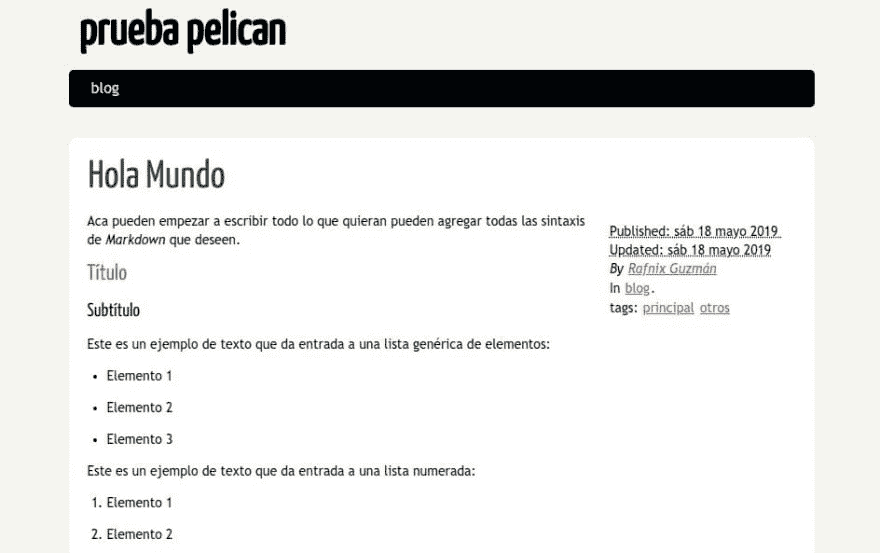

# 创建你的博客 con python usando GitHub 网页 y 鹈鹕

> 原文：<https://dev.to/rafnixg/crea-tu-blog-con-python-usando-github-pages-y-pelican-pbk>

当我开始重新思考创办博客的想法时，我想到了很多如何做到这一点的想法，比如使用著名的[【WordPress】](https://wordpress.org)，因为博客想这样做，是为了讲一点 python 的话，以及我将要了解和学习的技术，我决定更好地使用

## 是鹈鹕吗？

[Pelican](https://blog.getpelican.com/) 是用 python 开发的静态网站生成器，它允许我们将帖子写入用 restructuredtext、Markdown 或 AsciiDoc 编写的文件中，然后对这些文件进行处理以生成像此博客这样的静态网站，因此我们不需要像这样支持后端语言的数据库或 web 服务器

## Qué es GitHub 页数？

[GitHub Pages](https://pages.github.com/) 是静态网站的主机，正如其网页所示，它旨在直接在 GitHub 存储库中托管我们项目、个人或组织的网页，而且是一项免费服务。

借助这些功能，我们可以轻松创建我们的静态站点，并将其上传到 GitHub 存储库，该存储库的结构应如下所示`username.github.io`，下面我将介绍如何创建和配置该存储库，以便为我们的网站服务。

GitHub 推荐使用 [Jekyll](https://jekyllrb.com/) 来生成我们的静态站点，但这一事实在 Ruby 中是没有问题的，如果你使用 Ruby，但我作为一个#PythonLover 我决定使用的鹈鹕是用 Python 开发的。

## 在 GitHub 上创建我们的存储库

这部分是最简单的 post，因为我们只需登录 GitHub 帐户并创建一个新的公共存储库，其名称如下。

`tu_username.github.io`就我而言，这个博客所在的存储库叫做[【rafnixg . github。我](https://rafnixg.github.io)

只有这样，我们的 Github Pages 才能开始上传我们的静态内容。

## 安装和配置鹈鹕

安装和运行 Pelican 非常简单。但是，如果我要建议您使用 Pipenv 在虚拟环境中执行整个安装，为了将此安装与您系统上安装的其他 Python 套件分开，如果您不知道如何使用 Pipenv，我会在此给您留一封关于此主题的邮件，[使用 Pipenv 的 Python 虚拟环境](https://dev.to/rafnixg/entornos-virtuales-en-python-usando-pipenv-5e0d-temp-slug-8710604)。

在开始安装 pelican 之前，我们必须克隆我们的博客所在的存储库，为此，我们只需将自己定位在我们希望拥有项目的位置，在这种情况下，我将在系统的根目录下执行此操作。

```
$ cd ~ $ git clone https://github.com/tu_username/tu_username.github.io.git 
$ cd tu_username.github.io 
```

Enter fullscreen mode Exit fullscreen mode

之后，我们开始安装鹈鹕，我们要做的第一件事就是建立一个名为`source`的新分支，我们的所有源代码和书店都将在该分支中进行，因为对于 GitHub 来说`master`分支中的所有东西都将是服务的，为了我们的利益，我们只需爬上`master`他们所争夺的东西

```
$ git checkout -b source
$ pipenv shell 
```

Enter fullscreen mode Exit fullscreen mode

有了这一点，我们就有了我们的鹈鹕设施的虚拟环境，现在我们开始安装‘t0’，它是我们的静态网站生成器，`markdown`，它将帮助我们用这种语言撰写帖子，`ghp-import`帮助我们将网站发布到 GitHub。

```
$ pipenv install pelican markdown ghp-import 
Installing pelican… 
Adding pelican to Pipfile's [packages]…
✔ Installation Succeeded 
Installing markdown…
Adding markdown to Pipfile's [packages]… 
✔ Installation Succeeded 
Installing ghp-import… 
Adding ghp-import to Pipfile's [packages]… 
✔ Installation Succeeded 
Pipfile.lock not found, creating… 
Locking [dev-packages] dependencies… 
Locking [packages] dependencies… 
✔ Success! 
Updated Pipfile.lock (b0c318)! 
Installing dependencies from Pipfile.lock (b0c318)… 
🐍 ▉▉▉▉▉▉▉▉▉▉▉▉▉▉▉▉▉▉▉▉▉▉▉▉▉▉▉▉▉▉▉▉ 13/13 — 
```

Enter fullscreen mode Exit fullscreen mode

现在我们已经准备好开始使用 Pelican 了所以我们创建了第一个使用 pelican 的博客。

```
$ pelican-quickstart 
Welcome to pelican-quickstart v4.0.1\. 
This script will help you create a new Pelican-based website. 
Please answer the following questions so this script can generate the files needed by Pelican. 
Using project associated with current virtual environment.Will save to:
/home/username/blog/pelican
> What will be the title of this web site? prueba pelican 
> Who will be the author of this web site? rafnix guzman 
> What will be the default language of this web site? [es] es 
> Do you want to specify a URL prefix? e.g., https://example.com (Y/n) n 
> Do you want to enable article pagination? (Y/n) y 
> How many articles per page do you want? [10] 
> What is your time zone? [Europe/Paris] America/Lima 
> Do you want to generate a tasks.py/Makefile to automate generation and publishing? (Y/n) Y # Responder Y, esto nos ayuda mucho! 
> Do you want to upload your website using FTP? (y/N) n 
> Do you want to upload your website using SSH? (y/N) n 
> Do you want to upload your website using Dropbox? (y/N) n 
> Do you want to upload your website using S3? (y/N) n 
> Do you want to upload your website using Rackspace Cloud Files? (y/N) n 
> Do you want to upload your website using GitHub Pages? (y/N) y 
> Is this your personal page (username.github.io)? (y/N) y 
Done. Your new project is available at /home/username/blog/pelican 
```

Enter fullscreen mode Exit fullscreen mode

如果你对 aca 时区有任何疑问，我会给你一份所有[时区](https://en.wikipedia.org/wiki/List_of_tz_database_time_zones)
的清单

```
> Do you want to generate a tasks.py/Makefile to automate generation and publishing? (Y/n) 
```

Enter fullscreen mode Exit fullscreen mode

他们必须回答(y)这个问题，因为这个 Makefile 将帮助我们更容易地生成我们的网站，正如我们已经看到的那样，我们的 pelican 项目已经产生，我们可以开始使用。

## 写我们的第一篇帖子

我们将创建我们的第一个帖子，为此，我们必须位于“`content`”文件夹中，并使用我们最喜欢的文本编辑器创建一个名为 hello-world . MD 的文件(如果，我知道，想象力在议程上)，然后可以删除该文件仅供测试。

```
Title: Hola Mundo
Date: 2019-05-18 10:30
Modified: 2019-05-18 11:30
Category: blogTags: principal, otros
Slug: hola-mundo
Authors: Rafnix Guzmán
Summary: Mi primer post usando Pelican y GitHub Pages

Acá pueden empezar a escribir todo lo que quieran pueden agregar todas las sintaxis de *Markdown* que deseen.
## Título
### Subtítulo
Este es un ejemplo de texto que da entrada a una lista genérica de elementos:
- Elemento 1
- Elemento 2
- Elemento 3

Este es un ejemplo de texto que da entrada a una lista numerada:
1\. Elemento 1
2\. Elemento 2
3\. Elemento 3

Al texto en Markdown puedes añadirle formato como **negrita** o *cursiva* de una manera muy sencilla.
Todo esto fue extraído de este [Post sobre markdown](https://markdown.es/sintaxis-markdown/) 
```

Enter fullscreen mode Exit fullscreen mode

## 在现场测试我们的博客

撰写并储存您的第一个张贴之后，我们会产生测试伺服器，以便在将我们的网站上传至 GitHub 之前检视我们的结果，而在我们专案的根目录下，我们会执行下列指令。

```
$ make devserver pelican -lr /home/username/blog/pelican/content -o /home/username/blog/pelican/output -s /home/username/blog/pelican/pelicanconf.py 

-> Modified: content, theme, settings. re-generating... 
Done: Processed 1 article, 0 drafts, 0 pages, 0 hidden pages and 0 draft pages in 0.15 seconds. 
```

Enter fullscreen mode Exit fullscreen mode

要进入我们的本地测试服务器，我们必须使用我们最喜欢的浏览器输入以下 URL[:http://localhost:8000](http://localhost:8000)(希望没有 IE，xD)

[](https://res.cloudinary.com/practicaldev/image/fetch/s--DK0PcfPJ--/c_limit%2Cf_auto%2Cfl_progressive%2Cq_auto%2Cw_880/https://rafnixg.github.img/hola-mundo-pelican.jpg)

## Subir nuestro 博客 GitHub 页面

现在我们准备好上传到 github 第一个指令上传我们的源代码。

```
$ git add -A && git commit -a -m 'post hola-mundo.md' && git push --all 
```

Enter fullscreen mode Exit fullscreen mode

现在我们把所有的东西都上升到了`master`分支，记得我告诉过你们不要担心这个，是因为这个命令做好了把档案`output`中的所有东西上升到我们的分支`master`
的全部准备

```
$ make github 
```

Enter fullscreen mode Exit fullscreen mode

您在此处被询问您的 github 身份信息，以便上传到您的存储库中已生成的整个静态站点，您的博客将在 https://su _ username . github . io/上运行

对于下一篇帖子，我们将会看到如何设置一个`Thema`和一些`Plugins`来增强鹈鹕的功能，以及一些额外的设置来帮助我们拥有更好的 SEO。

下一个帖子再见，非常感谢您阅读我，任何疑问、评论或任何东西，请留言给 aca 或我的 Twitter 账户 [@rafnixg](https://twitter.com/rafnixg) 。