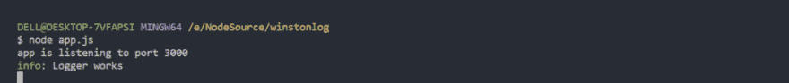
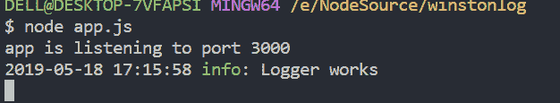
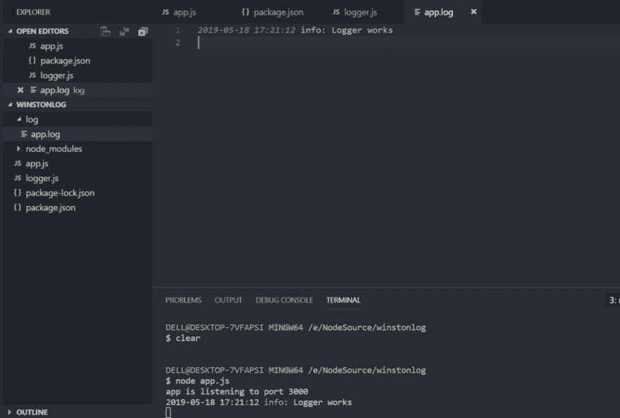

# 如何正确登录 Node.js 应用程序

> 原文：<https://dev.to/ganeshmani/how-to-log-node-js-application-properly-c2l>

在本文中，我们将了解如何正确记录 node.js 应用程序。

在进入本文之前，我们将了解为什么需要记录应用程序。假设我们正在构建一个简单的 [Node.js](https://cloudnweb.dev/category/web-dev/) 应用程序，应用程序会在某个时候崩溃。如果我们处于开发阶段，调试应用程序将会很容易。

。在进入本文之前，我们将了解为什么需要记录应用程序。假设我们正在构建一个简单的 [Node.js](https://cloudnweb.dev/category/web-dev/) 应用程序，应用程序会在某个时候崩溃。如果我们处于开发阶段，调试应用程序将会很容易。

但是，如果应用程序已经在生产中，而我们在生产中解决 bug 的时间少得多，会发生什么呢？

为了解决这些问题，日志记录成为软件开发的关键部分。我们将看到如何使用 Winston 记录 Node.js 应用程序

### 内容摘要

*   winston 入门
*   winston 中的不同日志级别
*   日志条目的格式
*   记录到文件和控制台

### Winston 入门

winston 是 Node.js 生态系统中的通用日志库。你可以问为什么我们不能直接用 **console.log()。**控制台日志的问题是你不能关闭它或者增加日志级别。对于日志，我们通常会有需求，`console`模块做不到。

让我们用 Winston 日志创建一个简单的应用程序。

```
npm init --yes
npm install --save express body-parser cors winston 
```

*   **express** - Express 是 Node.js 框架处理请求和响应
*   **body-parser** - body-parser 处理表单 POST 请求体
*   cors 用于处理跨源请求，比如你的前端应用和后端在不同的端口。
*   winston 是一个日志库，我们将使用它来记录我们的应用程序

创建一个名为 **app.js** 的文件，并添加以下代码

```
const express = require('express');
const bodyParser = require('body-parser');
const app = express();

app.use(bodyParser.json());
app.use(bodyParser.urlencoded({extended : false}));

app.get('/',(req,res) => {
    res.send("Hello From Cloudnweb");
})

app.listen(3000,() => {
    console.log(`app is listening to port 3000`);
})
```

现在，您需要添加一个名为 **logger.js** 的文件，并添加以下代码

```
const { createLogger,format,transports } = require('winston');

const logger = createLogger({
    level : 'debug',
    format : format.combine(format.simple()),
    transports : [
        new transports.Console()
    ]
});

module.exports = logger;
```

*   **create logger**-create logger 是一个结合不同配置参数的功能
*   **级别** -级别只不过是不同的日志级别。我们将在本文的后面讨论这一部分
*   **格式** -格式是我们显示日志信息的方式。有不同的格式。我们将一个接一个地看到
*   **传输** -传输您想要记录信息的器械包。我们可以将它记录在控制台或文件中

之后，你需要在 **app.js** 中添加 **logger.js** 。

```
const express = require('express');
const bodyParser = require('body-parser');
const logger = require('./logger');
const app = express();

app.use(bodyParser.json());
app.use(bodyParser.urlencoded({extended : false}));

app.get('/',(req,res) => {
    logger.info("Logger works");
    res.send("Hello From Cloudnweb");
})

app.listen(3000,() => {
    console.log(`app is listening to port 3000`);
})
```

<figure>[](https://res.cloudinary.com/practicaldev/image/fetch/s--Szp9J2VZ--/c_limit%2Cf_auto%2Cfl_progressive%2Cq_auto%2Cw_880/https://cloudnweb.dev/wp-content/uploads/2019/05/winston_log-1024x108.png) 

<figcaption>记录器</figcaption>

</figure>

您将得到类似这样的输出。耶！！。

[](https://res.cloudinary.com/practicaldev/image/fetch/s--JsY6d2Ue--/c_limit%2Cf_auto%2Cfl_progressive%2Cq_66%2Cw_880/https://cloudnweb.dev/wp-content/uploads/2019/05/i_did_it.gif)

### 温斯顿的日志级别

Winston 中有不同的日志级别，它们与不同的整数值相关联

```
{ error: 0, warn: 1, info: 2, verbose: 3, debug: 4, silly: 5 }
```

我们可以定义希望查看日志的级别..例如，如果我们将记录器级别定义为 **debug** 。我们在应用程序中看不到**傻**的日志。我们需要在我们的应用程序中修改它

```
const logger = createLogger({
    level : 'silly',
    format : format.combine(format.simple()),
    transports : [
        new transports.Console()
    ]
});
```

```
logger.info("info level");
logger.debug("debug level");
logger.silly("silly info");
```

### 日志中的格式

我们可以使用不同的格式来查看日志消息。例如，我们可以给日志消息着色。

```
const { createLogger,format,transports } = require('winston');

const logger = createLogger({
    level : 'debug',
    format : format.combine(format.colorize(),format.simple()),
    transports : [
        new transports.Console()
    ]
});

module.exports = logger;
```

我们还可以组合几种不同的日志消息格式。一个重要的特性是将时间戳添加到消息日志中

```
const { createLogger,format,transports } = require('winston');

const logger = createLogger({
    level : 'debug',
    format: format.combine(
        format.colorize(),
        format.timestamp({
          format: 'YYYY-MM-DD HH:mm:ss'
        }),
        format.printf(info => `${info.timestamp} ${info.level}: ${info.message}`)
      ),
    transports : [
        new transports.Console()
    ]
});

module.exports = logger;
```

日志消息应该是这样的，

[](https://res.cloudinary.com/practicaldev/image/fetch/s--kLjAuaaA--/c_limit%2Cf_auto%2Cfl_progressive%2Cq_auto%2Cw_880/https://cloudnweb.dev/wp-content/uploads/2019/05/winston.png)

### 记录到文件中

在应用程序中找到特定 bug 的日志有点困难。为了解决这个问题，我们可以将日志写入一个文件，并在需要时引用它。修改 **logger.js** 如下

```
'use strict';
const { createLogger, format, transports } = require('winston');
const fs = require('fs');
const path = require('path');

const env = process.env.NODE_ENV || 'development';
const logDir = 'log';

// Create the log directory if it does not exist
if (!fs.existsSync(logDir)) {
  fs.mkdirSync(logDir);
}

const filename = path.join(logDir, 'app.log');

const logger = createLogger({
  // change level if in dev environment versus production
  level: env === 'development' ? 'debug' : 'info',
  format: format.combine(
    format.timestamp({
      format: 'YYYY-MM-DD HH:mm:ss'
    }),
    format.printf(info => `${info.timestamp} ${info.level}: ${info.message}`)
  ),
  transports: [
    new transports.Console({
      level: 'info',
      format: format.combine(
        format.colorize(),
        format.printf(
          info => `${info.timestamp} ${info.level}: ${info.message}`
        )
      )
    }),
    new transports.File({ filename })
  ]
});

module.exports = logger;
```

首先，它检查名为 **log** 的文件夹是否已经存在。如果不存在，它将创建文件夹并创建一个名为 **app.log** 的文件名

**transports** -这是我们定义文件日志和控制台日志的地方。它配置日志位置。

一旦添加了文件日志，就可以用 **node app.js** 运行代码。你会看到**日志**目录，日志信息会存储在 **app.log** 中

[](https://res.cloudinary.com/practicaldev/image/fetch/s--mxulIPqO--/c_limit%2Cf_auto%2Cfl_progressive%2Cq_auto%2Cw_880/https://cloudnweb.dev/wp-content/uploads/2019/05/log-1024x691.png)

你做到了..这是我们在不中断生产服务器的情况下记录和调试应用程序的方法

[](https://res.cloudinary.com/practicaldev/image/fetch/s--LG29xt3P--/c_limit%2Cf_auto%2Cfl_progressive%2Cq_66%2Cw_880/https://cloudnweb.dev/wp-content/uploads/2019/05/claps-1.gif)

参考资料:

[https://blog.risingstack.com/node-js-logging-tutorial/](https://blog.risingstack.com/node-js-logging-tutorial/)

[https://www . digital ocean . com/community/tutorials/how-to-use-Winston-to-log-node-js-applications](https://www.digitalocean.com/community/tutorials/how-to-use-winston-to-log-node-js-applications)