# 10 张图中的 AI & ML 开发者峰会

> 原文：<https://dev.to/ibmdeveloper/ai-ml-developer-summit-in-10-pictures-fj3>

5 月 10 日[周五，IBM 开发者 SF](https://www.meetup.com/IBM-Developer-SF-Bay-Area-Meetup/) 举办了第一次全天活动: [AI & ML 开发者峰会](https://aiml-developer-summit.splashthat.com/)。这次活动非常成功。我们收到了 350 多份回复，150 人参加了会议，11 位演讲者来自六家公司(Twilio、优步、Bose、Optimizely、Antilips、IBM)。以下是 10 张(或更多)照片中的事件。

<figure> 

<figcaption id="caption-attachment-10430">准备就绪</figcaption>

</figure>

<figure>[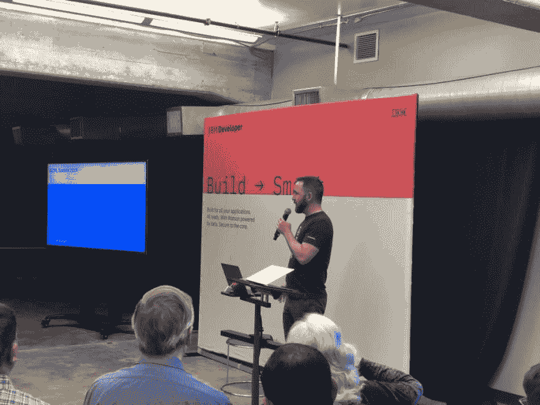](https://res.cloudinary.com/practicaldev/image/fetch/s--sGebvdZf--/c_limit%2Cf_auto%2Cfl_progressive%2Cq_auto%2Cw_880/https://katzmax.files.wordpress.com/2019/05/aiml-dev-summit-dave-start.jpg%3Fw%3D1024%26h%3D768) 

<figcaption id="caption-attachment-10432">来自 IBM 的开发者大卫·努根特正在启动峰会</figcaption>

</figure>

<figure>[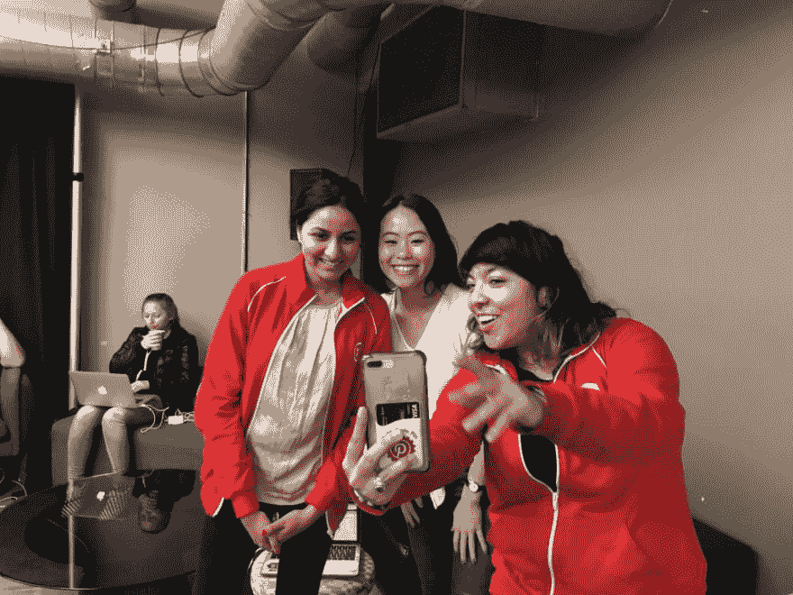](https://res.cloudinary.com/practicaldev/image/fetch/s--4RG98BVN--/c_limit%2Cf_auto%2Cfl_progressive%2Cq_auto%2Cw_880/https://katzmax.files.wordpress.com/2019/05/aiml-dev-summit-twilio-speakers.jpg%3Fw%3D1024%26h%3D768) 

<figcaption id="caption-attachment-10438">三人组:努普尔·维拉斯、芬奇·陈&莉齐·西格尔</figcaption>

</figure>

<figure>[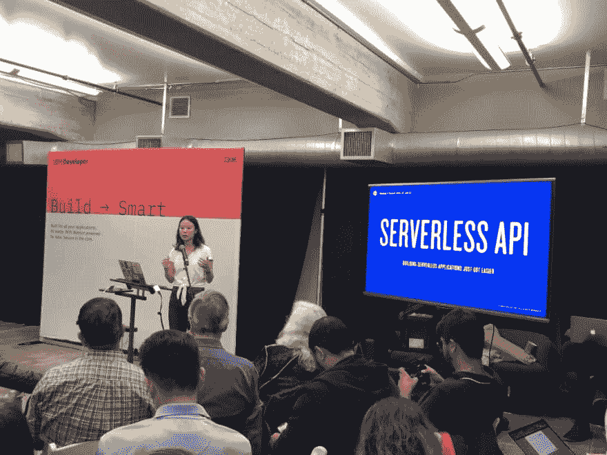](https://res.cloudinary.com/practicaldev/image/fetch/s--vGysoJL---/c_limit%2Cf_auto%2Cfl_progressive%2Cq_auto%2Cw_880/https://katzmax.files.wordpress.com/2019/05/aiml-dev-summit-vinci.jpg%3Fw%3D1024%26h%3D768) 

<figcaption id="caption-attachment-10439">文西陈从 Twilio 谈无服务器</figcaption>

</figure>

<figure>[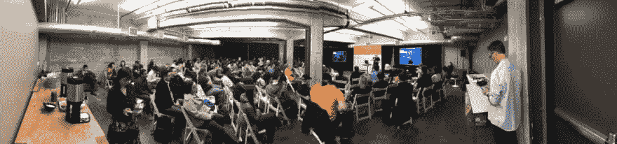](https://res.cloudinary.com/practicaldev/image/fetch/s--ARGfbwCH--/c_limit%2Cf_auto%2Cfl_progressive%2Cq_auto%2Cw_880/https://katzmax.files.wordpress.com/2019/05/aiml-dev-summit-room.jpg%3Fw%3D1100) 

<figcaption id="caption-attachment-10437">150 人参加了在旧金山举行的峰会</figcaption>

</figure>

<figure>[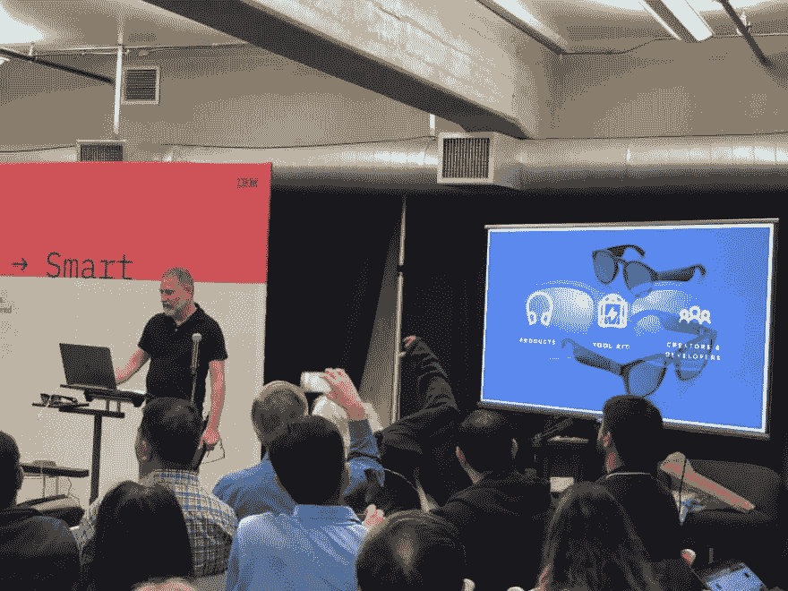](https://res.cloudinary.com/practicaldev/image/fetch/s--Q4wTyEDf--/c_limit%2Cf_auto%2Cfl_progressive%2Cq_auto%2Cw_880/https://katzmax.files.wordpress.com/2019/05/aiml-dev-summit-danzeitman.jpg%3Fw%3D1024%26h%3D768) 

<figcaption id="caption-attachment-10433">来自 Bose 的 Dan Zeitman 正在谈论 Bose 音频 AR 可穿戴设备和 AI</figcaption>

</figure>

<figure>[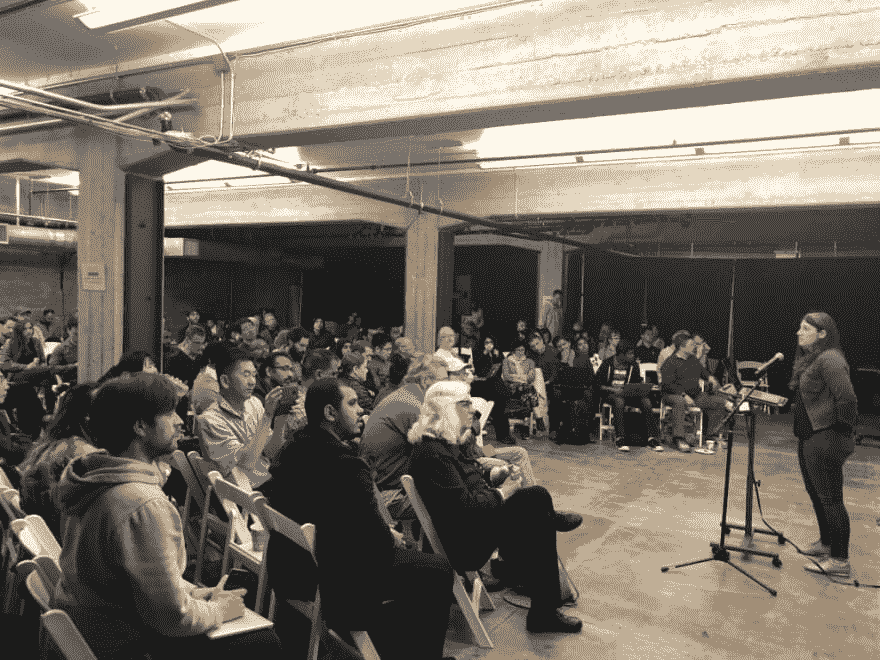](https://res.cloudinary.com/practicaldev/image/fetch/s--09XC3pNO--/c_limit%2Cf_auto%2Cfl_progressive%2Cq_auto%2Cw_880/https://katzmax.files.wordpress.com/2019/05/aiml-dev-summit-andreea.jpg%3Fw%3D1024%26h%3D768)

<figcaption id="caption-attachment-10435">Andreea Danielescu 谈为伦理 AI 避免有偏见的数据</figcaption>

</figure>

<figure>[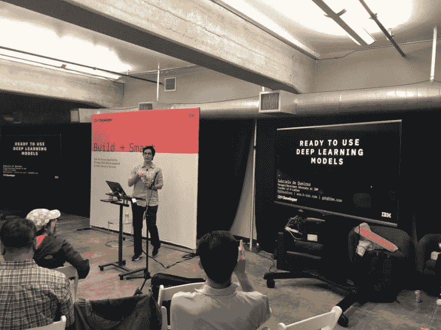](https://res.cloudinary.com/practicaldev/image/fetch/s--qm5HFBZW--/c_limit%2Cf_auto%2Cfl_progressive%2Cq_auto%2Cw_880/https://katzmax.files.wordpress.com/2019/05/aiml-dev-summit-gabriella.jpg%3Fw%3D1024%26h%3D768) 

<figcaption id="caption-attachment-10440">来自 IBM 的开发者 Gabriela de Queiroz 谈论准备使用深度学习模型</figcaption>

</figure>

<figure> 

<figcaption id="caption-attachment-10434">来自优步的 Carsten Jacobsen 正在优步展示他们如何优化机器学习</figcaption>

</figure>

<figure>[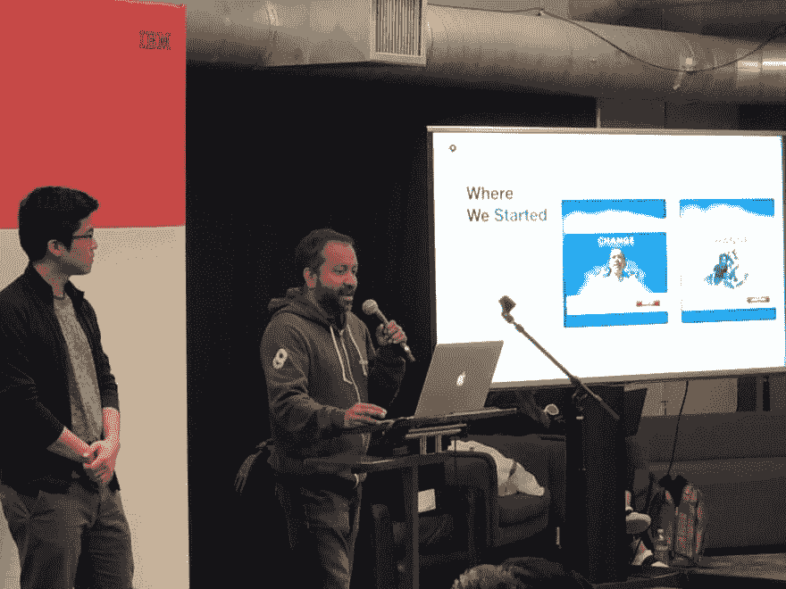](https://res.cloudinary.com/practicaldev/image/fetch/s--ghPZhn6b--/c_limit%2Cf_auto%2Cfl_progressive%2Cq_auto%2Cw_880/https://katzmax.files.wordpress.com/2019/05/aiml-dev-summit-ajith-sammy.jpg%3Fw%3D1024%26h%3D768) 

<figcaption id="caption-attachment-10441">阿吉特·库玛尔·马斯卡雷尼亚斯和萨米·李正在 Optimizely</figcaption>

</figure>

谈论机器学习

峰会如此之大，以至于 10 张照片都不够。所以这里再来 10 张图！

<figure>[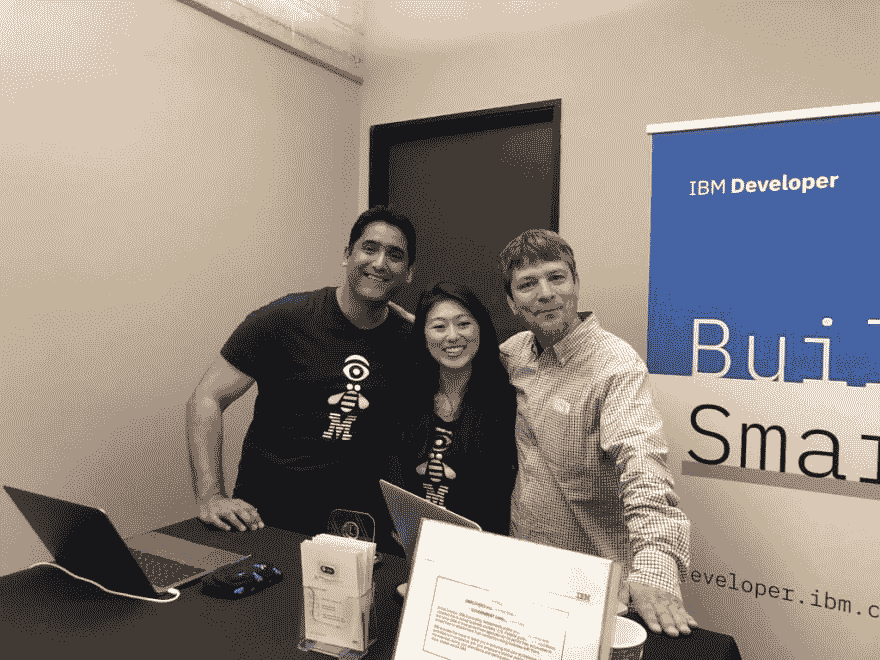](https://res.cloudinary.com/practicaldev/image/fetch/s--ko-S2EYs--/c_limit%2Cf_auto%2Cfl_progressive%2Cq_auto%2Cw_880/https://katzmax.files.wordpress.com/2019/05/aiml-dev-summit-upkarlisapeter.jpg%3Fw%3D1024%26h%3D768) 

<figcaption id="caption-attachment-10431">来自 IBM 开发者的 Upkar Lidder、Lisa Jung 和 Peter Moskovits</figcaption>

</figure>

<figure>[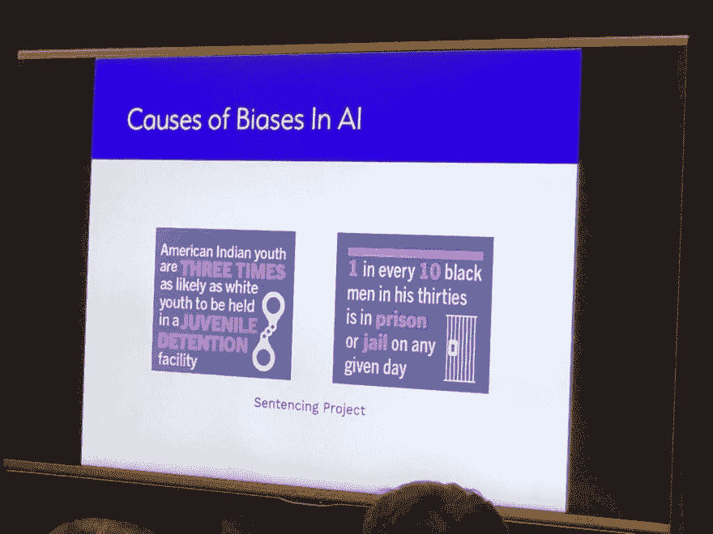](https://res.cloudinary.com/practicaldev/image/fetch/s--6W3xs0n2--/c_limit%2Cf_auto%2Cfl_progressive%2Cq_auto%2Cw_880/https://katzmax.files.wordpress.com/2019/05/aiml-dev-summit-aibiases.jpg%3Fw%3D1024%26h%3D768) 

<figcaption id="caption-attachment-10444">来自 Antilipsi 的 Andreea Danielescu 展示了 AI 偏差的成因</figcaption>

</figure>

<figure>[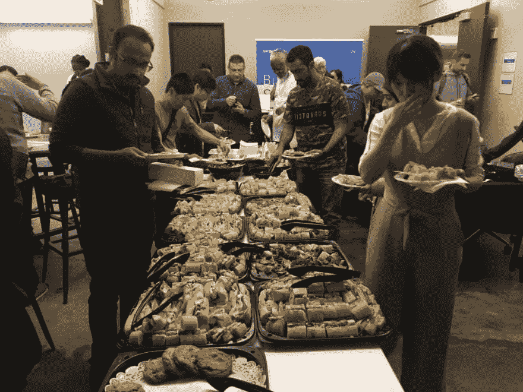](https://res.cloudinary.com/practicaldev/image/fetch/s--r0gHZw7y--/c_limit%2Cf_auto%2Cfl_progressive%2Cq_auto%2Cw_880/https://katzmax.files.wordpress.com/2019/05/aiml-dev-summit-lunch.jpg%3Fw%3D1024%26h%3D768) 

<figcaption id="caption-attachment-10443">午餐</figcaption>

</figure>

<figure>[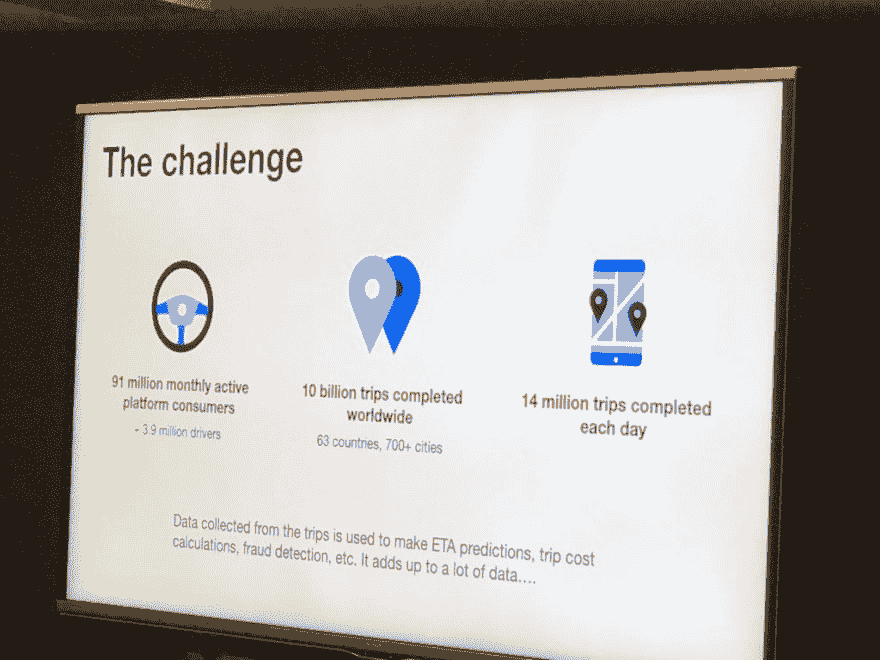](https://res.cloudinary.com/practicaldev/image/fetch/s--YikRRdPI--/c_limit%2Cf_auto%2Cfl_progressive%2Cq_auto%2Cw_880/https://katzmax.files.wordpress.com/2019/05/aiml-dev-summit-uberchallenges.jpg%3Fw%3D1024%26h%3D768) 

<figcaption id="caption-attachment-10445">优步正在用机器学习解决的一些挑战</figcaption>

</figure>

<figure>[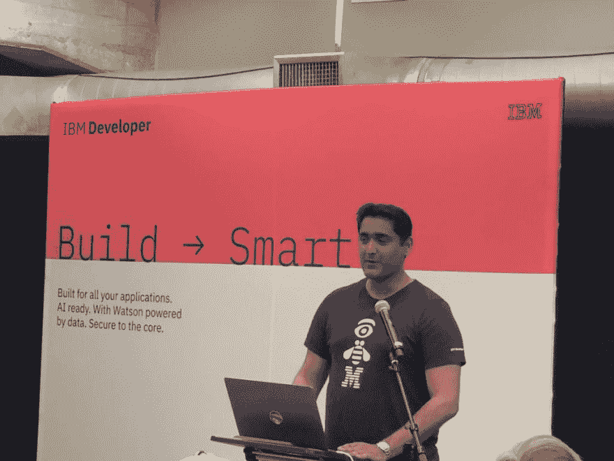](https://res.cloudinary.com/practicaldev/image/fetch/s--qW9WiBfZ--/c_limit%2Cf_auto%2Cfl_progressive%2Cq_auto%2Cw_880/https://katzmax.files.wordpress.com/2019/05/aiml-dev-summit-upkar.jpg%3Fw%3D1024%26h%3D768) 

<figcaption id="caption-attachment-10450">来自 IBM 开发者的 Upkar Lidder 开始了他关于聊天机器人</figcaption>

</figure>

的演讲

<figure>[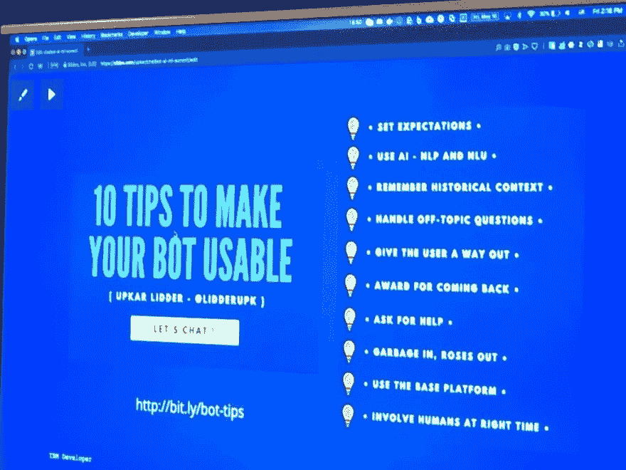](https://res.cloudinary.com/practicaldev/image/fetch/s--8CkpD2CJ--/c_limit%2Cf_auto%2Cfl_progressive%2Cq_auto%2Cw_880/https://katzmax.files.wordpress.com/2019/05/aiml-dev-summit-10tips.jpg%3Fw%3D1024%26h%3D768) 

<figcaption id="caption-attachment-10446">Upkar Lidder 的演讲:让你的机器人变得可用的 10 个小技巧</figcaption>

</figure>

<figure>[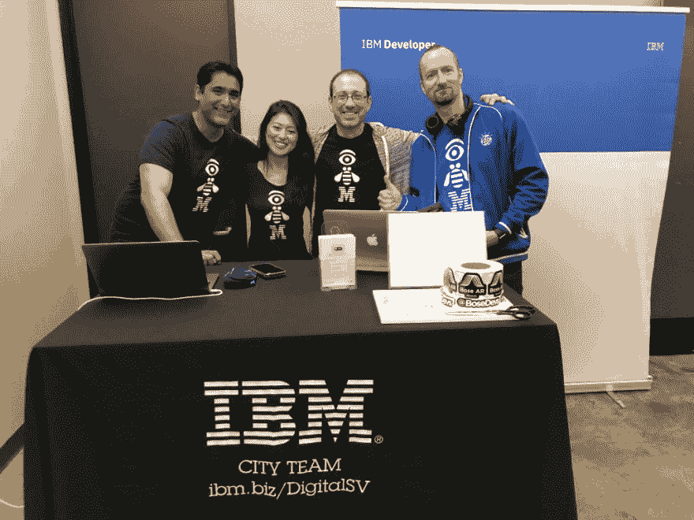](https://res.cloudinary.com/practicaldev/image/fetch/s--i8ItEvtW--/c_limit%2Cf_auto%2Cfl_progressive%2Cq_auto%2Cw_880/https://katzmax.files.wordpress.com/2019/05/aiml-dev-summit-upkarlisamaxmarek.jpg%3Fw%3D1024%26h%3D768) 

<figcaption id="caption-attachment-10451">乌普卡尔·利德，丽莎·荣格，我，马雷克·萨多夫斯基</figcaption>

</figure>

<figure>[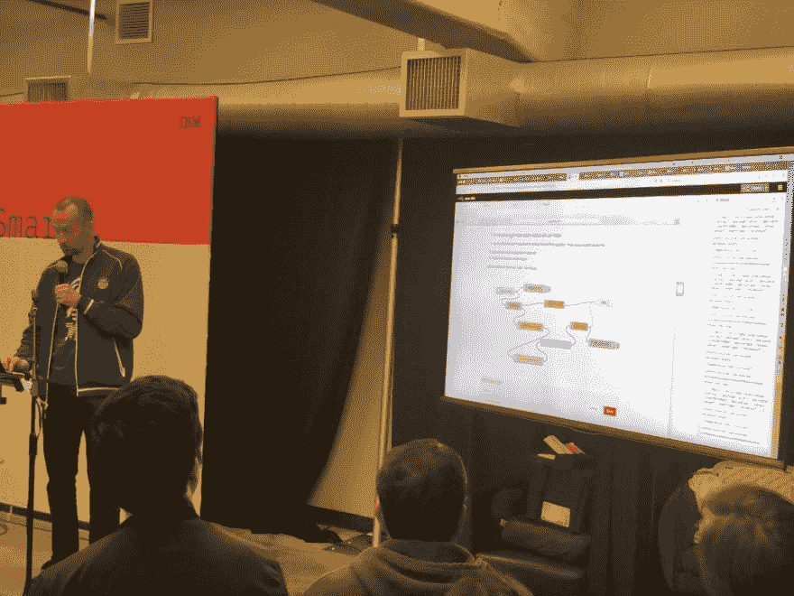](https://res.cloudinary.com/practicaldev/image/fetch/s--VSSFy2A6--/c_limit%2Cf_auto%2Cfl_progressive%2Cq_auto%2Cw_880/https://katzmax.files.wordpress.com/2019/05/aiml-dev-summit-marek.jpg%3Fw%3D1024%26h%3D768) 

<figcaption id="caption-attachment-10448">来自 IBM 开发者的 Marek Sadowski 正在展示 NodeRED</figcaption>

</figure>

<figure>[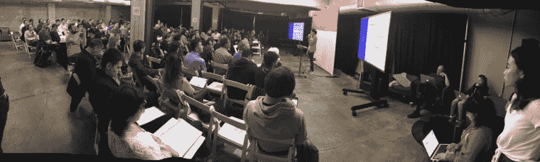](https://res.cloudinary.com/practicaldev/image/fetch/s--CKShUg5U--/c_limit%2Cf_auto%2Cfl_progressive%2Cq_auto%2Cw_880/https://katzmax.files.wordpress.com/2019/05/aiml-dev-summit-nupur.jpg%3Fw%3D1100)</figure>

<figure>[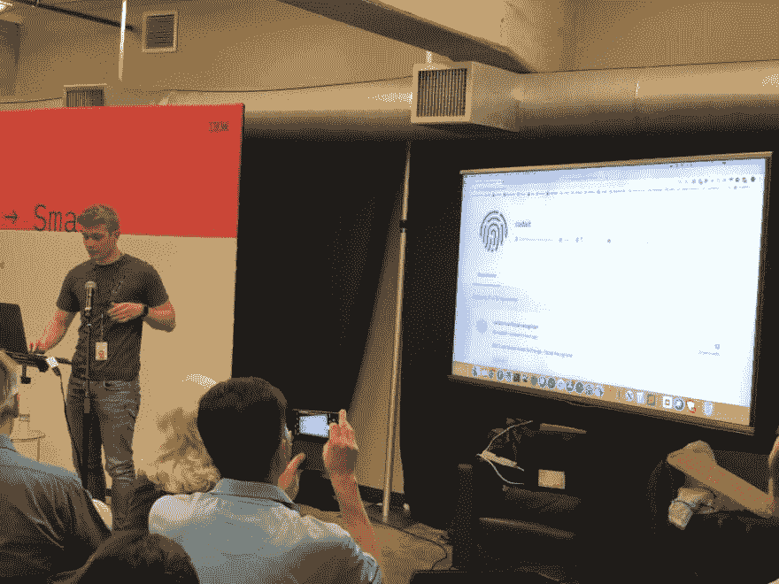](https://res.cloudinary.com/practicaldev/image/fetch/s--Fe-odi54--/c_limit%2Cf_auto%2Cfl_progressive%2Cq_auto%2Cw_880/https://katzmax.files.wordpress.com/2019/05/aiml-dev-summit-simon.jpg%3Fw%3D1024%26h%3D768)

<figcaption id="caption-attachment-10452">IBM 开发者西蒙·普罗维特正在展示 CODAIT 资源</figcaption>

</figure>