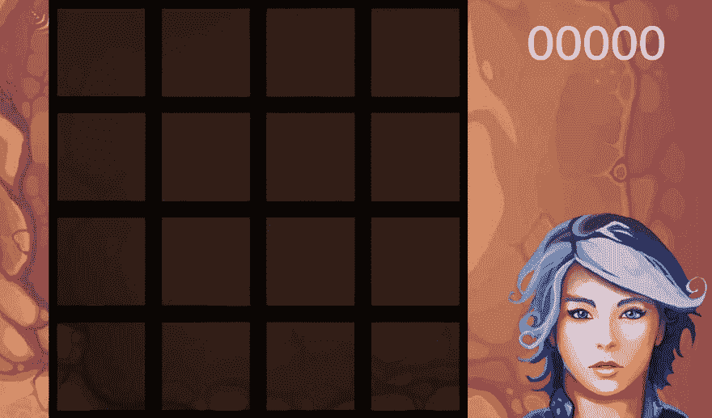
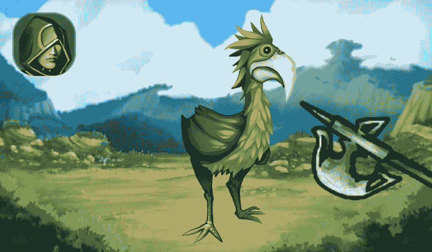
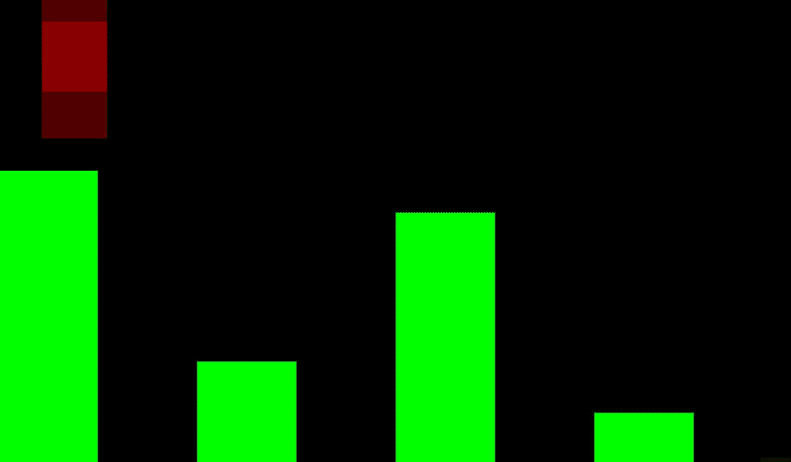

# Alexa 游戏和动画实验(APL)

> 原文：<https://dev.to/willblaschko/alexa-game-and-animation-experiments-apl-546>

这篇文章的目的是分享我在过去两个月中通过使用(和误用)Alexa 表示语言(APL)为 Alexa 创建可视化游戏所做的事情。我将强调动画，因为我花了大部分时间来制作这个作品。

## 背景

我一直在探索 Alexa 游戏空间寻找乐趣，并刚刚推出了我的第一个个人 Alexa 游戏技能:一个受欢迎的游戏 2048 的语音控制版本([英国版本](https://www.amazon.co.uk/Team-Quasko-2048/dp/B07PTYCXFL)，[美国版本](https://www.amazon.com/Team-Quasko-2048/dp/B07PTYCXFL)，其他即将推出)，内置屏幕设备(Spot，Show，FireTV)。这款游戏在移动和网络上有一百万个克隆版本，但我没有找到 Alexa 版本。[演示视频](https://youtu.be/RMc_pFn1MbM)。

虽然我以前使用过 APL，但是对于这些游戏，我深入研究了功能、响应大小和性能的极限。我遇到的一个大障碍是现有的 APL [组件](https://developer.amazon.com/docs/alexa-presentation-language/apl-component.html)和[命令](https://developer.amazon.com/docs/alexa-presentation-language/apl-commands.html)缺乏游戏类型的动画。

面对这个挑战，我想出了如何使动画工作(X 和/或 Y 轴运动的世界和物体；基于精灵的动画)。如果你看过我的一些[其他帖子](https://www.linkedin.com/in/willblaschko/detail/recent-activity/posts/)或者关注过我的一些[项目](https://forum.xda-developers.com/shield-tv/general/alexa-media-voice-control-android-t3784032)，你就会知道我不会让惯例或预期用途限制我。为此，我打破了杀伤人员地雷公约，以获得我需要的结果。

## TLDR；有什么可能？

如果你不关心我的项目，并想得到的内容的肉，在这里你去！可能有更多的可能性，但这里是我迄今为止所做的工作:

**X 或 Y 轴世界动画**:使用一个[序列](https://developer.amazon.com/docs/alexa-presentation-language/apl-sequence.html)(或嵌套序列)你可以将背景分解成图块(在[像素或百分比](https://developer.amazon.com/docs/alexa-presentation-language/apl-data-types.html#dimension)视口中)并使用[滚动](https://developer.amazon.com/docs/alexa-presentation-language/apl-standard-commands.html#scroll-command)命令[顺序](https://developer.amazon.com/docs/alexa-presentation-language/apl-standard-commands.html#sequential-command)移动世界。[这里举例背景动画](https://youtu.be/OAHiOijGRIw)(视频)。

[要旨在此](https://gist.github.com/willblaschko/579998deb99366be7c7876b80ecac7e2)

**X 轴或 Y 轴项目动画**:使用带有小的、隐藏的[项目](https://developer.amazon.com/docs/alexa-presentation-language/apl-sequence.html#sequence-children)的序列，您可以通过连续使用滚动命令来动画显示屏幕周围序列中的主要项目。我用 1vh 正方形空的[帧](https://developer.amazon.com/docs/alexa-presentation-language/apl-frame.html)来完成这个。[示例物品动画此处](https://youtu.be/MKBc_0Dpr5g)(视频)。

[要旨在此](https://gist.github.com/willblaschko/579998deb99366be7c7876b80ecac7e2)

**基于帧的精灵动画**:使用分页器，你可以通过依次使用[设置页面](https://developer.amazon.com/docs/alexa-presentation-language/apl-standard-commands.html#setpage-command)命令在不同页面之间翻转来近似精灵动画。[此处示例精灵动画](https://youtu.be/OAHiOijGRIw)——《鸟》(视频)。

[要旨在此](https://gist.github.com/willblaschko/f8f86ccb4598c6bf4125f4ebde3a7b81)

**200 多个元素 APL 文档**:通过聪明地重用[布局](https://developer.amazon.com/docs/alexa-presentation-language/apl-layout.html)，你可以将数百个 APL 组件放入发送给 Alexa 的响应中。这允许构建复杂的场景，并最小化 [RenderDocument](https://developer.amazon.com/docs/alexa-presentation-language/apl-render-document-skill-directive.html) 指令。

[要旨在此](https://gist.github.com/willblaschko/e72fe9359fb8cb605484819eec3583ab)

将这些结合在一起，你可以得到一个相当不错的自顶向下的 16 位风格的游戏。

## 项目

我将谈到 2048 年和我目前正在进行的另外两个项目(这两个项目可能永远不会被公众看到)。我想尝试各种类型的游戏，所以我创建了一个棋盘游戏，一个第一人称角色扮演游戏，和一个 2D 侧滚动/平台。我对所有这些项目的个人目标是 1)仅在绝对必要的时候使用 [RenderDocument](https://developer.amazon.com/docs/alexa-presentation-language/apl-render-document-skill-directive.html) 指令(场景变化), 2)将一切可能的东西做成动画，3)创造出令人愉快且有粘性的游戏。

我将保持下面相对代码轻，看到以上要点或相关视频的更多细节。

### 2048(棋盘游戏)

[](https://res.cloudinary.com/practicaldev/image/fetch/s--NrpGnFMW--/c_limit%2Cf_auto%2Cfl_progressive%2Cq_auto%2Cw_880/https://s3.amazonaws.com/alexa-posts/ss_2048.jpg)

作为目前为止推出的这款唯一的技能，这款是最打磨和可玩的。我建议[尝试一下](https://www.amazon.com/Team-Quasko-2048/dp/B07PTYCXFL)，感受一下它是如何工作的。你可以在无头(无屏幕)设备上玩，但这不是最好的体验。[视频此处](https://youtu.be/RMc_pFn1MbM)。

#### 挑战

这个项目有两个主要的挑战:1)适应不同的屏幕大小，2)渲染和控制所有的图块，并保持在性能和响应大小的限制范围内。

1)我是通过一些基于视口形状和宽高比的三元运算解决的。这些计算用于根据屏幕尺寸/形状将对象(容器中的容器)的 X/Y 网格放置在正确的位置。

```
${@viewportShape == @viewportShapeRound ? viewport.width / 6 : (viewport.width > viewport.height ? viewport.height / 4 : viewport.width / 4)} 
```

2)我为每个磁贴(4x4 = 16)创建了背景和寻呼机，并创建了一个自定义磁贴布局，这消除了重复代码，并大大减少了响应大小。通过简化这些图块，我还减少了渲染元素的数量。

```
...{

    "type": "Tile",

    "name": "pos1"

}... 
```

#### 
  
目标

唯一一次游戏收到一个新的 RenderDocument 是如果你自定义瓷砖或背景(“Alexa，自定义”)。其他一切都是由寻呼机命令控制的，包括记分板。理论上，磁贴和记分板都应该是动画的，我可能会稍微调整一下命令的时间，看看我是否能做到。粘性:我个人非常喜欢这个游戏，玩得远远超出了我自己测试的要求。

### RPG 名称 TBD(第一人称 RPG)

[](https://res.cloudinary.com/practicaldev/image/fetch/s--tNGDV7Ek--/c_limit%2Cf_auto%2Cfl_progressive%2Cq_auto%2Cw_880/https://s3.amazonaws.com/alexa-posts/ss_rpg.jpg)

我对这个游戏的长期目标是创建一个程序生成的 RPG 游戏，在这个游戏中你可以与怪物战斗，完成任务，并收集宝藏。如果你想玩一个已经在语音方面做得很好的游戏(在我看来)，可以看看 [Skyrim](https://www.amazon.co.uk/Bethesda-Game-Studios-Special-Edition/dp/B07D6STSX8) 。

我想要视觉和动画。如果你在屏幕上只有一个静止的图像，那么“向巨魔奋力一击”有什么意义呢？没错。查看此视频中的早期概念验证。

与此无关，对于这个项目，我需要能够向 Alexa 返回一系列发言响应，所以我创建了一个修改过的 [RequestHandler](https://gist.github.com/willblaschko/cc4f0019da90e8c0b388bf1ae42bca20) (gist)来与 [RequestInterceptor](https://developer.amazon.com/blogs/alexa/post/0e2015e1-8be3-4513-94cb-da000c2c9db0/what-s-new-with-request-and-response-interceptors-in-the-alexa-skills-kit-sdk-for-node-js) 一起使用。

#### 挑战

1)我如何制作武器和怪物的动画，以及 2)创建一个有层次感的环境？

对于#1，是时候打破顺序了。作为唯一的移动组件(寻呼机受到限制，因为它们只能显示一个项目)，我必须弄清楚如何精确地控制移动的速度和方向。解决方案是不可见的组件、像素或视图高度/宽度的百分比，我可以使用定时的[顺序的](https://developer.amazon.com/docs/alexa-presentation-language/apl-standard-commands.html#sequential-command)命令[滚动](https://developer.amazon.com/docs/alexa-presentation-language/apl-standard-commands.html#scroll-command)。有了这个，我就有了跳舞的生物，攻击性的武器，以及其他任何我想要的在 X 轴或 Y 轴上的动画。

对于#2，使用 position: absolute(这里有更多的)在容器中使用分层元素很容易解决这个问题。这让我可以创造多种前景和背景。

#### 目标

我想看看是否有可能使用更少的 RenderDocument 指令，目前每个场景变化(移动)或怪物死亡时都会显示一个。我可能会使用寻呼机在不同的背景/前景之间切换，但这里的负载不像 2048 年那样突然。怪物和攻击是动画，随着我的发展，我希望增加额外的动画。这个游戏需要大量的润色，但 APL 和语音体验都有一个坚实的基础。随着更多、更好的内容和方向(以及更好的名字)，这款游戏有可能在屏幕和纯语音设备上保持粘性。

### Flappy Alexa (2D 侧滚/平台玩家)

[](https://res.cloudinary.com/practicaldev/image/fetch/s--zMUgJuk2--/c_limit%2Cf_auto%2Cfl_progressive%2Cq_auto%2Cw_880/https://s3.amazonaws.com/alexa-posts/ss_flap.jpg)

Flappy Bird 的流行来来去去，但在成功制作 RPG 游戏动画后，我想知道是否有可能使用相同的策略来创建侧滚游戏和平台游戏。简而言之:是的，但前提是你要投入时间。我能够在大约 4 个小时内快速拼凑出一个 Flappy Alexa POC，它就像你预期的那样粗糙，可能不会得到更多的关注。[视频](https://youtu.be/OAHiOijGRIw)展示了模拟基本游戏的方块(发挥你的想象力)，全部渲染完毕，理论上可以在真实设备上玩。

有了正确的设计和数学，没有理由不能用来创建一个 2D 地图或平台，当角色“移动”时自动动画。角色也可以在 X 或 Y 轴上移动，这是使用相同技术讲故事所需要的。基于 16 位磁贴的游戏，有人吗？回合制会更容易。

鸟本身是一个寻呼机组件，如果你看视频，你会看到过渡。这种相同的行为可以用于动画精灵来制作粗糙的基于帧的动画。

#### 挑战

我很快就达到了地图信息和动画命令之间的 Alexa 响应大小的硬限制。如果这不是一个预先渲染的序列，你会在设计和动画上有更多的灵活性。有效载荷是完整的地图信息(我们在视频中只能看到大约 30%)和大约 500 个不同的命令来制作地图和鸟的动画。如果这是实时的，在大多数用例中，用户交互之间只需要大约 100 个命令。

#### 目标

在初始地图加载之后，没有 RenderDocument 指令，所有的事情都是通过 Pager 或 Sequence 命令来完成的。一切都是动画。而且游戏可能会很黏，但我不会建议像这样使用语音的快速抽动游戏，也许有回声按钮。让它回合制有一个良好的语音体验，你有东西在这里。

## 未来项目

我有几个有趣的想法。希望在不久的将来，它们成为 Alexa 技能选择的一部分。

一个游戏目前正在研究中，设计将是一个最好的屏幕体验。这里的挑战是，如果我想制作动画并避免 RenderDocument 指令加载中断，我需要同时显示大约 1000 个 APL 元素。我已经开发了一些 POC，让我相信这在真实设备上是可能的，尽管压倒了模拟器。

另一个游戏仍在构思中，但将是一个脚本，主题探索游戏。这将是回合制的，有一个动画的 X/Y 地图，玩家可以通过语音或触摸与屏幕上的内容进行交互。这也将有丰富的语音体验，所以没有屏幕设备的人也可以享受。

## 结论

修补匠们，我鼓励你们走出去，看看如何用新的令人兴奋的方式打破东西，超越预期的用途，以获得你想要的最终体验。让我知道你是否能够驯服 APL 来创造新的和不同的东西。

在我看来，使用这些技术的最终结果是给用户带来更流畅、更吸引人的体验。在一个越来越多的屏幕设备上都可以使用 Alexa 的世界里，视觉界面需要像语音体验一样完美。开发者需要承担风险，尝试新事物。

警告，这都是基于公开的 APL 测试版，任何黑客明天都可能停止工作。此外，记住对所有屏幕形状和尺寸使用适应性或响应性设计。

## 免责声明

这是我代表我个人的夜间/周末项目，与我的雇主无关。这里讨论的所有方法都是基于公开可用的特性，只是有些方法被意外使用。