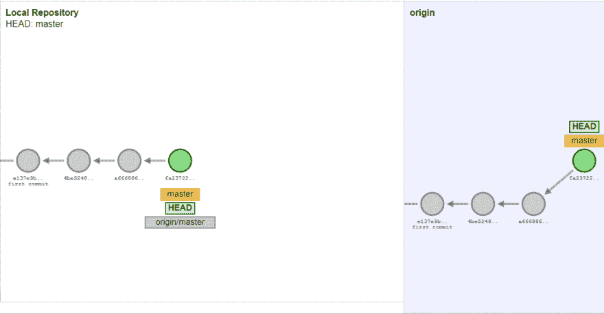
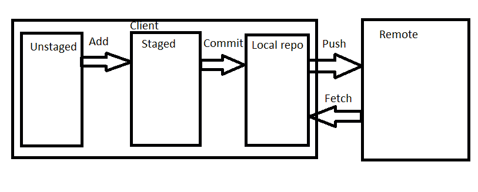
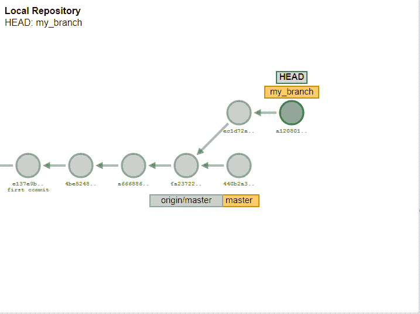
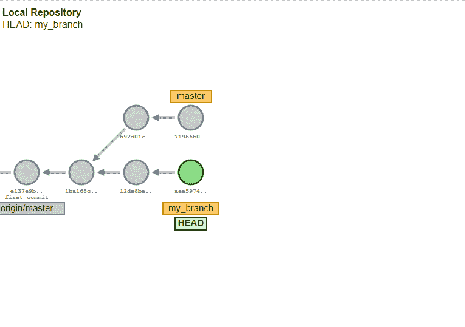
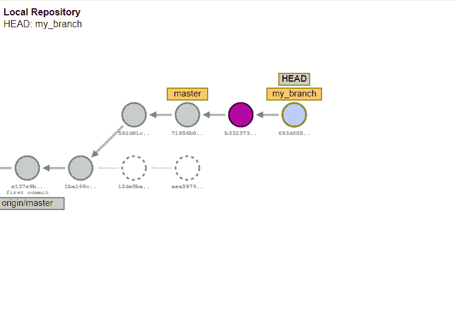
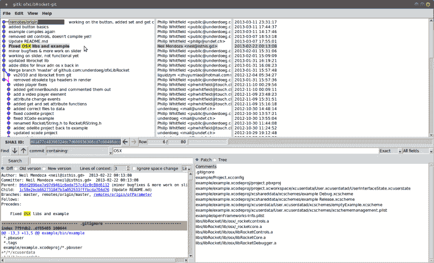
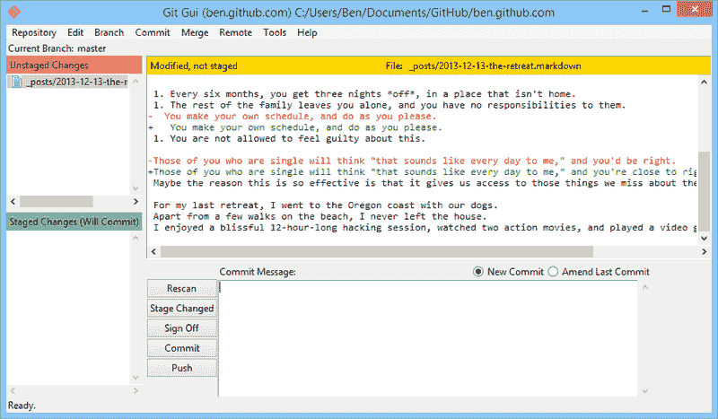

# 给初学者的 GIT

> 原文：<https://dev.to/rlxdprogrammer/git-for-beginners-3fgi>

如果你是一名程序员，你肯定需要使用某种版本控制系统，那么你正在做什么并没有什么不同。有好几个版本，但是最流行的是 GIT，如果你理解 GIT 的逻辑，你可以很容易理解任何版本控制系统的逻辑。

我和很多优秀的经验丰富的程序员一起工作，但是他们不能正确地使用 GIT，因此和他们一起工作是一场噩梦。我经常看到的另一个典型情况是，有人没有使用 GIT 的经验，但是他没有试图理解主要的逻辑，而是试图理解每个命令是如何工作的。问题是，如果不理解主要逻辑，您将永远无法使用 GIT 正常工作。

网上有成千上万的 GIT 教程，但在我看来，大多数要么过于详细，要么结构不正确。因此，我将尝试在一篇长文中总结 GIT 的主要逻辑。这个帖子的目标不是给出一个深刻的理解。您很可能需要搜索特定的 GIT 命令来找到它们的确切参数。在某些情况下，我还试图尽可能简单地描述事情，以避免提及一些细节。目标是给出一个快速的概述和主要的理解，以便能够在您的项目中开始使用 GIT。

作为练习，你可以在这里尝试网上的一切:[http://git-school.github.io/visualizing-git/](http://git-school.github.io/visualizing-git/)

# GIT 的用途是什么？

GIT 的目的是让多个开发人员处理同一个文件成为可能，让他们以一种安全舒适的方式互相分享他们的成果。此外，GIT 正在跟踪更改，所以您可以随时更改到任何旧版本。

GIT 的一大优势是你可以完全离线工作。您只需要在与所谓的远程存储库同步的时候在线。GIT 也运行在多个平台上。默认情况下，GIT runs 是一个命令行工具，但是有成千上万的 GUI 工具可以使用。

# 与 GIT 中的远程通信

主要的逻辑是有一个所谓的远程存储库。它可以通过调用 git init - bare 来创建。该存储库将被克隆到多台计算机(例如对于每个开发者)。这一步可以通过 git clone 命令来完成。在 git 克隆之后，您将在您的计算机上拥有远程存储库的最新状态。

此时，您可以开始对代码进行更改，在这一步，这些更改只存在于您的本地，它们被称为未分级的更改。您想要保留的更改需要通过 git add 命令进行。这将把您的更改移动到分段更改中。在这一点上，我们仍然没有完成，它仍然不是你的本地 GIT 库的一部分。

首先你需要做一个 GIT 提交。提交包含几个属于一起的变更。它还可以包含多个文件中的更改。如果您调用 git commit 命令，它将创建所有暂存更改的提交。提交也是你的代码版本的快照，你可以随时切换回那个版本。提交后，您可以调用 git log，该命令列出了由最后一次提交启动的存储库的提交，在本例中应该是您的提交。

这现在是您的本地 git 存储库的一部分，但是对其他人来说仍然是不可见的。要让其他人看到它，您需要将您的更改推送到遥控器。你可以用 git push 来做。它将所有存在于您的回购协议中但不在服务器上的更改推送到服务器。

要从服务器获取其他的修改，你需要调用 git fetch。这个命令从你还没有的遥控器获取所有的改变。但重要的是，它仍然不会覆盖您这边的当前代码。要做到这一点，您需要进行 git 合并。稍后我们将详细了解它的确切含义。因为 git fetch 和 git merge 通常一起使用，所以还有一个 git 命令:git pull，它等于 git fetch + git merge。大多数情况下，程序员使用这个命令很简单。

作为总结，我玩了一点油漆，创造了这张图片:

# 什么是提交？

在 GIT 中，每个提交都有一个内容，它是回购中的变更集合。它还有一个提交消息，是提交的描述。您需要使用 git commit 添加它。提交也有一个哈希键，这是自动生成的，它是提交的标识符。该提交还有一个父提交，它是一个(或多个)git 提交的散列。通过使用 git 提交操作，将会生成这样一个提交，父提交将自动成为您当前的头提交。

# 提交是如何相互连接的？

这个想法很简单，每当你有新的变化时，你就创建一个提交并推动它，所以它对其他人是可用的。但是怎么知道哪个评论是最后一个呢？通常每个提交都知道它的父提交，并且提交是一个链。在这种情况下，情况很简单。但有时情况会变得更复杂。

## 树枝

让我们来看看如果同一个父节点有多个提交的情况。如果两个同事基于相同的提交处理两个不同的特性，就会出现这种情况。这两个提交都有一个子提交，依此类推。这很典型，但是如果在你的 git 历史中有很多这样的“分支”,这将会变得混乱。为了解决这个问题，你可以引入分支。分支只不过是提交的命名标签(或指针)。默认情况下，主分支称为主分支。分支主机总是指向主链的最后一次提交。您可以随时通过调用 git branch branch_name 来创建一个新的分支，一个新的命名标签。以便以后您总是可以通过 git checkout branch_name 获得该提交。可以用 git branch -l 列出所有本地分支，用 git branch -D branch_name 删除任何分支。重要的是，如果你的分支有一个子提交(父提交被标记为提交)，那么分支标签将指向这个子提交。换句话说:它总是指向你的分支在历史中最近的提交。为此，你也可以只推送或获取一个特定的分支。

合并提交

现在让我们举个例子:你和你的同事正在开发两个特性，你们同时开始，基于相同的提交。你们两个都在工作，然后推进你们的新代码。因此，您将有两个具有相同父级的提交，但是它们都不包含所有的特性。如何解决这个问题？

简单来说，您应该创建一个包含这两个更改的提交。它在 GIT 中被称为合并提交。合并提交有两个父级。幸运的是，大部分工作是由 GIT 完成的，它可以接管两次提交的更改。您可以通过调用 git merge 来实现这一功能。

当同一段代码在两次提交中都被修改时，GIT 无法决定哪个版本是正确的。这称为合并冲突。Git 会让你知道哪些文件包含合并冲突。在这种情况下，它会在文件中显示两个版本。您需要手动打开这些文件，删除不需要的版本，保存它并为文件调用 git add。一旦解决了所有的合并冲突，您应该键入 git merge - continue。

## T2】

## 修改提交

有一种方法可以改变已经存在的提交。为此，您需要检查提交。进行更改，通过 git add 存放您的更改，当您使用 git commit - amend 命令提交时。在这种情况下，您的更改将应用于您的当前提交。但是请注意，如果不同的人在他们的网站上有不同的内容，这是很危险的。所以尽量避免这种方法。

你还需要知道技术上

# 如何移动提交？

也有可能在分支之间移动一个或多个提交，从提交链中删除提交或者改变提交的顺序。

## Rebase

重设基础意味着更改提交或分支的父级。首先，您需要检查您想要重新设定基础的分行。然后 git rebase new_base，其中 new_base 可以是提交或分支名称。它会将分支的父级更改为给定分支的顶部。这也意味着所有的更改都将应用于我们在新库中的提交。在重置基础时，冲突也可能发生。它们可以用与合并时相同的方式来解决。注意，没有一致的合并和重定基础的用法很容易导致混乱。

 

## 交互式 rebase

交互式 rebase 是一个非常先进的机会。有了它，你可以将多个提交压缩成一个，删除现有的提交，改变提交顺序等等。您可以通过键入 git rebase - interactive HEAD~10 来实现，其中 10 表示您希望在最后 10 次提交中进行更改(当然您可以添加任何数字)。在输入这个命令之后，您将会看到行首带有 pick 关键字的提交列表。下面你会看到可能的关键字。最重要的是 maybe drop，它可以删除一个提交，并挤压将它与前一个提交合并的提交。如果我们有许多小的提交，并且我们想稍微清理一下历史记录，这可能是有用的。如果您更改这些行的顺序，提交的顺序也会更改。保存此文本文件后，更改将被应用。当然冲突可能会出现，你可以像往常一样解决它们。

## 摘樱桃

您可以将一个特定提交中的更改应用到另一个分支。如果您只需要来自另一个分支的一两次提交，那么它会很有用。您需要签出您想要应用更改的分支。类型简单 git 精选 commit_id。

# 其他有用的特性

还有其他一些有用的可能性，可以让你更容易使用 git。

## Git reflog

Git reflog 讲述了您在本地存储库中执行的所有步骤。可以通过 git reflog 到达。它会列出你做的每一步。您可以通过检查行首提到的 commit_id 返回到任何状态。如果你犯了错误，这是一个撤销的机会。

## Git stash

使用 git stash，您可以在本地保存更改。当您想要更改到另一个分支或提交，但不想提交当前的更改时，它会很有用。简单地输入 git stash，它将保存您的本地更改。你可以做多次 git stash，它会在一个堆栈结构中分别存储每次修改。您可以通过调用 git stash list 来列出您隐藏的更改，并且可以通过 git stash pop 再次获得它们。

## 有用的工具

有成千上万的工具可以用于 GIT。然而，许多程序员更喜欢从命令行做任何事情，当一个图形化的概述很有帮助时，有不同的情况。我将提到我最喜欢两个工具，它们也很常用。

### Gitk

Gitk 是一个很好的工具，可以可视化你的历史(git 日志)和每次提交的变化。

### 去 GUI

Git GUI 是一个很好的工具，可以以一种简单的方式准备和提交您的更改。

