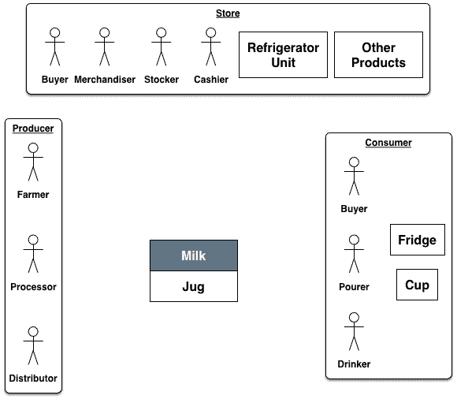
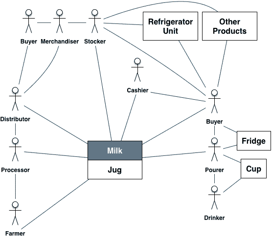

# 用户界面、可用性和用户体验:方形牛奶壶版

> 原文：<https://dev.to/billlenoir/user-interfaces-usability-and-user-experience-the-square-milk-jug-edition-4ce5>

鉴于所有设计师面临的时间和资源短缺，我们需要优先考虑我们的努力。这通常意味着将最明显或看起来最酷的功能留给那些能给我们带来最大投资回报的功能，即使(或特别是)当这些选择看起来违背直觉时。

要获得正确的设计，您需要回答 3 个关键问题:

*   谁使用它？
*   他们如何使用它？
*   如何衡量成功的互动？

通过预先回答这些问题，你有更好的机会创造一个产品，成为市场领导者，而不是被遗忘的追随者。需要一个好的例子给你指路？

## 方形牛奶罐难题

用户界面(UI)、可用性和用户体验(UX)之间的关系很复杂。以方形牛奶罐为例。也许你已经在一个大的盒子商店看见一个。消费者讨厌它，因为它很难倒，经常导致溢出。然而，它已经存在了大约十年，而且不太可能消失。为什么？虽然从罐子里倒牛奶的可用性有问题，但这是关键用例吗？如果不是，那是什么？从谁的角度来看呢？消费者、商店还是生产者？

### 域

先说领域。一个产品从生产到消费的运营环境是怎样的？表达这一点的典型方式是通过一些与你的产品直接交互的人和系统的表现，以及那些与产品的使用有利害关系或对其使用有影响的人。这不仅仅是倒牛奶的人和那个形状奇怪的牛奶罐之间的互动。从奶牛到喝牛奶的人的路程相当长。用户可以是购买牛奶、倒牛奶和喝牛奶的人；然而，如果这些是不同的人，他们的关系如何影响牛奶购买决策？你如何将牛奶送到用户放入购物车的地方？

在出售牛奶的商店里，出售一盒牛奶需要做很多事情:

*   采购代理人购买牛奶。
*   一辆冷藏车把牛奶送到商店。
*   储奶员把牛奶放在冷藏箱里。
*   用户与冷藏箱互动，将水壶放入购物车。
*   出纳员接受付款。

### 用户界面

用户界面是复杂的东西，很多产品——甚至是方形的牛奶罐——都不止一个。以下是关于产品用户界面的关键问题:

*   在这个领域中，任何两个参与者之间的接触点是什么？每一个都描述了一个交易。
*   这两个接口是如何执行该事务的:
    *   行动的先决条件是什么？
    *   交换是如何发生的？
    *   可能的结果是什么？

当然，在牛奶倾倒器和牛奶罐之间有一个接口；然而，杯子和饮用者之间，商店的冷藏箱和购买者之间，购买者和收银员之间，以及家里的冰箱之间也有接口。

### 可用性

UI 和可用性是灵魂伴侣，你需要同时服务于两者来构建一个伟大的产品。因此，至少隐含地，每个接口都有一个可用性承诺:每个参与者用来判断事务成功的一组标准。可用性是对界面易用性和可学性的一种质量度量。这为理解用户如何判断交互提供了一个框架。它是一种高度主观的度量，考虑了领域的上下文。

倒牛奶的人和牛奶罐之间的接口可以根据该人从冰箱中取出牛奶罐、打开它、倒牛奶、关闭它、以及放回原处而不溢出或浪费任何牛奶的容易程度来评估。与规则形状的水壶相比，方形水壶的紧凑性使其更难完成这些任务(尽管方形水壶可能更适合放在冰箱里)；然而，这只是众多接口中的一个。

### 用户体验(UX)

UX 不仅仅是每个界面可用性的总和。这是对整体体验的主观衡量，会因用户和时间而异。大多数倒牛奶的人都希望不会洒出来；有的比较宽容。一些购买牛奶的人希望他们的钱得到最好的回报；其他人想要最高质量的产品。有时我希望尽可能少花时间执行事务；其他时候，我喜欢逛逛，看看有什么东西在打折。这些个人体验的累积总和构成了整体的用户体验。

有些事情是设计师无法控制的，比如饮用者和牛奶之间的杯子接口。其他的事情，比如饮用者和购买者之间的关系，可以通过广告等活动间接影响(有牛奶吗？™).关键是要对这个列表进行优先排序，在给定的努力水平下，什么最有可能实现你的目标。

请注意，有机牛奶不是包装在方形罐中，因为有机牛奶购买者发现从奶牛到杯子的整个过程非常重要。所以，难倒就等于销量差。普通的牛奶购买者想要更容易地倒牛奶，但是，如果有选择的话，他们通常会选择更便宜的。它更便宜，因为如果它们是方形的，商店可以在冰箱里装更多的容器，这降低了他们的成本，使他们能够在价格上更好地竞争。用户对偶尔牛奶飞溅的挫折感被他们每周购买的产品获得优惠的重要性所压倒。

## 吸取教训

方形牛奶罐难题提供了几个有价值的见解:

*   **重要的 v .明显的**。最明显和最重要的界面是有区别的。在牛奶市场，最重要的指标是销量，而不是消费者的便利性。因此，最重要的接口是从乳品店到大盒子店，而不是消费者。消费者界面只需要“好到足以倾倒”
*   **想得更深**。很容易假设消费者的偏好是牛奶市场的头号驱动力，但方形牛奶罐的难题告诉我们并非如此。最大化货架上的牛奶量实际上最大化了销售，尽管不是最佳的牛奶容器。方形集装箱也更容易运输，更便宜，因为堆叠更容易，卡车空间的使用得到优化。
*   **跟着钱走**。假设你为消费者制造了完美的牛奶盒，但是没有人知道。我并不是说一旦你的完美容器上架，消费者就会拒绝它。我的意思是，大盒子商店拒绝你的容器有很多原因——每个容器的货架空间太大，购买和运输成本太高——消费者从来没有见过你的完美容器。你最好改进方形容器，这样消费者会更喜欢它，而不是设计一个没人会看到的产品。通过这种方式，乳品厂和商店尽可能地赚钱，消费者以一个好价格买到牛奶——尽管是装在一个明显普通的容器里。