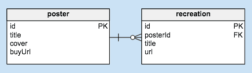
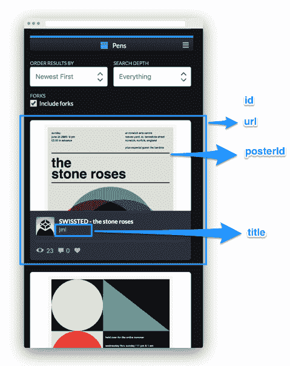
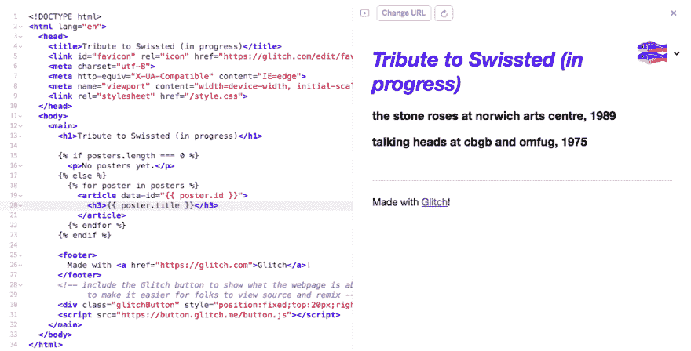
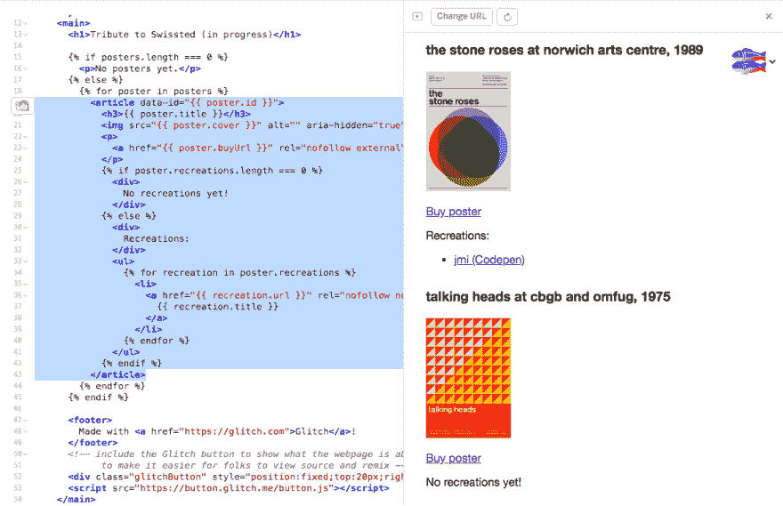
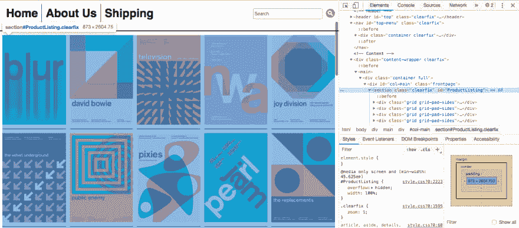
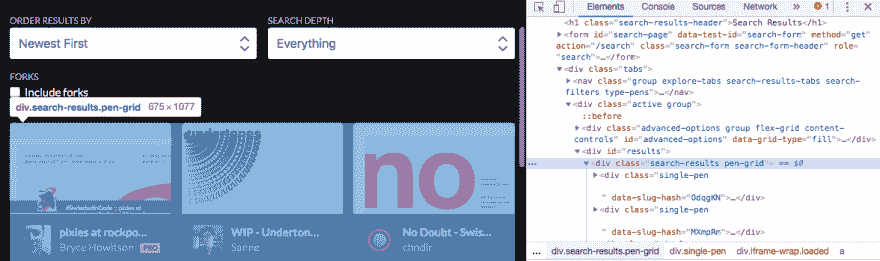
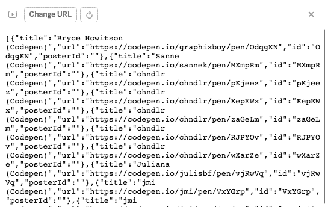
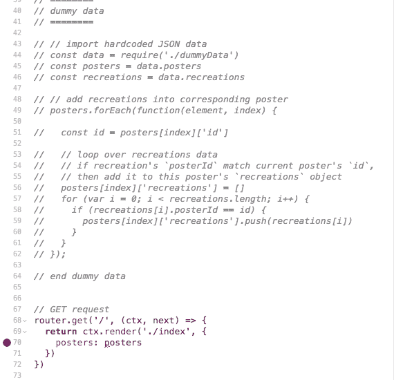

# 向 Swissted 致敬—第二部分:“抓取”，用 Cheerio 解析和提取数据

> 原文：<https://dev.to/ekafyi/tribute-to-swissted-part-ii-scraping-and-parsing-data-with-cheerio-1m2a>

这是一个[系列](https://dev.to/ekafyi/tribute-to-swissted-introduction-2c6i)的第二部分，我正在构建我的第一个 Node.js web 应用，名为**“致敬 Swiss ted”**，它在一个界面中显示所有 [Swissted](https://swissted.com) 海报设计和相应 [Codepen recreations](https://codepen.io/search/pens?q=swissted&page=1) 的链接。

[https://glitch.com/embed/#!/embed/tribute-to-swissted-skeleton?previewSize=100&path=index.html](https://glitch.com/embed/#!/embed/tribute-to-swissted-skeleton?previewSize=100&path=index.html)

在[之前的帖子](https://dev.to/ekafyi/tribute-to-swissted-part-i-setting-up-a-node-js-web-app-with-koa-and-nunjucks-ph4)中，我们已经有了一个简单的 Node 应用程序并开始运行。现在我们将添加来自 Swissted 和 Codepen 网站的内容。但是等一下...两个网站都没有提供公共 API 来访问它们的数据。这是否意味着我必须为*数百张*海报复制粘贴数据？😱

[](https://i.giphy.com/media/l378gxtNQaXcsqY7K/giphy-downsized.gif)

有好消息和坏消息。

*   **好消息:**我们可以用 Node.js 抓取 Javascript 中的网页内容！存在类似于 [`scrape-it`](https://github.com/IonicaBizau/scrape-it) 或者 [`cheerio`](https://github.com/cheeriojs/cheerio) 和 [`request`](https://github.com/request/request) 的组合的库。(转到这篇文章的结尾链接到教程。)
*   **坏消息:**不是所有的网站都允许刮痧。我需要刮的两个网站都不允许。🤷🏽‍♀️

这是一个没有严格要求的小项目，我决定*省略编程抓取*和*手动复制原始 HTML 数据，而不是*。当然，这个决定是有代价的:

*   我不得不从所有页面手动复制 HTML。不过，我只需要“抓取”7 页(4 页 Swissted 和 3 页 Codepen 结果)，这还是可行的。
*   我的 web 应用程序*无法在每次运行时(或每 x 小时/天)获取新数据*。如果有新的海报或 Codepen 条目，我必须手动添加。

因为抓取库也接收原始 HTML 数据，所以后续步骤将与我以编程方式抓取 HTML 是一样的。我们将*解析原始数据*以获得我们想要的信息，然后*将数据发送给 Nunjucks HTML 模板文件进行渲染*。

很酷的一点是 Javascript 部分运行在服务器而不是客户端(浏览器)，所以这个网站在*所有*浏览器中都可以工作，不管有没有 Javascript。😎

我们开始吧！

> 💡 **Sidenote:** 如果你想练习程序化抓取，请看这个关于 Glitch 的[教程和入门 app。除了 Node，你可能还对 Python 的 web 抓取感兴趣，如本教程](https://glitch.com/culture/web-scraping-cheerio-starter-app/)中[所述。](https://hackernoon.com/web-scraping-tutorial-with-python-tips-and-tricks-db070e70e071)

**图书馆**

*   [Koa](https://koajs.com/) and Koa middleware (koa-static, koa-router, koa-views)
*   [再见](https://github.com/cheeriojs/cheerio)
*   模板引擎

**目录**

1.  设计数据模型
2.  准备和处理我们的数据
3.  用 Nunjucks 在 HTML 中显示数据
4.  用 Cheerio“抓取”并解析*海报*数据
5.  用 Cheerio“抓取”并解析*娱乐*数据
6.  修改*再现*数据
7.  用我们的新数据替换虚拟数据

* * *

## 0。安装必备组件

用上面描述的库设置一个节点应用程序。

我做了一个 [Glitch starter app](https://glitch.com/~eka-nodejs-koa-starter) ，你可以重新混合，我在[我之前的帖子](https://dev.to/ekafyi/tribute-to-swissted-part-i-setting-up-a-node-js-web-app-with-koa-and-nunjucks-ph4)中描述过。

## 1。设计数据模型

首先，我们需要弄清楚我们到底想要在网站上显示什么。我们的数据模型由两个“实体”组成，*海报*和*娱乐活动*。一张*海报*可能有多个*娱乐活动*——例如[“诺里奇艺术中心的石玫瑰，1989”海报](https://www.swissted.com/products/the-stone-roses-1989)至少有两个用户的 Codepen 娱乐活动 [jmi](https://codepen.io/jmi/pen/wjvmpr) 和 [Shelby Perry](https://codepen.io/shelbyper/pen/vLvvNO) 。

[](https://res.cloudinary.com/practicaldev/image/fetch/s--eUsS_Oz4--/c_limit%2Cf_auto%2Cfl_progressive%2Cq_auto%2Cw_880/https://thepracticaldev.s3.amazonaws.com/i/ppjs9t2oq30ajjfgcie7.png)

一张*海报*包括:

[](https://res.cloudinary.com/practicaldev/image/fetch/s--u5kX5HD4--/c_limit%2Cf_auto%2Cfl_progressive%2Cq_auto%2Cw_880/https://thepracticaldev.s3.amazonaws.com/i/gumg3x9ymx0ltb7pf02i.png)

*   `id` —唯一标识符
*   `title` —海报标题，例如*“诺里奇艺术中心的石玫瑰，1989”*
*   `cover` —封面图片网址
*   `buyUrl` —在 Swissted 上购买海报的网址，例如[https://www.swissted.com/products/the-stone-roses-1989](https://www.swissted.com/products/the-stone-roses-1989)

一项*娱乐活动*包括:

[](https://res.cloudinary.com/practicaldev/image/fetch/s--2fdv6Fsb--/c_limit%2Cf_auto%2Cfl_progressive%2Cq_auto%2Cw_880/https://thepracticaldev.s3.amazonaws.com/i/aqjtj0hbry2l8jtg1mbt.png)

*   `id` —唯一标识符
*   `posterId` —对应海报的 id 值
*   `title` —创作者姓名及来源(非笔名)，如*“jmi(code pen)”*
*   `url` —娱乐入口网址，例如[https://codepen.io/jmi/pen/wjvmpr](https://codepen.io/jmi/pen/wjvmpr)

**注:**我决定称它为*娱乐*而不是比如说*笔*或*码笔*因为将来我可能会从其他来源添加项目(也许有人在 Glitch 上这么做了？).我决定不使用通用名称，如*项目*或*条目*，以避免与海报条目本身混淆。

在这一步中，我们仍然为数据使用虚拟内容。这样，当我们*知道*有实际内容时，我们就有了可靠的参考数据。在根目录下创建一个名为`dummyData.js`的新文件，并添加以下代码。

```
// dummyData.js
module.exports = {

  posters: [
    {
      "id": "",
      "title":"",
      "cover":"",
      "buyUrl":""
    }
  ],

  recreations: [
    {
      "id":"",
      "posterId": "",
      "title":"",
      "url":""
    }
  ]
} 
```

如您所见，我们正在创建两个数组对象来表示我们的两个实体，`posters`和`recreations`。现在让我们用从源网站复制的虚拟内容来填充这些内容:*两张海报*和*一个娱乐活动*。我们现在可以编造任何`id`值。

```
// dummyData.js
module.exports = {

  posters: [
    {
      "id": "stone-roses-1989",
      "title":"the stone roses at norwich arts centre, 1989",
      "cover":"https://cdn.shopify.com/s/files/1/0140/7312/products/stone_roses_300x300.gif",
      "buyUrl":"https://www.swissted.com/products/the-stone-roses-1989"
    },
    {
      "id": "talking-heads-1975",
      "title":"talking heads at cbgb and omfug, 1975",
      "cover":"https://cdn.shopify.com/s/files/1/0140/7312/products/talking_heads_300x300.jpg",
      "buyUrl":"https://www.swissted.com/products/talking-heads-at-cbgb-and-omfug-1975"
    }
  ],

  recreations: [
    {
      "id":"jmi-stone-roses-1989",
      "posterId": "stone-roses-1989",
      "title":"jmi (Codepen)",
      "url":"https://codepen.io/jmi/pen/wjvmpr"
    }
  ]
} 
```

## 2。准备和处理我们的数据

有了数据之后，现在让我们从服务器端脚本导入它。打开`server.js`并在`router.get`请求的前添加以下几行*(如果你使用我的 Glitch 应用程序，是第 20 行)。* 

```
// server.js
// ....

// import hardcoded JSON data
const data = require('./dummyData')
const posters = data.posters
const recreations = data.recreations

console.log('posters', posters)
console.log('recreations', recreations)

// .... 
```

检查你的**日志**，我们应该会发现我们的虚拟数据打印在那里。(这取决于你，但我通常在它打印出预期的输出后删除`console.log`行。)

我们*可以*将我们当前的数据原样发送到视图模板，但是视图模板必须处理这些数据以显示每个海报的正确再创作，这是*而不是*它的设计目的。我们的服务器代码应该尽可能多地处理这类工作。

现在，让我们将它添加到我们刚刚编写的代码中。

```
// server.js
// ...

// add recreations into corresponding poster
posters.forEach(function(element, index) {
  console.log('element', element)
});

// ... 
```

现在，它只将每个海报对象打印到日志中。让我们用下面的代码替换`console.log`行。

```
// server.js

// add recreations into corresponding poster
posters.forEach(function(element, index) {

  const id = posters[index]['id']

  // loop over recreations data
  // if recreation's `posterId` match current poster's `id`,
  // then add it to this poster's `recreations` object
  posters[index]['recreations'] = []
  for (var i = 0; i < recreations.length; i++) {
    if (recreations[i].posterId == id) {
      posters[index]['recreations'].push(recreations[i])
    }
  }
}); 
```

这段代码中发生了什么:

*   我们循环遍历每个海报对象
*   我们定义海报的 id
*   我们在 poster 对象中定义了一个新的空数组对象，称为`recreations`
*   我们循环每个娱乐对象
*   如果娱乐的`posterId`与当前海报的`id`匹配，则将娱乐添加到海报的`recreations`数组(即本娱乐属于本海报)

最后把我们的数据送去查看吧！找到我们的`router.get`函数，用`posters: posters`替换`name`字段。

```
// server.js
// GET request
router.get('/', (ctx, next) => {
  return ctx.render('./index', { 
    // name: 'Eka'
    posters: posters
  })
}) 
```

## 3。用 Nunjucks 在 HTML 中显示数据

让我们来看看我们的视图模板，即`index.html`。我们的视图使用 Nunjucks 模板引擎，这是我们马上要写的。将`<body` >内容替换为以下内容。

```
<!-- index.html -->
<html lang="en">
  <!-- no change in <head> -->
  <body>
    <main>
      <h1>Tribute to Swissted (in progress)</h1>

      
        <p>No posters yet.</p>
      
        <p>YES, we have posters!</p>
      

      <!-- footer and Glitch button -->
    </main>
  </body>
</html> 
```

点击**显示**，你会在我们的页面上看到第二段。这里我们使用 Nunjucks 条件 [`if`](https://mozilla.github.io/nunjucks/templating.html#if) 标签来预测空的`posters`数据并打印消息“无海报”(与显示空白屏幕相反)，从而改善用户体验。

接下来，我们用一个 [`for`循环](https://mozilla.github.io/nunjucks/templating.html#for)替换`else`内容，以迭代`posters`对象。

```
<!-- index.html -->

      
        <p>No posters yet.</p>
      
        
          <article>
            <h3>{{ poster.title }}</h3>
          </article>
        
       
```

重新加载你的页面，它应该显示一个海报标题列表。

[](https://res.cloudinary.com/practicaldev/image/fetch/s--IUOWPXPY--/c_limit%2Cf_auto%2Cfl_progressive%2Cq_auto%2Cw_880/https://thepracticaldev.s3.amazonaws.com/i/kvxg3rz34eydjc6f3gh1.png)

现在，我们将其余的数据添加到模板中。

```
<!-- index.html -->

      
        <p>No posters yet.</p>
      
        
          <article data-id="{{ poster.id }}">
            <h3>{{ poster.title }}</h3>
            
            <p>
              <a href="{{ poster.buyUrl }}" rel="nofollow noopener external">Buy poster</a>
            </p>
            
              <div>
                No recreations yet!
              </div>
            
              <div>
                Recreations:
              </div>
              <ul>
                
                  <li>
                    <a href="{{ recreation.url }}" rel="nofollow noopener external" target="_blank">
                      {{ recreation.title }}
                    </a>
                  </li>
                
              </ul>
            
          </article>
        
       
```

在这段代码中，我们用`for`循环显示每个`posters`对象。对于每张海报，我们显示包含以下内容的`<article>`元素:

*   [`data-`中的`id`属性](http://marcofolio.net/html5-data-attributes/)(这样我们就可以很容易的找到一张海报的`id`)
*   `title`
*   图像(我们对屏幕阅读器隐藏它，因为它是多余的)
*   链接到`buyUrl`
*   如果有的话，列出`recreations`(注意我们也使用条件来检查当前海报是否有任何重现，如果有，只运行`for`循环)

如果一切顺利，我们应该会得到这样的结果。我们已经成功地在模板中显示了我们的数据！

[](https://res.cloudinary.com/practicaldev/image/fetch/s--D3yL8S1f--/c_limit%2Cf_auto%2Cfl_progressive%2Cq_auto%2Cw_880/https://thepracticaldev.s3.amazonaws.com/i/z0ujx026efwacd0tr0dd.png)

## 4。用 Cheerio“抓取”和解析海报数据

让我们用“真实”数据替换我们的虚拟数据。为了使解析和处理数据更容易，我们正在安装 [cheerio](https://cheerio.js.org/) ，这是核心 jQuery 的一个轻量级实现，它“解析标记并提供一个 API 来遍历/操作结果数据结构”。在你的**控制台**中运行下面的命令。

```
pnpm install cheerio --save 
```

创建一个名为`postersData.js`的文件，我们将在其中处理我们的数据。在那里导入我们的 cheerio 库。

```
// postersData.js

// initialize data parsing/processing with cheerio
const cheerio = require('cheerio') 
```

#### 4a)“刮”数据

接下来，我们手动“抓取”我们的内容(因此有了引号)。我们将使用我们浏览器的*开发工具*——也称为*开发工具*——来复制原始的 HTML 数据。准确地说，我们使用的是*【检查元素】*工具。如果您不熟悉 *DevTools* ，请点击此处了解:

*   [火狐开发者工具](https://developer.mozilla.org/en-US/docs/Tools)
*   [铬债务工具](https://developers.google.com/web/tools/chrome-devtools/)
*   [Safari 开发工具](https://developer.apple.com/safari/tools/)

打开[swissted.com](https://swissted.com)，在页面内容上点击右键，选择*“检查元素”*。(您也可以从菜单或使用键盘快捷键打开它，请查看浏览器的 DevTools 文档)。

在*元素检查器*界面中，我们可以看到网页的 DOM 节点。单击三角形以获得包含所有海报的最远节点。这种情况下是`section#ProductListing`。点击右键，然后选择*复制>复制元素*。

[](https://res.cloudinary.com/practicaldev/image/fetch/s--LnR01RpB--/c_limit%2Cf_auto%2Cfl_progressive%2Cq_auto%2Cw_880/https://thepracticaldev.s3.amazonaws.com/i/4xhzd26twtizs0d6vxe4.png)

粘贴到您的文本编辑器。我使用缩小工具使代码更紧凑。如果使用 VSCode，还可以使用“连接线”功能。回到`postersData.js`，像这样粘贴我们的数据。

```
// postersData.js

const cheerio = require('cheerio')

// prepare raw HTML data
const page1 = '<section class="clearfix" id="ProductListing">... content here ...</section>' 
```

Swissted 网站由四个页面组成，所以让我们对另外三个页面重复相同的步骤:(1)打开元素检查器，(2)找到`#ProductListing`节点，(3)复制元素，(4)缩小/连接，(5)粘贴到`postersData.js`。

在我们获得所有四个页面的原始数据后，我们可以将所有数据连接成一个变量`allHtmlString`。

```
// postersData.js

// ... previous code

// prepare raw HTML data
const page1 = '<section class="clearfix" id="ProductListing">... content here ...</section>'
const page2 = '<section class="clearfix" id="ProductListing">... content here ...</section>'
const page3 = '<section class="clearfix" id="ProductListing">... content here ...</section>'
const page4 = '<section class="clearfix" id="ProductListing">... content here ...</section>'
const allHtmlString = page1.concat(page2.concat(page3.concat(page4))) 
```

#### 4b)解析和处理数据

最后，这篇文章有趣的部分——也就是我们可以利用 cheerio 简洁而强大的 API 的地方！

但是首先，让我们用*元素检查器*检查切换后的页面，看看一张海报是什么样子的。这里我们有`buyUrl`(第 1 行)`id`(第 2 行)`cover`图像(第 3 行)，和`title`(第 5 行)。

```
<a href="/products/blur-at-mandela-hall-1993" title="blur at mandela hall, 1993">
  <article id="product-198784422">
    
    <div>
      <h3>blur at mandela hall, 1993</h3>
      <p>From $50.00</p>
      <span class="button">view print</span>
    </div>
  </article>
</a> 
```

使用 Cheerio，我们基于上面的选择器从原始数据中提取/解析信息，并将其保存到一个名为`posters`的新数组对象中。

```
// postersData.js

// ... previous code

// load raw HTML data
const $ = cheerio.load(allHtmlString);

// create empty posters array
const posters = []

// create empty recreations array
const recreations = []

// parse data and add as child of `posters`
$('article').each(function(index, element) {

  // initialize poster object
  posters[index] = {};

  // get title
  const title = $(element).find('article h3').text()
  posters[index]['title'] = title

  // get cover
  const cover = $(element).find('article>img').attr('src')
  posters[index]['cover'] = cover.replace('1024x1024', '120x120')

  // get buyUrl
  const buyUrl = $(element).parent().attr('href')
  posters[index]['buyUrl'] = 'https://www.swissted.com' + buyUrl

  // get id
  const id = $(element).attr('id')
  posters[index]['id'] = id

  // create `recreations` array
  // loop over recreations data
  // if recreation's `posterId` match current poster's `id`,
  // then add it to this poster's `recreations` object
  posters[index]['recreations'] = []
  for (var i = 0; i < recreations.length; i++) {
    if (recreations[i].posterId == id) {
      posters[index]['recreations'].push(recreations[i])
    }
  }
});

console.log(posters) 
```

上面的代码中发生了什么:

*   将我们的 HTML 数据加载到 cheerio 中
*   稍后创建一个空的`posters`数组来保存我们的数据
*   用 cheerio 的 [`.each`](https://github.com/cheeriojs/cheerio#each-functionindex-element-) 迭代每张海报(`article`
    *   注意:也可以使用普通的 Javascript `for`循环，但是我选择使用 cheerio 的类似 jQuery 的 API。
*   提取每张海报的信息
    *   用`.find`在我们的节点中寻找一个选择器
    *   用`.parent`定位我们节点的父节点
    *   用`.text`获取元素内的文本(对于`title`)
    *   用`.attr`获取属性值(对于`cover`、`buyUrl`和`id`)

注意，在`.each`函数的末尾，我们有来自步骤 2 的重建循环代码。目前，它不会做任何事情，因为我们的`recreations`对象是空的。我们将在下一步处理*娱乐活动*数据，并在以后返回到该文件添加它们。

打开我们的**日志**，应该会看到上百张海报数据打印在那里。

## 5。用 Cheerio“抓取”和解析娱乐数据

这一步类似于上一步，只是现在我们用重建数据来做。就像上一步一样，创建一个名为`recreationsData.js`的文件，并将我们的 cheerio 库导入其中。

```
// recreationsData.js

// initialize data parsing/processing with cheerio
const cheerio = require('cheerio') 
```

#### 5a)“刮”数据

打开 Codepen 和[搜索“Swiss ted”](https://codepen.io/search/pens?q=swissted&page=1&order=newest&depth=everything)。默认情况下，搜索结果按*相关性&流行度*排序，但让我们将其更改为*最新第一*，以便将来更容易添加更多项目。同样，右键单击页面并选择*“检查元素”*。

在*元素检查器*面板中，寻找包含所有结果的节点，即`div.search-results.pen-grid`。右键选择*复制元素*，缩小粘贴的代码。

[](https://res.cloudinary.com/practicaldev/image/fetch/s--IpyfCCHM--/c_limit%2Cf_auto%2Cfl_progressive%2Cq_auto%2Cw_880/https://thepracticaldev.s3.amazonaws.com/i/kd5g36ncpfoy1hoy52xz.png)

返回`recreationsData.js`并粘贴我们的数据。

```
// recreationsData.js

const cheerio = require('cheerio')

// prepare raw HTML data
const codepen1 = '<div class="search-results pen-grid">... content here ...</div>' 
```

在撰写本文时，Codepen 搜索结果中有三页。对另外两个页面重复这个过程，然后将所有数据连接成一个变量`allHtmlString`。

```
// recreationsData.js

// ... previous code

// prepare raw HTML data
const codepen1 = '<div class="search-results pen-grid">... content here ...</div>'
const codepen2 = '<div class="search-results pen-grid">... content here ...</div>'
const codepen3 = '<div class="search-results pen-grid">... content here ...</div>'
const allHtmlString = codepen1Html.concat(codepen2Html.concat(codepen3Html)) 
```

#### 5b)解析和处理数据

让我们用*元素检查器*检查 Codepen 搜索结果页面。每支笔(娱乐)的实际 HTML 相当长。下面是包含我们需要的数据的删节版本:`title`(第 10 行)、`url`(第 4 行)和`id`(第 1 行)。

```
<div class="single-pen" data-slug-hash="OdqgKN">
  <div class="meta-title-name">
    <h3 class="item-title">
      <a href="https://codepen.io/graphixboy/pen/OdqgKN" title="pixies at rockpoint palladium 1991" >
        pixies at rockpoint palladium 1991
      </a>
    </h3>
    <div class="user">
      <a class="username" href="/graphixboy">
        <span>Bryce Howitson</span>
      </a>
    </div>
  </div>
</div> 
```

同样，我们用 Cheerio 提取我们需要的信息，并将其保存到一个名为`recs`的新数组对象中。

```
// recreationsData.js

// ... previous code

// load raw HTML data
const $ = cheerio.load(allHtmlString);

// create empty recreations array
const recs = []

// parse data and add as child of `recs`
$('.single-pen').each(function(index, element){

  // initialize recreation object
  recs[index] = {};

  // get title
  const title = $(element).find('.username span').text()
  recs[index]['title'] = title + ' (Codepen)'

  // get url
  const url = $(element).find('.item-title a').attr('href')
  recs[index]['url'] = url

  // get id
  const id = $(element).attr('data-slug-hash')
  recs[index]['id'] = id

  // add empty posterId field
  recs[index]['posterId'] = ''

});

console.log(recs) 
```

上面的代码中发生了什么:

*   将我们的 HTML 数据加载到 cheerio 中
*   稍后创建一个空的`recs`数组来保存我们的数据
*   用 cheerio 的 [`.each`](https://github.com/cheeriojs/cheerio#each-functionindex-element-) 迭代每张海报(`.single-pen`
*   提取每支笔的信息
    *   用`.find`在我们的节点中寻找一个选择器
    *   用`.text`获取元素内的文本(对于`title`)
    *   用`.attr`获取属性值(对于`url`和`id`)
*   添加一个空白的`posterId`字段，我们将在下一步手动填充它

检查我们的**日志**；如果我们看到我们的娱乐数据，那么我们可以继续下一步！

## 6。修改娱乐数据

我们有我们的*海报*数据，我们有我们的*娱乐*数据，但是我们没有把它们连接在一起。在大型现实世界项目中，理论上机器学习可以用来比较海报和娱乐。然而，在这个项目中，我们将手动完成这项工作。我们通过(1)将我们的*娱乐*数据打印到单独的路线，(2)创建重复数据，(3)为每个娱乐找到匹配的海报，并将海报的`id`添加到娱乐的`posterId`字段，最后(4)将娱乐数据添加到海报数据。

#### 6a)创建一个返回娱乐数据的路由

首先，我们用 [stringify](https://developer.mozilla.org/en-US/docs/Web/JavaScript/Reference/Global_Objects/JSON/stringify) 将我们的娱乐数据转换成 JSON 格式并导出它。

```
// recreationsData.js

// add to the bottom of the file
const recsWithoutPosterId = JSON.stringify(recs)
module.exports = recsWithoutPosterId 
```

然后转到`server.js`并在我们现有的`router.get`功能前添加下面的*。* 

```
// server.js

// load recommendations (without poster) data
const recsWithoutPosterId = require('./recreationsData')

// GET URL for recreations data without poster id
router.get('/recreations-data', (ctx, next) => {
  ctx.body = recsWithoutPosterId
}) 
```

上面的代码创建了一个名为`recreations-data`的新路径，它打印从上面的`recreationsData.js`文件导入的数据。

点击 Glitch 应用面板顶部的**“Change URL”**，输入我们的新路线(my-Glitch-app-name . Glitch . me/recreations-data)，我们应该会看到 JSON 格式的 recreations 数据。

[](https://res.cloudinary.com/practicaldev/image/fetch/s--IZq48MIr--/c_limit%2Cf_auto%2Cfl_progressive%2Cq_auto%2Cw_880/https://thepracticaldev.s3.amazonaws.com/i/pl89ceqzg0fz0l0xvje7.png)

#### 6b)创建重复的娱乐数据并添加`posterId`

点击右键，选择全部，复制*重现* JSON 数据。然后创建一个名为`recreationsWithPosterData.js`的新文件。定义一个名为`recreations`的变量，并将我们的数据粘贴到那里。它应该是这样的:

```
// recreationsWithPosterData.js
const recreations = [
  {
    "posterId":"",
    "title":"Bryce Howitson (Codepen)",
    "url":"https://codepen.io/graphixboy/pen/OdqgKN",
    "id":"OdqgKN"
  },
  {  
    "posterId":"",
    "title":"Sanne (Codepen)",
    "url":"https://codepen.io/sannek/pen/MXmpRm",
    "id":"MXmpRm"
  },
  // etc
] 
```

现在是手工工作。我的步骤是:

1.  打开每个 Codepen 链接
2.  搜索开关已停止匹配海报
3.  使用*检查元素*得到`posterId`
4.  将`posterId`添加到`recreationsWithPosterData.js`

我现在已经输入了大约 20 个项目，如果有一天我有时间，我会继续。这是我添加了`posterId`之后我们的数据看起来的样子。在底部，用`module.exports`导出我们的数据。

```
// recreationsWithPosterData.js
const recreations = [
  {
    "posterId":"product-198789752",
    "title":"Bryce Howitson (Codepen)",
    "url":"https://codepen.io/graphixboy/pen/OdqgKN",
    "id":"OdqgKN"
  },
  {  
    "posterId":"product-407927401",
    "title":"Sanne (Codepen)",
    "url":"https://codepen.io/sannek/pen/MXmpRm",
    "id":"MXmpRm"
  },
  // etc
]

module.exports = recreations 
```

#### 6c)给海报数据添加娱乐活动

还记得第四步吗？现在我们已经用相关的`posterId`完成了重建数据，我们正在编辑我们的海报数据，用来自`recreationsWithPosterData`的新数据替换空的`recreations`数组。

```
// postersData.js

// create empty posters array
const posters = []

// remove this line
// const recreations = []

// replace with this line
// import recreations data
const recreations = require('./recreationsWithPosterData') 
```

运行`console.log(posters)`来查看娱乐活动是否被适当地添加到我们的海报数据中。如果一切顺利，我们就导出数据吧！

```
// postersData.js
// add to the bottom of the file
module.exports = posters 
```

## 7。从视图样板渲染数据

最后，我们的最后一步！我们已经导出了新的*海报*数据，现在我们只需要将它从服务器发送到我们的 HTML 模板。

打开`server.js`，删除(或注释掉)步骤 2 中从`const data = require('./dummyData')`到`posters.forEach(function(element, index) { ... })`的虚拟数据代码。

我们会得到一个🔴*错误*，因为我们必须在`router.get`函数中将`posters`数据发送给我们的模板。

[](https://res.cloudinary.com/practicaldev/image/fetch/s--XhZbuG1L--/c_limit%2Cf_auto%2Cfl_progressive%2Cq_auto%2Cw_880/https://thepracticaldev.s3.amazonaws.com/i/nv4y0ggydi1xx4rc0ni0.png)

现在在`router.get`之前的任何地方添加我们的新海报数据。

```
// server.js

// load posters data 
const posters = require('./postersData') 
```

重新加载应用程序。不仅错误应该消失，而且我们的应用程序现在应该显示新的“抓取”数据。我们成功了！！🎉

* * *

## 📝我的笔记

*   从网站上抓取公共数据是 [*而不是*本身就是非法的](https://stackoverflow.com/a/32674131)。内容的性质和您显示内容的方式可能会使其非法(如侵犯版权)。如果您向网站的服务器发出太多或太频繁的请求，您可能会被阻止。注意你的刮擦用法。
    *   与此相关的是，我将在下一篇文章中用`fs`解决本地缓存和保存图像的问题。如果这款应用被 Shopify 屏蔽了，我会把图片保存到 Glitch 的`assets`文件夹中。
    *   如果你运行一个自动的 scraper，一定要预测源数据的变化(不同的标记，不同的类名，例如，如果用 CSS-in-JS 库自动生成)，这将影响你的数据结构。
*   Cheerio 的类似 jQuery 的 API 让我更容易处理 DOM 数据，例如这里的`.find()`、`.parent()`和`.text()`。很有帮助！

* * *

## 📚进一步阅读

*   使用 Cheerio 收集您需要的数据！
*   [如何在 Node.js 中编写 web scraper](https://ionicabizau.net/blog/30-how-to-write-a-web-scraper-in-nodejs)
*   [node . js 网页抓取终极指南](https://medium.freecodecamp.org/the-ultimate-guide-to-web-scraping-with-node-js-daa2027dcd3)

* * *

这样，我们就完成了 web 应用程序最基本版本的构建。但是正如你所看到的，在我们发货之前还需要最后的润色！在下一篇文章中，我将改进应用程序的标记、样式和性能。

感谢您的阅读。敬请关注下期帖子！