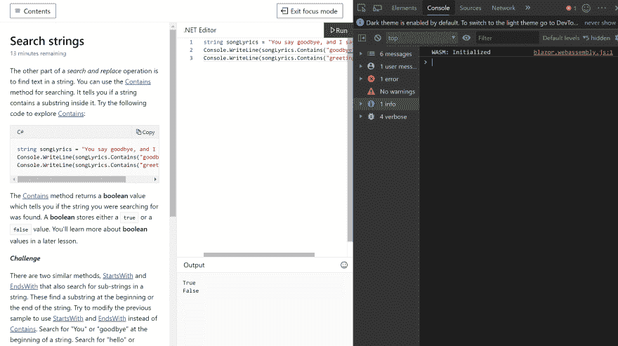
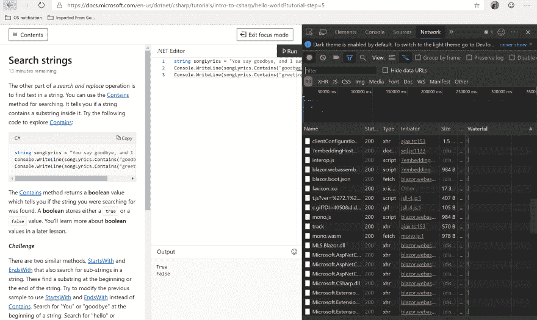
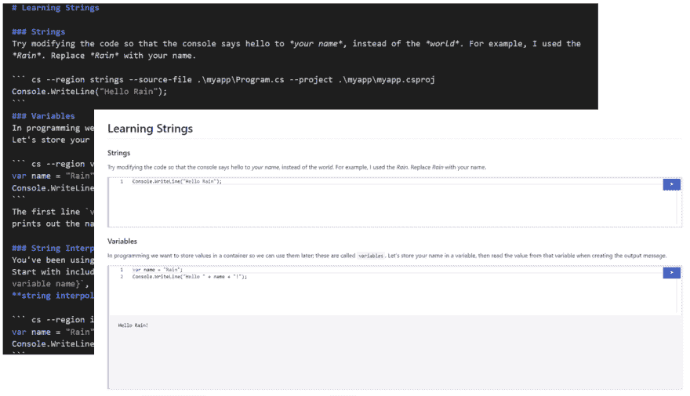
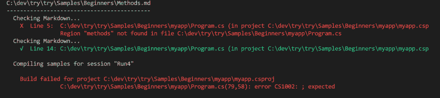

# Markdown +。NET =交互式文档？

> 原文：<https://dev.to/ladynaggaga/markdown-net-interactive-docs-3ba2>

我和我的团队一直在努力为从新手到更有经验的开发人员找出方法，使他们能够尝试和探索。轻松入网。我们的工作导致了 Try .NET 的开发。

**什么是尝试。网**:试试。NET 是一个交互式文档生成器。网芯。

## 试试。网络在线

当尝试时。NET 最初于 2017 年 9 月在 docs.microsoft.com 推出，我们使用 Azure 容器实例执行了我们所有的代码服务器端。然而，在过去的五个月里，我们使用 Blazor 和 Web Assembly 切换了代码执行客户端。通过移动客户端执行，我们可以提供尝试。免费提供给更多的观众😃。

你可以通过访问[这一页](https://docs.microsoft.com/dotnet/csharp/tutorials/intro-to-csharp/hello-world?tutorial-step=5)，打开你的浏览器开发工具来亲眼看看。在*控制台的*选项卡下，您会看到信息`WASM:Initialized`。现在，切换到*网络*标签，你会看到所有的 dll 现在都在客户端运行。

[](https://res.cloudinary.com/practicaldev/image/fetch/s--J60JmEDa--/c_limit%2Cf_auto%2Cfl_progressive%2Cq_auto%2Cw_880/https://user-images.githubusercontent.com/2546640/57245063-c6d10f00-6fee-11e9-860e-ddd6327c79c5.PNG) 
*控制台标签:WASM 初始化*

[](https://res.cloudinary.com/practicaldev/image/fetch/s--Thc3Lfig--/c_limit%2Cf_auto%2Cfl_progressive%2Cq_auto%2Cw_880/https://user-images.githubusercontent.com/2546640/57245056-c3d61e80-6fee-11e9-91f3-628aaa125a1f.PNG) 
*网络标签:dll*

## 试试。网络离线

对我们来说，在线和离线提供交互式文档是非常重要的。对于我们的线下体验来说，创造一种能够融入内容作者当前工作流程的体验至关重要。在我们的调查中，我们注意到我们的内容开发人员在创建开发人员文档时有两个经常使用的地方。

1.  用户可以下载并运行的示例项目。
2.  Markdown 文件包含一组指令，以及他们从代码库中复制并粘贴的代码片段。

试试看。网络使能。NET 开发人员使用`dotnet try`全局工具创建交互式降价文件。为了让你的减价文件具有交互性，你需要使用[。NET Core SDK](https://dotnet.microsoft.com/download/dotnet-core/3.0) 、 [dotnet try 全局工具](https://www.nuget.org/packages/dotnet-try/)、[Visual Studio](https://visualstudio.microsoft.com/)/[VS Code](https://code.visualstudio.com/)，还有你的 repo。
[](https://res.cloudinary.com/practicaldev/image/fetch/s--4z6IMfvT--/c_limit%2Cf_auto%2Cfl_progressive%2Cq_auto%2Cw_880/https://user-images.githubusercontent.com/2546640/57158389-47a2c780-6db1-11e9-96ad-8c6e9ab52853.png)

### 我们是如何做到这一点的？

**延长降价时间**

在 markdown 中，您使用隔离的代码块来突出显示代码片段。在代码块的前后放置三个反勾号。您可以添加可选的语言标识符，以便在 fenced 代码块中突出显示语法。例如，一个 C#代码块应该是这样的:

```
var name ="Rain";
Console.WriteLine($"Hello {name.ToUpper()}!"); 
```

带着尝试。我们已经扩展了代码栏，增加了额外的选项。

```
cs --region methods --source-file .\myapp\Program.cs --project .\myapp\myapp.csproj 
var name ="Rain";
Console.WriteLine($"Hello {name.ToUpper()}!"); 
```

我们创建了以下选项:

*   `--region`选项指向一个 C#区域。
*   `--source-file`选项指向一个包含源代码的文件。
*   `--project`选项指向一个项目文件，您可以用它来引用 NuGet 包。

所以，我们在这里做的是从后台项目`myapp`中一个名为`methods`的`#region`中访问代码，并使你能够在你的 markdown 中运行它。

**使用#区域**

在我们的 markdown 中，我们扩展了代码栏以包含一个指向 C#区域的`--region`选项，该区域的目标是一个名为`methods`的区域。

所以，你的`Program.cs`应该是这样的:

```
using System;

    namespace HelloWorld
    {
        class Program
        {
            static void Main(string[] args)
            {
                #region methods
                var name ="Rain"
                Console.WriteLine($"Hello{name.ToUpper()}!");  
                #endregion
            }
        }
    } 
```

**点网试验证**

`dotnet try verify`是为你的文档准备的编译器。使用这个命令，您可以确保每个代码片段都可以工作，并且与支持项目保持同步。

`dotnet try verify`的目标是验证您的文档是否按预期工作。

通过运行`dotnet try verify`,你将能够发现降价和编译错误。例如，如果我从上面的代码片段中删除一个分号，并将该区域从`methods`重命名为`method`，我会得到以下错误。

[](https://res.cloudinary.com/practicaldev/image/fetch/s--a1xGS2aD--/c_limit%2Cf_auto%2Cfl_progressive%2Cq_auto%2Cw_880/https://user-images.githubusercontent.com/2546640/57272892-67a0e800-704a-11e9-83f0-c0f2181e888e.PNG)

### 试试`dotnet try`全局工具

*   克隆[这个回购](https://github.com/dotnet/try)
*   安装。网芯 SDK [3.0](https://dotnet.microsoft.com/download/dotnet-core/3.0) 和 [2.1](https://dotnet.microsoft.com/download/dotnet-core/2.1) 。目前，`dotnet try`全局工具的目标是 2.1。
*   去你的终端
*   安装[试一下。网络工具](https://www.nuget.org/packages/dotnet-try/)

`dotnet tool install --global dotnet-try --version 1.0.19266.1`

更新到该工具的最新版本很容易，只需运行下面的命令

`dotnet tool update -g dotnet-try`

*   导航到这个存储库的 Samples 目录，输入下面的`dotnet try`。
    [](https://res.cloudinary.com/practicaldev/image/fetch/s--yOZQj76P--/c_limit%2Cf_auto%2Cfl_progressive%2Cq_66%2Cw_880/https://user-images.githubusercontent.com/2546640/57164943-ab35f080-6dc3-11e9-8230-ee521e00e428.gif)

*   这将启动浏览器。
    抱歉破坏了图片链接😿。你可以在这里查看发布体验

### 试试。NET 现在是开源的

试试看。NET 源代码现在在 [GitHub](https://github.com/dotnet/try) 上！请随时在我们的问题下提交任何错误报告。如果您有任何功能建议，请使用社区建议标签在我们的问题下提交。

了解更多有关尝试的信息。NET，查看 [dotnet 试回购](https://github.com/dotnet/try)。期待您的反馈。