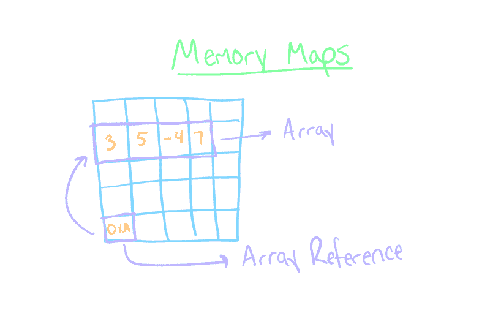
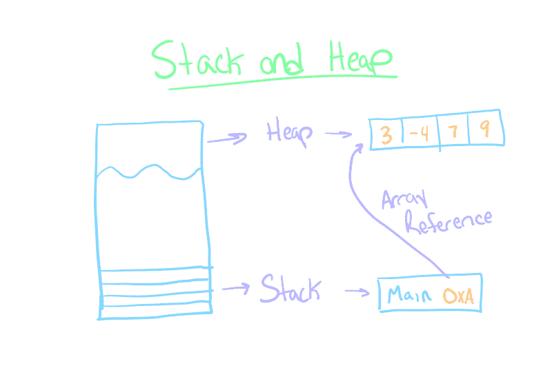
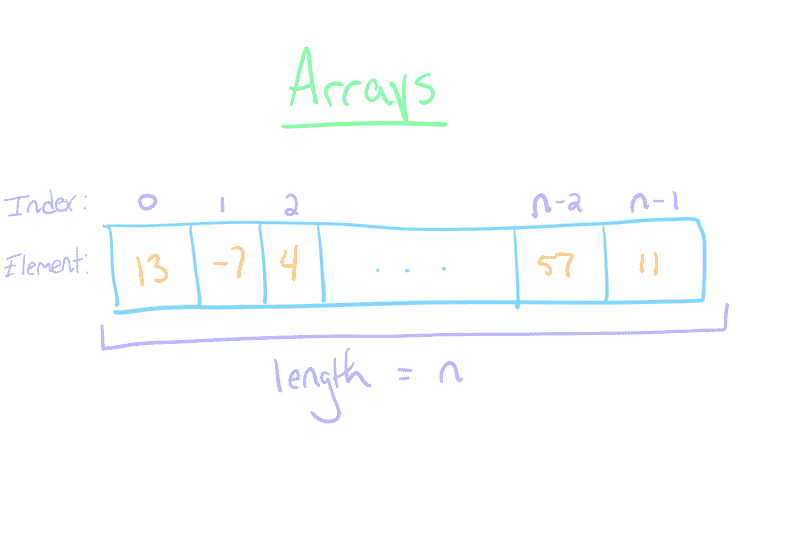

# 如何讲授计算机科学中的数组

> 原文：<https://dev.to/renegadecoder94/how-to-teach-arrays-in-computer-science-2f5n>

当我已经写了[一篇关于数据结构](https://therenegadecoder.com/code/array-data-structure/)的文章时，我还试图教数组，这可能看起来很奇怪。但是，文章只在传达一个概念时有用。在这篇文章中，我们将介绍一些在课堂环境中传达这一概念的方法。如果一切顺利，我可能会把这个做成一个系列！

## 什么是数组？

在我们开始之前，我想先声明本文中的方法在很大程度上是与语言无关的。换句话说，我不会专注于任何特定的语言，但我会借鉴我的 Java、C/C++、C#和 Python 经验。因此，可能会使用一些不一定与语言无关的概念(例如，从零、字符串等开始索引)。).不管怎样，我认为通过具体的例子可以学到很多东西。

当然，我这篇文章的目标读者是那些正在寻找新方法来教授同样的旧概念的老师们。此外，我希望用这篇文章来记录我这些年来学到的一些东西。因此，您可以期待这篇文章会随着时间的推移而发展壮大。

那么，什么是数组呢？我想你已经知道了。如果没有，也许你应该看看[我关于数组](https://therenegadecoder.com/code/array-data-structure/)的文章，总结一下:

数组是数据的集合。更具体地说，数组是一个固定大小的内存块，它被分割成多个单元用于数据存储。数据类型的大小决定了每个单元格的大小和数组的总大小。

在类 C 语言中，数组的定义如下:

```
int[] numbers = new int[10]; 
```

Enter fullscreen mode Exit fullscreen mode

在这个例子中，我们定义了一个大小为 10 的整数数组。换句话说，我们最多可以存储 10 个整数。自然，我们可以创建任何类型和任何大小的数组。但是，数组的这些参数在声明后是固定的。

好了，现在复习够了！我们继续吧！

## 学习目标

在教授数组时，我们应该有一些我们希望在课程结束时达到的目标。排名不分先后，下面是我的几个(以 Java 为例)。

**学生应该能够:**

*   理解并使用与阵列相关的术语:
    *   排列
    *   元素
    *   索引
*   读写有效的数组语法:
    *   声明:`int[] arr;`
    *   定义:`arr = new int[10];`
    *   设定:`arr[3] = 5;`
    *   获取:`int x = arr[2]`
*   完成常规阵列任务:
    *   居住于
    *   横贯
    *   搜索
    *   分类
    *   复制

根据不同的课程，我们可能想要扩大或缩小这个列表的范围。不管怎样，这是一个很好的开始！

## 挑战

在学习数组时，学生可能会遇到一些挑战。在这一部分，我将分享我注意到的一些挑战，以及我如何尝试解决它们。

### 没有数据结构的直觉

当引入时间数组时，学生通常对数据结构没有直觉。如果他们想存储一些值，他们通常选择尽可能多的变量来完成工作。

为了弥补这个知识缺口，我喜欢把数组和他们已经用得很多的东西联系起来:字符串。毕竟，字符串只是具有额外功能的字符数组。

字符串的一个可转移技能是索引。如果学生了解如何通过索引从字符串中检索字符，他们应该能够轻松地索引数组。同样，字符串通常从零开始索引，所以熟悉字符串的学生应该能够画出这种联系。

无论如何，这可能是学生第一次处理数据结构的概念，因此将这个概念与他们可能从日常生活中了解的集合联系起来是很重要的。

### 没有索引的直觉

对于一些学生来说，数组可能是他们第一次不得不从零开始计数。对于大多数学生来说，从零开始索引是违反直觉的。毕竟，在日常生活中，我们通常从一开始计数。当然，从零开始并不是一个陌生的概念。毕竟，我们通常从零开始，拥有像时间线这样的连续数据，所以现实世界中有很多相似的机会。

如前所述，如果您已经介绍了字符串，那么它会是一个很好的起点。在许多编程语言中，字符串是字符数组，所以平行线应该是清晰的。请注意，字符串通常是不可变的，而数组通常不是。

### 无参考型直觉

如果学生第一次接触数组，他们肯定会遇到一些问题。例如，这可能是他们第一次处理引用，所以证明复制是一项重要的任务是很重要的。

此外，如前所述，学生可能以前使用过字符串。不幸的是，当谈到引用类型时，字符串和数组之间的相似之处就不存在了。在许多语言中，字符串是不可变的，所以实际上你不能像对数组那样改变它们。如果您选择在示例中使用字符串，请注意这种心理上的跳跃。

## 方法

考虑到学习目标和挑战，我们如何实际教授数组呢？在这一节中，我将举例介绍一些我最喜欢的方法。

### 通过相关原理进行教学

正如已经多次提到的，学生们很有可能已经对一种非常类似数组的数据类型有所熟悉:字符串。毕竟，如果你的课程从 Hello World 开始，那么你已经让你的学生接触到了弦乐。

我喜欢使用字符串，因为很多语言使用数组对它们建模。在像 Java 这样的语言中，从`str.charAt(0)`到`str[0]`并不是什么难事。在 Python 等其他语言中(使用更接近数组列表的东西)，语法完全相同。因此，很有可能你已经教过数组了。

当然，通常有一些细节需要你去处理。例如，初始化通常有点不同。一定要分享数组可能有不同于字符串的初始化语法:

```
String str = "Hello"; 

// vs 
char[] str = {'H', 'e', 'l', 'l', 'o'}; 

// vs char[] 
str = new char[5]; 
str[0] = 'H'; 
str[1] = 'e'; 
str[2] = 'l'; 
str[3] = 'l'; 
str[4] = 'o'; 
```

Enter fullscreen mode Exit fullscreen mode

最终，在学生们传递了一些知识之后，您需要将数组的概念与字符串隔离开来。我喜欢把复制数组的挑战作为更有趣的话题的继续，比如嵌套数组和数组列表。

### 通过真实世界的例子进行教学

虽然字符串是教授数组的好工具，但我们并没有真正消除教授数组的问题。毕竟，像索引这样的概念必须在某个时候教授。输入:真实世界的例子。

在教授数组时，我喜欢在纸质列表和电子表格等概念之间进行比较。在纸质列表和电子表格中，每一项通常都被分配了一个数字，我们可以将这个数字与数组中的索引联系起来。

与许多现实世界的例子一样，这种类比通常会在某个时候失效。例如，现实世界中的列表通常对列表中的条目数量没有限制，而数组却有。

因此，我有时更喜欢用书架来类比。每个架子都是一个由架子宽度限定的数组。当然，书籍可以有不同的大小，这打破了数组的基本定义，但我发现它可以是一个比纸质列表更好的类比。

无论你选择什么样的类比，都要意识到它的局限性，并且只把它作为一种沟通你的学生已经知道的和他们需要知道的之间的桥梁。

## 直观教具

最后，让我们进入正题！毕竟我教书的时候喜欢画很多图，所以我们来看几个数组的直观教具。

### 记忆地图

去年我发现一个有用的工具是记忆地图。如果你不熟悉这个概念，它基本上是一个空的网格，你可以用它来演示对象如何存储在内存中。

[](https://therenegadecoder.com/?attachment_id=15777)

当您对数组使用内存映射时，您可以分割出内存映射的一部分来演示一个连续的内存块。然后，您可以用数字或字符填充不同的单元格，开始演示数组的概念。

对我来说，内存映射的真正强大之处在于展示了按值传递是如何工作的。换句话说，您可以展示一个函数在作为参数传递时如何复制数组引用。

### 栈和堆

如果您想了解本质细节，您可能想考虑引入堆栈和堆的概念。考虑到您的学生缺乏数组知识，您不一定需要深入解释这些概念，但我发现可视化这两部分内存非常有帮助。

[](https://therenegadecoder.com/?attachment_id=15780)

我喜欢画一个堆栈，其中只包含对创建数组的 main 方法的调用。然后，我想展示数组的地址存储在堆栈中，而数组本身放在堆中。这通常会进一步强化引用类型的概念。

### 数组

是的，这可能看起来很傻，但有时解释一个概念的最好方法是直接画出来。绘制数组有很多方法，但我通常使用两种不同的图表:一种使用数组语法，另一种喜欢一维网格。

[](https://therenegadecoder.com/?attachment_id=15781)

无论是哪种情况，思路都应该是清晰的。例如，每个单元格都有一些索引并存储一些数据。然后，您可以使用这个可视化来演示您可以在数组上进行的各种交互，如插入和删除。

事实上，我发现阵列可视化在可扩展性方面是最好的。您可以使用它来显示各种操作，如排序、遍历和填充。

## 活动

虽然类比和视觉辅助对于介绍计算机科学材料来说是很好的，但是你实际上为学生提供一些事情来加强他们的理解是很重要的。

### 实验室

计算机科学课程通常包括一个实验部分，学生可以和教师一起探索一个概念。对于数组，这意味着运行任务，迫使学生与数据结构进行交互。典型任务可能包括:

*   初始化:创建数组
*   填充:用项目填充数组
*   遍历:对数组中的每一项执行操作
*   搜索:在数组中查找一个项目

当然，还有更高级的任务，如:

*   排序:根据某种顺序重新排列数组中的项目
*   复制:复制数组
*   嵌套:探索多维数组

我相信在实验室里你还可以做很多其他的活动。只要选择上面的几个话题，想办法让它变得有趣。例如，用数组做凯撒密码可能很有趣。让学生加载一个包含一些字符的数组，然后将它们移动一定的偏移量。这是我在野外看到的几只实验室:

*   [硬币兑换](http://web.cse.ohio-state.edu/software/2221/web-sw1/extras/instructions/coin-change.html):用数组表示硬币面额进行兑换
*   [选择排序](http://web.cse.ohio-state.edu/cse1223/sp2019/closedlabs/CSE1223ClosedLab09.html):对一组数字进行排序

最终，实验室的目标是激发一些关于主题的推理。我通常喜欢在实验室里使用苏格拉底的方法。我不会直接回答问题，而是通过问学生一些有针对性的问题来给他们指出正确的方向。当然，如果你像我一样有一个满是 40 名学生的实验室，这可能会成为一个时间危机，所以不要害怕给出解决方案。

### 游戏

很多人可能会发现游戏对成年人来说有点不专业，但我发现它们可以为课堂注入一些激情。如果学生对这些材料感兴趣，你就知道你在做正确的事情。只要保证是真品，不要太噱头就行。

例如，我曾经为班级举办过一次[危险游戏](https://study-games.therenegadecoder.com/)。本质上，我让学生分成小组。然后，对于每个问题，每组有 15 秒的时间在黑板上写下他们的答案。如果小组得到了它，他们就得到了分数。游戏的竞争性迫使学生快速思考。结果，当学生显然不知道一个答案时，我能够暂停并解释它。

由于危险的性质，答案必须简短。很自然地，想出 25 个仅仅与数组相关的有趣的简答题是很困难的，所以你可能想寻求其他的选择。比如像[礼帽](https://tophat.com/)和[卡胡特这样的平台！](https://kahoot.com/)非常适合生成类似智力竞赛的游戏。学生们用他们的智能手机或笔记本电脑参与进来，并面对一系列问题。很自然地，这可能会变成你的学生之间的竞争游戏，他们都想第一个分享正确的答案。

就内容而言，数组、遍历和索引等术语的定义都很棒。此外，还可以分享代码片段，向学生询问结果(即`list[i]`)。无论你选择做什么，学生们都会喜欢课堂休息。

### 互动课程

我一直尝试做的一件事是让讲座变得互动。这是否意味着提出问题或组织小组项目，这并不重要。交互性是这里的关键。一个积极参与的课堂是一个学习的课堂，这在处理具有挑战性的计算机科学主题时尤为重要。

就我个人而言，我在整个课堂上定期用礼帽测验学生。这帮助我衡量理解，而不必不断地问“这有意义吗？”对于数组，我可能会问一些基本的索引问题，以确保学生知道数组是从零开始的(或者你选择的语言中的任何约定)。

我也喜欢让学生在讲课之余休息一下，给他们几分钟分组解决一个编码问题。例如，我可能会要求全班分成几个小组，编写一段代码来计算数组中数字的平均值。几分钟后，我会让学生们分享他们的作品，我甚至可能会分享我自己的一个例子。最后，我想强调的是，有很多方法可以解决同一个问题。

## 作业

你让学生带回家的东西和你在课堂上教的东西一样重要。确保你有意完成家庭作业，而不仅仅是制造繁忙的工作。

### 小测验

我参加过的很多班级都有某种形式的在线测验，以确保学生跟上进度。我建议在测验中保持较低的分值，这样学生在不理解某些内容时不会感到有压力。毕竟，这些测验是给你，老师，而不是学生的。评估学生的成长是你的工作，而测验是完成这项工作的好方法。

就与数组相关的测验而言，我建议只涵盖高级概念。例如，展示代码片段并让学生告诉你他们做了什么是很有帮助的

```
x = [1, 4, 6] 
print(x[1]) # What does this print? 
```

Enter fullscreen mode Exit fullscreen mode

这些理解性的问题可以帮助你衡量你的学生对数组的理解。

在形式上，你可以很容易地将课外测验作为家庭作业。或者，你可以利用测验作为课堂检查点。不管怎样，我认为定期跟踪进展是有价值的。

### 项目

正如任何全面的计算机科学课程一样，我认为让学生带一两个项目回家是个好主意。理想情况下，项目应该比你在课堂上和实验室里完成的材料更难。这样，学生们就有机会独自或在小团队中真正解决问题。

当我上编程入门课时，我们被要求做一个游戏。特别是，我们制作了类似于 [Bejeweled](https://en.wikipedia.org/wiki/Bejeweled) 的东西，其中有一个你可以匹配的颜色网格。当然，网格是由一组嵌套的按钮阵列组成的，这些按钮阵列与游戏板的列和行相关。自然，有很多这种基于网格的游戏。例如，你可能会要求学生实现一个简单版本的 [2048](https://en.wikipedia.org/wiki/2048_(video_game)) 或者甚至是[生命游戏](https://en.wikipedia.org/wiki/Conway%27s_Game_of_Life)。

如果游戏看起来太有挑战性，你可以选择任意数量的数组操作项目:排序、搜索等。或者，你可以走数据科学路线。例如，你可以要求学生用数字填充数组，并对集合进行统计计算:最大值、最小值、平均值、标准差、中值、众数等。

根据学生的经验水平，您可能希望为他们提供一个方法模板来填写。或者，您可以提供一个 API，并要求学生用代码重现该功能。

无论哪种情况，都要注意你的截止日期。在我看来，应该给学生几周时间来完成项目。额外的时间应该让他们感觉不那么匆忙，这样你会得到更好的结果。此外，更长的时间表迫使学生专注于他们的时间管理技能。大多数学生无论如何都会等到最后一分钟，但像我这样的人会欣赏呼吸的空间。

### 习题集

虽然测验很适合检查，项目很适合实践，但习题集很适合理论。换句话说，当你想让学生扩展他们的理解时，就创建问题集。

就数组而言，问题集应该包括拓展学生已知知识的问题。例如，询问学生如何在不告诉他们数组列表的情况下实现数组列表可能会很有趣。这迫使学生思考如何处理数组容量已满而用户试图添加另一个元素的情况。这也让他们接触到像复制这样的话题。

或者，习题集可以用来强化行话。我不一定让学生复制和粘贴定义，但让他们用自己的话给出定义可能会有帮助。例如，您可以让他们向您解释什么是数组以及如何使用数组。

我个人最喜欢比较对比题。不幸的是，学生们可能是第一次接触数据结构，所以数组是独立的。然而，这可能是一个很好的机会来询问基本类型和引用类型之间的区别(当然这取决于语言)。

随着学生对他们的计算机科学课程越来越深入，我发现教授们倾向于走问题集路线，因为主题更理论化。不管怎样，习题集对学生来说是一个很好的机会来真正解释他们的思维过程。

## 反馈

和往常一样，我知道我不是世界上唯一的计算机科学教育家。如果你过去教过数组，你最喜欢用什么方式来表达这些内容？请随意分享你的想法。

否则，谢谢你的来访！我感谢你们的支持，我希望你们会继续留下来。