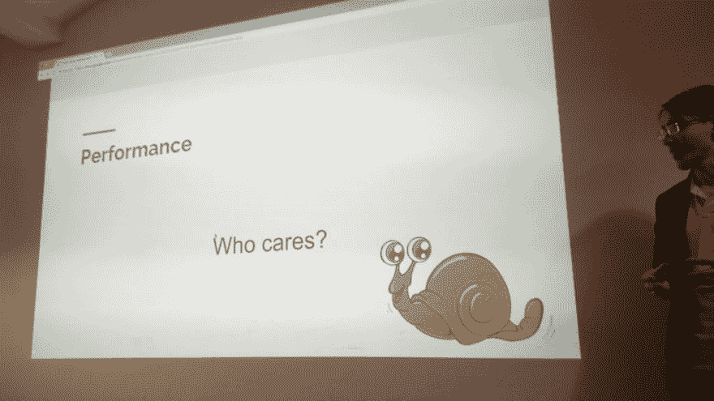

# 为 Ruby API 选择哪个框架

> 原文：<https://dev.to/mkdev/which-framework-to-choose-for-ruby-api-5hk7>

不久前，我有机会在柏林的 Ruby meetup 上分享我使用 Grape framework 的经验。在本文中，我将向您展示我在那里展示的内容。

我的团队开发了一个单页应用程序。这意味着我们不会把前端的苹果和后端的橙子混在一起。所以后端留下的唯一东西就是它的 API，根本没有表示逻辑。不仅如此，我们的工作速度非常快。设计师创造概念，进行用户测试，把所有东西送到开发部门，我们创造概念，开始 beta 测试。如果反馈是积极的，我们保持一切原样，如果不是，删除或重写。正如你所看到的，对我们来说非常重要的是，框架不会阻碍工作进程，而是帮助我们，并拥有我们需要的所有基本功能。同样至关重要的是，这个框架不应该限制我们将最非传统的想法付诸实践的权利。

我们选择 Ruby，因为整个团队在某种程度上都很熟悉它。无论一些非信徒说什么，它仍然是快速原型和进入市场的最佳语言。不久前，我和我的朋友兼 Golang 开发者打了个小赌，看谁能更快地创建一个简单的 API 和数据库。我们想知道在 web 应用程序的开发过程中，哪种语言更快。嗯，很明显是 Ruby，不然我也不会给你举这个例子:)我不想在任何意义上淡化 Go 的意义，但是这两种语言在很多方面是完全不同的。

> 不知道 API 是什么？然后从[什么是 web 应用中的 API 以及为什么需要它开始](https://mkdev.me/posts/chto-takoe-api-v-veb-prilozheniyah-i-zachem-on-nuzhen)。

### 选择一个框架

选择了语言之后，现在我们需要选择一个框架。好吧，我们这里有什么？Ruby on Rails！嗯...嗯，DHH，我们真的很感谢你所做的一切，但是让我们四处看看，也许我们会找到别的东西。

如果你和我一样，已经和 Ruby 一起工作了相当长的时间，我想你已经厌倦了。例如，如果开发人员关于架构和框架的观点本质上不一致，那么框架不会让你遵循原则，而在你看来，这些原则是构建可持续和灵活系统的基础。让我提醒你，我不想把烂番茄扔到铁轨上。如果你不确定该如何处理，用它编写的应用程序可能会开始发臭。这就是为什么你需要知道结果只在开发者手里。不幸的是，他们中的大多数人并不真正关心建筑。虽然我们确实在乎，但我们还是决定寻找其他的选择。以下是候选名单:

*   葡萄
*   honami
*   洛达
*   Rails API
*   西纳特拉

这些是我们对框架的要求:

*   相当数量的开箱即用功能；
*   版本控制；
*   它上市的时间；
*   性能；
*   我们的个人喜好。说它们不重要是骗人的。

### 开箱特性

有一些基本的特性，没有这些特性，任何 API 都没有任何用处。参数验证、跨源资源共享(CORS)支持和异常处理是基本的功能。

可以肯定地说，Rails API 拥有所有这些特性，因为它是同一个生态系统的一部分。

相反，Sinatra 是完全不同的，因为它没有以上任何东西。)很明显，你可以用它建造一个你想要的建筑，并添加任何宝石，但对我来说，这是一个巨大的缺点，超过了所有的优点。我和 Sinatra 合作过，甚至不止一次用它做过一些东西，但是对于我们现在正在做的产品，我们想要一些功能丰富的东西。所有其他框架都介于两者之间，这意味着它们既有现成的特性，又有额外的优点，所以让我们跳过它们。

### 版本化

当你创建一个 API 时，你可以随时添加版本控制。但是如果你一开始不做，以后再做可能会很痛苦。对我们的团队来说，在任何时候都有机会改变一个 API 是至关重要的，但是要保持旧的 API 不变。当然，我们现在讨论的所有框架都有版本控制，但是每个框架在某些方面都是不同的。

Sinatra，Hanami，Rails API:

```
namespace '/api/v1' do
  # routes goes here
end 
```

Enter fullscreen mode Exit fullscreen mode

Roda:

```
r.on "api" do
  r.on "v1" do
    r.is "users" do
      r.get do end
      r.post do end
    end
    r.get "comments" do end
  end
end 
```

Enter fullscreen mode Exit fullscreen mode

葡萄:

```
version 'v1', using: :path 
```

Enter fullscreen mode Exit fullscreen mode

在我看来，葡萄的方式不是最干净的内在逻辑，但最方便和可读。此外，除了基于 url(路径)的版本控制，您还可以使用基于参数和头的类型。

### 市场上的时间

这一点表明该框架不是由某个学生动态构建的。时间测试在软件世界中至关重要。

#### 葡萄

发布于 2010 年，根据 GitHub analytics 的数据，1 月份有 4 个合并的拉取请求。

Rails API 于 2012 年发布，1 月份有 85 个合并的拉请求。请记住，Rails API 存储库在 2015 年与主要的 Rails API 存储库合并，因此它们共享这些 pull 请求。这并不奇怪，因为 Rails 在 Ruby 框架市场上占据主导地位。

#### 辛纳特拉

算是菜鸟中的老手了。它于 2008 年发布，从那以后就一直在更新，尽管看起来它并不需要任何更新。一月份有 3 个拉取请求。然而，对我来说，它似乎在过去的五年里没有任何重大更新，但我没有深入挖掘，所以我可能是错误的。

#### 花见

2014 年发布的一个新的优秀框架在应用程序中有一个有趣的关注点分离功能。直到去年，当 1.0 版本发布时，我才有机会看一看它。据我所知，它正在积极开发中，但在一月份只有一个拉请求。我知道一些开发人员在工作中使用 Hanami，但在创建应用程序的时候，它对我们来说还是太粗糙了。

#### Roda

第一次稳定发布是在 2014 年。它在一月份有一个拉取请求。

当你选择一个框架时，你应该记住这些数字吗？嗯，这完全取决于你。对我来说，它们不应该是关键点，但在你试图从几个选项中做出选择时可能会有用。

### 表现

[](https://res.cloudinary.com/practicaldev/image/fetch/s--HnwWNS9H--/c_limit%2Cf_auto%2Cfl_progressive%2Cq_auto%2Cw_880/http://zonov.me/wp-content/uploads/2018/02/DU-TIc9XUAA1uXw-1024x576.jpg)

您可能已经知道了，但是框架性能可能是最后一件吸引您注意力的事情。是 Ruby，你知道，性能不是它最强的点。即使这个项目很大，已经上市一段时间了，你需要优化它的性能，web 框架不是你的瓶颈，而是你的代码。或者您的数据库查询。或者错误的架构。

### 个人喜好

正如我已经提到的，我已经使用 Rails 和 Rails API 很长时间了，如果需要的话，我准备再次工作。然而，这一次我们决定采用不同的框架。我可以推荐你读一篇彼得·索尔尼卡的[知名文章。但是，即使考虑到这篇文章和其他框架的所有优点，如果我必须快速原型化一些东西，我的最佳选择将是 Rails。](http://solnic.eu/2016/05/22/my-time-with-rails-is-up.html)

辛纳特拉是最基本的，它没有开箱即用的功能。当它被适当地定制并且所有需要的宝石被添加的时候，它工作得很好并且不会引起任何问题。我在以前的工作中遇到了一些问题，但主要是我的错。但是当你刚开始在你的项目中使用它时，你需要手动完成大部分的工作，这很烦人。

正如我已经说过的，我发现 Hanami 非常迷人，因为它允许您将关注点分离到一些特定的项目和数据库中，就像您正在开发微服务架构一样，但没有任何困难(当然也有好处，因为它不是另一个的子站)。在 Hanami 中，lib 目录和 apps 目录中有一个共享代码库，其中可能包含几个第三方 web 界面或应用程序。乍一看，这似乎很令人兴奋，但是使用你不确定的关于 bug 和安全问题的框架从来都不是一个好主意，尤其是如果你的目标是快速开发的话。在写这篇文章的时候，NPM 5.7.0 发布了，它有一个巨大的安全缺陷，改变了你所有系统目录的访问权限。我这么说是为了说明你永远不知道什么时候可信的软件会帮你一个大忙。

洛达。当我在 meetup 上准备我的演讲时，我没有和洛达打交道的实际经验。我觉得它的路线很糟糕。嗯，从那以后我的观点就没有真正改变过。meetup 上的一些人试图证明洛达是市场上存在的最好的框架，所以也许这是真的。

葡萄。这就是我们最后的选择。它不会把它的架构强加给你，它功能丰富，但不会太多，功能不会太多，并且已经上市很长时间了。

### 美中不足

他们说，没有理想的框架，所以 Grape 也有不好的一面。在我看来，第一个是 Grape 有自己的 DSL(领域特定语言)，这意味着你不应该编写普通的 Ruby 代码，而是应该遵循 Grape 文档中提到的调用和命名标准。有时它会导致非常可怕的代码。自己看:

```
expose :some_attribute, if: ->(element, _) { element.final? } do |element|
  element.my_attribute
end 
```

Enter fullscreen mode Exit fullscreen mode

### 结论

“软件”中有一个“软”字是有原因的，它是一种不断变化的“物质”。对产品本身的要求可能会改变，但标准、观点、偏好和方法也会改变。最重要的是，所有的项目都是不同的，在对每个项目做出决定之前，你需要思考一段时间。这篇文章的目的是展示所有的 Ruby 框架都是不同的，你需要检查和使用每一个框架，甚至在你的项目中尝试所有的框架。我希望我能做到这一点！我还建议您记住 Grape，它是一个非常棒的 API 框架！

> 你想了解更多关于 Ruby 和 API 的知识吗？您可以从阅读系列文章开始，在这些文章中，Kirill Shirinkin 从头开始为使用外部 API 创建了一个 Gem[GrooveHQ Ruby Gem 的开发](https://mkdev.me/en/posts/how-to-create-a-gem-for-working-with-an-api)。

* * *

*这是[一篇由](https://mkdev.me/en/posts/which-framework-to-choose-for-ruby-api)[基里尔·佐诺夫](https://mkdev.me/en/mentors/graffzon)撰写的mkdev 文章。你可以聘请基里尔做你的私人 Ruby 导师。*