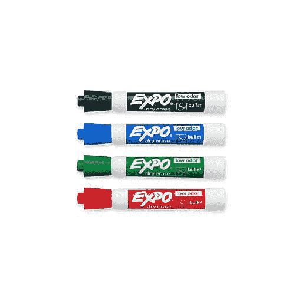
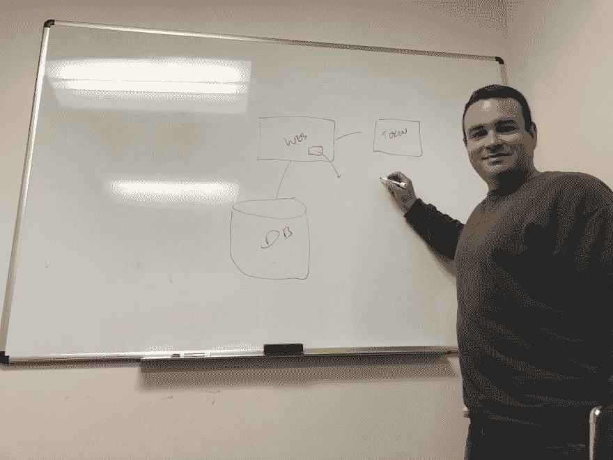
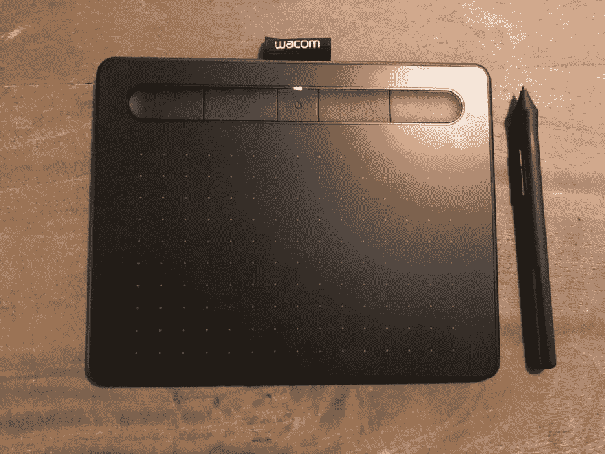

# 站在白板前统治世界！

> 原文：<https://dev.to/techleadcoach/stand-before-the-whiteboard-and-rule-the-world-19e1>

我总是说，站在白板前的人统治世界。以下是如何打破平庸的方法和原因，哪怕只是一点点。

尽管每个人都害怕无聊的会议，但会议实际上是技术领导者最好的朋友。人类可能至少早在穴居老人处理穴居时代的重大问题时就召集会议了。今天，当我们需要实时讨论一些重要的事情(希望对每个人都重要，而不仅仅是少数人)时，我们仍然使用会议🙄).

尽管我们的穴居人祖先会对 Slack(以及相关的 Giphy 和 Emoji)等异步工具感到困惑，但身体上(或虚拟地)出现在某人面前以及“召集会议”以集中每个人的注意力的仪式是庄严的。

关于为什么会议是有价值的，我还有很多话要说，但是我就不多说了。现在，我想推荐一个在会议中产生影响的方法，包括虚拟会议。

## 用记号笔记录会议

想象你自己在一个会议室里。人们围坐在会议桌旁。很无聊。一些人试图讨论一些技术问题，并发出类似“废话连篇”的噪音一半(或更多)的对话是在试图澄清困惑、纠正误解，或者只是努力让会议不偏离主题。房间里一半(或更多)的人甚至没有注意，他们在用笔记本电脑或手机(希望能在 dev.to 上看到这篇文章👀).

如果你是我经常写信的一位技术领导，或者即使你不是，我也请求你，*请* : **起来反对这种平庸**！

站起来，呃，站起来。拿起一支记号笔(**专业提示**:带上你自己的记号笔，因为它们在大多数会议室里总是不起作用)，开始在白板上画一些方框或写一些要点。

即使你感到害羞或紧张，也要去做。你越是这样想，对你来说做这件事就越重要！

即使你不是视觉学习者或沟通者，也要这样做，因为站起来走向白板有一种神奇的感觉。

首先，**这是一种身体上的领导行为**。你自我选择成为一名领导者，通过做一些相对于其他人(他们可能无精打采地坐在椅子上，眼神呆滞)来说身体占优势的事情，你在和你的整个身体交流，你正在取得领导地位。我不是一个科学家，但是有一些关于身体的东西似乎进入了我们原始的蜥蜴大脑。

第二，通过这样做，**你增加了房间里的能量水平**相当多，因为你现在身体在四处活动。只要站起来，敞开心扉，你就会增加自己的能量。会议突然变得更有趣，更吸引人，甚至(有点)娱乐性，因为事情会感觉像正在发生。(**另一个专业建议**:如果你真的想增强这种效果，可以在白板上来回移动，甚至在房间里来回移动。)

第三，**现在你控制了对话**。一部分是因为当你站着而他们坐着的时候，你比房间里的人块头大，一部分是因为你的声音实际上投射在他们身上，还有一部分是因为你吸引了他们对你的视觉注意力。

但最重要的是，通过你的图表或写下对话中的关键词，你可以控制或至少对对话的走向和重点有更大的影响，即使是在房间里比你更有权威或影响力的人中间。

这真的是一个惊人的技巧，它很容易做到，而且我们中没有足够的人做到这一点。

另外，有人把白板放在房间里是有原因的。用它！

## 如果你是远程的，会发生什么？

当然，拥有白板是一个强大的举措，但在过去的几年里，我一直在远程团队工作，所以我没有像我希望的那样有太多的白板时间。但是我发现了一个我想和你分享的方法。它不像移动到白板上那样有效，但是它确实给了你同样的影响力和控制力。

首先，**出去给自己买一个小的笔型平板电脑**，比如 Wacom 平板电脑，或者甚至，我想是一个适合你的普通苹果或安卓平板电脑的好笔。我用的是 59 美元的 Wacom Intuos 蓝牙平板电脑，我把它放在背包里随身携带。在我看来，尝试在没有手写工具的情况下使用白板真的很难和/或很慢。

第二，在你下一次打电话时，当会议开始偏离轨道和/或变得平庸时，**拿出 Wacom 平板电脑，开始屏幕共享**。有些技术，如 Zoom，内置了白板支持。Slack 让人们可以在彼此的屏幕上写字。

不过在紧要关头，你可以打开屏幕共享，使用微软 Powerpoint 的“绘图”功能，或者像 Tayasui Sketches for the Mac 这样的免费绘图应用程序。在我看来，Powerpoint 看起来更像白板，但我也使用过绘图应用程序。

## 这种技巧并不总是奏效

当然，我的技术有一些问题，但通常是可以控制的。

一些示例和*可能的*解决方案包括:

*   最可怕的事情，对我来说，是当别人站起来，要求“借”你的宝贵的橡皮擦标记，现在正在使用你自己的技术-这种情况有时发生在我身上，有时唯一的选择是尝试只是站在那里更长时间，或者也许其他人有更好的想法，你可以坐下来，让他们开车。
*   这里没有白板或纸张，抱歉，你有点累了；下次，找一个有白板的房间。
*   没有笔，或者墨水用完了——唉，记住，一个真正的专业人士会带着自己的干擦记号笔:-)。
*   白板在会议中关键人物的后面——这可能是一个问题，因为他们必须转过身去看它，有时可能会不屑一顾地忽视你大胆的、身体上的领导行为(你可能不得不要求他们移动，这可能有用，也可能没用)。
*   有时房间很小，你必须爬过椅子才能到达白板，或者在身体上很难移动-只需要花一点时间让人们稍微移动一下。
*   如果你有拨入会议的人，或者你没有设置视频技术，那么这种黑客行为的有效性可能会降低一点。
*   同样，如果是虚拟会议，有些人可能被拨入，但看不到白板。
*   在一个长时间的会议中，你走来走去会感到有点累。

你怎么想呢?你已经在会议中使用这种方法了吗？为什么你觉得有用或者没用？对于远程会议，你还有其他的技术技巧吗？

## 有点塞

我喜欢写想法，把东西拿出来帮助技术领导、工程经理、初创公司 CTO/VPE，甚至顾问，让他们的领导更有影响力。但更重要的是，我希望你们成为互相帮助的社区的一员。我称之为[人行道训练](https://learn.sidewalktraining.com)，我们结合了许多免费活动和一些付费训练来提供帮助。希望你能加入我们，或者从一个关于成为技术领导者的[免费迷你课程开始](https://learn.sidewalktraining.com/p/mini-introduction-to-the-tech-lead-role)。