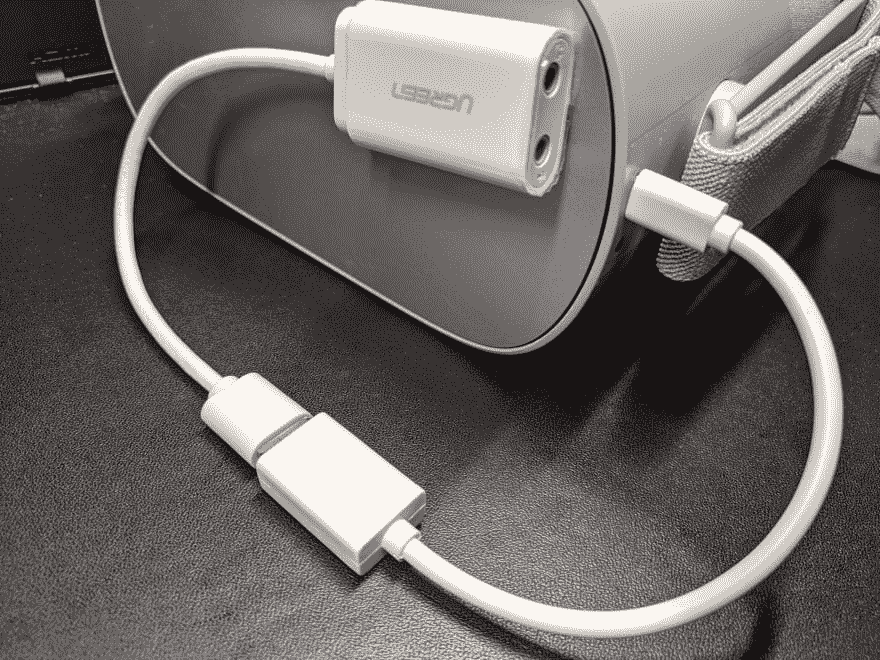

# 在 Oculus Go 中使用外部麦克风

> 原文::t0【https://dev . to/shiena/oculus-go-2 ABI】

# 前言

Oculus Go 虽然内置了麦克风，但是因为没有麦克风端子，所以看起来不能使用外部麦克风。
在那里使用 USB 音频转换适配器的话，就可以使用外部麦克风了，所以介绍一下结构。

# 准备好的东西

*   USB OTG 电缆
*   具有麦克风端子的 USB 音频转换适配器
*   3.5 毫米插头的耳机
*   3.5 毫米插头麦克风

确认动作的电缆和适配器为以下产品。

*   [https://www.amazon.co.jp/dp/B00NF8MF3E/](https://www.amazon.co.jp/dp/B00NF8MF3E/)
*   [https://www.amazon.co.jp/dp/B074WZC6B4/](https://www.amazon.co.jp/dp/B074WZC6B4/)

# 连接方法

我想不需要解释，接下来是。
识别出 USB 音频后，嵌入式扬声器不再发出声音，从连接到 USB 音频转换适配器或耳机插孔的耳机发出声音。

Oculus Go 的 USB 接口
↓
USB OTG 电缆
↓
USB 音频转换器
↓
麦克风

耳机从 USB 音频转换器和 Oculus Go 的耳机插孔中都发出了声音。

# Use

可以使用外部麦克风，可以连接 PC 的声音输出和麦克风端子进行语音更换。 实际上做了之后发现到处都是电缆，很难移动，或者因为 USB 音响，电池消耗会变快，所以事前准备很重要。

使用外部麦克风时[HTML 5 Microphone Visualizer](https://static.yige.ch/html5-mic/) 好像很容易检查音量。