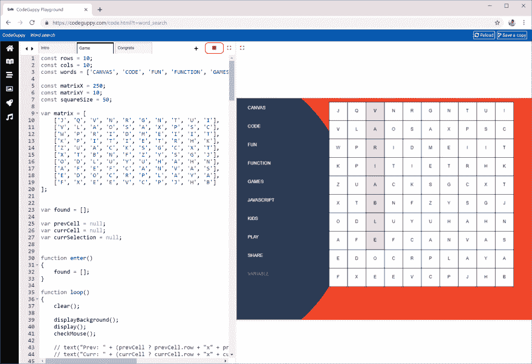

# 单词搜索

> 原文：<https://dev.to/codeguppy/word-search-4b0>

# [T1】简介](#intro)

单词搜索游戏如此受欢迎，以至于整个杂志和小册子都致力于这个游戏。在这个程序中，你将学习如何用 JavaScript 实现一个单词搜索游戏。

建议:根据你的喜好定制这个游戏，让它在找到所有单词后显示一条秘密消息。然后与你的家人和朋友分享你的程序，如果他们想看到这个信息，请他们解决这个难题。

您将了解到:

*   如何使用数组和矩阵
*   如何实现多场景游戏
*   如何使用游戏循环

# 需要什么？

要运行本文中的代码，您不需要在本地计算机上安装任何东西。

只需从[codeguppy.com/code.html](https://codeguppy.com/code.html)打开在线 JavaScript playground，在集成编辑器中复制并粘贴以下代码。

准备就绪后，按“播放”按钮运行代码。

[](https://res.cloudinary.com/practicaldev/image/fetch/s--0CX6SQCz--/c_limit%2Cf_auto%2Cfl_progressive%2Cq_auto%2Cw_880/https://thepracticaldev.s3.amazonaws.com/i/couibr9jjyrkffzi7dah.png)

# 源代码

> 这个节目包含多个场景。请在单独的代码页中复制并粘贴每个场景。确保场景的名称如下所示。

## 场景:简介

```
//Note: Design and color inspiration - canva.com

function enter()
{
    sprite('game.happy', 100, 465);

    noStroke();
    fill("Navy")

    background(241, 69, 40);

    fill(42, 59, 85);
    circle(600, 300, 400);

    textSize(20);
    textAlign(CENTER, CENTER);
    fill("White");

    text("Hello Friend!", 500, 200)
    text("I have a special message for you", 500, 290)
    text("... but first you need to solve a puzzle!", 500, 325)

    textSize(14);
    textAlign(CENTER, CENTER);
    text("Click to continue...", 500, 580);
}

function mouseClicked()
{
    showScene("Game");
} 
```

## 场景游戏

```
const rows = 10;
const cols = 10;
const words = ['CANVAS', 'CODE', 'FUN', 'FUNCTION', 'GAMES', 'JAVASCRIPT', 'KIDS', 'PLAY', 'SHARE', 'VARIABLE'];

const matrixX = 250;
const matrixY = 10;
const squareSize = 50;

var matrix = [
    ['J', 'Q', 'V', 'N', 'R', 'G', 'N', 'T', 'U', 'I'], 
    ['V', 'L', 'A', 'O', 'S', 'A', 'X', 'P', 'S', 'C'], 
    ['W', 'P', 'R', 'I', 'D', 'M', 'E', 'I', 'I', 'T'], 
    ['K', 'P', 'I', 'T', 'I', 'E', 'T', 'R', 'H', 'K'],  
    ['Z', 'U', 'A', 'C', 'K', 'S', 'G', 'C', 'X', 'T'],  
    ['X', 'T', 'B', 'N', 'F', 'Z', 'Y', 'S', 'G', 'J'],  
    ['O', 'D', 'L', 'U', 'Y', 'U', 'H', 'A', 'H', 'N'],  
    ['A', 'F', 'E', 'F', 'C', 'A', 'N', 'V', 'A', 'S'],  
    ['E', 'D', 'O', 'C', 'R', 'P', 'L', 'A', 'Y', 'A'],  
    ['F', 'X', 'E', 'E', 'V', 'C', 'P', 'J', 'H', 'B']
];

var found = [];

var prevCell = null;
var currCell = null;
var currSelection = null;

function enter()
{
    found = [];
}

function loop()
{
    clear();

    displayBackground();
    display();
    checkMouse();

    // text("Prev: " + (prevCell ? prevCell.row + "x" + prevCell.col : "null"), 10, 10);
    // text("Curr: " + (currCell ? currCell.row + "x" + currCell.col : "null"), 10, 30);
}

function displayBackground()
{
    noStroke();
    background(241, 69, 40);
    fill(42, 59, 85);
    circle(-90, 300, 400);
}

function checkMouse()
{
    if (!mouseIsPressed)
    {
        validateSelection();

        prevCell = null;
        currCell = null;
        currSelection = null;
        return;
    }

    if (!prevCell)
        prevCell = findCell(mouseX, mouseY);

    var nextCell = findCell(mouseX, mouseY);

    if (nextCell)
        currCell = nextCell;

    currSelection = findSelection();
}

function validateSelection()
{
    var word = selectedWord();
    if (!word)
        return;

    if (foundWord(word))
        return;

    if (words.includes(word))
        addFound(word, currSelection);

    if (found.length === words.length)
    {
        showScene("Congrats");
    }
}

function findCell(x, y)
{
    var col = Math.floor( (x - matrixX) / squareSize );
    var row = Math.floor( (y - matrixY) / squareSize );

    if (col < 0 || col >= cols || row < 0 || row >= rows )
        return null;

    return { row : row, col : col };
}

function display()
{
    displayMatrix();
    displaySelection();
    displayWords();
}

function displayMatrix()
{
    push();

    textAlign(CENTER, CENTER);

    for(var row = 0; row < matrix.length; row++)
    {
        var arRow = matrix[row];

        for(var col = 0; col < arRow.length; col++)
        {
            var chr = arRow[col];

            var x = matrixX + col * squareSize;
            var y = matrixY + row * squareSize;

            stroke(0);

            var clr = isSelected(row, col) ? "LightBlue" : (foundCell(row, col) ? "Pink" : "White");
            fill( clr );
            rect( x, y, squareSize, squareSize );

            noStroke();
            fill(0);
            text(chr, x + squareSize / 2, y + squareSize / 2);
        }
    }

    pop();
}

function selectedWord()
{
    if (!currSelection)    
        return "";

    var txt = "";    

    for(var o of currSelection)
    {
        txt += o.chr;
    }

    return txt;
}

function displaySelection()
{
    var txt = selectedWord();    
    if (!txt)
        return;

    push();
    noStroke();
    fill(0);
    textSize(20);
    text(txt, matrixX, matrixY + (rows + 1) * squareSize);
    pop();
}

function displayWords()
{
    push();
    noStroke();
    for(var i = 0; i < words.length; i++)
    {
        fill( foundWord(words[i]) ? "Gray" : "White" );
        text(words[i], 30, matrixY + 20 + i * 50);
    }
    pop();
}

function findSelection()
{
    if (!prevCell || !currCell)
        return null;

    // JavaScript feature
    // Execute hSelection() ... and if null execute vSelection(), etc.
    return hSelection() || vSelection() || dSelection();
}

function hSelection()
{
    if (!prevCell || !currCell)
        return null;

    if (prevCell.row != currCell.row)
        return null;

    var ar = [];

    var delta = prevCell.col <= currCell.col ? 1 : -1;

    for(var col = prevCell.col; col != currCell.col + delta; col += delta)
    {
        var row = prevCell.row;
        var chr = matrix[row][col];

        ar.push( { row : row, col : col, chr : chr } );
    }

    return ar;        
}

function vSelection()
{
    if (!prevCell || !currCell)
        return null;

    if (prevCell.col != currCell.col)
        return null;

    var ar = [];

    var delta = prevCell.row <= currCell.row ? 1 : -1;

    for(var row = prevCell.row; row != currCell.row + delta; row += delta)
    {
        var col = prevCell.col;
        var chr = matrix[row][col];

        ar.push( { row : row, col : col, chr : chr } );
    }

    return ar;        
}

function dSelection()
{
    if (!prevCell || !currCell)
        return null;

    if (abs(currCell.row - prevCell.row) != abs(currCell.col - prevCell.col))
        return null;

    var ar = [];

    var dh = prevCell.col <= currCell.col ? 1 : -1;
    var dv = prevCell.row <= currCell.row ? 1 : -1;

    var row = prevCell.row;
    var col = prevCell.col;

    while(row != currCell.row + dv && col != currCell.col + dh)
    {
        var chr = matrix[row][col];
        ar.push( { row : row, col : col, chr : chr } );

        row += dv;
        col += dh;
    }

    return ar;
}

// Returns true if the specified cell is part of the current selection 
function isSelected(row, col)
{
    if (!currSelection)
        return false;

    for(var o of currSelection)
    {
        if (o.row === row && o.col === col)
            return true;
    }

    return false;
}

// Add specified word and list of cells to the found list
function addFound(word, cells)
{
    found.push( { word : word, cells : cells } );
}

// Returns true if the specified word is already found
function foundWord(word)
{
    for(var o of found)
    {
        if (o.word === word)
            return true;
    }

    return false;
}

// Returns true if the specified cell is part of an word already found
function foundCell(row, col)
{
    for(var o of found)
    {
        for(var oCell of o.cells)
        {
            if (oCell.row === row && oCell.col === col)
                return true;
        }
    }

    return false;
} 
```

## 场景:恭喜

```
function enter()
{
    noStroke();
    background(241, 69, 40);

    fill(42, 59, 85);
    circle(250, 300, 400);

    fill(255);
    textSize(50);
    textAlign(CENTER, CENTER);
    text("Congratulations....", width / 2, height / 2)

    textSize(14);
    textAlign(CENTER, CENTER);
    text("Click to return...", width / 2, height - 20);
}

function mouseClicked()
{
    showScene("Game");
} 
```

# 反馈

如果你喜欢这篇文章，请在 Twitter 上关注 [@codeguppy](https://twitter.com/codeguppy) 和/或访问 codeguppy.com[获得更多教程和项目。](https://codeguppy.com)

另外，如果你想用详细的说明来扩展这篇文章，解释如何一步一步地构建程序，请在评论中留下反馈。