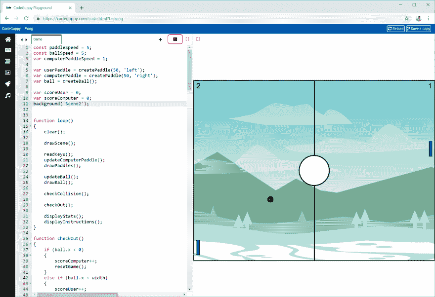

# 恶臭

> 原文：<https://dev.to/codeguppy/pong-10om>

# [T1】简介](#intro)

Pong 是最早的街机游戏之一。作为一款成功的游戏，它在街机、游戏机和个人电脑上催生了无数的克隆和衍生产品。

通过阅读本教程，您将了解如何使用 JavaScript 实现这款流行游戏的克隆版。

请随意进一步定制和皮肤的游戏，然后与您的家人和朋友分享。

# 需要什么？

要运行本文中的代码，您不需要在本地计算机上安装任何东西。

只需从[codeguppy.com/code.html](https://codeguppy.com/code.html)打开在线 JavaScript playground，在集成编辑器中复制并粘贴以下代码。

准备就绪后，按“播放”按钮运行代码。

[](https://res.cloudinary.com/practicaldev/image/fetch/s--ngVLHaKL--/c_limit%2Cf_auto%2Cfl_progressive%2Cq_auto%2Cw_880/https://thepracticaldev.s3.amazonaws.com/i/sa88ym4lrmjs2fzey7ys.png)

# 源代码

```
const paddleSpeed = 5;
const ballSpeed = 5;
var computerPaddleSpeed = 1;

var userPaddle = createPaddle(50, 'left');
var computerPaddle = createPaddle(50, 'right');
var ball = createBall();

var scoreUser = 0;
var scoreComputer = 0;

function loop()
{
    clear();

    drawScene();

    readKeys();
    updateComputerPaddle();
    drawPaddles();

    updateBall();
    drawBall();

    checkCollision();

    checkOut();

    displayStats();
    displayInstructions();
}

function checkOut()
{
    if (ball.x < 0)
    {
        scoreComputer++;
        resetGame();
    }
    else if (ball.x > width)
    {
        scoreUser++;

        // if the user wins, computer will increase the paddle speed
        // so it can be harder to beat next time
        computerPaddleSpeed += random(0.75);

        resetGame();
    }
}

function updateComputerPaddle()
{
    if (ball.dx == 1)
    {
        // find y where the ball will hit
        var y = ball.slope * (computerPaddle.x - ball.x1) + ball.y1;

        // calculate distance between computer paddle and where the ball will hit
        var dy = (y - computerPaddle.y - computerPaddle.w / 2);

        // calculate the dy that should be applied to the computer paddle to intercept the ball        
        dy = dy / ( (computerPaddle.x - ball.x) / ballSpeed );

        // computer cannot move faster than the setting...
        dy = constrain(dy, -computerPaddleSpeed, computerPaddleSpeed);

        computerPaddle.y += dy;
    }
}

function updateBall()
{
    if (!ball.inMotion)
        return;

    ball.x += ball.dx * ballSpeed;
    ball.y = ball.slope * (ball.x - ball.x1) + ball.y1;
}

function checkCollision()
{
    hitBall(userPaddle);
    hitBall(computerPaddle);
}

function hitBall(paddle)
{
    if (collisionCircleRect(ball.x, ball.y, ball.r, paddle.x, paddle.y, paddle.h, paddle.w))
    {
        // workaround: move the ball in front of the paddle
        ball.x = paddle.x + -1 * ball.dx * (paddle.h + ballSpeed);

        // pick a new random slope
        pickSlope();

        // reverse ball direction
        ball.dx *= -1;        
    }
}

function pickSlope()
{
    // pick a random point on the oposite wall
    ball.x2 = ball.dx < 0 ? width : 0;
    ball.y2 = random(ball.r, height - ball.r);

    // current ball position
    ball.x1 = ball.x;
    ball.y1 = ball.y;

    // calculate the slope of the line that the ball need to use to hit the point
    ball.slope = (ball.y2 - ball.y) / (ball.x2 - ball.x);
}

function displayStats()
{
    push();

    noStroke();
    fill(0);
    textSize(24);

    textAlign(LEFT, CENTER);
    text(scoreUser, 10, 20);

    textAlign(RIGHT, CENTER);
    text(scoreComputer, width - 10, 20);

    pop();
}

function displayInstructions()
{
    if (ball.inMotion)
        return;

    push();

    fill('white');
    rect(200, 450, 400, 100);

    fill(0);
    noStroke();
    textSize(24);
    textAlign(CENTER, CENTER);
    text('Press SPACE to launch the ball', 400, 500);

    textSize(14);
    text('Use Q and A to move the paddle', 400, 530);

    pop();
}

function drawBall()
{
    strokeWeight(1);
    fill('green');

    circle(ball.x, ball.y, ball.r);
}

function drawScene()
{
    strokeWeight(3);

    noFill();
    rect(0, 0, width - 1, height - 1);
    line(width / 2, 0, width / 2, height);

    fill('white');
    circle(width / 2, height / 2, 50);
}

function readKeys()
{
    if (keyIsDown(81) && userPaddle.y >= paddleSpeed )  // Q
    {
        userPaddle.y -= paddleSpeed;
    }
    else if (keyIsDown(65) && userPaddle.y < height - userPaddle.w - paddleSpeed) // A
    {
        userPaddle.y += paddleSpeed;
    }
    else if (keyIsDown(32)) // SPACE
    {
        launchBall();
    }
}

function launchBall()
{
    if (ball.inMotion)
        return;

    // launch the ball randomly to right(1) or left(-1)
    ball.dx = random([1, -1]);

    pickSlope();

    ball.inMotion = true;
}

function drawPaddles()
{
    strokeWeight(1);
    fill('Teal');

    rect(userPaddle.x, userPaddle.y, userPaddle.h, userPaddle.w);
    rect(computerPaddle.x, computerPaddle.y, computerPaddle.h, computerPaddle.w);
}

function createPaddle(w, where)
{
    var paddle = { w : w,
                   h : 10,
                   y : (height - w) / 2,
                };

    paddle.x = where == 'left' ? 10 : width - paddle.h - 10;

    return paddle;
}

function createBall()
{
    var ball = {
        x : width / 2,
        y : height / 2,
        r : 10,
        slope : 0,
        dx : 0,
        inMotion : false
    };

    return ball;
}

function resetGame()
{
    ball.x = width / 2;
    ball.y = height / 2,
    ball.dx = 0;

    ball.inMotion = false;

    userPaddle.y = (height - userPaddle.w) / 2;
    computerPaddle.y = (height - computerPaddle.w) / 2;
} 
```

# 反馈

如果你喜欢这篇文章，请在 Twitter 上关注 [@codeguppy](https://twitter.com/codeguppy) 和/或访问 codeguppy.com[获得更多教程和项目。](https://codeguppy.com)

另外，如果你想用详细的说明来扩展这篇文章，解释如何一步一步地构建程序，请在评论中留下反馈。