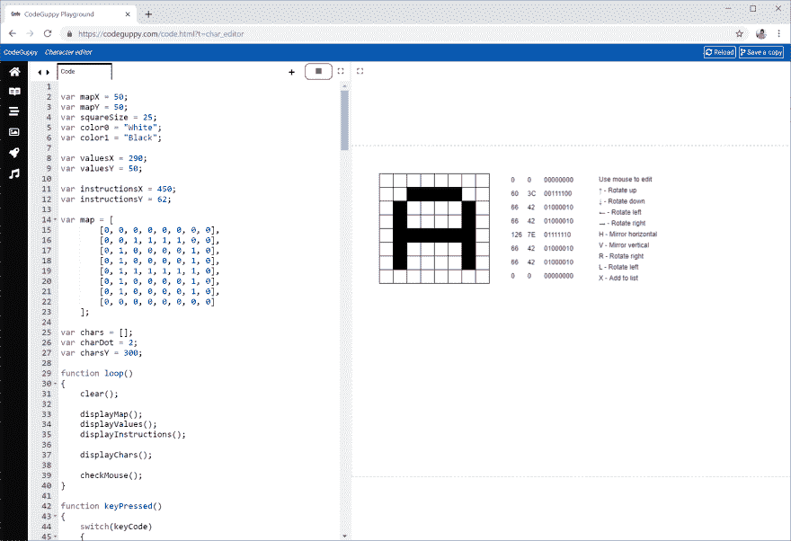

# 字符编辑器

> 原文：<https://dev.to/codeguppy/character-editor-3o14>

# [T1】简介](#intro)

在实现这个有用的字符编辑器时，了解二进制和字符表示。该工具在为你的游戏定义自定义精灵角色时非常有用。

CodeGuppy 上还有其他教程向你展示如何在你的程序中使用自定义精灵。

# 需要什么？

要运行本文中的代码，您不需要在本地计算机上安装任何东西。

只需从[codeguppy.com/code.html](https://codeguppy.com/code.html)打开在线 JavaScript playground，在集成编辑器中复制并粘贴以下代码。

准备就绪后，按“播放”按钮运行代码。

[](https://res.cloudinary.com/practicaldev/image/fetch/s--KDJBfnZq--/c_limit%2Cf_auto%2Cfl_progressive%2Cq_auto%2Cw_880/https://thepracticaldev.s3.amazonaws.com/i/w2x4nfh0k9f2b8i4vomi.png)

# 源代码

```
var mapX = 50;
var mapY = 50;
var squareSize = 25;
var color0 = "White";
var color1 = "Black";

var valuesX = 290;
var valuesY = 50;

var instructionsX = 450;
var instructionsY = 62;

var map = [ 
        [0, 0, 0, 0, 0, 0, 0, 0],
        [0, 0, 1, 1, 1, 1, 0, 0],
        [0, 1, 0, 0, 0, 0, 1, 0],
        [0, 1, 0, 0, 0, 0, 1, 0],
        [0, 1, 1, 1, 1, 1, 1, 0],
        [0, 1, 0, 0, 0, 0, 1, 0],
        [0, 1, 0, 0, 0, 0, 1, 0],
        [0, 0, 0, 0, 0, 0, 0, 0]
    ];

var chars = [];
var charDot = 2;
var charsY = 300;

function loop()
{
    clear();

    displayMap();
    displayValues();
    displayInstructions();

    displayChars();    

    checkMouse();
}

function keyPressed()
{
    switch(keyCode)
    {
        case UP_ARROW:
            shiftLeft(map);
            break;
        case DOWN_ARROW:
            shiftRight(map);
            break;
        case LEFT_ARROW:
            shiftMapLeft();
            break;
        case RIGHT_ARROW:
            shiftMapRight();
            break;
    }

    switch(key)
    {
        case "H":
            mirrorMap();
            break;
        case "V":
            mirrorArray(map);
            break;
        case "R":
            rotateRight();
            break;
        case "L":
            rotateLeft();
            break;
        case "X":
            var ar = getChar();
            chars.push(ar);
            break;
    }
}

function checkMouse()
{
    if (!mouseIsPressed)
        return;

    var o = findRowCol(mouseX, mouseY);
    if (!o)
        return;

    map[o.row][o.col] = mouseButton == LEFT ? 1 : 0;
}

function findRowCol(x, y)
{
    var col = floor( (x - mapX) / squareSize );
    var row = floor( (y - mapY) / squareSize);

    if (row < 0 || row >= map.length)
        return null;

    if (col < 0 || col >= map[0].length)
        return null;

    return { row : row, col : col };
}

function displayMap()
{
    stroke(0);

    for(var row = 0; row < map.length; row++)
    {
        var arRow = map[row];

        for(var col = 0; col < arRow.length; col++)
        {
            var x = mapX + col * squareSize;
            var y = mapY + row * squareSize;

            fill( arRow[col] == 0 ? "White" : "Black" );
            rect(x, y, squareSize, squareSize);
        }
    }
}

function displayValues()
{
    fill(0);
    noStroke();
    textAlign(LEFT, CENTER);

    for(var row = 0; row < map.length; row++)
    {
        var arRow = map[row];
        var number = arrayToNumber(arRow);

        var y = valuesY + squareSize / 2 + squareSize * row;

        // Dec
        text(number.toString(), valuesX, y);

        // Hex
        text(number.toString(16).toUpperCase(), valuesX + 30, y);

        // Bin
        text(toBinary(number, 8), valuesX + 60, y);
    }
}

// Returns an array of 8 numbers representing the defined character
function getChar()
{
    var ar = [];

    for(var row = 0; row < map.length; row++)
    {
        var number = arrayToNumber(map[row]);
        ar.push(number);
    }

    return ar;
}

function displayInstructions()
{
    var delta = 20;

    text("Use mouse to edit", instructionsX, instructionsY + delta * 0);
    text("↑ - Rotate up", instructionsX, instructionsY + delta * 1);
    text("↓ - Rotate down", instructionsX, instructionsY + delta * 2);
    text("← - Rotate left", instructionsX, instructionsY + delta * 3);
    text("→ - Rotate right", instructionsX, instructionsY + delta * 4);
    text("H - Mirror horizontal", instructionsX, instructionsY + delta * 5);
    text("V - Mirror vertical", instructionsX, instructionsY + delta * 6);
    text("R - Rotate right", instructionsX, instructionsY + delta * 7);
    text("L - Rotate left", instructionsX, instructionsY + delta * 8);
    text("X - Add to list", instructionsX, instructionsY + delta * 9);
}

function toBinary(number, n)
{
    var txt = number.toString(2);

    while(txt.length < n)
        txt = "0" + txt;

    return txt;
}

function arrayToNumber(ar)
{
    var n = ar.length;
    var number = 0;

    for(var i = 0; i < n; i++)
    {
        number += ar[i] * pow(2, n - i - 1)
    }

    return number;
}

function displayChar(ar, x, y)
{
    noStroke();

    for(var i = 0; i < ar.length; i++)
    {
        var t = toBinary(ar[i], 8);

        for(var j = 0; j < t.length; j++)
        {
            fill( t[j] == "0" ? color0 : color1 );
            rect(x + j * charDot, y + i * charDot, charDot, charDot);
        }
    }
}

function displayChars()
{
    var x = 10;
    var y = charsY;

    for(var i = 0; i < chars.length; i++)    
    {
        var ar = chars[i];
        displayChar(ar, x, y);
        x += charDot * ar.length * 2;

        if ( x > width - 30 ) 
        {
            y += 30;
            x = 10;
        }
    }

}

function shiftMapLeft()
{
    for(var ar of map)
    {
        shiftLeft(ar);
    }
}

function shiftMapRight()
{
    for(var ar of map)
    {
        shiftRight(ar);
    }
}

function shiftLeft(ar)
{
    var el = ar.shift();
    ar.push(el);
}

function shiftRight(ar)
{
    var el = ar.pop();
    ar.unshift(el);
}

function mirrorMap()
{
    for(var ar of map)
    {
        mirrorArray(ar);
    }
}

function mirrorArray(ar)
{
    var n = ar.length;
    for(var i = 0; i < n / 2; i++)
    {
        var el = ar[n - 1 - i];
        ar[n - 1 - i] = ar[i];
        ar[i] = el;
    }
}

function rotateLeft()
{
    var n = map.length;
    var map2 = newMap(n);

    for(var i = 0; i < n; i++)
    {
        for(var j = 0; j < n; j++)
        {
            map2[n - 1 - j][i] = map[i][j];
        }
    }

    map = map2;
}

function rotateRight()
{
    var n = map.length;
    var map2 = newMap(n);

    for(var i = 0; i < n; i++)
    {
        for(var j = 0; j < n; j++)
        {
            map2[j][n - 1 - i] = map[i][j];
        }
    }

    map = map2;
}

function newMap(n)
{
    var ar = new Array(n);
    for(var i = 0; i < n; i++)
    {
        ar[i] = new Array(n);
    }

    return ar;
} 
```

# 反馈

如果你喜欢这篇文章，请在 Twitter 上关注 [@codeguppy](https://twitter.com/codeguppy) 和/或访问 codeguppy.com[获得更多教程和项目。](https://codeguppy.com)

另外，如果你想用详细的说明来扩展这篇文章，解释如何一步一步地构建程序，请在评论中留下反馈。