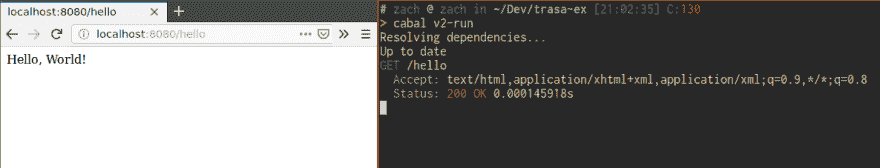
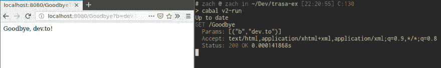

# 特拉萨教程角。1:使用 trasa 键入安全 web 路由

> 原文：<https://dev.to/goolord/trasa-tutorial-pt-1-type-safe-web-routing-with-trasa-5b1p>

# [`trasa`](https://hackage.haskell.org/package/trasa) :在 Haskell 中键入安全的 HTTP 路由和调度

## 您好，世界！

[](https://res.cloudinary.com/practicaldev/image/fetch/s--mFzXRF32--/c_limit%2Cf_auto%2Cfl_progressive%2Cq_auto%2Cw_880/https://thepracticaldev.s3.amazonaws.com/i/3kukx3rnokmaegp7rnmd.png)

#### 依赖关系

```
 build-depends: base ^>=4.12.0.0
    , trasa
    , trasa-server
    , quantification
    , bytestring
    , wai
    , wai-extra
    , warp 
```

Enter fullscreen mode Exit fullscreen mode

为了简洁起见，我将把所有代码放在同一个 cabal 包中。这些是启动和运行 web 服务器的最低要求。`trasa`可以利用`wai`和`warp`来处理 webserver/webapp 组件。

[`quantification`](https://hackage.haskell.org/package/quantification) 也许是这里唯一一个你可能不认识的图书馆。它是由`trasa`在内部使用的，你需要它来获得更好的错误信息，并最终注释一些类型签名。

#### 分机

```
{-# language DataKinds #-}
{-# language GADTs #-}
{-# language KindSignatures #-}
{-# language OverloadedStrings #-}
{-# language ScopedTypeVariables #-} 
```

Enter fullscreen mode Exit fullscreen mode

`trasa`在内部大量使用了`GADTs`和`TypeFamilies`，试图在`servant`中看到的类型级魔法和价值级 haskell 之间取得平衡。本教程只假设熟悉`GADTs`，我们将用它来定义一个`Route`类型。

#### 进口

```
import Data.ByteString.Lazy (ByteString)
import Data.Functor.Identity
import Data.Kind (Type)
import Network.Wai (Application)
import Network.Wai.Handler.Warp (run)
import Network.Wai.Middleware.RequestLogger (logStdoutDev)
import Trasa.Core
import Trasa.Server
import qualified Data.ByteString.Lazy as B
import qualified Trasa.Method as Method 
```

Enter fullscreen mode Exit fullscreen mode

#### 我们的路线类型

```
-- Our route data type. We define this ourselves.
data Route :: [Type] -> [Param] -> Bodiedness -> Type -> Type where
  HelloWorld :: Route 
    '[] -- ^ the route does not capture any part of the path
    '[] -- ^ the route does not capture any queries
    'Bodyless -- ^ the route does not have a request body
    ByteString -- ^ the response body will be `ByteString` 
```

Enter fullscreen mode Exit fullscreen mode

`trasa`在‘route’类型中是多态的。这意味着我们*可以*稍微偏离这样的类型，比如用文档注释`Route`。

我们的`HelloWorld`构造函数表示一个路由，它不解码任何路径片段，也没有任何查询参数。对于响应主体，我们必须为我们选择的请求和响应类型定义一个`BodyCodec`。`ByteString`有最琐碎的身体编解码器定义:

```
bodyText :: BodyCodec ByteString
bodyText = BodyCodec 
  (pure "text/html; charset=utf-8") -- ^ NonEmpty list of the HTTP media type names.
  id -- ^ encode @ByteString -> ByteString@
  Right -- ^ decode @ByteString -> Either Text ByteString@ 
```

Enter fullscreen mode Exit fullscreen mode

(utf-8 编码的`Text`比这里的`ByteString`更正确。如果你愿意，你可以定义一个`bodyText :: BodyCodec Text`作为练习)

#### 为我们的路线类型提供元数据

```
-- | metadata about our routes: value level functions and data for constructing
--   and decoding paths
meta :: Route captures queries request response -> MetaCodec captures queries request response
meta route = case route of
  HelloWorld -> Meta 
    (match "hello" ./ end) -- ^ match "/hello"
    qend -- ^ no query parameters
    bodyless -- ^ no request body
    (resp (one bodyText)) -- ^ response body is one BodyCodec: our bodyText function above
    Method.get -- ^ http method: GET 
```

Enter fullscreen mode Exit fullscreen mode

由于`Route` GADT 实际上并不携带关于我们的路由的信息(像它的 HTTP 方法或它的路径的文本表示)，我们定义了一个函数，在这个函数中我们在数据构造器上进行模式匹配，并使用来自`trasa`的函数提供这个信息

#### 路线处理

```
-- | this function defines how we handle routes with our web server:
--   what actions we perform based on the route and its captures & queries
routes
  :: forall captures queries request response.
     Route captures queries request response -- ^ our route GADT, polymorphic over its type variables
  -> Rec Identity captures -- ^ an extensible record of the captures for this route
  -> Rec Parameter queries -- ^ an extensible record of the captures for this route
  -> RequestBody Identity request -- ^ the request body
  -> TrasaT IO response -- ^ our response
routes route captures queries reqBody = case route of
  HelloWorld -> go helloWorld
  where
  -- | this helper function uses the `handler` function to unwrap the `Arguments` type family.
  go :: Arguments captures queries request (TrasaT IO response) -> TrasaT IO response
  go f = handler captures queries reqBody f

helloWorld :: TrasaT IO ByteString
helloWorld = pure "Hello, World!" 
```

Enter fullscreen mode Exit fullscreen mode

web 服务器将使用此函数来根据匹配的路由数据构造函数确定要采取的操作。我们看到的是:

*   我们的路由数据构造器
*   路径中捕获的每个值的可扩展记录
*   每个查询参数的可扩展记录
*   请求体

`go`助手函数使用`handler`将这些提供给它所传递的函数。`handler`函数和`Arguments`类型家族有助于保持一切完全多态。

`helloWorld`是从捕获和查询中获取所有参数(在本例中没有)并将其解析为响应正文类型的函数。类型的`TrasaT IO`部分允许我们做好错误处理和 IO，我们将忽略样板文件。

#### web server

```
-- | We define a list of all the routes for our server, 
--   this is the only place where the type checker won't help us
allRoutes :: [Constructed Route]
allRoutes = [Constructed HelloWorld]

-- | Boilerplate. This creates the data structure used to do routing
router :: Router Route
router = routerWith (mapMeta captureDecoding captureDecoding id id . meta) allRoutes

-- | `wai` application
application :: Application
application = serveWith
  (metaCodecToMetaServer . meta) -- ^ boilerplate: this just marshals some types
  routes -- ^ routes function defined above
  router -- ^ router function defined above

main :: IO ()
main = run 8080 (logStdoutDev application) 
```

Enter fullscreen mode Exit fullscreen mode

现在运行`cabal run`、`xdg-open http://localhost:8080/hello`，你应该会收到“你好，世界！”
T3T5】

## 捕获和查询

好的，好的，酷。现在我们可以做一些基本的路由，但在我看来，trasa 最好的特性是:捕获和查询。说而不是“你好，世界！”我们想要稍微复杂一点的。说我们要“$0，$1！”。让我们稍微修改一下 HelloWorld 构造函数的类型:

```
data Route :: [Type] -> [Param] -> Bodiedness -> Type -> Type where
  HelloWorld :: Route 
    '[ByteString] -- ^ now the path captures the first piece as a ByeString
    '[('Optional ByteString)] -- ^ there is an optional query parameter, decoded as a ByteString
    'Bodyless -- ^ the route does not have a request body
    ByteString -- ^ the response body will be `ByteString` 
```

Enter fullscreen mode Exit fullscreen mode

现在我们要修复一些类型错误。

```
src/Main.hs:(37,17)-(42,14): error:
    • Couldn't match type ‘'[]’ with ‘'[ByteString]’
      Expected type: MetaCodec captures queries request response
        Actual type: Meta
                       CaptureCodec
                       CaptureCodec
                       (Many BodyCodec)
                       (Many BodyCodec)
                       '[]
                       '[]
                       'Bodyless
                       ByteString ...
 | 37 |   HelloWorld ->  Meta
 |                 ^^^^^...
src/Main.hs:54:20-29: error:
    • Couldn't match type ‘TrasaT IO ByteString’ with ‘ByteString ->  Maybe ByteString -> TrasaT IO ByteString’
 Expected type: Arguments
                       captures queries request (TrasaT IO response)
        Actual type: TrasaT IO ByteString
    • In the first argument of ‘go’, namely ‘helloWorld’
      In the expression: go helloWorld In a case alternative: HelloWorld ->  go helloWorld
 | 54 |   HelloWorld ->  go helloWorld 
```

Enter fullscreen mode Exit fullscreen mode

我们在我们的`meta`函数中得到一个稍微不透明的类型错误，但是来自我们的`routes`函数的错误稍微更有启发性。为了解决第一个错误，让我们看看`trasa` :
中三个函数的类型

```
match :: Text -> Path cpf caps -> Path cpf caps
capture :: cpf cap -> Path cpf caps -> Path cpf (cap ': caps)
end :: Path cpf '[] 
```

Enter fullscreen mode Exit fullscreen mode

以及来自我们的`meta`函数的`HelloWorld`元数据:

```
 HelloWorld -> Meta 
    (match "hello" ./ end) -- ^ match "/hello"
    qend -- ^ no query parameters
    bodyless -- ^ no request body
    (resp (one bodyText)) -- ^ response body is one BodyCodec: our bodyText function above
    Method.get -- ^ http method: GET 
```

Enter fullscreen mode Exit fullscreen mode

类型错误告诉我们路径的类型是`Path cpf '[]`，因为`match`不会扩展`end`，但是类型检查器推断的是`Path cpf '[ByteString]`。对于查询参数，情况是类似的。让我们来解决这个问题:

```
-- add `text` as a dependency
import qualified Data.Text.Encoding as TE
import qualified Data.ByteString.Lazy as B
import qualified Trasa.Method as Method
-- define a CaptureCodec for ByteString: encoding and decoding to and from text
bytestring :: CaptureCodec ByteString
bytestring = CaptureCodec (TE.decodeUtf8 . B.toStrict) (Just . B.fromStrict . TE.encodeUtf8)
-- I'm still not going to change this to Text for now. We'll fix this later 
```

Enter fullscreen mode Exit fullscreen mode

更改`helloWorld`以将其路径捕获和查询参数作为参数:

```
helloWorld :: ByteString -> Maybe ByteString -> TrasaT IO ByteString
helloWorld a (Just b) = pure $ a <> ", " <> b <> "!"
helloWorld a Nothing = pure a 
```

Enter fullscreen mode Exit fullscreen mode

使用`trasa`中的帮助函数和`bytestring`捕获编解码器添加关于如何解码`HelloWorld`路径的元数据:

```
 HelloWorld -> Meta 
    (capture bytestring ./ end) -- ^ capture "/$0"
    (optional "b" bytestring .& qend) -- ^ optionally capture "?b=$1"
    bodyless -- ^ no request body
    (resp (one bodyText)) -- ^ response body is one BodyCodec: our bodyText function above
    Method.get -- ^ http method: GET 
```

Enter fullscreen mode Exit fullscreen mode

重新运行，瞧！
[T3】](https://res.cloudinary.com/practicaldev/image/fetch/s--HZnAtCSG--/c_limit%2Cf_auto%2Cfl_progressive%2Cq_auto%2Cw_880/https://thepracticaldev.s3.amazonaws.com/i/t9ld8i5y7e2p4cc1i40n.png)

代码:[https://github . com/goolord/trasa-tutorial/tree/master/trasa-ex-pt1](https://github.com/goolord/trasa-tutorial/tree/master/trasa-ex-pt1)