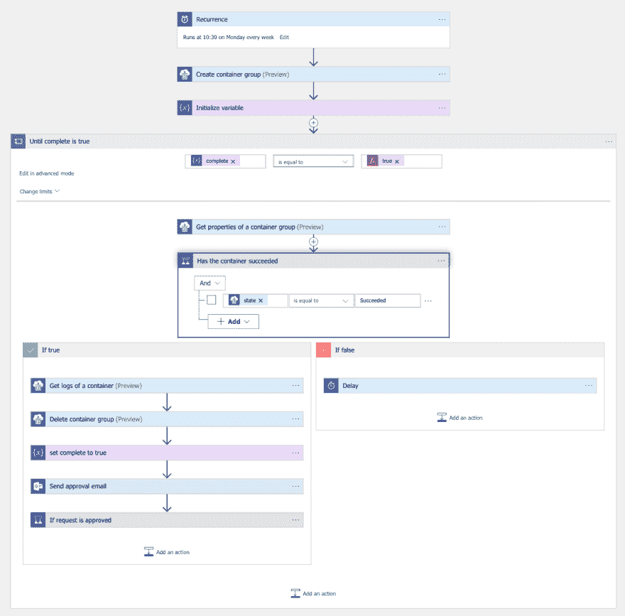
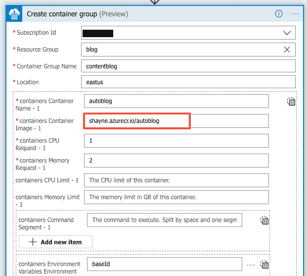
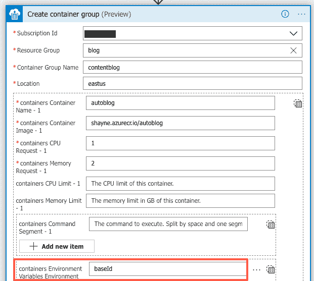
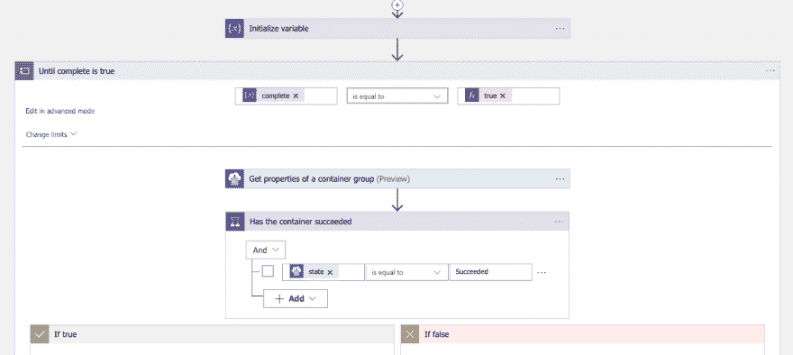
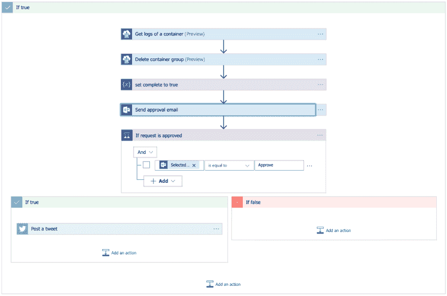

# 自动博客 Jekyll 与逻辑应用程序，ACI 容器和。网络核心

> 原文：<https://dev.to/azure/auto-blogging-jekyll-with-logic-apps-aci-containers-and-net-core-1icf>

*[订阅每月简讯](https://azure.microsoft.com/resources/join-the-azure-developer-community/?WT.mc_id=devto-blog-shboyer)，其中有许多文章、文档、事件和事件，并寻找机会与其他在线和本地开发人员联系。*

所有相关链接:[https://www.theurlist.com/autobloggerpost](https://www.theurlist.com/autobloggerpost)

Jekyll 是在 GitHub 上托管静态站点的一种非常流行的方式，发布新内容非常简单，只需创建一个 markdown 文件，然后提交给相关的 repo。GitHub 会处理剩下的事情。

> 查看 GitHub 的帮助页面-> [使用 Jekyll 在本地设置您的 GitHub 页面站点](https://help.github.com/en/articles/setting-up-your-github-pages-site-locally-with-jekyll)

对于我来说，这似乎是一个很好的方式来开始写一些储存在 CMS 中的内容。我们感兴趣的视图每周更新一次，可通过[访问。NET 标准](https://docs.microsoft.com/en-us/dotnet/standard/net-standard/?WT.mc_id=devto-blog-shboyer) API。

有几个选项可以实现这一点。我可以编写一个控制台应用程序，每周执行一次来生成文件，然后自己运行`git`命令。我为什么要这么做？

#### 我们在做什么

每周一必须为博客创建一个新帖子。代替使用
手动运行过程

```
dotnet run myapp  
git add newfile.md  
git commit -m 'add new file'  
git push 
```

Enter fullscreen mode Exit fullscreen mode

我想完全自动化这个过程。使用 Docker、[逻辑应用](https://docs.microsoft.com/azure/logic-apps/?WT.mc_id=devto-blog-shboyer)、 [Azure 容器实例(ACI)](https://docs.microsoft.com/en-us/azure/container-instances/?WT.mc_id=devto-blog-shboyer)；管理何时“开始、停止和清理”相当容易。然而，在 Logic Apps 中没有完整的 GitHub 连接器来执行 git 中的命令。因此，我在我的容器中添加了`git`和一个 **startup.sh** 脚本来完成这个任务。

*   Logic Apps 每周一上午 10:30 开始这一过程
*   [ACI 容器镜像](https://docs.microsoft.com/en-us/azure/container-instances/?WT.mc_id=devto-blog-shboyer)运行[。网络核心](https://dot.net/?WT.mc_id=devto-blog-shboyer)应用
    *   克隆回购
    *   为新数据调用 CMS API
    *   生成新的降价文件
    *   Git 提交、添加、推送
*   逻辑应用程序删除 ACI 容器
*   GitHub CI/CD 运行，用新内容更新博客
*   逻辑应用程序给我发邮件
    *   电子邮件包含容器的日志(git 输出)
    *   请求批准在推特上发布新内容
*   逻辑应用程序发送新推文

#### 细节，是怎么做到的？

我们将使用以下组件来构建我们的 Jekyll“自动博客”。

**码头集装箱**

让我们从容器开始。看起来很不典型的[。NET Core](https://dot.net/?WT.mc_id=devto-blog-shboyer) 2.2 镜像，除了`git-core`安装在最终镜像中。

```
FROM mcr.microsoft.com/dotnet/core/sdk:2.2 as build-env  
WORKDIR /app

COPY autoblog/*.csproj ./  
RUN dotnet restore

COPY ./autoblog ./  
RUN dotnet publish -c Release -o out

# FINAL IMAGE
FROM mcr.microsoft.com/dotnet/core/runtime:2.2  
WORKDIR /app  
COPY --from=build-env /app/out .

# install git
RUN apt-get update && \  
  apt-get upgrade -y && \
  apt-get install -y git-core

COPY ./autoblog/startup.sh .  
RUN chmod 777 startup.sh  
ENTRYPOINT ["/bin/bash", "./startup.sh"] 
```

Enter fullscreen mode Exit fullscreen mode

`startup.sh`文件是*魔法*发生的地方。当容器启动时，我们首先将 git 配置为使用存储为环境变量($token)的部署密钥，将源 repo 克隆到我们的工作目录中，并重新初始化 repo(如果我们这样做，可能是一个错误)。

最后，为任何提交设置 git 用户/电子邮件，然后启动。NET Core 控制台应用程序。

```
# ensure the git deploy token is used for commits
git config --global url."https://$token:@github.com/".insteadOf "https://github.com/"

# clone the source repository
git clone $source /app/$dir

# bug? must re-init the repo
# set the git user/email for commits
cd /app/$dir && \  
  git init && \
  git config --global user.email "$email" && \
  git config --global user.name "$user"

# run the process for creating new entry
dotnet /app/autoblog.dll 
```

Enter fullscreen mode Exit fullscreen mode

当使用逻辑应用程序启动 ACI 容器时，将设置所有 ENV 变量

**。网络核心应用**

在容器内部运行的控制台应用程序创建格式化的降价页面，git 提交并推送到 repo。

下面是`Main()`的转述代码。

```
 static async Task Main(string[] args)
 {

   var root = $"/app/{Environment.GetEnvironmentVariable("dir")}";

   if (!Directory.Exists(root))
   {
     Directory.CreateDirectory(root);
   }

   var output = new System.Text.StringBuilder();
   output.AppendLine(Bash($"git -C {root} pull"));

   await GetContentRepositoryItemsAsync();

   var creator = new Creator.Post(ContentItems);
   try
   {
      var fileContents = await creator.Create();
      await File.WriteAllTextAsync(creator.FileName, fileContents);
   }
    catch (Exception ex)
   {
    Console.WriteLine(ex.ToString());
    throw ex;
   }

   output.AppendLine(Bash($"git add ."));
   output.AppendLine(Bash($"git commit -m '{creator.FileName} added'"));
   output.AppendLine(Bash("git push"));

   Console.WriteLine(output.ToString());
 } 
```

Enter fullscreen mode Exit fullscreen mode

`Creator`类生成文件，一旦完成，我们执行 git 命令将新创建的文件推送到 repo。

**Azure Logic App**

通过将各种服务的连接器集成到单个图形界面中，Azure Logic Apps 支持创建强大的业务工作流。使用 Azure 容器实例连接器，您可以将容器化的应用程序作为您的逻辑应用程序工作流的一部分来运行。

> [Azure 容器实例(ACI)](https://docs.microsoft.com/azure/container-instances/?WT.mc_id=devto-blog-shboyer) 是在 Azure 中运行容器的最简单方式。我们可以使用它来运行容器，而不必担心基础设施的供应，我们只需为使用的资源付费。

在这种情况下，我们需要在每周一的固定时间运行该流程，以启动容器流程。

[](https://res.cloudinary.com/practicaldev/image/fetch/s--UBx6GksF--/c_limit%2Cf_auto%2Cfl_progressive%2Cq_auto%2Cw_880/http://tattoocoder.com/conteimg/2019/05/Screen-Shot-2019-05-16-at-5.09.54-PM.png)

容器映像构建并存储在我的私有 Azure 容器注册表中，并且很容易在“创建容器组”连接器中配置。

[](https://res.cloudinary.com/practicaldev/image/fetch/s--kXst7Qw1--/c_limit%2Cf_auto%2Cfl_progressive%2Cq_auto%2Cw_880/http://tattoocoder.com/conteimg/2019/05/Screen-Shot-2019-05-16-at-5.16.09-PM.png)

所需的环境变量也可以在这里配置。另一个选择是使用 [Azure Key Vault](https://docs.microsoft.com/en-us/azure/key-vault/?WT.mc_id=devto-blog-shboyer) 连接器在应用之间共享和保护密钥。

[](https://res.cloudinary.com/practicaldev/image/fetch/s--bDsDSmU6--/c_limit%2Cf_auto%2Cfl_progressive%2Cq_auto%2Cw_880/http://tattoocoder.com/conteimg/2019/05/Screen-Shot-2019-05-16-at-5.16.09-PM-1.png)

接下来，设置变量`complete`来保存容器的状态。任务`Until`将运行*，直到*容器的状态为**成功**并且`complete`为**真**。如果为假，我们添加一个 10 秒的`Delay`任务。

[](https://res.cloudinary.com/practicaldev/image/fetch/s--5eInpjbR--/c_limit%2Cf_auto%2Cfl_progressive%2Cq_auto%2Cw_880/http://tattoocoder.com/conteimg/2019/05/Screen-Shot-2019-05-16-at-5.23.51-PM.png)

如果容器组返回 **Succeeded** ，则检索日志，清理容器组，并为 tweet 发送电子邮件批准。

[](https://res.cloudinary.com/practicaldev/image/fetch/s--qovPhnSt--/c_limit%2Cf_auto%2Cfl_progressive%2Cq_auto%2Cw_880/http://tattoocoder.com/conteimg/2019/05/Screen-Shot-2019-05-16-at-5.24.57-PM.png)

### 包装完毕

Azure Logic Apps 是一种构建流程流的有趣且高效的方式，在这种情况下，我能够使用代码、容器和审批流程生成内容，而无需任何手动步骤。