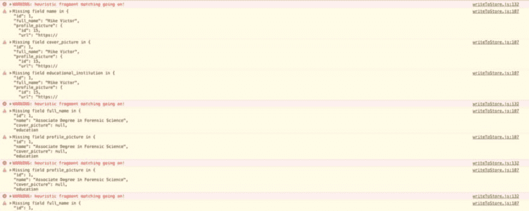
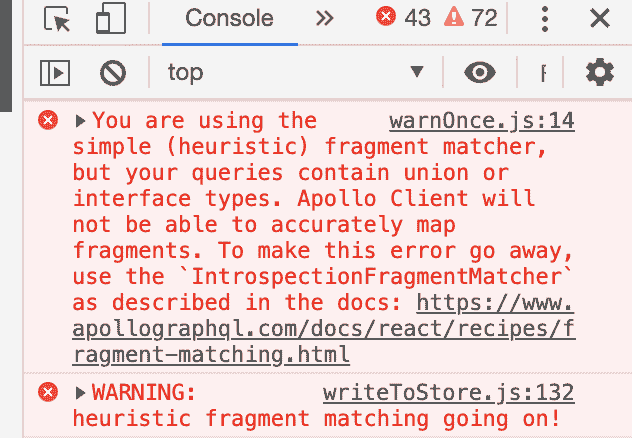

# 启发式片段匹配器警告！怎么修？

> 原文：<https://dev.to/chandan/heuristic-fragment-matcher-warning-how-to-fix-it-ho3>

### 启发式片段匹配器警告！怎么修？

<figure> 

<figcaption>如何修复 GraphQL 阿波罗客户端中的启发式片段匹配器警告</figcaption>

</figure>

Apollo 客户端广泛用于管理通过 GraphQL 获取的数据，缓存是它提供的主要特性之一。如果在 GraphQL 中使用联合或片段，默认情况下，apollo 客户机使用启发式片段匹配器来映射字段(片段)。

<figure> 

<figcaption>启发式片段匹配正在进行！</figcaption>

</figure>

#### 为什么会看到？

在弄清楚为什么会出现这个警告之前，请理解这样一个事实，即 Apollo 客户机不知道我们的 GraphQL 模式，因此它不能准确地映射片段。因此，这将以控制台上的以下警告结束:

"您正在使用简单(启发式)片段匹配器，但是您的查询包含联合或接口类型. "

<figure> 

<figcaption>错误:您正在使用简单(启发式)片段匹配器，但您的查询包含联合或接口类型。</figcaption>

</figure>

#### 你该担心这个吗？

启发式片段匹配器在某些情况下工作良好，但 Apollo 客户端不会验证服务器响应，即它不会阻止您使用 writeQuery 或 updateQuery 手动将无效数据写入存储。所以，忽略警告是不理想的。

<figure> 

<figcaption>【塔诺齐】</figcaption>

</figure>

#### 塔诺的恶声恶气！让警告消失:

因此，为了消除这个警告，您可以查询模式来获得所需的关于联合和接口的信息。此后，使用 IntrospectionFragmentMatcher 将这些知识提供给 apollo 客户端的 InMemeoryCache，如[文档](https://www.apollographql.com/docs/react/advanced/fragments)中所述。

#### 逐步指南–使用 IntrospectionFragmentMatcher

让我们看看如何让 apollo 客户机准确地映射片段(联合和接口),并在写入存储之前验证它们。

**第一步:创建 schemaQuery 文件**

作为第一步，转到项目' **src** '文件夹，创建一个名为 schemaQuery.js 的文件，并添加以下代码: