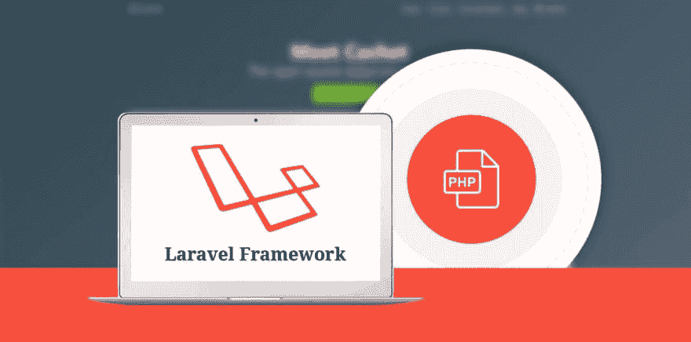

# Laravel PHP 框架:为什么它对企业商务网站有益

> 原文：<https://dev.to/shalinipanchal7/laravel-php-framework-why-it-is-beneficial-for-enterprise-business-websites-4ndn>

在其他 PHP 开发框架中，Laravel 被认为是一个独特且健壮的框架。它是一个开源的现代 PHP 框架，用于 web 应用程序开发。 Laravel 使用 MVC——模型视图控制器，这是一种用于开发用户界面的架构模式。Laravel 有很多特性，比如简单验证、会话处理、安全路由、单元测试等等。它已经成为小型初创企业、大中型企业进行 web 开发的首选。根据 site point 调查，Laravel 是全球 50 个国家中投票率最高的框架。

任何企业应用程序都有复杂的功能，基于组件的分布式系统。对于构建这种 web 应用程序，Laravel 可能是处理高度复杂性的好选择。

以下是企业商务网站选择 Laravel 的 8 个重要原因。

 **1) Laravel 是开源框架:

Laravel 框架是开发人员开发企业业务应用程序的首选框架。Laravel 是一个开源框架。可以根据客户要求定制。

2) MVC 架构:

Laravel 使用 MVC 架构，为开发人员提供内置功能。与其他框架相比，它还提供了更好的文档。使用这个 Laravel 关键特性，开发者可以制作高性能和大规模的 web 应用程序。这也是人们选择 Laravel 作为企业 web 应用的一个原因。

3)高安全性和增强性能:

与其他 PHP 框架相比，Laravel 提供了高级别的安全性。它不允许任何恶意软件活动进入 web 应用程序。它使您的网站数据和代码更加安全可靠。如果您选择 Laravel 进行 web 开发，那么您的 web 应用程序将不会遭受网络攻击。

选择 Laravel 的另一个原因是它的 web 应用程序的高性能。Laravel 使用各种工具来帮助开发人员提高 web 应用程序的性能。这意味着如果你用 Laravel 框架开发你的网站，那么你的应用程序与其他网络应用程序相比具有最高的性能。

4)强大的认证:

对于 web 开发人员来说，强大的身份验证是极具挑战性的功能之一。开发 Laravel 框架的目的最终是帮助网站开发者。他们可以更快、更好地创建某些复杂的功能。Laravel 还允许开发人员创建逻辑，为授权用户提供访问权限。

5) Laravel 自带刀片模板引擎:

使用刀片模板引擎，编码变得比以往任何时候都简单。该引擎允许开发者简单地使用预定义的模板来创建新的网站或代码。Blade 的另一个优势是它带有现成的小部件，这些小部件有内置的 JS 和 CSS 代码。这就是 Laravel web 应用程序轻量级的原因。

6)数据库迁移系统:

对于开发人员来说，数据迁移是比较容易的任务之一。如果你正在开发一个大规模的企业商务网站，那么你需要迁移数据库。数据迁移允许开发人员轻松撤销对特定数据库所做的更改。使用数据迁移系统，开发人员可以与其他开发人员共享数据库，他们可以轻松顺利地与团队合作。

7)更少的开发时间:

正如我们前面所讨论的，Laravel 提供了内置的功能，使得开发人员更容易编写代码。因此，与其他框架相比，Laravel web 开发要快得多，也不复杂。

8)专门的开发人员社区:

与其他社区相比，Laravel 有专门的开发者社区。他们更新良好，可以开发大模块和按需插件。因此，如果你的开发者面临复杂的功能，他们可以从 Laravel 社区获得专业的建议。因此，它可以帮助开发人员，他们可以根据您的客户构建高可伸缩性和健壮的 web 应用程序。

**结论:**

因此，您可以看到 Laravel 是企业 web 应用程序的最佳选择，它可以提高性能和安全性。它需要很少的开发时间。你肯定会在你的网站上获得大量的观众，这将影响你的商业收入。因此，如果你想开发一个企业网络应用程序，你可以[雇佣 Laravel 的开发者](https://www.cmarix.com/hire-laravel-developers.html)，但是要确保网络应用程序符合你的工作范围。**