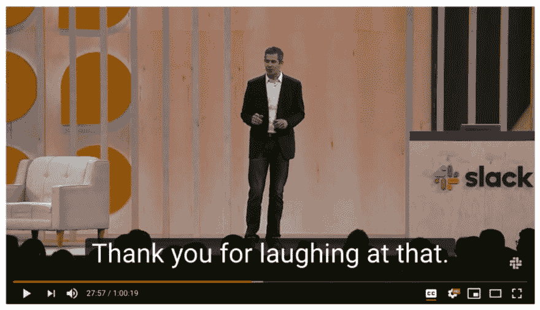

# 拥抱 SaaS 非捆绑宇宙

> 原文：<https://dev.to/transposit/embracing-the-saas-unbundleverse-1lp1>

亚当·莱文塔尔写的

以前的软件消费时代是由它们的捆绑包定义的。我们当前的时代是由其多样化的应用程序生态系统和非绑定来定义的。甚至在最近，企业消费者还骄傲地对一家供应商表示忠诚:我们是微软商店，我们是甲骨文商店，我们是 IBM 商店。虽然很投入，但这种关系并不是一夫一妻制。合适的工作工具，但受关系指引，就像北极星。捆绑有互操作性的好处(至少是感觉到的)——许多工具互相结合，帮助我们像团队一样很好地工作。

SaaS 改变了软件的经济性和捆绑的粘性。即使你想成为一家单一商店，也很难看出如何去做(或者你为什么想这样做)。团队正在挑选他们想要的工具。应用程序比以往任何时候都更加深入和狭窄。因此，每个人都有更多来自更分散的供应商的应用程序。

现有的和新的公司都在为这种分布式的、多样化的非捆绑服务重新定位。我们开始转置来帮助构建由非捆绑软件的 API 组成的应用程序。我们押注于这一趋势。但几周前，在 Slack 的前沿会议上，我听到了这个现代软件时代的一个新愿景:在一个去中心化的时代，即使在非绑定中也可以有中心。这些中心不是对相似的应用程序进行分组，而是对相似的活动进行分组。在一个非绑定的世界中，垄断将是水平的，聚合应用程序间相似类型的交互。

### 松松垮垮

在会议上，Slack 提出了一个重要而令人信服的愿景，即在这一行业分拆中成为一个主要中心。虽然这次会议令人感到大胆和有启发性，但 Slack 的总结博客帖子更加平淡:大多是新功能和非具体的热情。它列出了共享频道、工作流构建器和 Gmail/Outlook 网关等几大部分。在“打造现代工作工具”的标题下，CPO Tamar Yehoshua 展示的视频触及了会议的一个共同主题:

> “但是工作中的交流不仅仅发生在人与人之间。我们需要访问数据和其他工作流。一个典型的企业使用超过 1000 个云应用。这些软件工具分散了人们的注意力，使信息更难在组织间流动。因此，我们希望越来越多地将 Slack 与每项业务背后的关键工具联系起来。”

### 1071

对于任何身处前沿的人来说，1071 这个数字至少会让他们感到亲切而有意义。我在 Slack 合奏团的不同成员的不下 6 个不同的演讲中数了一下。它是企业中云应用程序的平均数量。(显然是从[这份 Netskope 报告](http://go.netskope.com/rs/665-KFP-6img/april-2017-worldwide-cloud-report.pdf)。)这是会议的主题:公司有大量的 SaaS 应用程序，Slack 是协作、审批、工作流等的中心。

 

<figcaption>不确定哪一届；可能是他们中的任何一个。</figcaption>

作为一个旁白，Slack 的著名的谦逊，移情文化也在展览中。第二个最常见的主题是演讲者感谢观众的笑声——收起你的嘲笑，继续前进吧！(并且[我们有完美的炒作人](https://dev.to/realtransposit/hypebot-is-the-hype-man-who-never-lets-me-down-5bfm)！)

 

<figcaption>不客气。</figcaption>

应用形成孤岛。孤岛阻碍了跨团队的沟通和协作。如果一项任务需要一群人用一堆工具来批准，那么在空闲时间进行会更快。如果人们不经常使用工具，通过空闲时间提供一些普通的任务。不要从多个应用程序收集数据，而是将所有数据集中在每个人都已经开放的工具 Slack 中。这是充满抱负的工作中心。

### 中枢的中心

SaaS 打破了传统的捆绑。新的垄断机会是横向的。这些中心将拥有应用领域的共同任务，而不是接管应用的集合。Slack 希望拥有跨应用的协作和轻量级交互。这是一种垄断，它拥抱一个庞大的生态系统，而不是试图拥有它。这些催化了束试图包含的扩张和异质性。每个主要的软件供应商都在寻找他们的中枢机会。

Slack 将如何成为这个枢纽？怎么会有人呢？Slack 在他们的 S-1(发表在 Frontiers 之后的第二天)中列举了他们增长战略的几个组成部分。前 6 个是销售和营销的不同方面。第七个提出了他们的平台愿景(可以从其他有抱负的中心几乎一字不差地复制过来):

> **发展我们的应用平台和开发者生态系统**
> 
> 我们将继续投资，以增加开发与 Slack 集成的应用的开发者数量，并让 Slack 与越来越多的第三方和内部开发的定制应用协同工作。

(第八个也是最后一个增长策略是“利用人工智能、机器学习和高级搜索”，我想这是我们这个时代的陈词滥调。)

对于任何中枢来说，都有核心平台、应用程序和 API 的包围，以及它们之间的巨大差距。平台和用户都依赖于开发者来填补这一鸿沟，来编写连接 hub 和 edge 的软件。从 Zapier，到 Airtable，再到 Transposit，这就是我们在这里的原因。就像中枢将定义我们的未来一样，将它们结合在一起的开发人员、工具和平台也将定义我们的未来。

—

在 hub 和 edge 之间构建 Slack bots 或其他连接？[试转位](https://www.transposit.com/?c=hub_medium_post)。

* * *