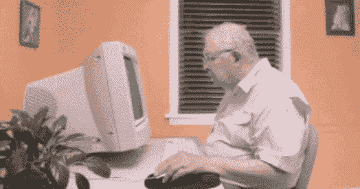
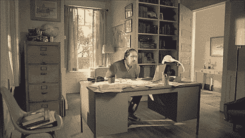
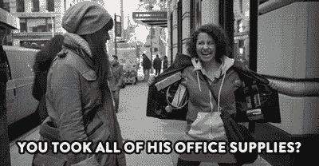
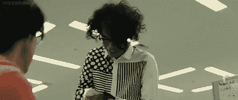
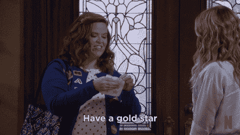
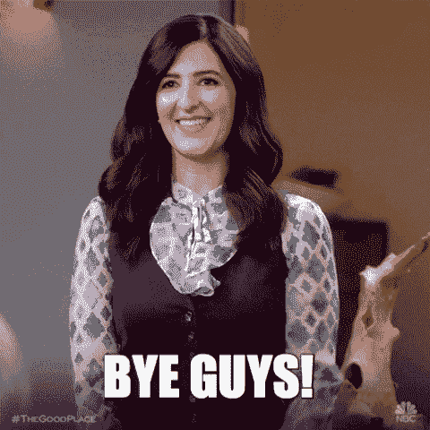

# 当我离开一份工作时，我是如何离开自己的(用 gif！)

> 原文：<https://dev.to/geekgalgroks/how-i-offboard-myself-when-leaving-a-job-with-gifs-1k64>

在我的职业生涯中，到目前为止，我已经离开了好几份工作。有些是因为我要搬家，其他时候是因为我想追求新的机会。我总是试图以好的方式离开，并移交我目前正在做的一切。

这是我个人在最后一天之前要做的事情的清单(除了在场外文件或流程中列出的任何事情)

*   从笔记本电脑中删除个人文件和浏览器书签
    

*   从办公桌上收拾个人物品
    

*   将多余的办公用品放回办公用品柜
    

*   平静地接受这个事实:无论我做什么，闪光都会存在
    

*   给我想联系的人发名片
    

*   确保所有正在进行的工作都被检入并推出到版本控制
    

*   整理我的研究笔记和书签
    

*   回收旧笔记和文件(根据公司政策完成销毁，事先检查政策以确定是否需要粉碎任何东西)
    

*   分发剩余的贴纸、代币和奖励
    

*   组织欢乐时光
    

*   向大家告别
    

离开一份工作可能会有压力和令人兴奋，但这不是不小心把你最喜欢的黄金女孩雕像丢在身后的借口。