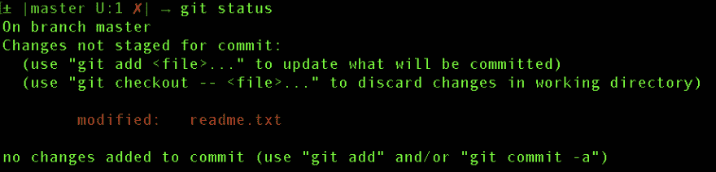
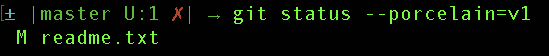

# 用一行代码将修改后的文件复制到 Git 中

> 原文：<https://dev.to/grepliz/copy-your-modified-files-in-git-with-1-line-2n39>

出于这样或那样的原因，我偶尔会发现自己想要复制本地 git 存储库中所有修改过的文件并重新开始。这通常是因为痛苦的合并，我只是想要一个新的开始。这是您可以使用的一行程序:

`git status --porcelain=v1 | awk {'print $2'} | xargs -I {} cp -r {} ../dir_with_changed_files`

让我们详细分解这一行的每一部分。

`git status --porcelain=v1`

您可能对`git status`很熟悉，添加`--porcelain=v1`标志只是改变了以下代码的输出:

对此:

`awk {'print $2'}`

该 awk 命令将把[标准的第二列打印到](https://linux.die.net/man/3/stdout)(即屏幕上显示的内容)。在我们的例子中，这将打印出带有来自前面的`git status --porcelain=v1`命令的文件名的列。

`xargs -I {} cp -r {} ../dir_with_changed_files`

这部分命令利用了 [xargs](http://man7.org/linux/man-pages/man1/xargs.1.html) 工具，该工具允许对来自标准输入的内容进行迭代。在这种情况下，`xargs`命令的标准输入是前一个`awk`命令的标准输出。它获取文件列表并将其复制到`../dir_with_changed_files`目录中。