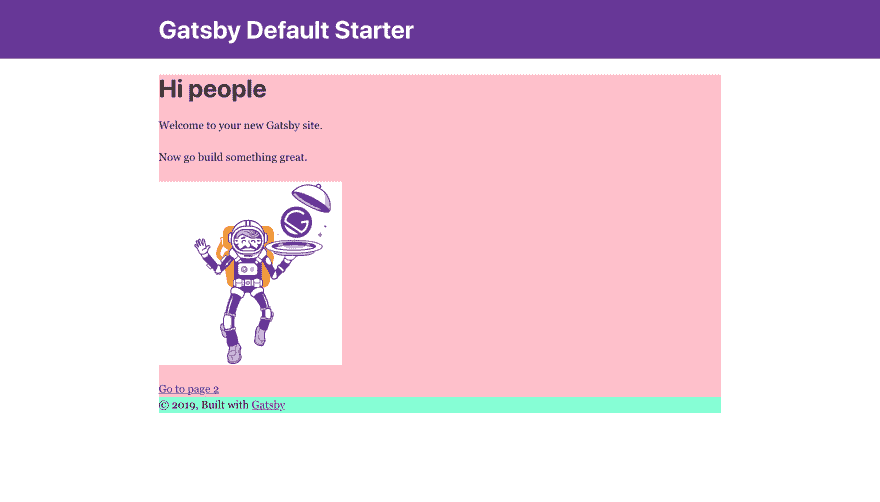
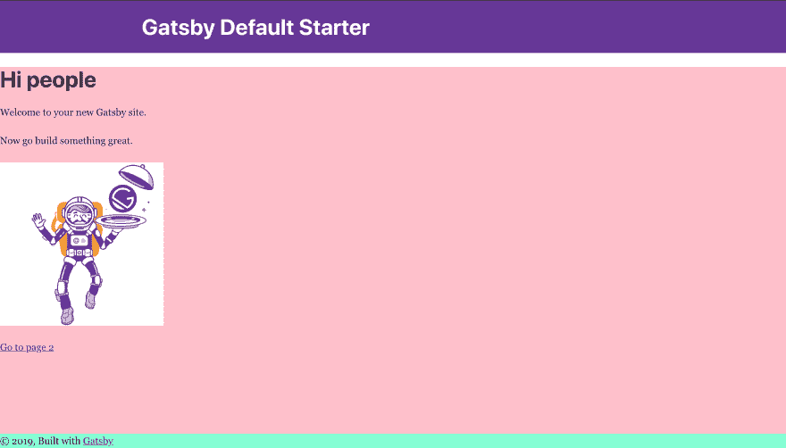
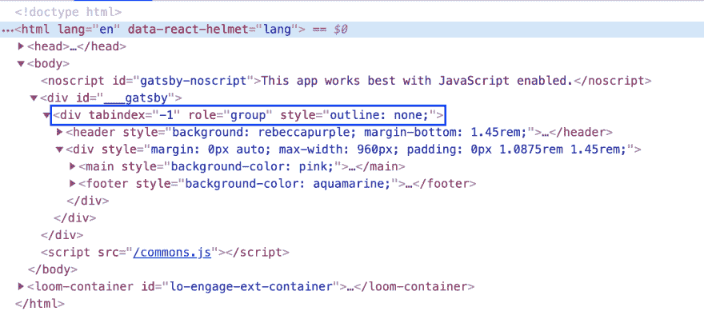
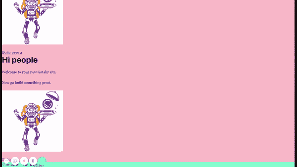

# 100%高度到所有 divs 盖茨比

> 原文：<https://dev.to/hzburki/100-height-to-all-divs-gatsby-33nd>

# 用例

一个简单的用户界面，包括页眉、主界面和页脚。

如果页脚(主页面)上面的内容没有填满整个视图，那么页脚应该贴在底部；如果内容(主页面)超过了视图高度，那么页脚应该被向下推。

<figure>

[](https://res.cloudinary.com/practicaldev/image/fetch/s--t0ifCpsm--/c_limit%2Cf_auto%2Cfl_progressive%2Cq_auto%2Cw_880/https://thepracticaldev.s3.amazonaws.com/i/9nmvdxs1nvu995y6zh0d.png)

<figcaption>What we Have!</figcaption>

</figure>

<figure>

[](https://res.cloudinary.com/practicaldev/image/fetch/s--EUzSRwbn--/c_limit%2Cf_auto%2Cfl_progressive%2Cq_auto%2Cw_880/https://thepracticaldev.s3.amazonaws.com/i/cw5bmw5znid8bpqpmlao.png)

<figcaption>What we Want!</figcaption>

</figure>

# 简单的解决方法

我的第一个想法是将所有 html 标签分配到 div 之上，div 包含了标签`<main></main>`和标签`height: '100%'`。

## 但是！！！😮😮😮

<figure>[](https://res.cloudinary.com/practicaldev/image/fetch/s--adTejDa7--/c_limit%2Cf_auto%2Cfl_progressive%2Cq_auto%2Cw_880/https://thepracticaldev.s3.amazonaws.com/i/iho2sk8cs1n1x1ax2wel.png) 

<figcaption>附加 div **高亮显示**</figcaption>

</figure>

Gatsby 使用了 [@reach/router](https://github.com/reach/router) ，它将`Layout`组件包装在一个附加的 div 中。这样做是为了，

> @reach/router 可以自动管理焦点，作为确保屏幕阅读器可以使用站点的一部分。

因此，您可以看到向没有任何`class`或`id`的 javascript 注入 div 添加样式可能是一个问题。

# 实解

嗯，**真实解**实际上还是一样的，我们需要给所有父 div 分配一个`height: '100%'`。

*   创建一个新的 css 文件，命名为`global.css`。我已经把它放在我的回购中一个单独的风格文件夹。

```
/* 
 * Purpose:
 * Assign height: "100%" to
 * html, body, #___gatsby &  
 * div with role="group"
*/

html, body, #___gatsby {
    height: 100%;
}

body {
    margin: 0px;
}

div[role="group"][tabindex] {
    height: 100%;
} 
```

Enter fullscreen mode Exit fullscreen mode

*   在您的根目录中，查找`gatsby-browser.js`并导入`global.css`。

```
import './src/styles/global.css' 
```

Enter fullscreen mode Exit fullscreen mode

*   我喜欢从零开始我的项目。这是我对`Layout`组件的看法。

```
<div style={{
  height: '100%',
  display: 'flex',
  flexDirection: "column"
}}>
  <header>
    <Header siteTitle={data.site.siteMetadata.title} />
  </header>

  <main 
    style={{
      backgroundColor: 'pink',
      flexGrow: 1
    }}
  >{children}</main>

  <footer style={{
    backgroundColor: 'aquamarine'
  }}>
    © {new Date().getFullYear()}, Built with
    {` `}
    <a href="https://www.gatsbyjs.org">Gatsby</a>
  </footer>
</div> 
```

Enter fullscreen mode Exit fullscreen mode

# 结果如约而至！！

<figure>

[](https://res.cloudinary.com/practicaldev/image/fetch/s--nVRVm9hp--/c_limit%2Cf_auto%2Cfl_progressive%2Cq_66%2Cw_880/https://thepracticaldev.s3.amazonaws.com/i/z1cdwannqfd42xs7vqrx.gif)

<figcaption>Footer pushed down by content</figcaption>

</figure>

> 这个解决方案基于一个 [github 线程](https://github.com/gatsbyjs/gatsby/issues/7310)。