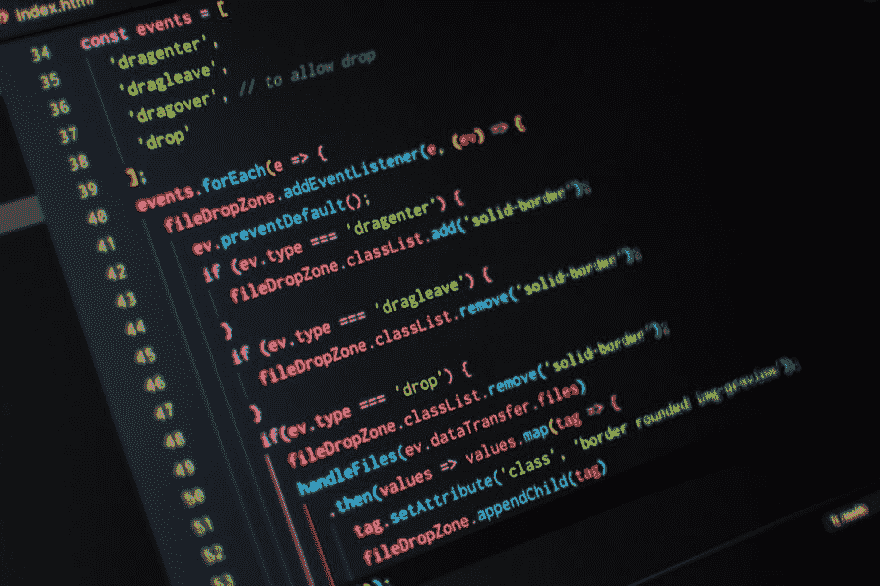

# 我是一名伟大的软件开发人员

> 原文：<https://dev.to/dorshinar/i-am-a-great-software-developer-a36>

### 我对如何成为一名更好的软件开发人员的想法和意见。

嗯，我并不像标题暗示的那么自恋。事实上，我远没有我希望的那么好。我只有几年的经验，但我已经收集了一些有用的见解，帮助我每天都变得更好。

我相信如果你跟随他们，你一定可以提高你的游戏。没有必要一蹴而就——以适合你的速度，缓慢而稳定地采用其中的一些部分。

#### 永远比昨天好

试着想一想你最后一次真正做了什么让你学到东西的事情。一些让你比前一天更好的事情。

 

<figcaption>照片由 [Jungwoo Hong](https://unsplash.com/@oowgnuj?utm_source=medium&utm_medium=referral) 于 [Unsplash](https://unsplash.com?utm_source=medium&utm_medium=referral)</figcaption>

如果你不记得上一次读到有趣的东西或做了不寻常的事情是什么时候，你应该担心了。我相信，如果你在这里，阅读我的文章，那么你是那种喜欢改善自己的人，即使不是每天都这样。

每天都有许许多多的方法让自己变得更好，但最基本的是尽可能经常地学习新东西。Medium(和其他平台)充满了信息、指南和演练，无论你或你的公司选择哪种技术，都可以帮助你做一些令人敬畏的事情。

假设你已经从你的一个同事那里听说了[某个超级棒的框架]中的那个可爱的新特性。可悲的是，我认识的大多数开发人员会说“是的，这听起来不错，但是我打赌这很复杂，所以我甚至不应该尝试”。不管是出于懒惰、自卑还是时间不够，我可以有把握地说，这种说法多半是错的。你选择的技术很可能是由负责任的团队或热心的社区维护的(如果不是，那么你可能应该重新考虑它们)，并且大多数功能(复杂或不复杂)都有很棒的指南来帮助你完成。

不要害怕未知。最糟糕的事情可能发生的是，你将无法实现所说的功能和未来的学习。我还没有在没有学到任何新东西的情况下失败过。让我们不要忘记你成功的快乐场景——你学到了一些东西，让你的/你的团队的/你的公司的代码变得更好，更易维护，这不就是我们的全部吗？

我认为你能做的最好的事情是养成每天至少阅读一篇文章的习惯。我经常使用 [Pocket](https://getpocket.com) (我与他们没有任何关系)来存储我在不同来源找到的文章，所以我总是有一个文章列表在等我，只要我有时间，我就会打开应用程序并补上它们。你可以选择任何一种适合你的方法(例如，我也训练我的 Google feed 向我展示了许多面向技术的文章)，但要确保你做到了，而且应该尽可能简单。

#### 不要只关注“你的代码”

老实说，我讨厌人们把部分代码当成自己的。

> 这是我的功能，只有我可以对其进行更改

而相反的是:

> “这不是我的功能，所以如果它坏了也不是我的责任”

或者更糟:

> “我没有写这个代码，所以我没有理由去碰它”

代码不属于任何人，它是双向的。你应该尽可能多地了解你的系统的方方面面。当然，我不指望任何人能记住一个包含数百个微服务的系统中的每一个微服务，他们的团队只维护了十几个，但这是你应该渴望的。

你应该知道你的应用程序是如何部署的，而不是简单地依赖它来工作。了解您的 CI/CD 管道、使用的环境、用于运行应用程序的脚本。如果您使用某种形式的日志分析工具(您应该这样做)，了解如何查询它以及如何创建仪表板，即使没有人会看它们，因为这在将来可能会有用。在这一类别中，我还会考虑存在于任何应用程序中的一些基本东西——用户认证、数据库交互等等。

你甚至可能想让人们向你解释他们在代码库中所做的事情，这样你就不必自己解决所有的事情。

你不必精通你系统的每一个方面，也不应该是一个多面手(什么都不精通)。你应该有一个专业领域，只是不要忽视其他领域。有些人会称之为 T 型的人，其中 T 的顶部代表了广泛而浅薄的知识，而字母的长“脚”是你的专业领域。

#### 不要害怕阅读别人的代码

> 我们读代码比写代码多得多。句号。

 

<figcaption>照片由[潘卡杰·帕特尔](https://unsplash.com/@pankajpatel?utm_source=medium&utm_medium=referral)在 [Unsplash](https://unsplash.com?utm_source=medium&utm_medium=referral)</figcaption>

通常这一行打开一段(或一篇文章)关于写干净的代码或使用一些文档格式。虽然这些东西非常重要，如果不密切关注它们，任何应用程序都不会成功，但我想把重点放在阅读部分，而不是写作部分。阅读他人的代码可以为你创造奇迹——它可以打开你的思维，以创造性的方式来实现某个目标或某个功能，你可以找到代码库中的弱点(你希望以后修复的弱点，或者只是通知你的团队),让你成为一个更好的开发人员。

你还应该渴望尽可能经常地审查人们的代码(我知道这对一些人来说可能是一件麻烦事，但是相信我这是值得的)。

在工作中，我(和其他优秀的人一起)负责新兵训练营。在 4 个月的时间里，我接受了很多代码审查的任务，目的是确保他们的代码符合公司的标准。从头到尾的观察新兵确实显示了他们能力的巨大进步(否则这将是巨大的时间浪费🙃)，但作为副作用，我觉得自己也变得更好了，尽管我几乎没有机会写代码。

我认为这里主要的要点是你不应该害怕外国代码。无论你选择在哪里工作，它都会存在。拥抱它，从中学习，并不时地改进它。

综上所述，要点如下:

*   永远比昨天更好
*   不要只关注“你的代码”
*   不要害怕阅读别人的代码

以上是我对如何成为一名更好的软件开发人员的两点看法。我希望你喜欢它(只有我的第二篇文章中！).非常欢迎你评论你的观点(我喜欢好的讨论)。

感谢您的阅读！