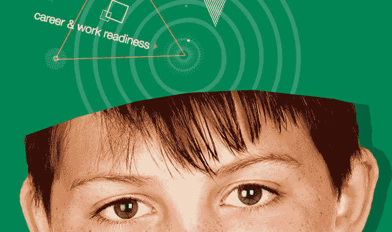

# CSS 动画提示从试验和错误的土地

> 原文：<https://dev.to/epicosity/css-animations-tips-from-trial-and-error-land-3c3>

我最近参与了一个客户的项目，这个项目需要大量的 CSS 动画。过去我没有涉足动画太多，这对我来说是一个新的挑战。第一步？搜索一些关于“写 CSS 动画要避免的错误”和“CSS 动画 10 大技巧”的博文。但是那些搜索一无所获。所以这里有一些我从反复试验中学到的东西。

 

<figcaption>【禀明万物】</figcaption>

**使用供应商前缀**

Autoprefixer 是你的朋友。如果你正在使用 VSCode，检查一下 [autoprefixer 插件](https://marketplace.visualstudio.com/items?itemName=mrmlnc.vscode-autoprefixer)。它会遍历你的 CSS，给任何东西加上合适的厂商前缀，为你节省大量的时间，为每个前缀一遍又一遍地输入每一行。

**使用 3D 变换**

> CSS 动画、转换和过渡不会自动进行 GPU 加速，而是从浏览器较慢的软件渲染引擎执行([团队树屋](https://blog.teamtreehouse.com/increase-your-sites-performance-with-hardware-accelerated-css))

简单地说，即使你没有做真正的 3D 动画，你也可以通过 3D 变换来迫使浏览器使用硬件加速。

不使用 *transform: translate(tx，ty)* 你可以使用 *transform: translate3d(tx，ty，tz)。*

这同样适用于旋转和缩放等变换。

**重用动画关键帧**

您可以重用现有的关键帧，而不是为每个单独的动画编写单独的关键帧。例如，如果您需要缩放一个元素，您可以编写一个标题为“zoomin”或“zoomout”的通用关键帧，并将该关键帧动画应用于任何需要缩放相同量的其他元素。这是让你在网站上的所有动作保持一致的好方法。

**使用指针事件代替显示:无**

不要使用 display: none 来隐藏和显示动画帧，而是使用指针事件来渲染项目，就好像它们不在页面上一样。

> “它可以通过 CSS 轻松打开和关闭，而不会中断动画或以任何方式影响渲染/可见性。”( [Gyroscope.pe](https://blog.gyrosco.pe/smooth-css-animations-7d8ffc2c1d29) )

您可以将此与不透明度结合使用，以隐藏和显示页面元素，而无需重新渲染。这对于与交互元素重叠的元素特别有用，而不是依赖精确的时间来确保隐藏的元素不会妨碍用户与另一个元素的交互。

**仅制作不透明度和变换的动画**

转换比在浏览器中更改元素的宽度或位置更有效。每当一个元素移动或改变大小，它需要重新计算。使用转换仅仅有助于将页面的加载时间缩短几毫秒，因为转换已经针对浏览器进行了优化。

**尝试避免绝对定位的元素**

相信我，如果可能的话，不要使用绝对定位的物品。我参与的项目是一个非常特殊的设计，全屏显示，没有滚动条。需要制作动画的元素也需要放置在页面上相对于其他元素的特定位置。也许有一个更好的方法来做这件事，但它最终是很多绝对定位的元素，让所有的拼图块在一起。直到 7 个人用不同的浏览器大小测试了这个网站，然后媒体查询的意大利面条开始了，并且还在继续，可能永远不会结束。*叹息*

* * *