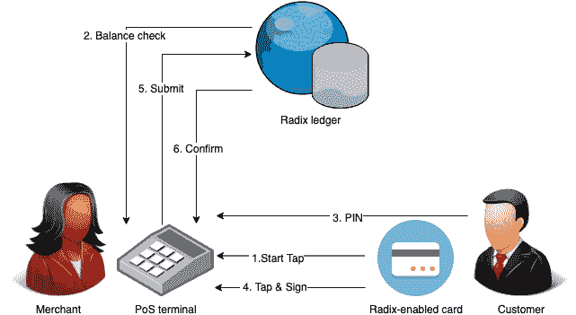

# 基数用例-卡支付系统

> 原文：<https://dev.to/radixdlt/radix-usecases-card-payment-system-1nda>

> 需要测试版访问
> 这个 Radix 应用程序目前正在预发布测试中，代码尚未在我们的 github 上提供，如果您希望尽早访问以立即开始测试，或者只是希望在它准备好使用时得到通知，请通过此表单注册:[https://radixdlt.typeform.com/to/Hw7F5y.We](https://radixdlt.typeform.com/to/Hw7F5y.We)目前预计该代码将于 2019 年 7 月底公开。

# 简介

在本文中，我们介绍了一个使用 Radix 分布式分类帐的简单卡支付系统，它允许国际零售商通过简化复杂的卡生态系统来增加销售额、忠诚度和现金流，同时降低运营成本和交易费用。

这种提出的卡支付系统提供了与 PoS 终端的安全的基于卡的交易，并要求持卡人向终端出示 Radix-enabled 卡，输入他们的 PIN，然后智能卡为终端签署交易以将其提交给分类帐。

# 概述

在传统支付卡系统中，您拥有复杂的金融生态系统，其中:

-交易费用高，
-消费者可能向支付服务提供商支付额外的交易费用，
-清算和结算缓慢，
-数据由第三方所有。

因此，零售商和商店无法洞察顾客的消费习惯，他们看到的唯一数据是购买总额。

使用基数分布式分类帐，我们可以通过创建支持基数的商店卡来简化流程并降低运营支出。

# 基数使能卡

基数使能卡不同于当前可用的其他存储卡。这是一个灵活的解决方案，允许您将多种用途编程到一张卡中，使在单个设备中捆绑提供信用卡、借记卡、预付费和忠诚卡成为可能。

除了卡的多种使用场景，通过利用基数分布式分类账，我们还可以实现:

-商店的最低交易费用
-快速清算和结算
-忠诚计划积分的同一张卡
-消费习惯洞察
-通过应用程序(Android)或卡支付

# 用基数卡支付

在基数分布式分类账中，不需要多方交易清算。Radix 的技术使用户能够拥有多种类型的设备，对交易进行加密签名并直接提交给分类账。因此，这带来了支付的即时清算和结算。

实现这种卡支付系统需要三个关键组件:

-可以创建 ECC 签名的卡，这些签名被 Radix ledger
接受-具有 NFC 功能的移动电话，可读写卡
-代表您想要清除的价值的令牌(法定令牌、忠诚度积分、会员积分)。

> 提示:在这里学习如何在基数[上构建菲亚特令牌。](https://docs.radixdlt.com/alpha/learn/use-cases/fiat-tokens)

# 支付生态系统

一个基本的支持基数的支付生态系统包括以下几个阶段:

# 令牌创建

使用 Radix 多发行令牌 API，零售商铸造其令牌。一旦代币类型被创建，零售商可以根据需要不断地铸造和烧制代币。

# 发卡

零售商为客户创建 Radix 账户，并使用 Radix 卡操作系统将卡链接到客户账户，从而授予卡从客户账户签署交易的能力。

# 装载代币卡

一位客户登录并将资金转入他的 Radix 账户。在后端，使用 [Radix fiat token provider](https://docs.radixdlt.com/alpha/learn/use-cases/fiat-tokens) 将转移的法定资金转换为分类账上的法定代币，并将相应的代币转移到客户的 Radix 账户。

# 支出

想要付款的客户在零售商的 Android 销售点(PoS)设备上使用他们的 Radix-enabled 卡。这笔交易记录在分类账上以备将来参考。

# 清算和结算

在商店发生交易后的几秒钟内，零售商就会收到顾客账户中的菲亚特代币。然后，零售商可以将这些法定代币转移给基数法定代币提供商，并在其银行账户中收到相应数量的法定代币。

# 用户支付流程

一般用户流定义为:

1.出纳员在登记簿上记入待付总额

2.收银员在 Android PoS 终端上输入要收取的总额

3.收银员要求客户在 Android PoS 终端上点击他们支持基数的卡

4.客户将卡放在 PoS 终端上验证他的余额

5.客户输入 PIN 以确认交易

6.客户在 PoS 终端上轻击卡，以签署和支付交易

7.在分类帐上确认交易记录

8.交易确认显示在 PoS 终端上

# 要求

智能卡平台:智能卡基于 [Java Card Platform](https://docs.oracle.com/javacard/) ，这是 Java 编程语言的一个子集，针对智能卡和类似的小内存嵌入式设备进行了优化。

终端:任何运行在 Android 上的支持 NFC 的设备。

分类帐中的令牌定义:使用的令牌类型是代表本地货币的菲亚特支持的令牌。

通信:智能卡和 PoS 终端之间的连接基于 NFC。

# Java 卡平台

Java Card 技术将 Java 编程语言的子集与针对安全元素(如智能卡和其他防篡改安全芯片)优化的运行时环境相结合。Java Card 技术提供了一个安全且可互操作的执行平台，可以在一个资源有限的设备上存储和更新多个应用程序，同时保持最高的认证级别和与标准的兼容性。Java Card 开发人员可以快速安全地构建、测试和部署应用程序和服务。这个加速的过程降低了开发成本，增加了产品的差异化，并提高了对客户的价值。

Java Card API 与安全元件的国际标准兼容，例如 ETSI/3GPP 发布的 ISO 7816 或移动通信标准。主要的行业特定标准，如 EMVCo 和 Global Platform 均参考此标准。

> 注意:要了解更多信息，请查看 Java Card [开发者参考](https://docs.oracle.com/javacard/)。

# 实现

Radix 主要是用 Java 写的，节点核心和成熟的 Java 客户端库都是。Radix 上的事务基本上意味着构建、签名和提交包含相关数据的 Atom(状态的原子容器)到 Radix 节点，从而提交到 Radix 分类帐。一旦足够长的时间过去了(大约 5 秒)，没有相反的证据，就可以确定提交的原子已经被基数分类帐接受和确认。

# 提交交易

具体来说，向 Radix 分类帐提交交易包括以下步骤:

1.必须构建包含交易细节(金额、令牌类型、资金来源和目标)的 Atom

2.Atom 必须序列化为专有格式

3.必须附上基于该序列化形式散列的电源费用

4.必须附上通过使用持有资金来源的私钥对该散列签名而生成的签名

5.Atom 必须使用 JSON RPC 以基于 JSON 的格式提交给提交节点

6.Atom 必须被提交节点接受和存储

7.在合理的时间内(已确定为 5 秒钟)来自其他节点的冲突之后，提交节点不得删除 Atom

8.原子和包含的事务被确认

# 连载

Radix 使用两种形式的序列化:

-基于字节的专有格式，用于哈希、签名和内部使用(存储、节点到节点)

-用于节点-客户端通信的 JSON-RPC 格式

# 签名卡上的原子哈希

Radix 使用椭圆曲线 secp256k1 进行签名。为了对原子进行签名，应用程序需要对以专有格式序列化的原子的散列进行签名。signer 应用程序不需要知道 Atom 的内容，如果只提供了 hash，就无法知道它正在签署什么。
最简单的解决方案是让卡直接对 atom hash 签名。这样，卡片就不需要知道基数、原子或者任何它的结构和语义。Radix-enabled 卡将简单地得到一个字节数组，它应该签名并返回该数组。唯一的额外逻辑是，它需要使用 NFC 通信与终端交换其公钥，以便 PIN 可以被加密用于传输。

# 结论

对于这个简单的卡支付系统用例，只对交易的散列进行签名就足够了，而且简单得多，因为只需在智能卡上编写少量特殊用途的 Java 卡代码就可以做到这一点。
对于适当的商业实施，Atom 序列化和签名应在 Radix-enabled 卡上完成，否则交易可能会在原型环境之外受到危害。

# 加入 Radix 社区

[电报](https://t.me/radix_dlt)普通聊天
[不和](https://discord.gg/7Q7HSZZ)开发者聊天
[Reddit](https://reddit.com/r/radix) 普通讨论
[论坛](https://forum.radixdlt.com/)技术讨论
[推特](https://twitter.com/radixdlt)发布公告
[电子邮件](https://radixdlt.typeform.com/to/nyKvMV)简讯每周更新
邮件[hello@radixdlt.com](//hello@radixdlt.com)普通查询