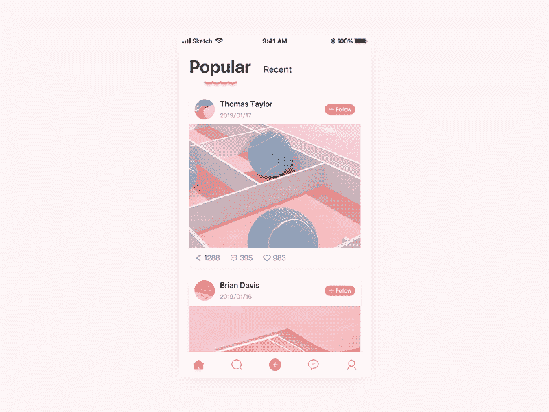
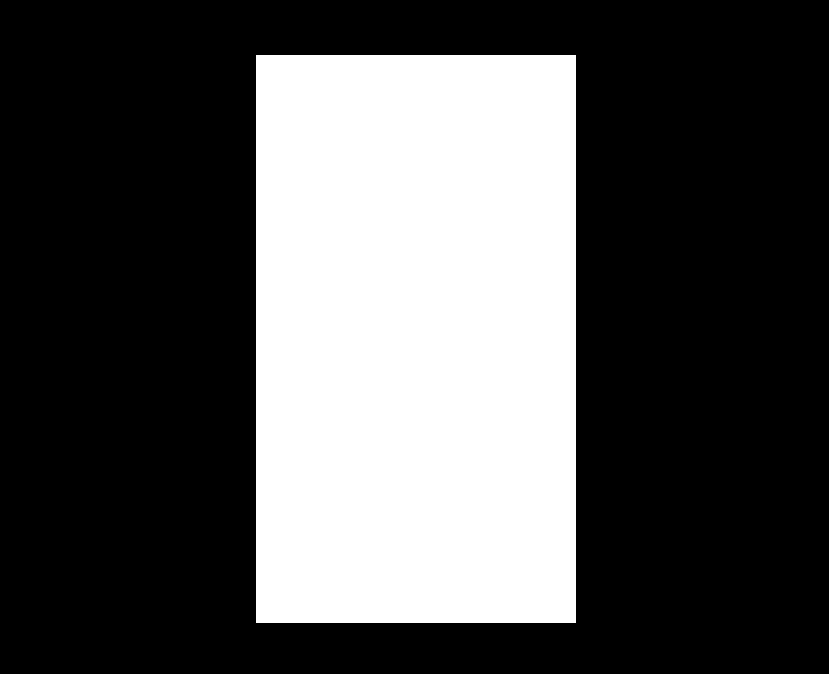
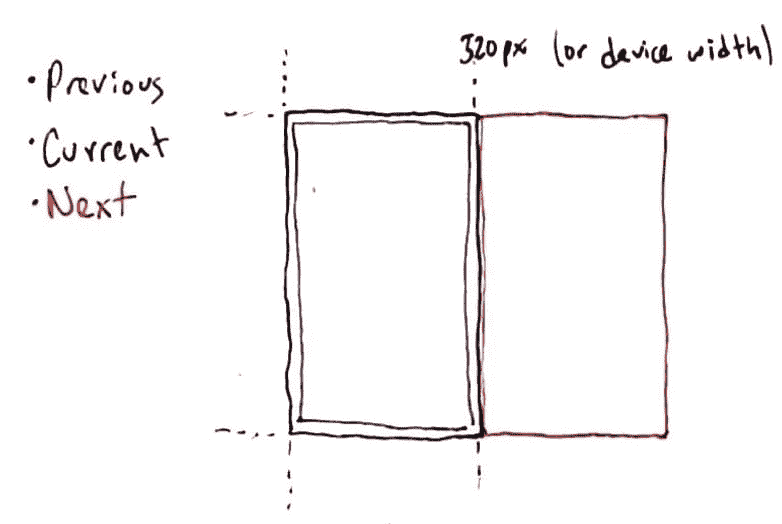
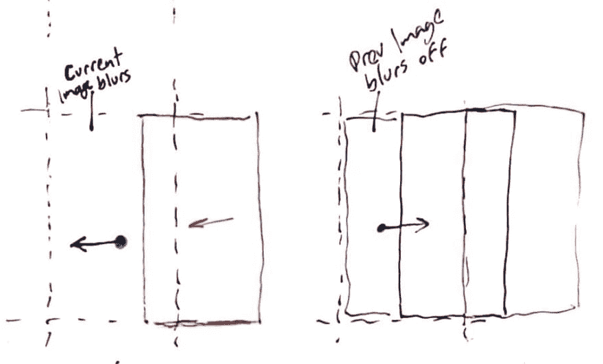
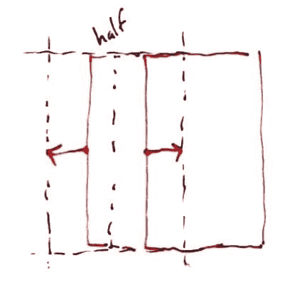
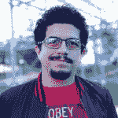

# 使用 Vue.js 和 Tailwind - WotW 推送图库

> 原文：<https://dev.to/ederchrono/swipe-gallery-using-vue-js-tailwind-wotw-4akc>

欢迎来到“每周小部件”系列，在这里我拍摄了令人敬畏的 UI/UX 组件的 gif 或视频，并用代码将它们赋予生命。

今天，我们将创建一个滑动画廊，既可以使用触摸控制，也可以使用鼠标控制。
灵感来自[荣宇](https://dribbble.com/CHEN-RONGYU)创作的[投稿](https://dribbble.com/shots/5911272-UI-design)，看起来是这样的:

[](https://res.cloudinary.com/practicaldev/image/fetch/s--VgIPBQ2q--/c_limit%2Cf_auto%2Cfl_progressive%2Cq_66%2Cw_880/https://thepracticaldev.s3.amazonaws.com/i/tb86mk1j5l3tin33g5vu.gif)

### 这是给谁的？

本教程面向希望提升技能的前端开发人员。建议你先有一些 HTML，CSS，JS 的知识。
我将使用 [Vue.js](https://vuejs.org/) 来制作这个小工具，如果你不熟悉这个框架，这些精彩的帖子可以帮助你快速上手:

*   [用 Vue.js 替换 jQuery](https://www.smashingmagazine.com/2018/02/jquery-vue-javascript/)
*   [从 React 切换到 Vue.js](https://medium.com/js-dojo/switching-from-react-to-vue-js-badf34565a2d)

### 制剂

对于今天的小部件，我们将使用 [Vue.js](https://vuejs.org/) ，对于一些动画，我们将使用 [TweenMax](https://greensock.com/tweenmax) 。此外，我将使用新发布的 [TailwindCSS v1.0.1](https://tailwindcss.com/) 。如果你想跟进，你可以派生这个已经有依赖关系的 [codepen 模板](https://codepen.io/ederdiaz/pen/gJgrxB)。

### 创建移动视口

首先，我想做的是限制小部件容器的面积，使之与移动设备的大小相匹配。为此，我将首先编写一些 CSS 规则:

```
.mobile-container {
  width: 320px;
  height: 568px;
} 
```

Enter fullscreen mode Exit fullscreen mode

> 这将是整个小部件唯一需要的 CSS 类...没错，剩下的样式将使用 TailwindCSS 来完成。

现在要看到它的工作，我们需要给我们的小部件添加一些标记，让我们从制作我们的应用程序容器开始:

```
<div id="app" class="flex items-center justify-center bg-black w-screen h-screen"></div> 
```

Enter fullscreen mode Exit fullscreen mode

这些是一堆 TailwindCSS 类，如果你习惯于编写 CSS 规则，它们中的大多数都是不言自明的。从左到右，它们匹配以下 CSS 规则:

```
display: flex;
align-items: center;
justify-content: center;
background-color: black;
width: 100vw;
height: 100vw; 
```

Enter fullscreen mode Exit fullscreen mode

正如你所看到的，我们写了更少的代码，而且我们能够做任何改变，而不必在 CSS 文件和 HTML 文件之间跳转。

> 在本教程的其余部分，我不会“翻译”每个 TailwindCSS 类，但我肯定会突出最重要的类。其余的你可以访问 [TailwindCSS 文档](https://tailwindcss.com/)。

现在让我们利用我们创建的`.mobile-container`类:

```
<!-- inside the app div -->
<div class="mobile-container relative overflow-hidden bg-white"></div> 
```

Enter fullscreen mode Exit fullscreen mode

我们正在使容器`relative`能够相对于它移动图库图像，并且`overflow-hidden`应该帮助我们隐藏容器框外的任何内容。

现在我们应该有这样的东西:
[](https://res.cloudinary.com/practicaldev/image/fetch/s--8DgUtmLt--/c_limit%2Cf_auto%2Cfl_progressive%2Cq_auto%2Cw_880/https://thepracticaldev.s3.amazonaws.com/i/3z9rsbrmai7gy1kt1dzk.png)

### 图像

要开始制作我们的图库，我们需要几张图片，你可以使用我为这个小部件托管的下列图片:

```
// js
const images = [
  'https://res.cloudinary.com/ederchrono/image/upload/v1556684546/wotw-013/nature-1.jpg',
  'https://res.cloudinary.com/ederchrono/image/upload/v1556684546/wotw-013/nature-2.jpg',
  'https://res.cloudinary.com/ederchrono/image/upload/v1556684526/wotw-013/nature-3.jpg',
  'https://res.cloudinary.com/ederchrono/image/upload/v1556684544/wotw-013/nature-4.jpg',
  'https://res.cloudinary.com/ederchrono/image/upload/v1556684520/wotw-013/nature-5.jpg',
  'https://res.cloudinary.com/ederchrono/image/upload/v1556684527/wotw-013/nature-6.jpg'
] 
```

Enter fullscreen mode Exit fullscreen mode

### 设置视图. js

与本系列中的通常情况一样，我们需要设置 Vue.js 来将我们的`js`数据绑定到 HTML 模板，并使我们的小部件具有交互性:

```
new Vue({
  el: '#app',
  data: {
    currentImageIndex: 0
  }
}) 
```

Enter fullscreen mode Exit fullscreen mode

现在没发生什么事情，我只是在我的数据对象中声明了一个属性，它保存了图库中当前项目的索引。

### 如何运作？

在继续之前，我需要给你看几张图，这应该有助于解释画廊的真实行为。

我们的图库应该遍历数组中的所有图像，但是我们只需要同时拥有 3 张图像:`Previous`、`Current`和`Next`，而不是创建所有的图像

[](https://res.cloudinary.com/practicaldev/image/fetch/s--kLbaih7E--/c_limit%2Cf_auto%2Cfl_progressive%2Cq_auto%2Cw_880/https://thepracticaldev.s3.amazonaws.com/i/nx3hsowvs9km15m9x944.png)

每当我们浏览图片时，我们最多只能看到这三张图片，所以我们将对它们做一些“魔术”，让它们看起来像是无限的。

当滑动时有两个结果，你向右拖动当前图像并显示前一个`or`拖动下一个图像到当前图像之上:

[](https://res.cloudinary.com/practicaldev/image/fetch/s--HLuBxm-F--/c_limit%2Cf_auto%2Cfl_progressive%2Cq_auto%2Cw_880/https://thepracticaldev.s3.amazonaws.com/i/m0gmj01m7csiistzfyej.png)

将拖动的图像释放到任一侧后，我们需要决定图像是停留在中心，还是离开视口:

[](https://res.cloudinary.com/practicaldev/image/fetch/s--kNEvLors--/c_limit%2Cf_auto%2Cfl_progressive%2Cq_auto%2Cw_880/https://thepracticaldev.s3.amazonaws.com/i/0uzrxhooytq8xhg1qwx8.png)

为此，我们将采取图像位置，如果它的一半以上是在视口内，它停留，如果不是，它离开。此外，为了继续使用相同的三幅图像，我们应该相应地交换它们。

### 设置图像

我们现在知道将要渲染三幅图像，我们已经有了`currentImageIndex`,但是我们还需要前一幅和下一幅。此外，如果图像 URL 可以存储在一个变量中，或者更好地存储在计算属性中，那就太棒了:

```
 // after our data inside the Vue instance
  computed: {
    currentImage () {
      return images[this.currentImageIndex]
    },
    previousImageIndex () {
      return (this.currentImageIndex - 1 + images.length) % images.length
    },
    previousImage () {
      return images[this.previousImageIndex]
    },
    nextImageIndex () {
      return (this.currentImageIndex+1) % images.length
    },
    nextImage () {
      return images[this.nextImageIndex]
    },
  } 
```

Enter fullscreen mode Exit fullscreen mode

> 计算属性帮助我们
> 简化组件并提高其性能，而不是使用方法，[计算属性基于它们的反应依赖关系](https://vuejs.org/v2/guide/computed.html)被缓存。

我们已经有了开始渲染图像的一切，所以让我们回到 HTML 部分:

```
<!-- inside .mobile-container -->

<!--  image below   -->


<!--  interactive image   -->


<!--  image above   -->
 
```

Enter fullscreen mode Exit fullscreen mode

所有三个图像都需要堆叠在前一个之上，这就是为什么我们使用`z-0`、`z-10`、`z-20`和`absolute`位置。`h-full`类确保图像垂直填充容器的空间。

我们有一个小问题，第一张图中所示的`nextImage`应该在视口之外(右侧)。我们最终还将制作动画，所以我将把样式属性绑定到一个名为`nextImageStyle`的计算属性。

```
<!--  image above   -->
 
```

Enter fullscreen mode Exit fullscreen mode

然后我们需要创建那个计算的属性，但是它需要一个引用设备宽度的常量:

```
// before the Vue instance
const DEVICE_WIDTH = 320 
```

Enter fullscreen mode Exit fullscreen mode

> 对于这个小部件来说，它是一个硬编码的常量，但是在现实场景中，我们应该能够获得设备宽度并相应地设置这个常量。

```
 // inside computed: {
    nextImagePosition () {
      return DEVICE_WIDTH
    },
    nextImageStyle () {
      return {
        'left': `${this.nextImagePosition}px`
      }
    } 
```

Enter fullscreen mode Exit fullscreen mode

我们为样式创建了几个计算属性，这看起来有点夸张，但是它们在制作图像动画时会很有用。在这之后，你应该会看到第一个图像，瀑布，而不是一些绿叶。

### 获取用户输入

用户将通过触摸或点击当前图像与我们的图库进行交互，然后它将开始移动光标或手指，之后，他们应该会释放图像。

这是我们需要倾听的三个事件:

*   开始
*   移动
*   结束

start 事件总是由当前图像触发，但是其他两个事件可以发生在图像内部或图库容器外部。下一步是监听这些事件，并使其能够在移动和桌面设备上工作，我们不仅需要监听触摸事件，还需要监听鼠标事件:

```
<!-- add these 4 events to the app div -->
<div
  id="app"
  @mousemove="drag"
  @touchmove="drag"
  @mouseup="stopDrag"
  @touchend="stopDrag"
  class="flex items-center justify-center bg-black w-screen h-screen"
></div> 
```

Enter fullscreen mode Exit fullscreen mode

```
<!--  these 2 events go in the current image   -->
 
```

Enter fullscreen mode Exit fullscreen mode

> 注意`prevent`修饰符，这有助于防止浏览器添加到图像中的常规拖放行为。

我们有三个不同的方法需要在 Vue 实例中声明，但是首先，让我们创建一个助手函数来提取鼠标或手指触摸屏幕的位置:

```
const getCursorX = (event) => {
  if (event.touches && event.touches.length) {
    // touch
    return event.touches[0].pageX
  }

  if (event.pageX && event.pageY) {
    // mouse
    return event.pageX
  }

  return 0
} 
```

Enter fullscreen mode Exit fullscreen mode

我们应该能够使用这个函数来相应地更新光标移动，但我们也需要跟踪初始点击位置，如果用户当前正在拖动图像:

```
// inside the vue instance data
    dragging: false,
    cursorStartX: 0,
    cursorCurrentX: 0

// after data
  methods: {
    startDrag(e) {
      this.dragging = true
      this.cursorStartX = getCursorX(e)
      this.cursorCurrentX = this.cursorStartX
    },
    drag(e) {
      if(!this.dragging) {
        // avoid updating if not dragging
        return
      }
      this.cursorCurrentX = getCursorX(e)
    },
    stopDrag(e) {
      this.dragging = false
    }
  }, 
```

Enter fullscreen mode Exit fullscreen mode

要查看所有这些是否正常工作，您可以添加这个小部件来查看属性是如何变化的:

```
<!-- inside the app div -->
<pre
  class="fixed bottom-0 left-0 p-3 text-white z-50 bg-gray-800 opacity-75 pointer-events-none"
>
dragging: {{ dragging }}
imagesIndexes: [{{previousImageIndex}}] [{{currentImageIndex}}] [{{nextImageIndex}}]
cursorStartX: {{ cursorStartX }}
cursorCurrentX: {{ cursorCurrentX }}</pre
> 
```

Enter fullscreen mode Exit fullscreen mode

### 移动图像

有趣的部分来了，在接下来的步骤中，我们将首先声明一些我们将使用的常量:

```
// after DEVICE_WIDTH constant
const HALF_WIDTH = DEVICE_WIDTH / 2
const DRAGGING_SPEED = 1.2
const MAX_BLUR = 8 
```

Enter fullscreen mode Exit fullscreen mode

> 完成后，您可以使用这些值来观察事情如何变化。

就像我上面提到的，拖动图像有两种情况，要么是向左拖动，要么是向右拖动。让我们为此创建几个计算道具:

```
// inside computed
    diffX () {
      return this.cursorStartX - this.cursorCurrentX
    },
    swipingLeft () {
      return this.diffX >= 0
    }, 
```

Enter fullscreen mode Exit fullscreen mode

> 基本上，我们得到了用户开始拖动的位置和光标当前位置之间的差异。如果差值大于`0`，这意味着用户向左拖动图像。

在深入移动图像之前，我将创建另一个助手函数，它可以帮助我们将图像保存在容器中

```
const clampPosition = (position) => {
  // constrain image to be between 0 and device width
  return Math.max(Math.min(position, DEVICE_WIDTH), 0)
} 
```

Enter fullscreen mode Exit fullscreen mode

现在我们可以用这个新的属性来替换`nextImagePosition`计算属性:

```
// inside computed, replacing the old one
    nextImagePosition () {
      const swipingRight = !this.swipingLeft
      if(!this.dragging || swipingRight) {
        return DEVICE_WIDTH
      }

      const position = DEVICE_WIDTH - (this.diffX * DRAGGING_SPEED)
      return clampPosition(position)
    }, 
```

Enter fullscreen mode Exit fullscreen mode

试试吧！

按下并向左拖动时，`nextImage`应该会出来。

每当用户没有拖动或者用户向右滑动时，我们希望下一个图像在视窗外的同一个位置。在另一种情况下，根据拖动速度，图像应该更靠近容器的中心。

同理，我们可以对`currentImage`做类似的事情，当用户向右滑动时，先绑定样式属性:

```
<!--  interactive image   -->
 
```

Enter fullscreen mode Exit fullscreen mode

然后为其创建计算方法:

```
// inside computed
    currentImagePosition () {
      if(!this.dragging || this.swipingLeft) {
        return 0
      }
      const position = this.diffX * -DRAGGING_SPEED
      return clampPosition(position)
    },
    currentImageStyle () {
      return {
        'left': `${this.currentImagePosition}px`
      }
    }, 
```

Enter fullscreen mode Exit fullscreen mode

### 模糊效果

在参考中，当当前图像被下一个图像覆盖时，它会逐渐模糊，从而产生一种被发送到底部的效果。让我们创建最后一个助手函数:

```
const calculateBlur = (position) => {
  return MAX_BLUR * (1 - position / DEVICE_WIDTH)
} 
```

Enter fullscreen mode Exit fullscreen mode

> 这个函数应该根据图像的位置给出一个介于 0 和`MAX_BLUR`之间的值。当图像越靠近视口外部，模糊越少，当图像越靠近中心时，模糊值越大。

我们之前的图像也需要一个样式属性:

```
<!--  image below   -->
 
```

Enter fullscreen mode Exit fullscreen mode

`previousImage`模糊取决于`currentImage`位置，`currentImage`模糊取决于`nextImage`位置:

```
// inside computed
    currentImageStyle () {
      const blur = calculateBlur(this.nextImagePosition)

      return {
        'left': `${this.currentImagePosition}px`,
        'filter': `blur(${blur}px)`
      }
    },
    prevImageStyle () {
      const blur = calculateBlur(this.currentImagePosition)

      return {
        'filter': `blur(${blur}px)`
      }
    }, 
```

Enter fullscreen mode Exit fullscreen mode

### 放下图像后制作动画

到目前为止，一切顺利。图像会相应地移动和模糊，但在我们发布之后，它们又会恢复原状。我们需要一种方法让他们在我们刷卡后去我们想去的地方。

就像我们之前说过的，根据图像的一半是显示还是隐藏，我们将使其动画化。

让我们添加一些我们需要的数据道具:

```
// inside data
    animating: false,
    currentImageAnimatedX: 0,
    nextImageAnimatedX: DEVICE_WIDTH 
```

Enter fullscreen mode Exit fullscreen mode

属性会让我们知道什么时候移动图像，并阻止任何其他动作。`currentImageAnimatedX`和`nextImageAnimatedX`将在动画显示相应图像时保持该位置。

为了让这两个属性正确工作，我们需要更新两个图像定位计算属性:

```
// inside computed
    nextImagePosition () {
      // add these 3 lines...
      if(this.animating) {
        return this.nextImageAnimatedX
      }
      const swipingRight = !this.swipingLeft
      if(!this.dragging || swipingRight) {
        return DEVICE_WIDTH
      }

      const position = DEVICE_WIDTH - (this.diffX * DRAGGING_SPEED)
      return clampPosition(position)
    },
    currentImagePosition () {
      // ... and these 3 too
      if(this.animating) {
        return this.currentImageAnimatedX
      }
      if(!this.dragging || this.swipingLeft) {
        return 0
      }
      const position = this.diffX * -DRAGGING_SPEED
      return clampPosition(position)
    }, 
```

Enter fullscreen mode Exit fullscreen mode

然后我们需要改变`stopDrag`方法来触发动画:

```
// inside methods
    stopDrag(e) {
      let animationProps = this.createReleaseAnimation()

      this.dragging = false
      this.animating = true
      TweenLite.to(this, 0.2, {
        ...animationProps,
        onComplete: () => {this.animating = false}
      })
    }, 
```

Enter fullscreen mode Exit fullscreen mode

> 我们使用`TweenLite`来补间 Vue 实例数据，这将反应性地更新图像样式的计算属性。

你可能已经注意到我们需要定义`createReleaseAnimation`，这是一个方法，它将保持逻辑来知道图像在发布后应该去哪里。这是某种决策树，所以我会用注释来解释:

```
// inside methods
    createReleaseAnimation() {
      if(this.swipingLeft) {
        if(this.nextImagePosition > HALF_WIDTH) {
          // next image should be animated back to be offscreen
          this.nextImageAnimatedX = this.nextImagePosition
          return {nextImageAnimatedX: DEVICE_WIDTH}
        }

        // current image "copies" the nextImage position
        this.currentImageAnimatedX = this.nextImagePosition
        // the nextImage is sent offscreen
        this.nextImageAnimatedX = DEVICE_WIDTH

        // Change the image index to become the next image in the array
        // images src attribute will update accordingly
        this.currentImageIndex = this.nextImageIndex
        return {currentImageAnimatedX: 0}
      }

      // swipe right
      if(this.currentImagePosition < HALF_WIDTH) {
        // current image should be animated back to center position
        this.currentImageAnimatedX = this.currentImagePosition
        return {currentImageAnimatedX: 0}
      }

      // the nextImage "copies" the currentImage position
      this.nextImageAnimatedX = this.currentImagePosition
      // the currentImage gets centered to become the prevImage
      this.currentImageAnimatedX = 0

      // Change the image index to become the previous image in the array
      this.currentImageIndex = this.previousImageIndex
      return {nextImageAnimatedX: DEVICE_WIDTH}
    } 
```

Enter fullscreen mode Exit fullscreen mode

我们正在定义四种情况中的每一种:

*   向左滑动，但图像应该回到屏幕外
*   向左滑动，图像应该到达容器的中心
*   向右滑动，图像应该回到中间
*   向右滑动，先前的图像应该成为新的当前图像

对于每一种情况，我们都定义了一个对象，TweenLite 将使用该对象将相应的`animatedX`属性更改为目标。

而现在最后的结果！

[https://codepen.io/ederdiaz/embed/bJmdOd?height=600&default-tab=result&embed-version=2](https://codepen.io/ederdiaz/embed/bJmdOd?height=600&default-tab=result&embed-version=2)

我留下了一个`<pre>`标签，显示所有更新的属性，但如果您只是想查看没有它的图库，请随意移除它。

这就是本周的**小部件。**

如果你想知道更多，你可以去看看其他的 WotW:

[](/ederchrono) [## 带有 Vue.js 和 GSAP - WotW 的极简导航菜单

### eder díaz Apr 24 ' 198min read

#webdev #vue #tutorial #wotw](/ederchrono/minimalistic-nav-menu-with-vue-js-and-gsap-wotw-1m3k)[](/ederchrono) [## 制作一个交互式密码验证器- WotW

### eder díaz Jul 31 ' 188min read

#webdev #vue #tutorial #wotw](/ederchrono/making-an-interactive-password-validator---wotw-1md0)[](/ederchrono) [## 制作动画滑块- WotW

### eder díaz Jul 12 ' 188min read

#webdev #vue #tutorial #wotw](/ederchrono/making-an-animated-slider---wotw-mkj)