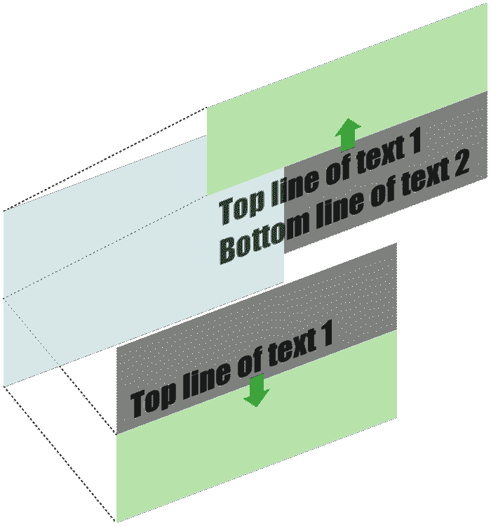

# 用 CSS 重新制作 iPad Pro 商业动画

> 原文：<https://dev.to/alvaromontoro/recreating-the-ipad-pro-commercial-animation-with-css-4aph>

在网上浏览，我看到了新 iPad Pro 的广告，我非常喜欢开头的动画词:

[https://www.youtube.com/embed/Moq2SyuljnA](https://www.youtube.com/embed/Moq2SyuljnA)

我试图用 HTML 和 CSS 重新制作一个类似的动画，它碰巧非常容易开发，同时仍然保持视觉冲击力:

[https://codepen.io/alvaromontoro/embed/RmRjvg?height=600&default-tab=result&embed-version=2](https://codepen.io/alvaromontoro/embed/RmRjvg?height=600&default-tab=result&embed-version=2)


<figcaption>[或者你可以加一点“东西”来模仿商业上的旋转平板。](https://codepen.io/alvaromontoro/pen/MLKZMJ)</figcaption>

[T3】](https://codepen.io/alvaromontoro/pen/MLKZMJ)

我的第一个想法是，“*我可以只用一个 HTML 元素*来构建动画，”尽管这是可能的，但是代码也可能是不可访问的，并且可能存在兼容性问题。所以我决定尝试一些稍微复杂一点的*。*

 *这个想法是有一个容器，其中两个元素占据了它的全部高度(各占 50%)。他们都需要`overflow: hidden`来隐藏可视区域之外的任何东西，然后文本将被放置在可视区域之外，只有在动画中合适的时候才会上下滑动。

顶部元素的文本在底部，它会向上滑动。底部元素的文本将位于顶部，它将向下滑动:

<figure>

[](https://res.cloudinary.com/practicaldev/image/fetch/s--zfOOE-qz--/c_limit%2Cf_auto%2Cfl_progressive%2Cq_auto%2Cw_880/https://thepracticaldev.s3.amazonaws.com/i/74bfvuoowa6xccc45qrd.png)

<figcaption>The two layers hide the text by positioning it outside of their visible area</figcaption>

</figure>

考虑到这种结构，HTML 代码可能看起来像这样:

```
<div class="animated-title">
  <div class="text-top">
    <div>
      <span>Mimicking</span>
      <span>Apple's design</span>
    </div>
  </div>
  <div class="text-bottom">
    <div>for the win!</div>
  </div>
</div> 
```

Enter fullscreen mode Exit fullscreen mode

其中`.animated-title`是容器，`.text-top`和`.text-bottom`是包含文本的元素，这些文本位于通过 CSS 移出视图的`div`中。让我们把所有这些放在一起，一步一步地查看 CSS。

首先，`.animated-title`(动画的主容器)被放置在屏幕的中央:

> 在这个演示中，我们将把动画放在屏幕的中央，但是你也可以把它放在任何你想放的地方。重要的是它有一个位置和高度/宽度定义。

```
.animated-title {
  color: #222;
  font-family: Roboto, Arial, sans-serif;
  height: 90vmin;
  left: 50%;
  position: absolute;
  top: 50%;
  transform: translate(-50%, -50%);
  width: 90vmin;
} 
```

Enter fullscreen mode Exit fullscreen mode

现在，这个容器的直接子容器必须绝对定位到父容器(这就是为什么它需要一个位置)，并且占据它的一半高度。第一个孩子`.text-top`将位于容器的顶部，第二个孩子`.text-bottom`将位于容器的底部。

```
.animated-title > div {
  height: 50%;
  overflow: hidden;
  position: absolute;
  width: 100%;
}

.animated-title > div.text-top {
  border-bottom: 1vmin solid #000;
  top: 0;
}

.animated-title > div.text-bottom {
  bottom: 0;
} 
```

Enter fullscreen mode Exit fullscreen mode

> 你可能已经注意到`.text-top`有一个底部边框。它在那里产生中间线。同样的事情也可以使用其他方法来实现，比如伪元素、边框阴影或者主容器或子容器上的边框。

在我们定义文本之前，让我们添加控制文本滑动的动画。最初，文本将通过平移其高度的 100%而位于可见区域之外，并且它将通过将该值动画化为 0 来滑动。

底部的文本将被翻译 100%向上，所以它向下滑动，而顶部的文本将被翻译 100%向下，所以它可以向上滑动(另外，我们需要为它添加一个短暂的停顿！):

```
@keyframes showTopText {
  0% { transform: translate3d(0, 100%, 0); }
  40%, 60% { transform: translate3d(0, 50%, 0); }
  100% { transform: translate3d(0, 0, 0); }
}

@keyframes showBottomText {
  0% { transform: translate3d(0, -100%, 0); }
  100% { transform: translate3d(0, 0, 0); }
} 
```

Enter fullscreen mode Exit fullscreen mode

> 这种效果可以通过不同的方式实现，但我们选择使用 3D 转换来触发硬件加速(这将导致更平滑、更少波动的过渡)。

此时，我们有了父容器的样式、将承载文本的元素以及将创建效果的动画。让我们包括文本本身的样式。

在 HTML 中，我们在`.text-top`和`.text-bottom`中都有一个`<div>`。它将包含每个部分的文本，所以我们需要以一种绝对的方式定位它，并将其移动到它们的父级之外。

> 如何将文本放置在可见区域之外取决于创建动画的方法。在这种情况下，我们使用转换。

我们分配动画并播放一点时间值，这样幻灯片就会按照我们想要的时间/方式播放:

```
.animated-title > div div {
  font-size: 12vmin; /* for demo purposes */
  padding: 2vmin 0;
  position: absolute;
}

.animated-title > div.text-top div {
  animation: showTopText 1s;
  animation-delay: 0.5s;
  animation-fill-mode: forwards;
  bottom: 0;
  transform: translate(0, 100%);
}

.animated-title > div.text-bottom div {
  animation: showBottomText 0.5s;
  animation-delay: 1.75s;
  animation-fill-mode: forwards;
  top: 0;
  transform: translate(0, -100%);
} 
```

Enter fullscreen mode Exit fullscreen mode

最后，我们只需要添加一些细节来完成设计:需要将`<span>`转换成块，所以每个块占据一行。调整第一行的颜色，使其比其他行更亮:

```
.animated-title > div div span {
  display: block;
}

.animated-title > div.text-top div span:first-child {
  color: #767676;
} 
```

Enter fullscreen mode Exit fullscreen mode

> 您可能想知道，"*如果您想要一个块元素，为什么不使用`<div>`而不是样式化的`<span>`？*“好大的问题！答案与可用性/可访问性有关。使用带有`<div>`的屏幕阅读器，文本将被“模仿”阅读。苹果的设计。为了胜利！”，但加上`<span>`会读起来更流畅:“模仿苹果的设计。为了胜利！”我们甚至可以认为整个文本应该放在一堆`<span>`中

就这样，我们的动画完成了。将所有这些放在一起后，结果将类似于我们之前看到的:

[https://codepen.io/alvaromontoro/embed/RmRjvg?height=600&default-tab=result&embed-version=2](https://codepen.io/alvaromontoro/embed/RmRjvg?height=600&default-tab=result&embed-version=2)*