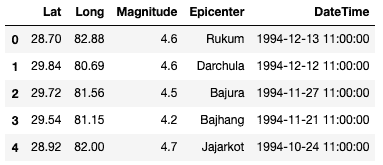
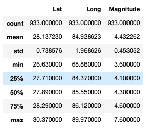
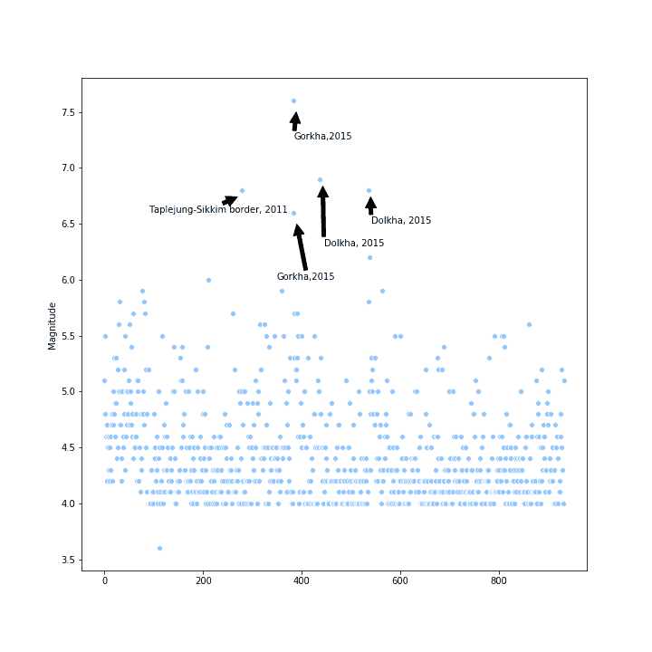
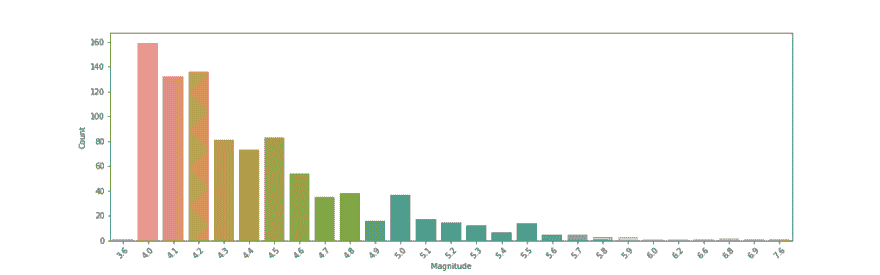
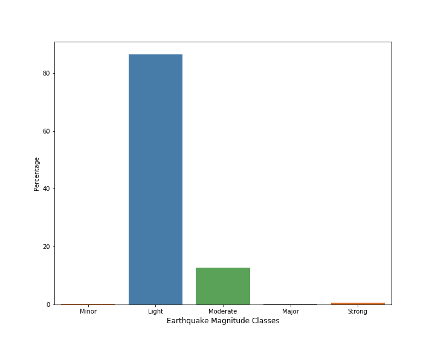
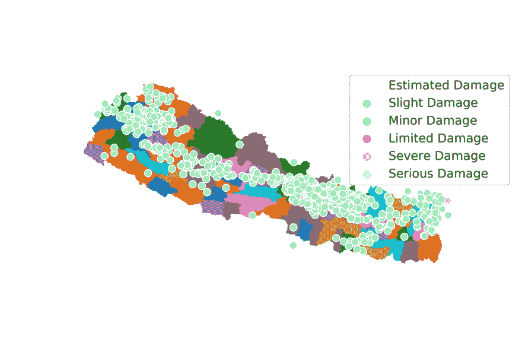

# 尼泊尔地震震级数据分析及 Python 数据可视化

> 原文：<https://dev.to/saral/nepal-earthquakes-magnitude-data-analysis-and-data-visualization-with-python-12gl>

本文试图对尼泊尔 1994-2019 年间的地震数据进行分析和可视化。数据提取自[国家地震中心(NSC)数据库](http://seismonepal.gov.np/earthquakes)。获取和清理数据的代码可以在[这里](https://github.com/Saralkarki/Nepal_earthquake/blob/master/extract_data.ipynb)找到。

#### 哪里的数据需要清理？

一旦数据从网页上刮下来，就需要一点清理。代码中的注释描述了大部分清理工作是如何完成的，但是我需要做的事情很少:

#### 一、将日期改为合适的格式:

数据库中的日期不是标准的日期时间格式。尼泊尔和英国的日期被连接在一起。所以第一项任务是将日期转换成适当的格式。

#### 二世。将时间更改为正确的格式:

数据库中的时间列不是标准格式。因此，这也需要改变。

一旦这两项任务完成，我的数据库就差不多可以进行快速分析和可视化了。

#### 三世。删除的行:

我进行这一分析的前提之一是，震中必须在尼泊尔境内。因此，我删除了震中不在尼泊尔的任何行。

最后，有几个坐标在纬度和经度上有误差。一旦这些被考虑和清理，数据就可以使用了。

#### 数据分析

分析的第一步是导入所需的库。

```
import pandas as pd
import matplotlib.pyplot as plt
import seaborn as sns
plt.style.use('seaborn-pastel') 
```

准备好库之后，下一步是导入数据文件。

```
df = pd.read_csv('earthquake.csv') 
```

我能够导入所需的 csv 文件熊猫'读取 CSV '功能。我快速查看了数据框的内容，现在方便地称之为 df。

```
df.head()
df.describe() 
```

[](https://res.cloudinary.com/practicaldev/image/fetch/s--AP6xiTpP--/c_limit%2Cf_auto%2Cfl_progressive%2Cq_auto%2Cw_880/https://cdn-images-1.medium.com/max/383/1%2AeI8SgxLV2zYH-6TUGOoOtQ.png) 

<figcaption>df.head( )</figcaption>

[](https://res.cloudinary.com/practicaldev/image/fetch/s--R-F4MeY5--/c_limit%2Cf_auto%2Cfl_progressive%2Cq_auto%2Cw_880/https://cdn-images-1.medium.com/max/289/1%2A6U6hBR8WyWGndxCRpOOuqg.png)T3】df . describe()

这让我对数据的样子有了一个快速的概述，并对数字数据进行了快速的统计汇总。

快速浏览一下统计摘要就可以发现，自 1994 年以来，尼泊尔发生了 933 次地震。据说，大地震发生后，仅在 2015 年就有超过 30，000 次震动。然而，必须指出的是 [NSC 处理重大地震和余震的数据。](http://The%20NSC%20processed%20the%20data%20of%20more%20than%20450%20significant%20aftershocks)

### 地震震级曲线图

```
plt.figure(figsize=(10,10))

sns.scatterplot(y="Magnitude", x=df.Magnitude.index , data=df)

plt.annotate('Gorkha,2015', xy=(389, 7.5), xytext=(385, 7.25),arrowprops=dict(facecolor='black', shrink=0.01),)

plt.annotate('Gorkha,2015', xy=(390, 6.5), xytext=(350, 6.0),arrowprops=dict(facecolor='black', shrink=0.01),)

plt.annotate('Dolkha, 2015', xy=(443, 6.84), xytext=(445, 6.3),arrowprops=dict(facecolor='black', shrink=0.01),)

plt.annotate('Dolkha, 2015', xy=(540, 6.74), xytext=(541, 6.5),arrowprops=dict(facecolor='black', shrink=0.01),)

plt.annotate('Taplejung-Sikkim border, 2011', xy=(282, 6.74), xytext=(100, 6.6),arrowprops=dict(facecolor='black', shrink=0.01),)

plt.savefig('overall\_earthquakes.png') 
```

[](https://res.cloudinary.com/practicaldev/image/fetch/s--66wySSQQ--/c_limit%2Cf_auto%2Cfl_progressive%2Cq_auto%2Cw_880/https://cdn-images-1.medium.com/max/720/1%2ADqmIUcLyBDCPzhqe8JT4fA.png) 

<figcaption>标绘 1994 年至 2019 年以来的每一次地震</figcaption>

我们可以从散点图中观察到，仅在 2015 年就发生了一些大地震，尤其是四次大地震。

[](https://res.cloudinary.com/practicaldev/image/fetch/s--1KS3fh_Q--/c_limit%2Cf_auto%2Cfl_progressive%2Cq_auto%2Cw_880/https://cdn-images-1.medium.com/max/1024/1%2AmbYhLbd8TGiXQe05nL_PpA.png)

<figcaption>【1994 年-2019 年】地震震级频率图</figcaption>

### 1994-2019 年的年度地震

从图表中可以观察到 2015 年地震频率的激增。地震的数量已经下降，并遵循 2015 年之前的模式。

[](https://res.cloudinary.com/practicaldev/image/fetch/s--vo7cc2ze--/c_limit%2Cf_auto%2Cfl_progressive%2Cq_auto%2Cw_880/https://cdn-images-1.medium.com/max/1024/1%2ASGTdjn7oifPRJB4289SkGg.png)

<figcaption>1994 年至 2019 年</figcaption>

的年度地震

#### **地震震级等级**

根据地震的震级，地震也分为轻微地震和强烈地震。([来源](http://www.geo.mtu.edu/UPSeis/magnitude.html))

**等级震级**

*   很好:8 或更多
*   专业:7–7.9
*   强:6–6.9
*   中度:5–5.9
*   光线:4–4.9
*   辅修:3 -3.9

```
#array for storing the size\_class
size\_class = []

for magnitude in df.Magnitude:
    if magnitude >= 3.0 and magnitude <=3.9:
        size\_class.append("Minor")
    elif magnitude >=4.0 and magnitude <=4.9:
        size\_class.append("Light")
    elif magnitude >=5.0 and magnitude <=5.9:
        size\_class.append("Moderate")
    elif magnitude >=6.0 and magnitude <=6.9:
        size\_class.append("Strong")
    elif magnitude >=7.0 and magnitude <=7.9:
        size\_class.append("Major")
    else:
        size\_class.append("Great")

#Creating a column in the dataframe called size\_class
df['size\_class'] = size\_class

df\_size\_class = pd.DataFrame(df.size\_class.groupby(df.size\_class).count()) 
```

完成后，我在数据中有一栏显示了不同的震级等级。绘制这些

[](https://res.cloudinary.com/practicaldev/image/fetch/s--TueH4vR6--/c_limit%2Cf_auto%2Cfl_progressive%2Cq_auto%2Cw_880/https://cdn-images-1.medium.com/max/720/1%2AKnP5BAdekK0FVspVmx6T3Q.png) 

<figcaption>地震按震级分组。(1994-2019)</figcaption>

#### 在地理地图上绘制地震

根据地震的震级及其估计影响，在数据库中创建了一个新列。【[来源](http://www.geo.mtu.edu/UPSeis/magnitude.html)。根据震级的影响，地震被绘制在尼泊尔的地图上。

```
scale = []
for magnitude in df.Magnitude:
    if magnitude >= 3.0 and magnitude <=3.9:
        scale.append("Limited Damage")
    elif magnitude >=4.0 and magnitude <=4.9:
        scale.append("Minor Damage")
    elif magnitude >=5.0 and magnitude <=5.9:
        scale.append("Slight Damage")
    elif magnitude >=6.0 and magnitude <=6.9:
        scale.append("Severe Damage")
    elif magnitude >=7.0 and magnitude <=7.9:
        scale.append("Serious Damage")
    else:
        scale.append("Great Damage")
df['scale'] = scale 
```

[](https://res.cloudinary.com/practicaldev/image/fetch/s--nckustgm--/c_limit%2Cf_auto%2Cfl_progressive%2Cq_auto%2Cw_880/https://cdn-images-1.medium.com/max/1024/1%2AEGX-nC8pFIJzagfXxTrysw.png) 

<figcaption>根据损失情况绘制地震图</figcaption>

最后，Jupyter 笔记本的全部代码可以在这里找到[。](https://github.com/Saralkarki/Nepal_earthquake/blob/master/Nepal_Earthquake_Magnitude_Data_Analysis_and_Visualization%20.ipynb)