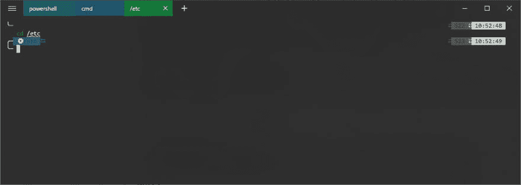
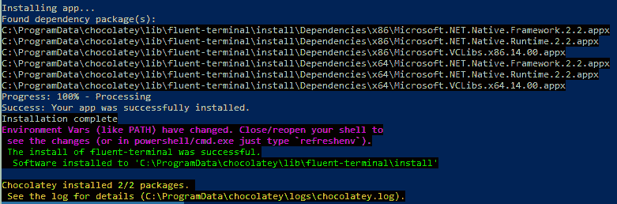
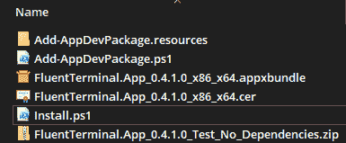
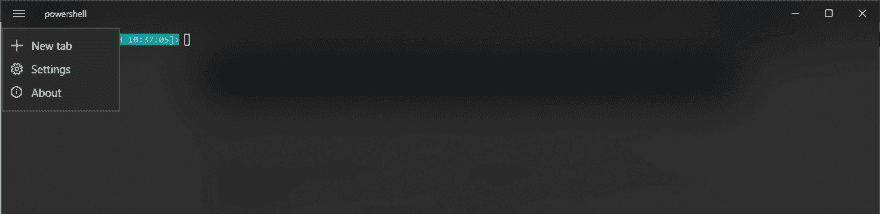
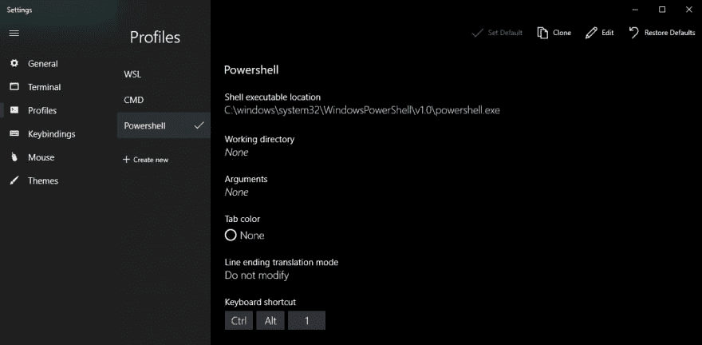
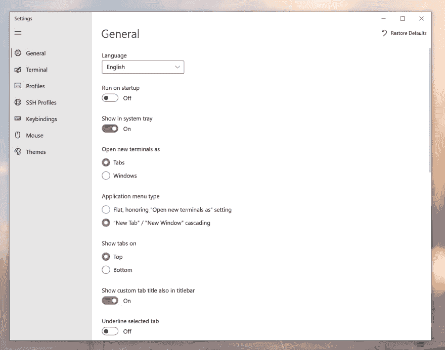

# Windows 10 流体终端

> 原文：<https://dev.to/darksmile92/windows-10-fluentterminal-5a24>

# 在 Windows 10 上用标签在一个终端中使用 PowerShell、CMD、WSL 和自定义 Shell！

我在我的 Windows 机器上使用[超级终端](https://hyper.is/)有一段时间了，真的很喜欢它(特别是像[超级力量](https://www.npmjs.com/package/hyperpower)这样很酷的扩展)。

但是我想要一些新的东西，并且发现了 [FluentTerminal](https://github.com/felixse/FluentTerminal) ！

<figure>

[](https://res.cloudinary.com/practicaldev/image/fetch/s--QOnxg2d9--/c_limit%2Cf_auto%2Cfl_progressive%2Cq_auto%2Cw_880/https://thepracticaldev.s3.amazonaws.com/i/st60e8p51sf45akcjn3b.png)

<figcaption>Screenshot of configured terminal</figcaption>

</figure>

### 该装了！

您可以通过 Chocolatey 安装它，或者从存储库中下载并安装它(在 repo 中为手动)。

```
choco install fluent-terminal 
```

Enter fullscreen mode Exit fullscreen mode

[](https://res.cloudinary.com/practicaldev/image/fetch/s--gSi69HSv--/c_limit%2Cf_auto%2Cfl_progressive%2Cq_auto%2Cw_880/https://thepracticaldev.s3.amazonaws.com/i/4s2ah4qpw91kfjslk3j1.png)

注意:
我需要下载最新的`*_No_Dependencies`版本，然后运行`Install.ps1`才能通过 windows 菜单(开始和上下文)使用这个应用程序！

[](https://res.cloudinary.com/practicaldev/image/fetch/s--tkCQR4gB--/c_limit%2Cf_auto%2Cfl_progressive%2Cq_auto%2Cw_880/https://thepracticaldev.s3.amazonaws.com/i/uqnpggtcy13frrzmk3sk.png)

[](https://res.cloudinary.com/practicaldev/image/fetch/s--G7AOFMtB--/c_limit%2Cf_auto%2Cfl_progressive%2Cq_auto%2Cw_880/https://thepracticaldev.s3.amazonaws.com/i/vcn8fxrvfcyqm6s587ry.png)

### 看起来怎么样？

第一次启动后，它使用 powershell 并具有可定制的默认设置。

[](https://res.cloudinary.com/practicaldev/image/fetch/s--aF9qTMiV--/c_limit%2Cf_auto%2Cfl_progressive%2Cq_auto%2Cw_880/https://thepracticaldev.s3.amazonaws.com/i/2bxdtp46bicmz8445wdx.png)

我建议复习一下键绑定和配置文件，这样您就知道如何通过键盘打开某个 shell 了:

[](https://res.cloudinary.com/practicaldev/image/fetch/s--iC8y9QAI--/c_limit%2Cf_auto%2Cfl_progressive%2Cq_auto%2Cw_880/https://thepracticaldev.s3.amazonaws.com/i/yhmid8yzds8naiao7kx0.png)

### 主题

可以导入任何 iterm2 兼容的主题！
在这里找例子:[https://iterm2colorschemes.com/](https://iterm2colorschemes.com/)

### 备注

对我来说，Fluent 终端比 hyper 有一个巨大的优势:WSL 中来自 oh-my-zsh 的自定义字体和符号可以正常工作，无需任何配置！

存储库:

##  [费利克斯](https://github.com/felixse) / [流体终端](https://github.com/felixse/FluentTerminal)

### 基于 UWP 和 web 技术的终端仿真器。

<article class="markdown-body entry-content container-lg" itemprop="text">

[](https://raw.githubusercontent.com/felixse/FluentTerminal/master/./Icons/Icon_no_margin.png)

# 流畅终端

[](https://github.com/felixse/FluentTerminal/workflows/CI/badge.svg?branch=master)[](https://sonarcloud.io/dashboard?id=FluentTerminal)[](https://gitter.im/FluentTerminal)[](https://github.com/felixse/FluentTerminal/releases/)[](https://github.com/felixse/FluentTerminal/releases)[](https://github.com/felixse/FluentTerminal/graphs/contributors)

基于 UWP 和 web 技术的终端仿真器。

[](https://raw.githubusercontent.com/felixse/FluentTerminal/master///www.microsoft.com/store/apps/9p2krlmfxf9t?cid=storebadge&ocid=badge)

## 特征

*   PowerShell、CMD、WSL 或自定义 Shell 的终端
*   对 SSH 和 [Mosh](https://mosh.org/) 连接的内置支持
*   支持选项卡和多窗口
*   主题和外观配置
*   导入/导出主题
*   导入项目主题
*   全屏模式
*   可编辑按键绑定
*   搜索功能
*   配置 shell 配置文件以在不同的 shell 之间快速切换
*   浏览器上下文菜单集成(安装脚本可在[这里](https://github.com/felixse/FluentTerminal/tree/master/Explorer%20Context%20Menu%20Integration)找到)
*   VsCode 扩展([此处](https://marketplace.visualstudio.com/items?itemName=Xherdi.fluent-terminal))

## 截屏

[ ](https://raw.githubusercontent.com/felixse/FluentTerminal/master/Screenshots/terminal.png) [ ](https://raw.githubusercontent.com/felixse/FluentTerminal/master/Screenshots/settings.png)

## 语言

*   阿拉伯语
*   阿拉伯语(伊拉克)
*   阿塞拜疆人
*   波黑人
*   中文(简体)
*   中文(繁体)
*   荷兰人
*   英语
*   法语
*   德国人
*   希伯来人
*   印地语
*   印度尼西亚的
*   意大利的
*   日本人
*   韩国的
*   抛光剂
*   葡萄牙语(巴西)
*   罗马尼亚的
*   俄语
*   西班牙语
*   乌克兰的

注册[Poe editor](https://poeditor.com/join/project/TfKNIt826z)来帮助现有的翻译或添加新的语言

## 如何安装(作为最终用户)

### 先决条件

*   您需要更新到 Fall Creators Update 或更高版本。

### 微软商店

*   在微软商店应用中搜索 Fluent 终端或点击此处的

### Chocolatey 软件包管理器安装

*   安装…

</article>

[View on GitHub](https://github.com/felixse/FluentTerminal)