# Spring Boot 登录选项快速指南

> 原文：<https://dev.to/oktadev/a-quick-guide-to-spring-boot-login-options-5fjo>

在这篇文章中，您将了解使用 Spring Boot 2.1 实现登录功能的各种选项。您将从最简单、最基本的身份验证开始，除了内部后端工具之外，您可能永远也不想使用它，然后转到一个简单的基于表单的身份验证页面。接下来，您将通过覆盖一些默认模板和控制器来自定义默认的、自动生成的表单。最后，您将继续使用 OAuth 2.0 添加单点登录。您将看到如何允许用户使用 Github 和 [Okta](https://developer.okta.com/) 登录。

本教程的假设非常基本。我假设您已经对 Spring 和 Spring Boot 有了基本的了解，但不一定对 Spring 安全或 Spring 的各种安全特性有深入的理解。你会希望安装`git`，并且`gradle`会很好，但是你可以为所有的`gradle`命令使用 Gradle 包装器，所以这不是绝对必要的。

继续克隆我为本教程创建的库:

```
git clone https://github.com/oktadeveloper/okta-spring-boot-login-options-example.git 
```

该存储库包含五个子目录:

*   `basic-auth`
*   `form-auth`
*   `custom-form-auth`
*   `oauth-start`
*   `oauth-okta-github`
*   `oauth-okta-starter`

这些对应于本教程的四个部分(最后一部分是三个部分，OAuth 部分)。除了`oauth-start`，这些都是全功能应用。在本教程中，您将了解代码的含义以及如何构建它们。

## 在 Spring Boot 建立 HTTP 基本登录

基本认证是最基本的。这是一个直接内置在 HTTP 协议中的简单方案。它来自大量数据和资金通过互联网的各种管道流动之前的田园时代。因此，它真的不是非常安全。根据规范，密码和用户名在 HTTP `authorization`头中使用 Base64 编码。因为 Base64 也可能是纯文本，所以如果您打算对任何事情使用基本身份验证，请确保您总是使用 HTTPS/SSL，因为您会在每个请求中发送您的身份验证凭据。

用你最喜欢的 IDE 或编辑器打开`basic-auth` Spring Boot 项目。

您首先要检查的是`build.gradle`文件。转载如下。我不会详细介绍它们，但我想让您了解这里正在发生的一些事情，以防您还不熟悉。

```
plugins {  
    id 'org.springframework.boot' version '2.1.4.RELEASE'  
    id 'java'  
}  

apply plugin: 'io.spring.dependency-management'  

group = 'com.okta.springsecurityauth'  
version = '0.0.1-SNAPSHOT'  
sourceCompatibility = '1.8'  

repositories {  
    mavenCentral()  
}  

dependencies {  
    implementation 'org.springframework.boot:spring-boot-starter-security'  
    implementation 'org.springframework.boot:spring-boot-starter-web'  
    testImplementation 'org.springframework.boot:spring-boot-starter-test'  
    testImplementation 'org.springframework.security:spring-security-test'  
} 
```

有两个 Spring 插件被添加到构建中:`org.springframework.boot`和`io.spring.dependency-management`。请注意，版本设置为`2.1.4.RELEASE`。过去，Spring 的一个真正问题是依赖管理。Spring 是一个巨大的库集合，当你引入一个库时，你需要引入其他兼容版本的库。当您更新一个时，通常会导致其他的不兼容。过去解决这个问题可能会让你陷入所谓的“依赖地狱”

幸运的是，春天让事情变得简单多了。看看我们的两个 Spring 依赖:

```
dependencies {  
    implementation 'org.springframework.boot:spring-boot-starter-security'  
    implementation 'org.springframework.boot:spring-boot-starter-web'  
... 
} 
```

请注意，它们没有版本号。这些基本上是功能集的大型元依赖项(在这种情况下是安全和 web)，Spring 插件根据这一行中的版本集为您管理所有的子依赖项:

```
id 'org.springframework.boot' version '2.1.4.RELEASE' 
```

所有这些的执行概要是，这个`build.gradle`文件将加载 Spring Boot 版本 2.1.4，并将添加 web 和安全功能模块。春季[的所有可用首发名单可以在他们的文件](https://docs.spring.io/spring-boot/docs/current/reference/htmlsingle/#using-boot-starter)中找到。

除了`gradle.file`之外，实际上只有另外三个感兴趣的文件，都是 Java 文件。在`src/main/java/com/okta/springsecurityauth`下面看，你会看到它们:

*   `Application.java`(auto-magic 的整个 Spring Boot 框架存在的主要类)
*   `SecurityConfiguration.java`(配置安全选项)
*   `WebController.java`(一个非常基础的 HTTP 请求控制器)

`Application.java`是进入 app 的入口。在这种情况下很简单，在很多情况下也是如此。最重要的是`@SpringBootApplication`注释，它告诉你的 Spring 依赖项引导整个 Spring Boot 框架。当然，还有`main()`方法，这是 Spring 加载和运行`Application`类的地方。

```
package com.okta.springsecurityauth;  

import org.springframework.boot.SpringApplication;  
import org.springframework.boot.autoconfigure.SpringBootApplication;  

@SpringBootApplication  
public class Application {  

    public static void main(String[] args) {  
        SpringApplication.run(Application.class, args);  
    }  

} 
```

非常聪明的是，它是你的网络请求控制器。它定义请求端点并确定响应。

```
package com.okta.springsecurityauth;  

import org.springframework.stereotype.Controller;  
import org.springframework.web.bind.annotation.RequestMapping;  
import org.springframework.web.bind.annotation.ResponseBody;  

@Controller  
public class WebController {  

    @RequestMapping("/")  
    @ResponseBody  
    public String index() {  
        return "That's pretty basic!";  
    }  

} 
```

在这种情况下，web 控制器返回一个简单的字符串，而不是路由到一个模板文件，我们马上就会看到。`@ResponseBody`注释允许这个方法直接返回字符串。

在本教程中,`SecurityConfiguration.java`是行动发生的地方。这是 Spring Boot 被配置为使用基本身份验证的地方。这也是您可以配置硬编码的默认用户和密码的地方(显然，这不是我在产品中要做的事情，但是对于教程来说非常好)。

```
package com.okta.springsecurityauth;  

import org.springframework.context.annotation.Configuration;  
import org.springframework.security.config.annotation.authentication.builders.AuthenticationManagerBuilder;  
import org.springframework.security.config.annotation.web.builders.HttpSecurity;  
import org.springframework.security.config.annotation.web.configuration.WebSecurityConfigurerAdapter;  

@Configuration  
public class SecurityConfiguration extends WebSecurityConfigurerAdapter {  

    @Override  
    public void configure(HttpSecurity http) throws Exception {  
        http  
            .authorizeRequests()  
            .anyRequest().authenticated()  
            .and()  
            .httpBasic();  
    }  

    @Override  
    protected void configure(AuthenticationManagerBuilder auth) throws Exception {  
        auth.inMemoryAuthentication()  
            .withUser("user")  
            .password("{noop}pass") // Spring Security 5 requires specifying the password storage format 
            .roles("USER");  
    }  

} 
```

如果你看一下`configure()`方法，你会看到`http`对象和它的 fluent 接口一起使用，告诉 spring 认证所有请求并使用 HTTP 基本认证。这是相当琐碎的，但正如你马上会看到的，这个界面有巨大的力量。

对于本教程来说，`configure()`方法主要是在内存认证管理器中创建一个用户。您正在创建一个用户名为`user`密码为`pass`的用户。用户被分配了`USER`角色。

就是这样！

打开一个终端，确保你在`basic-auth`项目的根目录下。使用以下命令运行项目:

```
./gradlew bootRun 
```

等待 Spring Boot 应用程序完成加载。

导航至`http://localhost:8080`。

您将看到一个登录窗口。

[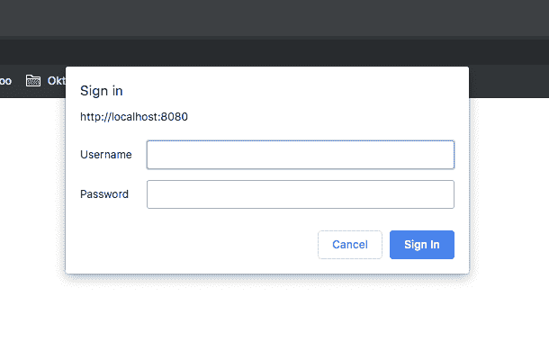](https://res.cloudinary.com/practicaldev/image/fetch/s--E5v5BChb--/c_limit%2Cf_auto%2Cfl_progressive%2Cq_auto%2Cw_880/https://developer.okta.com/assets-jekyll/blog/spring-boot-login-options/basic-auth-01a45591998d89a436198afc40e431f4e0ea3eb7b5a507f3c932f611cad69453.png)

使用`user`和`pass`作为凭证登录。

你将被带到一个成功的屏幕上，上面写着，“这是非常基本的！”

## 配置 Spring Boot 基于表单的登录

使用基本 auth 时，登录表单实际上是由浏览器生成的，而不是由应用程序生成的。它显示为一个非风格的弹出窗口。这不是很好的流程或非常专业的外观。

只需对代码做一些非常小的改动，您就可以让 Spring Boot 自动生成一个看起来更专业的登录表单。完整的代码可以在 GitHub repo 的`form-auth`子目录中找到，或者如果`basic-auth`项目仍然打开，您可以对其进行修改。

你想把`SecurityConfiguration.java`文件的`configure()`方法修改成这样:

```
@Override  
public void configure(HttpSecurity http) throws Exception {  
    http  
        .authorizeRequests()  
        .anyRequest().authenticated()  
        .and()  
        .formLogin()  
        .and()  
        .httpBasic();  
} 
```

唯一不同的是增加了`.and().formLogin()`。除此之外，这两个项目是相同的。

使用`./gradlew bootRun`再次运行。

导航至`http://localhost:8080`(您可能需要打开一个匿名窗口来触发重新认证)。

这次您将看到 Spring 为您生成的登录页面。

[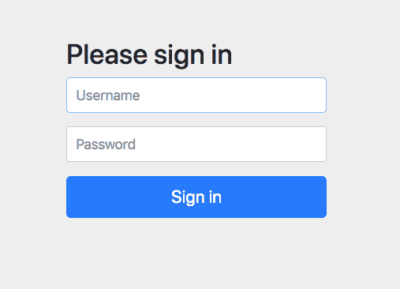](https://res.cloudinary.com/practicaldev/image/fetch/s--6Aw_nDIY--/c_limit%2Cf_auto%2Cfl_progressive%2Cq_auto%2Cw_880/https://developer.okta.com/assets-jekyll/blog/spring-boot-login-options/form-login-3cd57690ea325b0b82c2f3bd2eeba730dbd8e00b9212aaa212fa576c63cac4ee.png)

## 自定义 Spring Boot 登录表单

我们日益复杂的 Spring Boot 身份验证之旅的下一步是定制登录表单。春天让这变得超级简单。然而，与上次相比，有许多新文件和更多代码更改，所以我建议打开 repo 的`custom-form-auth`文件夹下的项目。

在`build.gradle`文件中有一个新的依赖项。这就引入了百里香模板引擎，这是 Spring Boot 使用的默认 web 模板引擎。

```
dependencies {  
    ...
    implementation 'org.springframework.boot:spring-boot-starter-thymeleaf'  
    ... 
} 
```

`SecurityConfiguration.java`文件现在看起来像这样(为了简洁省略了一些部分):

```
package com.okta.springsecurityauth;  

...

@Configuration  
@EnableWebSecurity  
public class SecurityConfiguration extends WebSecurityConfigurerAdapter {  

    @Override  
    public void configure(HttpSecurity http) throws Exception {  
        http  
            .authorizeRequests()  
            .antMatchers( "/public/**").permitAll()  
            .anyRequest().authenticated()  
                .and()  
            .formLogin()  
                .loginPage("/login.html")  
                .failureUrl("/login-error.html")  
                .permitAll();  
    }

    ...

} 
```

注意，`.httpBasic()`不见了，而`.formLogin()`有了一些新的选项。在这里，您要设置一个登录页面和一个登录失败页面，并确保它们是公开可用的。

还要注意这一行:

```
.antMatchers( "/public/**").permitAll() 
```

这里，您使类路径根目录上的`public`目录无需认证即可使用。在`src/main/resources/static`下有一个`public`目录。当应用程序启动时，`src/main/resources/static`目录下的所有内容都被复制到类路径中，因此`public`目录位于类路径的根目录下，其中的所有文件都无需认证即可使用。这对于图像、JavaScript 文件和 CSS 文件来说非常好。

`WebController.java`也有一些新的端点:

```
package com.okta.springsecurityauth;  

...

@Controller  
public class WebController {  

    @RequestMapping("/")  
    @ResponseBody  
    public String index() {  
        return "You made it!";  
    }  

    // Login form 
    @RequestMapping("/login.html")  
    public String login() {  
        return "login.html";  
    }  

    // Login form with error 
    @RequestMapping("/login-error.html")  
    public String loginError(Model model) {  
        model.addAttribute("loginError", true);  
        return "login.html";  
    }  

} 
```

注意，虽然`index()`方法有`@RequestBody`注释，这意味着它将直接以字符串形式返回其请求体，但是`login()`和`loginError()`方法没有。相反，他们返回的是 Spring Boot 将渲染的百里香模板的名称。默认情况下，这些模板位于`src/main/resources/templates`下。另外，请注意`loginError()`有点像路由技巧。它实际上只是返回了`login.html`模板，但是在模型中注入了一个错误属性。

`src/main/resources/templates/login.html`是一个新文件。这是登录模板文件。

```
<!DOCTYPE html>  
<html xmlns:th="http://www.thymeleaf.org">  
<head>  
    Login page  
    <link th:href="@{/public/style.css}" rel="stylesheet" />  
</head>  
<body>  
<div id="container">  
    <h2>Login page</h2>  
    <form th:action="@{/login.html}" method="post">  
        <label for="username">Username</label>  
        <input type="text" id="username" name="username" autofocus="autofocus" />  
        <label for="password">Password</label>  
        <input type="password" id="password" name="password" />  
        <input id="submit" type="submit" value="Log in" />  
    </form>  
    <p th:if="${loginError}" class="error">Wrong user or password</p>  
</div>  
</body>  
</html> 
```

对百里香真正深入的解释已经超出了本教程的范围。如果你喜欢，可以去他们的网站了解一下。

还记得你公开`public`目录的时候吗？这一行引入了一个非常基本的样式表。主要是为了演示在模板文件中包含静态资源的一种方法。

```
<link th:href="@{/public/style.css}" rel="stylesheet" /> 
```

基于模型的`loginError`属性有条件地渲染误差线，该属性由控制器的`loginError()`方法注入。

```
<p th:if="${loginError}" class="error">Wrong user or password</p> 
```

除此之外，这是一个非常简单的登录表单！

再一次，`./gradlew bootRun`运行它。

您将看到样式化的定制登录表单:

[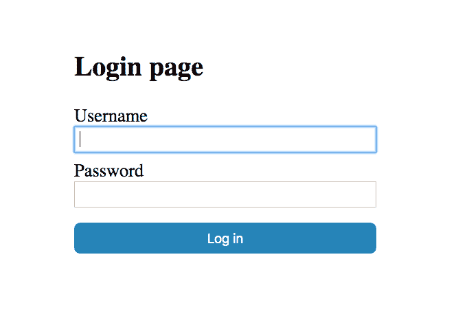](https://res.cloudinary.com/practicaldev/image/fetch/s--WZSdD5-z--/c_limit%2Cf_auto%2Cfl_progressive%2Cq_auto%2Cw_880/https://developer.okta.com/assets-jekyll/blog/spring-boot-login-options/custom-login-form-e63639954be8694c09fb8ddd5c799e86321cab93246c42a323f9fc408e097d84.png)

使用`user:pass`再次登录，你会看到我们的成功屏幕说，“你成功了！”

## Spring Boot OAuth 2.0 登录使用 GitHub 和单点登录

到目前为止，所有的身份验证都是在本地完成的，使用的是临时内存中的`AuthenticationManager`。在生产中更常见的是，应用程序支持 OAuth 2.0 和 OIDC(开放 ID 连接)。OAuth 2.0 是一个开放的授权标准。OIDC 建立在 OAuth 2.0 之上，并增加了身份验证，形成了更完整的身份管理协议。

在本教程中，您将首先看到如何使用 GitHub 添加单点登录(SSO)。之后，您将看到如何使用 Okta，一个软件即服务身份解决方案提供商。

这两种方法都非常简单，而且允许用户重用现有的身份提供者确实有好处。强迫用户为数百个网站处理和管理单独的强密码是徒劳的，最终会导致较弱的密码和跨多个网站重复使用的密码(增加了他们遭受攻击的脆弱性)；更不用说那种陈旧的“随便写在便利贴上，贴在显示器上”的密码管理解决方案了。

## 使用 GitHub 单点登录简化您的 Spring Boot 应用程序登录

现在是实现 GitHub OAuth 2.0 客户端的时候了。

首先，您需要向 GitHub 注册一个新的 OAuth 应用程序。去[他们的网站](https://github.com/settings/applications/new)现在就这么做。如下所示填写值。

请特别注意**授权回调 URL** ，因为这需要是`http://localhost:8080/login/oauth2/code/github`。

[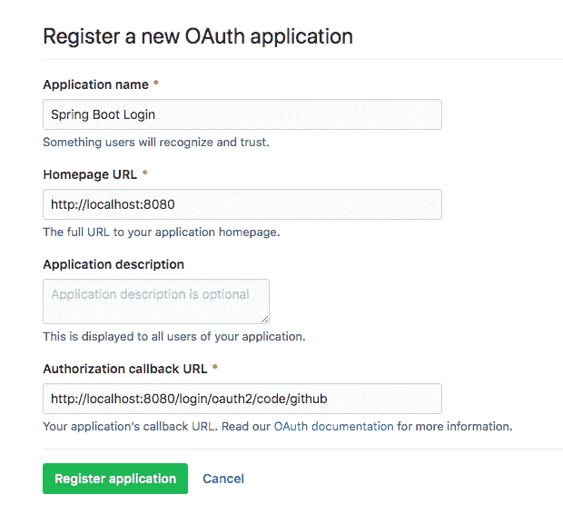](https://res.cloudinary.com/practicaldev/image/fetch/s--Df0183Yt--/c_limit%2Cf_auto%2Cfl_progressive%2Cq_auto%2Cw_880/https://developer.okta.com/assets-jekyll/blog/spring-boot-login-options/github-registration-1367914684b04ac2e0b1a8a8047276ddc7075ad32b784564ff9bc2e03a550fe9.png)

点击**注册应用**。记下**客户 ID** 和**客户秘密**，因为你马上会用到它们。

现在，回到 Java。在您的 IDE 中打开`oauth-start`项目。

在`build.gradle`文件中，注意几个新的依赖项:

```
...
dependencies {  
    implementation 'org.springframework.boot:spring-boot-starter-security'  
    implementation 'org.springframework.boot:spring-boot-starter-thymeleaf'  
    implementation 'org.springframework.boot:spring-boot-starter-web'  
    implementation 'org.springframework.security:spring-security-oauth2-client'  
    implementation 'org.springframework.security:spring-security-oauth2-jose'  
    ...  
} 
```

安全、百里香和网络启动器仍然存在。然而，有两个新的春季首发:`oauth2-client`和`oauth2-jose`。

`oauth2-client`引入实现 OAuth 2.0 客户端所需的库。`oauth2-jose`引入了一些用于签名和加密的公共库。JOSE 代表 Java 对象签名和加密。

已经为 OAuth 登录更新了`SecurityConfiguration.java`文件:

```
package com.okta.spring.SpringBootOAuth;    
...

@Configuration  
public class SecurityConfiguration extends WebSecurityConfigurerAdapter {  
    @Override  
    public void configure(HttpSecurity http) throws Exception {  
        http.antMatcher("/**")  
            .authorizeRequests()  
            .antMatchers("/", "/login**").permitAll()  
            .anyRequest().authenticated()  
            .and()  
            .oauth2Login();  
    }  
} 
```

需要注意两件事:1)所有对`/`和`login`的请求都是公开的，2)`oauth2Login()`方法是导致 Spring Boot 配置 OAuth 2.0 客户端的原因。

如果这看起来*太简单*，你是对的。一些配置已经被移动到`application.yml`文件中。

打开`src/main/resources/application.yml`文件:

```
spring:  
  thymeleaf:  
    cache: false  
  security:  
    oauth2:  
      client:  
        registration:  
          github:  
            client-id: << your GitHub client ID>>  
            client-secret: << your GitHub client secret >> 
```

您需要将上面的**客户 ID** 和**客户秘密**填入该文件。

web 路由和模板也发生了变化。看`WebController.java`文件:

```
package com.okta.spring.SpringBootOAuth;  

...

@Controller  
public class WebController {  

    @RequestMapping("/securedPage")  
    public String securedPage(Model model,  
                              @RegisteredOAuth2AuthorizedClient OAuth2AuthorizedClient authorizedClient,  
                              @AuthenticationPrincipal OAuth2User oauth2User) {  
        model.addAttribute("userName", oauth2User.getName());  
        model.addAttribute("clientName", authorizedClient.getClientRegistration().getClientName());  
        model.addAttribute("userAttributes", oauth2User.getAttributes());  
        return "securedPage";  
    }  

    @RequestMapping("/")  
    public String index() {  
        return "index";  
    }  

} 
```

该控制器定义了两个返回两个模板文件的端点:

*   `/`—>`src/main/resources/templates/index.html`
*   `/securedPage`—>`src/main/resources/templates/securedPage.html`

在`securedPage()`方法中，注意如何使用依赖注入来获得关于认证用户的信息，以便可以将它注入到模型中，然后传递到模板文件。

`src/main/resources/templates/index.html`非常简单:

```
<!DOCTYPE html>  
<html lang="en">  
<head>  
    <meta charset="UTF-8">  
    Home  
</head>  
<body>  
    <h1>Spring Security SSO</h1>  
    <a href="securedPage">Login</a>  
</body>  
</html> 
```

和`src/main/resources/templates/securedPage.html`模板文件:

```
<!DOCTYPE html>  
<html xmlns:th="http://www.thymeleaf.org">  
<head>  
    <meta charset="UTF-8">  
    Secured Page  
</head>  
<body>  
    <h1>Secured Page</h1>  
    <div>User Name: <span th:text="${userName}"></span></div>  
    <div>Client Name: <span th:text="${clientName}"></span></div>  
    <div>User Attributes: <span th:text="${userAttributes}"></span></div>  
</body>  
</html> 
```

现在，您已经准备好尝试它了。同样，确保您在项目根目录中，并运行`./gradlew bootRun`。

导航至`http://localhost:8080`并点击**登录**链接。

如果你的浏览器绕过登录页面直接进入`/securedPage`端点，打开一个匿名浏览器再试一次。

首先，您需要授权 Spring Boot 登录应用程序使用您的 Github 帐户进行 OAuth 登录。

[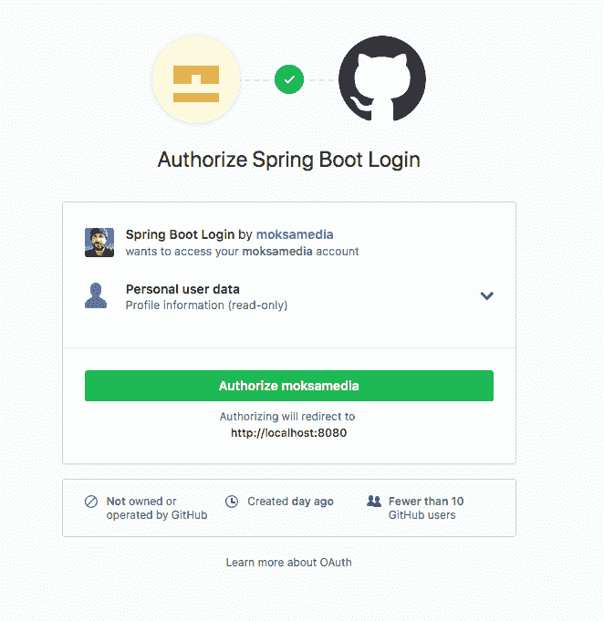](https://res.cloudinary.com/practicaldev/image/fetch/s--mbg6Qe4d--/c_limit%2Cf_auto%2Cfl_progressive%2Cq_auto%2Cw_880/https://developer.okta.com/assets-jekyll/blog/spring-boot-login-options/github-authorize-2223db0f13f73317941ba42215a9f30d63bfb99ae1933a598afd707f02a33eb5.png)

接下来，您将看到 GitHub OAuth 登录屏幕:

[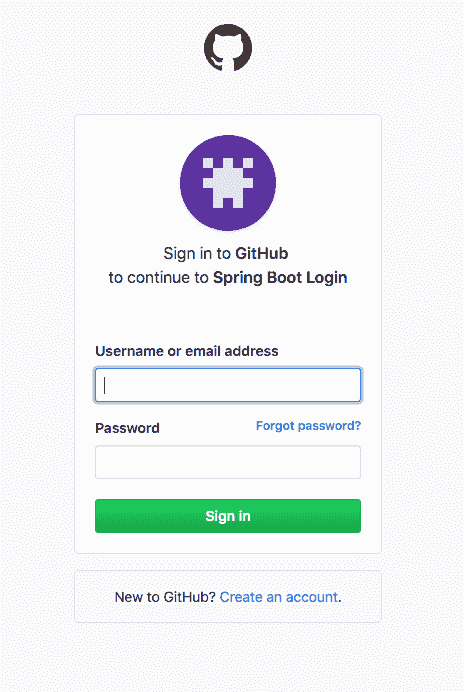](https://res.cloudinary.com/practicaldev/image/fetch/s--5c_cDvuU--/c_limit%2Cf_auto%2Cfl_progressive%2Cq_auto%2Cw_880/https://developer.okta.com/assets-jekyll/blog/spring-boot-login-options/github-login-8e7b96a76940c9643ca4df4425ebf5c97a3e2c45decfed9c66505c4eda71ef36.png)

如果成功，您将看到一个简单的文本页面，上面用粗体字写着“安全页面”,并显示关于您的 OAuth 用户的一些信息。

很可爱，是吧？

现在您将添加第二个 OAuth 提供者:Okta。

## 将 OAuth 2.0 登录 Okta 添加到您的 Spring Boot 应用程序

首先，去 developer.okta.com 注册一个免费的开发者账户，如果你还没有的话。

拥有帐户后，要创建 OAuth/OIDC 应用程序，请打开 Okta 开发者仪表板。点击**应用**顶部菜单项，然后点击**添加应用**。

选择 **Web** 作为平台，点击**下一步**。

给应用程序命名。我把我的命名为“Spring Boot 登录”，但是你可以随意命名你的。

将**登录重定向 URIs** 改为`http://localhost:8080/login/oauth2/code/okta`。

其他默认都没问题。

[](https://res.cloudinary.com/practicaldev/image/fetch/s--PSLwHkAh--/c_limit%2Cf_auto%2Cfl_progressive%2Cq_auto%2Cw_880/https://developer.okta.com/assets-jekyll/blog/spring-boot-login-options/oidc-settings-4b99fd1c1b42725efc05b0ffdc907e11a7005c45e0dc0acc628085807fb5782b.png)

点击**完成**。

记下下一页的**客户端 ID** 和**客户端密码**。

更新 Okta 的`application.yml`文件:

```
spring:  
  ...
  security:  
    oauth2:  
      client:  
        registration:  
          github:  
            client-id: << Your GitHub Client ID >>  
            client-secret: << Your GitHub Client Secret >>  
          okta:  
            client-id: << Your Okta Client ID >>  
            client-secret: << Your Okta Client Secret >> 
            client-name: Okta
        provider:  
          okta:  
            issuer-uri: https://{yourOktaDomain}/oauth2/default 
```

您需要添加 Okta 注册和提供商条目，确保填写您的**客户 ID** 、**客户机密**和 Okta 发行商。

重启 app，进入`http://localhost:8080`，点击**登录**链接。

这一次，您可以选择 OAuth 提供者。这个屏幕是由 Spring Boot 自动生成的。

[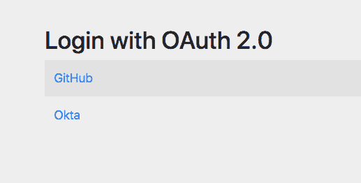](https://res.cloudinary.com/practicaldev/image/fetch/s--HG0d4k1P--/c_limit%2Cf_auto%2Cfl_progressive%2Cq_auto%2Cw_880/https://developer.okta.com/assets-jekyll/blog/spring-boot-login-options/spring-security-oauth-login-3a9c0a1644235b4fd84d2bcf20883f2a775934b98228ce6792e083f2a2cf817c.png)

点击 **Okta** ，你将被带到 Okta 登录页面(通常关于注销和/或匿名的警告适用)。

[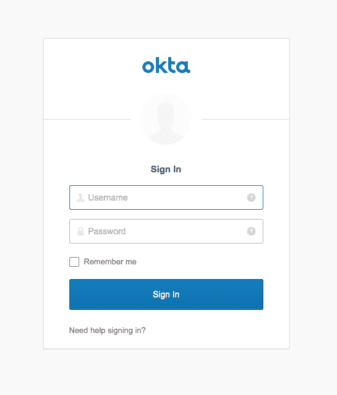](https://res.cloudinary.com/practicaldev/image/fetch/s--MF4E9QBc--/c_limit%2Cf_auto%2Cfl_progressive%2Cq_auto%2Cw_880/https://developer.okta.com/assets-jekyll/blog/spring-boot-login-options/okta-login-277f4b146e564d8745ac974b6fead6e07e93c3d1e24d1cae65f3cea09946f5c3.png)

成功登录，您将看到我们的成功页面。

[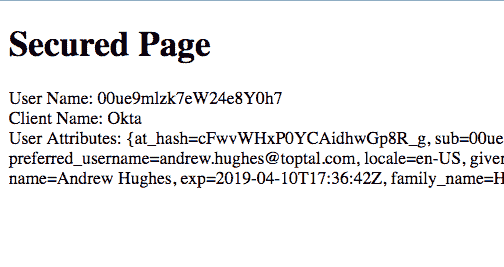](https://res.cloudinary.com/practicaldev/image/fetch/s--2b89etO6--/c_limit%2Cf_auto%2Cfl_progressive%2Cq_auto%2Cw_880/https://developer.okta.com/assets-jekyll/blog/spring-boot-login-options/secured-page-success-fc0bcb05228c1ccc87956dcf5a7906ce6a9e890a62c070ee41b110d1f2391157.png)

至此，您已经用`oauth-github-okta`项目文件夹更新了`oauth-start`项目，并且您已经看到了向一个 Spring Boot 应用程序添加多个 OAuth 提供者是多么容易。

## 使用 Okta 的 Spring Boot 启动器简化 OAuth 2.0 登录

在本教程中，您要做的最后一件事是配置 Okta 以允许新用户注册。不过，在此之前，我想先给你介绍一下秋田犬 Spring Boot 开胃菜。该项目简化了 Spring Boot 和俄克拉荷马州的整合。该项目的自述文件是获取更多深入信息的绝佳来源。

您将把 Okta Spring Boot 启动器集成到这个项目中，并稍微简化一下配置。为了简单起见，您还将删除 GitHub OAuth 集成。

向`build.gradle`文件添加一个依赖项:

```
dependencies {
    ...
    implementation 'com.okta.spring:okta-spring-boot-starter:1.1.0'
    ...
} 
```

现在更新`application.yml`文件:

```
okta:  
  oauth2:  
    issuer: https://{yourOktaDomain}/oauth2/default  
    client-id: <<yourOktaClientID>>
    client-secret: <<yourOktaClientSecret>> 
spring:  
  thymeleaf:  
    cache: false 
```

填写您的**客户密码**和**客户 ID** 。

试试看。运行`./gradlew bootRun`。

你应该可以通过 Okta 登陆。这一次，您将无法选择 OAuth 2.0 提供者。

## 启用用户注册

登录您的[developer.okta.com](https://developer.okta.com)账户。

将鼠标悬停在**用户**上，点击**注册**。

[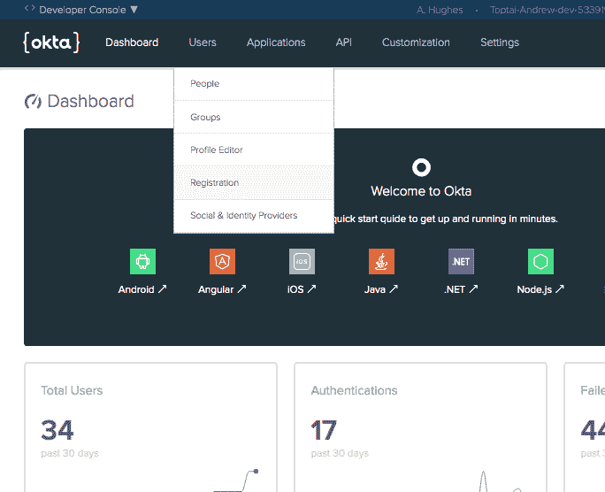](https://res.cloudinary.com/practicaldev/image/fetch/s--_xOUJgY0--/c_limit%2Cf_auto%2Cfl_progressive%2Cq_auto%2Cw_880/https://developer.okta.com/assets-jekyll/blog/spring-boot-login-options/user-registration-6d44bd53e7d69b1f730ec308cfdc6cf1d96413c62804eb7e368e4952fc50b5d4.png)

启用注册。另外，在登录页面中启用**显示“注册”链接…** 选项。这将导致注册链接显示在托管登录页面中。

[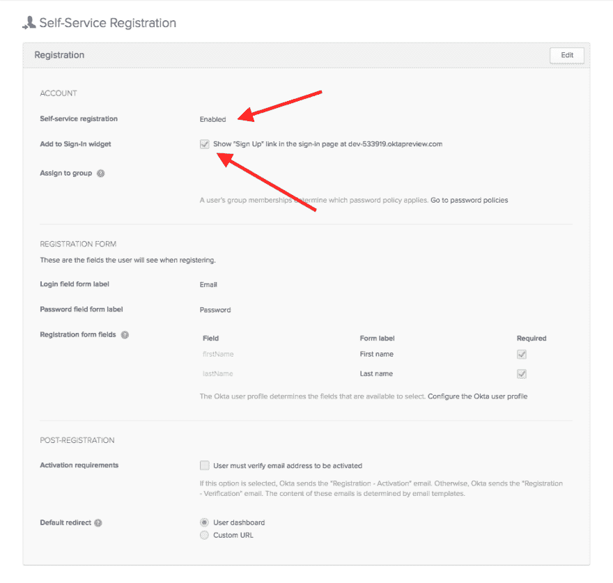](https://res.cloudinary.com/practicaldev/image/fetch/s--HXbkatWL--/c_limit%2Cf_auto%2Cfl_progressive%2Cq_auto%2Cw_880/https://developer.okta.com/assets-jekyll/blog/spring-boot-login-options/enable-registration-46d515a4c7b1bdb30f1d326bb682343808eb4bfc5b1dd0703771ade39bebddcd.png)

使用匿名窗口再次登录。这一次，您会注意到用户可以选择注册为新用户。

[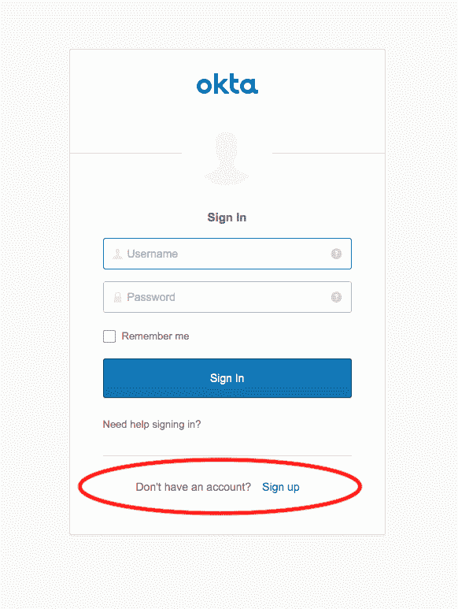](https://res.cloudinary.com/practicaldev/image/fetch/s--SfqNEtLJ--/c_limit%2Cf_auto%2Cfl_progressive%2Cq_auto%2Cw_880/https://developer.okta.com/assets-jekyll/blog/spring-boot-login-options/okta-login-with-signup-c94e5359b1a5dcc810f5018735f7171b74f17245db94c2e596dc97421ade44cb.png)

输入您的电子邮件地址、密码和姓名。设置几个安全问题，就大功告成了！您使用 Okta 为您的应用程序注册了一个新用户。

通过 Okta 的自助注册选项，您可以做更多的事情。所有这些都可以配置和定制。看一看他们的文件以深入了解。

使用 Okta Spring Boot 启动器并移除 GitHub OAuth 的最终产品可以在`oauth-okta-starter`目录中找到。

## 了解有关 Spring Boot 登录选项和安全认证的更多信息

您在本教程中涉及了大量的领域。您使用基本身份验证、基于表单的身份验证和定制的基于表单的身份验证实现了一个 Spring Boot 应用程序。然后，您使用 OAuth 2.0 和 OIDC 来实现使用 GitHub 和 Okta 的 SSO。最后，您了解了如何使用 Okta Spring Boot 启动器来简化 Spring Boot 的 OAuth/OIDC SSO 配置，以及如何允许用户自助注册 Okta。

你可以在 GitHub 上找到本教程[中例子的所有代码。](https://github.com/oktadeveloper/okta-spring-boot-login-options-example)

为了更深入地创建定制的登录表单，请看一下关于这个主题的 Spring 文档。

Spring Security 的 [oauth2login 示例](https://github.com/spring-projects/spring-security/tree/master/samples/boot/oauth2login)也有一些很棒的信息和更多的例子。

以下是一些相关的博文，展示了如何使用 Spring Boot 和 Spring Security 进行登录和认证:

*   【Java 应用的简单令牌认证
*   [用 Spring Boot 和 Spring Security 在 15 分钟内构建一个 Web 应用](https://developer.okta.com/blog/2018/09/26/build-a-spring-boot-webapp)
*   [创建一个安全的 Spring REST API](https://developer.okta.com/blog/2018/12/18/secure-spring-rest-api)
*   [用 Spring Boot 和 Vue.js 构建一个简单的 CRUD 应用](https://developer.okta.com/blog/2018/11/20/build-crud-spring-and-vue)

如果你喜欢这篇文章，请在社交媒体{ [Twitter](https://twitter.com/oktadev) 、[脸书](https://www.facebook.com/oktadevelopers)、 [LinkedIn](https://www.linkedin.com/company/oktadev/) 、 [YouTube](https://www.youtube.com/channel/UC5AMiWqFVFxF1q9Ya1FuZ_Q) 上关注我们，了解我们何时发布过类似的文章。