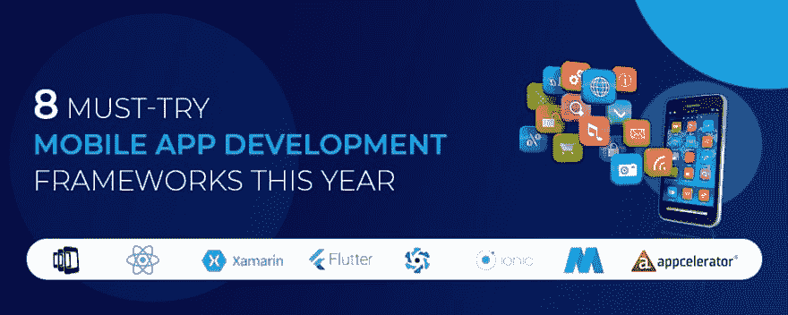

# 今年必须尝试的 8 个移动应用开发框架

> 原文：<https://dev.to/edword12/8-must-try-mobile-app-development-frameworks-this-year-5deg>

如今，移动应用需求巨大，这都要归功于手机用户数量的不断增长，正因为如此，移动应用开发框架被越来越多的 IT 服务公司所使用。

这还没有结束，多年来，移动行业已经看到 iOS 和 Android 操作系统的编程语言数量有了相当大的增长。

因此，让我们来看看一些最流行的移动应用程序开发框架，它们将成为今年及以后开发人员的主要工具。

## PhoneGap

由 Apache Cordova 开发的 Adobe PhoneGap 是目前市场上最流行的跨平台框架之一。它基本上是一个开源框架，这意味着您可以重用现有的 web 开发技能来制作混合应用程序。这些应用程序都是用一个代码库构建的，这样你就可以在任何设备上接触到你的受众。

## 反应自然

React Native 是市场上另一个流行的跨平台框架，由社交媒体巨头脸书在 2013 年推出。它还是一个开源框架，为 ide 和其他移动应用程序开发工具提供了充分的支持。它使用与常规 iOS 和 Android 应用程序相同的基本 UI 构建模块，以便于操作。

## Xamarin

Xamarin 是一个 Android 应用程序开发框架，让您可以更快地构建移动应用程序。Xamarin 非常受欢迎，在全球范围内有超过 150 万人使用它。它非常适合在没有 Java 支持的情况下开发 android 应用。此外，它还为开发其他移动操作系统的原生应用程序提供了一套完整的 C#代码库。

## 摆动

Flutter 是谷歌支持的另一个强大的移动应用开发框架。除了帮助您构建原生 iOS 和 Android 应用程序，它还允许您使用 Google 自己的编程语言 Dart 开发这些应用程序。现在，特别有趣的是，为了呈现应用程序，您也不需要 WebView 或其他本机 UI 组件。

## 类星体

Quasar 于 2016 年进入市场，并一炮走红。它使开发人员能够一次性编写代码，并使用单一代码库同时将其部署为桌面(使用 Electron)、移动应用(Android、iOS)和网站(SSR、PWA、SPA)。此外，它提供 HTML/CSS/JS 缩小、源映射、缓存破坏、林挺代码、代码分割和 ES6 传输，同时保持较小的性能开销。

## 离子的

Ionic 是另一个开源框架，它能够构建令人惊叹的本地应用。它广受欢迎，因为它提供了使用 CSS、HTML5 和 Sass 等技术开发混合移动应用程序的工具和服务。此外，它支持从社区插件到高级支持的集成。

## 移动角度用户界面

这个框架负责简单方便的开发。它有助于用 Angular JS 和 Bootstrap 构建 HTML 5 移动应用程序，此外还包含一些易于学习的指令。它基本上是 Bootstrap 扩展的一个扩展，包含某些移动组件，如开关、侧栏、覆盖、可滚动区等。

## 加速钛

Titanium 是一个跨平台框架，完全支持 iOS 和 Android，但不包括 CSS 和 HTML。它更像是 native 和 javascript 的结合，有助于提高移动混合开发的性能。另一个值得注意的方面是，它配备了许多移动平台 API 和云服务，可用作应用后端。

# 结束行:

如果你开始寻找，你可能会发现市场上有大量的 [**移动应用开发**](https://www.clapcreative.com/services/los-angeles-mobile-app-development/?utm_source=dev) 框架，值得你在下一个应用开发项目中考虑。我所提供的是正在讨论的一些最突出的例子。