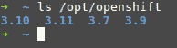
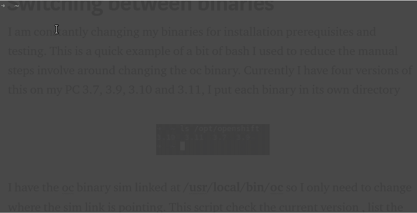

# 在二进制文件之间切换

> 原文：<https://dev.to/austincunningham/switching-between-binaries-3i9j>

我不断地为安装先决条件和测试更改我的二进制文件。我过去常常花一点时间改变路径或更新**。bashrc** 。这是我用来减少改变 oc 二进制文件(Openshift 命令行二进制文件)的手工步骤的一个简单例子。目前我的电脑上有四个版本的 oc 二进制文件，分别是 3.7、3.9、3.10 和 3.11，我将每个二进制文件放在各自的目录中，分别位于 **/opt/openshift**

[](https://res.cloudinary.com/practicaldev/image/fetch/s--aLTkbbhz--/c_limit%2Cf_auto%2Cfl_progressive%2Cq_auto%2Cw_880/https://cdn-images-1.medium.com/max/800/1%2AzXG7mgEcd2CCmpWXBu6GOg.png%3Fstyle%3Dcenterme)

我在 **/usr/local/bin/oc** 有 oc 二进制[符号链接](https://www.shellhacks.com/symlink-create-symbolic-link-linux/)，所以我只需要改变符号链接指向的地方。该脚本检查当前版本的符号链接，列出 PC 上的版本，询问您希望安装什么版本，删除现有的符号链接并添加一个新的。

```
#!/bin/bash
echo "########################################################################################"
echo Current version of oc
ls -la /usr/local/bin/oc
echo "########################################################################################"
echo Versions of openshift oc on the system
ls /opt/openshift
echo "########################################################################################"
echo "What version do you wish to install ?"
read version
sudo rm /usr/local/bin/oc
sudo ln -s /opt/openshift/$version/oc /usr/local/bin/oc
echo " "
echo "########################################################################################"
oc version
echo " "
echo "########################################################################################" 
```

Enter fullscreen mode Exit fullscreen mode

一旦你写好了你的脚本，你就可以通过改变 Linux 权限来使它可执行

```
chmod u+x change_oc.sh 
```

Enter fullscreen mode Exit fullscreen mode

然后可以运行

```
./change_oc.sh 
```

Enter fullscreen mode Exit fullscreen mode

运行它看起来像这样

[](https://res.cloudinary.com/practicaldev/image/fetch/s--luhbTvDc--/c_limit%2Cf_auto%2Cfl_progressive%2Cq_66%2Cw_880/https://cdn-images-1.medium.com/max/800/1%2AjC7XC2re8v9JXIqRvtn_Lw.gif%3Fstyle%3Dcenterme)

[我的博客](https://austincunningham.ddns.net)