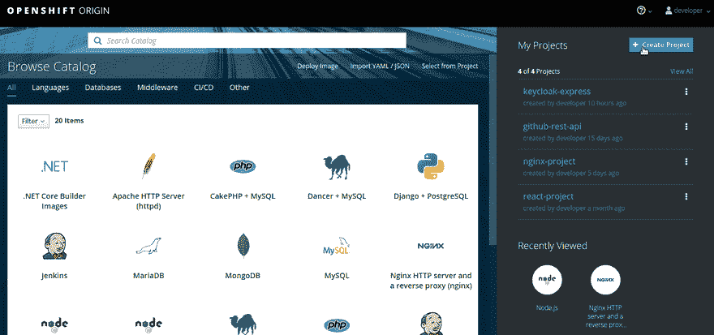
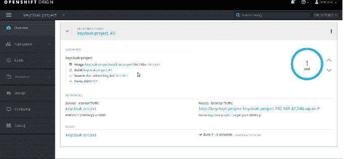
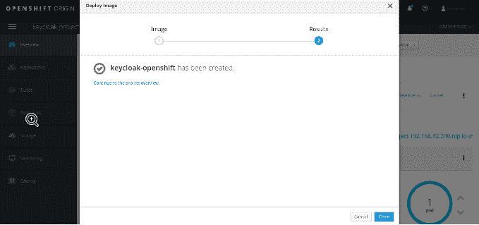
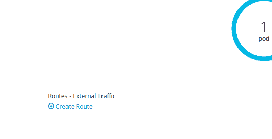
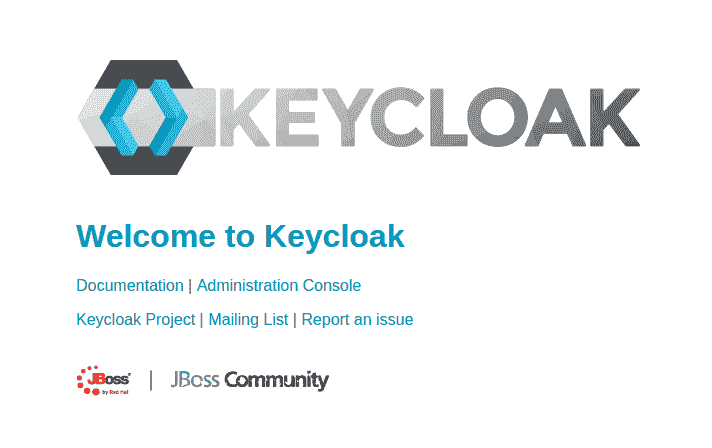
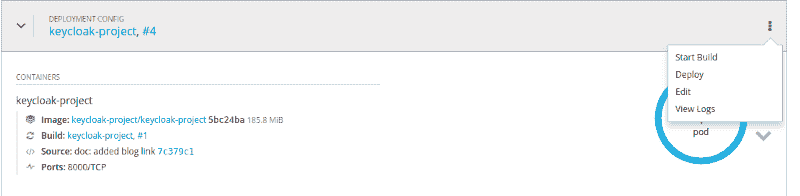
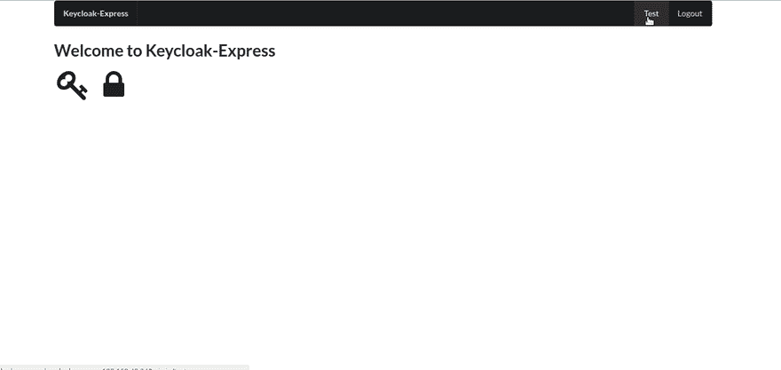

# Openshift、Node 和 Keycloak

> 原文：<https://dev.to/austincunningham/openshift-node-and-keycloak-2lan>

## 节点 Express.js

使用 [keycloak-connect](https://www.npmjs.com/package/keycloak-connect) 中间件，您可以使用 keycloak 保护您的端点。我会在这里详细介绍[。以下是在快速项目中安装 keycloak-connect 的基本步骤。](https://codeburst.io/keycloak-and-express-7c71693d507a) 

```
 'use strict';

const Keycloak = require('keycloak-connect');
const express = require('express');
const session = require('express-session');
const expressHbs = require('express-handlebars');

const app = express();

// Register 'handelbars' extension with The Mustache Express
app.engine('hbs', expressHbs({extname:'hbs',
  defaultLayout:'layout.hbs',
  relativeTo: __dirname}));
app.set('view engine', 'hbs');

var memoryStore = new session.MemoryStore();
var keycloak = new Keycloak({ store: memoryStore });

//session
app.use(session({
  secret:'thisShouldBeLongAndSecret',
  resave: false,
  saveUninitialized: true,
  store: memoryStore
}));

app.use(keycloak.middleware());

//route protected with Keycloak
app.get('/test', keycloak.protect(), function(req, res){
  res.render('test', {title:'Test of the test'});
});

//unprotected route
app.get('/',function(req,res){
  res.render('index');
});

app.use( keycloak.middleware( { logout: '/'} ));

app.listen(8000, function () {
  console.log('Listening at http://localhost:8000');
});
view raw 
```

Enter fullscreen mode Exit fullscreen mode

我在 package.json 中添加了一个启动脚本

```
"scripts":  {  "start":  "node app.js"  } 
```

Enter fullscreen mode Exit fullscreen mode

然后将更改推送到远程 git repo。我现在可以将它从 git 部署到 Openshift。点击 Openshift 中的新项目，浏览目录并选择节点，指向您的 git repo。

[](https://res.cloudinary.com/practicaldev/image/fetch/s--QMXx2t8T--/c_limit%2Cf_auto%2Cfl_progressive%2Cq_66%2Cw_880/https://cdn-images-1.medium.com/max/800/1%2A0rLa_RLZastlbJVNctGHRA.gif%3Fstyle%3Dcenterme)

项目已部署，但 Openshifts 的默认端口是 8080，因为 expresss 服务器是在 8000 上服务的，我们需要对此进行更改以获得要解析的路由。我们需要编辑部署配置、服务和路由来改变这一点。

[](https://res.cloudinary.com/practicaldev/image/fetch/s--l9eyObWJ--/c_limit%2Cf_auto%2Cfl_progressive%2Cq_66%2Cw_880/https://thepracticaldev.s3.amazonaws.com/i/nzooewok4hhd24zyvgrn.gif)

现在，您应该能够单击该链接，问题应该会得到解决。还有一件事，我们需要做这个应用程序，但这是在我们得到了 Keycloak 服务器启动和运行。

## 钥匙锁

这里有一个设计用于 Openshift 的 Keycloak 容器，我将用它来部署 Keycloak。点击 Add to project 并部署映像，将 **jboss/keycloak-openshift** 添加到映像名称中，并为管理员用户名 **(KEYCLOAK_USER)** 和密码 **(KEYCLOAK_PASSWORD)** 添加两个环境变量。

[](https://res.cloudinary.com/practicaldev/image/fetch/s--G7LMNYqL--/c_limit%2Cf_auto%2Cfl_progressive%2Cq_66%2Cw_880/https://cdn-images-1.medium.com/max/800/1%2ANKxp306KPkzt-toY5p7O0Q.gif%3Fstyle%3Dcenterme)
[T6】](https://res.cloudinary.com/practicaldev/image/fetch/s--J-BluahN--/c_limit%2Cf_auto%2Cfl_progressive%2Cq_66%2Cw_880/https://thepracticaldev.s3.amazonaws.com/i/kf5a8d0eiu64ts8r8dj7.gif)

构建完成后，您将看到没有设置任何路由。只需点击创建路线，除了默认的。

[](https://res.cloudinary.com/practicaldev/image/fetch/s--3CaTPPMm--/c_limit%2Cf_auto%2Cfl_progressive%2Cq_auto%2Cw_880/https://cdn-images-1.medium.com/max/800/1%2Abc46J2ME7vC416Hq15KGoQ.png%3Fstyle%3Dcenterme)

一旦创建了路线，你就可以点击它并进入钥匙锁登陆页面

[](https://res.cloudinary.com/practicaldev/image/fetch/s--3SFJx212--/c_limit%2Cf_auto%2Cfl_progressive%2Cq_auto%2Cw_880/https://cdn-images-1.medium.com/max/800/1%2A5FxEC4vIM9tgQicGTH9m9g.png%3Fstyle%3Dcenterme)

点击**管理控制台**，可以使用管理员用户名(KEYCLOAK_USER)和密码(KEYCLOAK_PASSWORD)登录。这就是你的 Keycloak 服务器在 Openshift 上运行的全部内容。

## 将 Express 服务器连接到 Keycloak

在 Keycloak 服务器上，我们需要创建一个领域并在领域中创建一个客户端，为客户端设置有效的重定向 url，即在 Openshift 上将它指向我们的 express 服务器，在领域中创建一个用户并设置其密码，并将 keycloak.json 文件下载到我们的 express 应用程序的根目录。我会在这里详细介绍这一点[。这是一个快速概述。](https://dev.to/austincunningham/keycloak-and-express-1cdd)

[](https://res.cloudinary.com/practicaldev/image/fetch/s--U1iTl-CD--/c_limit%2Cf_auto%2Cfl_progressive%2Cq_66%2Cw_880/https://cdn-images-1.medium.com/max/800/1%2AIwAwtkr-7yty5fsDPEv_mg.gif)

在 express server 项目调用 keycloak.json 的路径中创建一个文件，其中包含下载的内容，例如

```
{  "realm":  "express",  "auth-server-url":  "http://keycloak-openshift-keycloak-project.192.168.42.240.nip.io/auth",  "ssl-required":  "external",  "resource":  "express",  "public-client":  true,  "confidential-port":  0  } 
```

Enter fullscreen mode Exit fullscreen mode

提交更改并推送到您的远程存储库。然后触发 express Pod 的构建，从 git 中提取更改并部署它们。

[](https://res.cloudinary.com/practicaldev/image/fetch/s--MwfH0ZMv--/c_limit%2Cf_auto%2Cfl_progressive%2Cq_auto%2Cw_880/https://cdn-images-1.medium.com/max/800/1%2ASQI99Eh4JMX52as8LmZ7gQ.png%3Fstyle%3Dcenterme)

好了，现在一切都正常了。

[](https://res.cloudinary.com/practicaldev/image/fetch/s--txh0MjXb--/c_limit%2Cf_auto%2Cfl_progressive%2Cq_66%2Cw_880/https://cdn-images-1.medium.com/max/800/1%2ARo_szAuoWA3V6KkDECZMcg.gif%3Fstyle%3Dcenterme)

[我的博客](https://austincunningham.ddns.net)