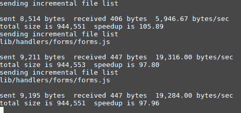

# 从节点应用程序向 Openshift 推送热代码

> 原文：<https://dev.to/austincunningham/hot-code-pushes-to-openshift-from-a-node-app-34p7>

如何将您的本地开发迁移到 Openshift？这里有几种方法可以将您的本地代码更改推送到 Openshift。

## 1。创建开发映像并与 oc RSYNC 同步

为你的节点应用程序创建一个 docker 容器。如果进行了任何更改，我们需要节点应用程序重新启动，而不是终止 pod，因为新的 pod 不会有我们的更改。使用 forever 在 pod 中将节点程序作为服务运行，其中 app.js 是应用程序的起点。删除 CMD [ "npm "，" start "]，并将以下内容添加到 docker 文件中。

```
## Installing forever in app dir
RUN npm install -g forever
## ignore node_modules
RUN echo "node_modules" >> .foreverignore
## start app.js with forever watching for file changes the directory
CMD ["forever","-w","--watchDirectory=/opt/app-root/src","app.js"] 
```

Enter fullscreen mode Exit fullscreen mode

**注意**:你可以用一个叫做 nodemon 的包做类似的事情

禁用活动和就绪检查，这样当您的应用程序重新启动时，您的 pod 不会重新启动。

```
oc login https://openshift-cluster-url
oc project your-project-name
oc set probe dc your-app-name --liveness --readiness --remove=true 
```

Enter fullscreen mode Exit fullscreen mode

建立你的形象，并把它推到 dockerhub

```
docker build -t docker.io/docker-user-name/appName:tagName -f Dockerfile .
docker push dockerhub-user-name/appName:tagName 
```

Enter fullscreen mode Exit fullscreen mode

将 Openshift 上的图像更改为指向您的新开发图像，然后单击 save。

[](https://res.cloudinary.com/practicaldev/image/fetch/s--lzWCF7Ax--/c_limit%2Cf_auto%2Cfl_progressive%2Cq_66%2Cw_880/https://cdn-images-1.medium.com/max/800/1%2Aqar2WY5lLwjw5BB2SeDCxQ.gif%3Fstyle%3Dcenterme)

就这样，现在您已经部署了一个映像，它将在代码库发生变化时重新启动。

### [T1】RSYNC](#rsync)

oc 二进制文件包含一个 rsync(远程同步)命令，其功能与传统的 rsync 命令非常相似。

```
rsync options source destination 
```

Enter fullscreen mode Exit fullscreen mode

所以你怎么用这个。首先你需要两条信息来源和目的地。

1.  转到项目的根目录。
2.  确定代码库的(源)目录。这可能是根目录。/或者在某些节点应用程序中通常是。/lib 或。/src 目录
3.  登录到您的 Openshift 集群并切换到您的项目

```
oc login https://openshift-cluster-url
oc project your-project-name 
```

Enter fullscreen mode Exit fullscreen mode

1.  在 Openshift(目的地)中获取您的应用程序 pod 名称。使用以下命令，其中 appName 是您的应用程序名称。返回的结果将是 pod 名称

```
oc get po | grep appName | grep Running | awk '{print $1}'
run oc rsync 
```

Enter fullscreen mode Exit fullscreen mode

**注意**:在选项上，我们不想在 Openshift 上改变文件的权限，我们使用 no-prems 标志，watch 标志运行 rsync 持续监视变化

```
oc rsync --watch --no-perms=true ./source pod-name:/opt/app-root/src 
```

Enter fullscreen mode Exit fullscreen mode

**注意**:路径:/opt/app-root/src 不会改变，这是 pod 中代码的默认位置
你会看到类似

[](https://res.cloudinary.com/practicaldev/image/fetch/s--KIFf5j6H--/c_limit%2Cf_auto%2Cfl_progressive%2Cq_auto%2Cw_880/https://cdn-images-1.medium.com/max/800/1%2A6tPkFjzzYPV1erUkgWe0pA.png%3Fstyle%3Dcenterme)

检查您的 pod 是否已更新，方法是转到 pod 终端，并打开 cd 到/opt/app-root/src，然后打开您已更改的文件，查看您的更改是否已生效。你还会在日志中看到应用程序重启。

```
error: restarting script because change changed
error: Forever detected script was killed by signal: SIGKILL
error: Script restart attempt #1 
```

Enter fullscreen mode Exit fullscreen mode

[](https://res.cloudinary.com/practicaldev/image/fetch/s--1B2o1DMw--/c_limit%2Cf_auto%2Cfl_progressive%2Cq_auto%2Cw_880/https://cdn-images-1.medium.com/max/800/1%2ArrTjLh0qVh9DllyNXds67Q.jpeg%3Fstyle%3Dcenterme)

## 2。从本地目录开始构建

如果您已经在 Openshift 上部署了一个项目，那么您可以使用 **from-dir** 标志目录直接从您的本地目录开始构建。

```
oc login https://openshift-cluster-url
oc project your-project-name
oc start-build app-name-on-openshift --from-dir=. --wait 
```

Enter fullscreen mode Exit fullscreen mode

这将从您最后一次 git 提交创建一个本地容器映像，并在 Openshift 上启动一个构建，这将在 Openshift 上关闭当前运行的 pod 并启动一个新的。

oc start-build 命令需要注意的一点是，它每次运行时都会生成一个新的 docker 容器，其中包含所有本地磁盘空间开销。因此，管理本地映像可能是一个问题。但它确实证实了与 rsync 不同的是，Openshift 将会有所改变。

[我的博客](https://austincunningham.ddns.net)