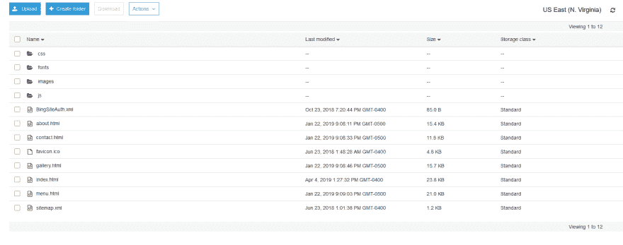
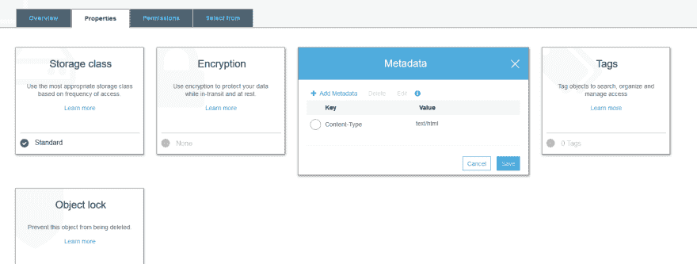
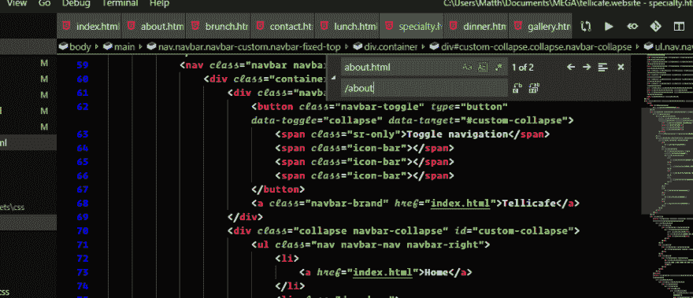
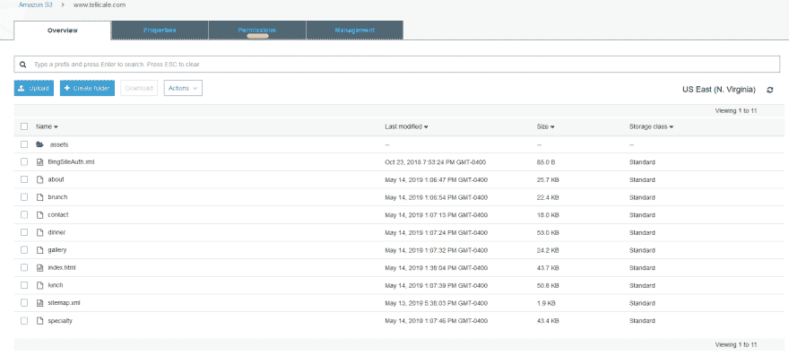
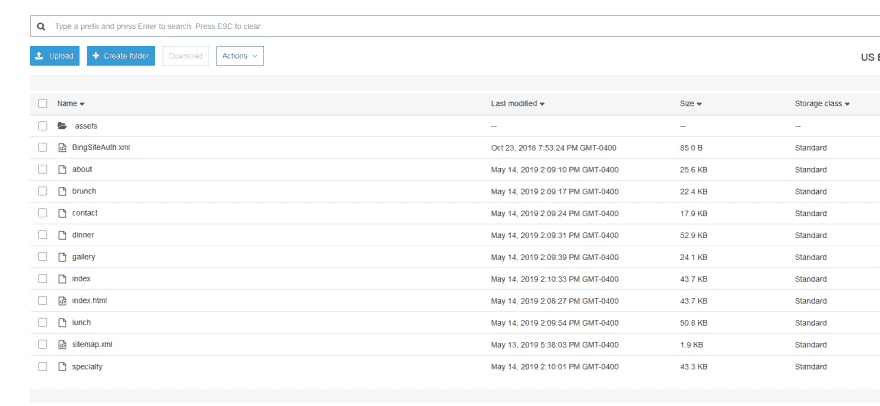
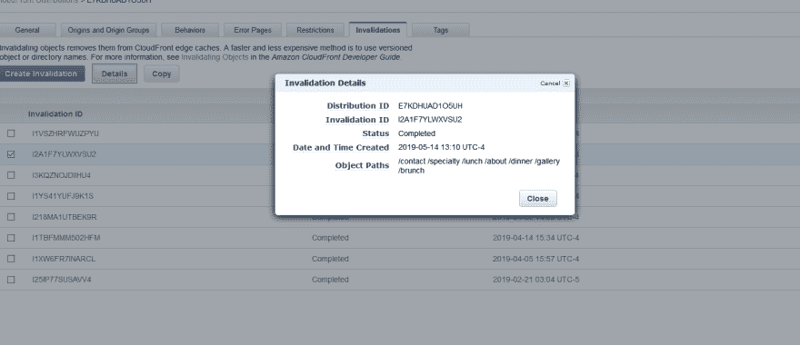

# AWS s3 的漂亮网址

> 原文：<https://dev.to/ciphercoder/pretty-url-s-with-aws-s3-2eme>

# 让你的网址在亚马逊 S3 上变得漂亮

我在[亚马逊 s3 静态网站托管](https://aws.amazon.com/s3/)上托管多个网站。他们以极其合理的价格提供了很好的产品。他们甚至提供了一个[免费层](https://aws.amazon.com/free/)，尽管有一些要求。绝对值得一探究竟。有一个像样的学习曲线，但也不是不可能。作为一个新手，通过大量的搜索和阅读他们的文档，我就能弄明白这一点。

我用他们所有的服务建立了我的第一对夫妇的网站，除了域名，我是从 [Namecheap](https://www.namecheap.com/) 得到的。我用了他们的 S3 水桶，云锋，和 53 号公路。设置好我的网站后，我注意到的一个问题是网站的 URL 有。html 在最后。一旦我的域名建立，主页是唯一没有的网页。html 在最后。我想摆脱它，所以我开始着手一项任务。

我开始搜索他们的文档，这些文档非常庞大，对‘漂亮的 URL’这几个字真的没有反应，所以我用我的搜索引擎找到了一些关于如何做到这一点的 Stack Overflow 的摘录，但不是真正的深入解释。现在，我正在尝试清理的网站都是商业网站，在我尝试清理的时候，我不想让它们关闭。我能够把不同摘录中的一些共同点拼凑起来，并弄清楚。但是因为我在做的时候很困惑，所以我想我会把这个放在一起给其他人看。

我要从一个已经建立的网站开始。如果你想知道如何建立这个网站，请参考迈克·塔博尔的这篇文章，我认为它是最有帮助的。

一旦你的站点设置好了，你就有了一个包含所有文件的列表。当您最初设置它时，您必须选择一个“索引文档”，我将其设置为“index.html”。这一点不会改变。我的网站结构如下:

你可以看到所有的文件都有。html 在他们的名字后面。我的“索引文件”是`index.html`,我也是这样离开的。我做的第一件事是浏览所有其他页面，在它们的“属性”标签下，并确认元数据将它们列为“文本/html”。如果没有，您需要设置它:

确认了这一点后，我不得不去看代码。我做这个的网站有八页，我不得不乏味地浏览每一页，把每一个“href”都改成`<a href="/gallery">Gallery</a>`。html，而不是原来的`<a href="/gallery.html">Gallery</a>`。我在 VS 代码中使用了“查找和替换”工具:

我在每一页、每一个链接上都这样做，直到我的网站上的所有链接、任何内部导航都被设置为`<a href="/gallery">Gallery</a>`而不是原来的方式。如果您试图在浏览器中预览网站而不将其托管在 AWS 上，这将会破坏导航。所以请记住，如果你正在更新网站或工作，并在浏览器中预览它。你必须单独预览每一页，而不是点击导航。

然后，您将不得不重新上传您更改过的所有页面。一旦你上传了所有东西，它看起来就会和原来一样。现在，在亚马逊上，在你网站的桶中，浏览所有的页面并“重命名”页面，去掉“重命名”。“html”。它现在应该看起来像这样:

完成后，我注意到在内部导航中，当你从另一个页面点击回到主页时，它会显示为[www.mysite.com/index.html](http://www.mysite.com/index.html)。为了解决这个问题，我上传了一个复制的 index.html 页面，并将名称改为“索引”，这样现在它将在内部导航到 www.mysite.com/index 的。请注意，当您上传第二个索引页面时，请确保在上传之前将其重命名为“index1.html”或其他名称，否则它将替换您的存储桶中已有的“index.html”页面。上传后，将“index1.html”重命名为“index”。它现在应该是这样的:

* ***编辑*** *
过了一会儿，我收到通知说我有重复的页面。所以这个关于`index.html`页面的把戏没有起作用。所以我改变了策略，我所做的就是去掉那个`index.html`，回到代码中，我改变了所有去 index.html 页面的链接，到实际的网站`https://example.com`，并把它作为外部链接。其他的一切，我都保持不变，而且一切都无缝运行。

一旦完成，你就进入了最后阶段。如果您让它保持原样，根据您的缓存设置或托管方式，它最终会正常工作。我的网站是用亚马逊的默认缓存策略设置的，所以它只会每 24 小时检查一次。由于这是一个商业网站，我必须看看这是否能马上工作。我继续为我更改的每个页面创建一个无效，这样我就可以知道我所做的是否破坏了网站，或者是否正常工作。为此，请转到 CloudFront，选择正确的发行版，然后在顶部选择标签为“Invalidations”的选项卡。点击蓝色按钮“创建无效”并填写您更改的所有页面。

一旦这个过程使所有的页面失效，导航到你的站点并检查它。记得清空你的浏览器缓存，这样如果你最近看了这个网站，它就不会从缓存中给你一个过时的拷贝。

我希望这有所帮助。