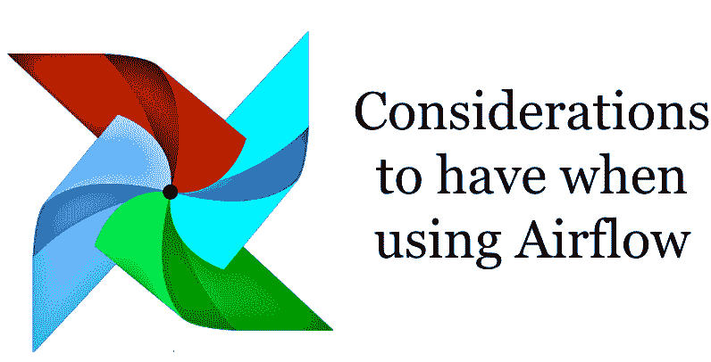
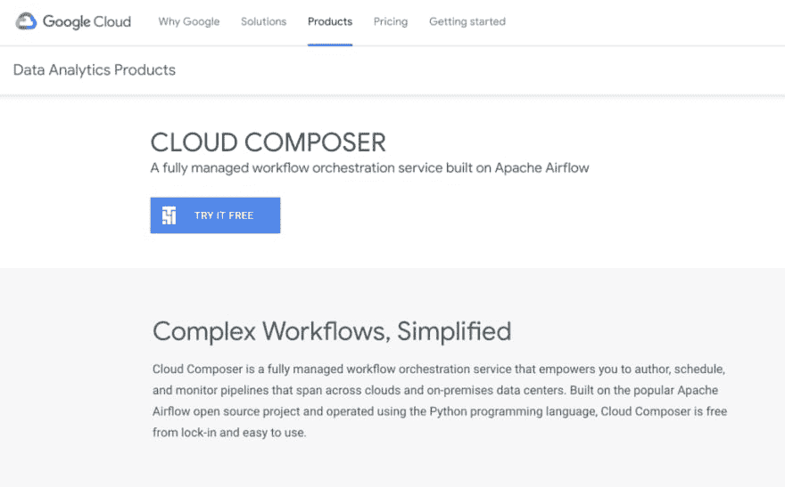
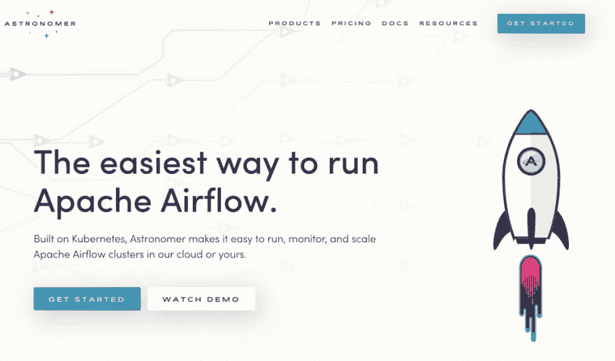
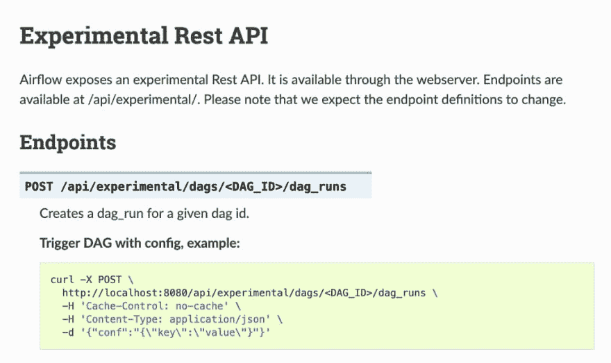

# 使用气流时需要考虑的 5 个因素

> 原文：<https://dev.to/julienkervizic/5-considerations-to-have-when-using-airflow-5ea5>

### 使用气流时要注意的 5 点

在之前的帖子中，我已经解释了气流的基础知识以及如何在 azure 上设置 T2 气流，但是我还没有解释在使用气流时我们应该考虑什么。

我认为使用气流时有 5 个主要考虑因素:

*   设置什么类型的**基础设施**来支持它
*   遵守什么类型的**操作符**模型，选择哪些操作符
*   如何构建不同的**Dag**并设置任务
*   是否利用**模板化的**代码
*   是否以及如何使用它的 **REST API**

这些考虑将决定你和你的团队将如何使用气流以及如何管理气流。

### (1)气流基础设施—尽可能采用托管服务

设置和维护气流并不容易，如果您需要设置气流，您很可能需要比基本图像更多的东西:

*   需要设置加密来安全地存储机密和凭证
*   设置授权层，如果只是通过 flask 登录设置，最好是通过 oAuth2 提供者，如 google
*   需要配置 SSL
*   web 服务器需要转移到一个更适合生产的环境中(例如使用 wsgi/nginx)
*   需要安装库和驱动程序来支持您希望处理的不同类型的操作
*   …

对于最简单的用例，可以只依赖本地执行器，但是一旦出现真正的处理需求，就会出现更多的分布式计算需求，基础设施的管理也会变得更加复杂。

它们还需要比本地执行器设置更多的资源来运行，在本地执行器设置中，工作器、调度器和 web 服务器可以位于同一个容器中:

*   *芹菜执行器* : Webserver (UI)、Redis (MQ)、Postgres(元数据)、Flower(监控)、Scheduler、Worker
*   *Mesos 执行器* : Webserver (UI)、Redis (MQ)、Postgres(元数据)、Mesos infra
*   Kubernetes:web 服务器(UI)、Postgres(元数据)和调度程序，Kubernetes infra

大量的组件将增加复杂性，使维护和调试问题变得更加困难，这些问题需要人们理解[芹菜执行器](https://blog.sicara.com/using-airflow-with-celery-workers-54cb5212d405)如何与气流一起工作，或者如何与 [Kubernetes](https://towardsdatascience.com/kubernetesexecutor-for-airflow-e2155e0f909c) 交互。

气流的管理版本存在于谷歌云上，通过 [Cloud Composer](https://cloud.google.com/composer/) ，[天文学家. io](https://www.astronomer.io/) 也提供管理版本， [qubole](https://www.qubole.com/) 提供它作为其“数据平台”的一部分。在适用的情况下，建议您使用托管版本，而不是自己设置和管理基础架构。

### (2)传感器、挂钩和**操作器——找到你适合的**

根据您的使用情况，您可能希望能够使用某些传感器、挂钩或操作器。虽然 airflow 对大多数普通运营商有不错的支持，对 T2 的谷歌云也有很好的支持。如果你有一个更不常见的用例，你可能需要查看[用户贡献的操作列表](https://github.com/apache/airflow/tree/master/airflow/contrib/operators)或者开发你自己的。

了解如何根据特定的公司设置使用运算符也很重要。有些人对操作符持有激进的立场[，但现实是操作符的使用需要在你公司的环境中进行。](https://medium.com/bluecore-engineering/were-all-using-airflow-wrong-and-how-to-fix-it-a56f14cb0753)

*   您的公司是否有支持使用 Kubernetes 或其他容器样式实例的工程偏见？
*   您的公司是否更多地使用由数据科学部门驱动的气流，而很少使用工程支持？对他们来说，使用 python 操作符或 still [pending R 操作符](https://github.com/apache/airflow/pull/3115)可能更有意义
*   您的公司是否仅计划使用气流来操作数据传输(Sftp/S3 …)和 SQL 查询来维护数据仓库？对于他们来说，使用 K8s 或任何容器实例都是多余的。例如，这是在 [Fetchr](http://bytepawn.com/fetchr-data-science-infra.html#fetchr-data-science-infra) 采用的方法，其中大部分处理在 ERM/Presto 中完成。

选择您的操作员设置不是一刀切。

### (3)DAGS——保持简单

有很多方法可以在气流中设计你的 DAGS，但是一般来说，最好保持简单。将真正相互依赖的任务保留在 DAGS 中，当处理多个 DAGS 依赖关系时，将它们抽象到另一个 DAG 和文件中。

当处理大量数据源和相互依赖关系时，事情会变得混乱，将 Dag 设置为自包含文件，尽可能保持简单，可以大大提高代码的可维护性。[外部任务传感器](https://airflow.readthedocs.io/en/latest/_modules/airflow/sensors/external_task_sensor.html)，帮助分离 DAG 及其在多个自包含 DAGS 中的依赖性。

正如在大多数分布式系统中一样，将操作设置为尽可能幂等是很重要的——至少在 Dag 运行中是如此。dag 运行之间的某些操作可能依赖于过去的设置。

出于代码可维护性的同样原因，应该尽量少用子 DAGS。我使用亚 DAGS 的唯一正当理由是为了创造动态的 DAGS。

任务间的通信，虽然可以通过 [XCom](https://airflow.apache.org/concepts.html?highlight=xcom) 来实现，但应该尽可能地减少，以利于自包含函数/操作符，这使得代码更加易读、无状态，除非你想只重新运行这部分操作，否则不要证明使用这些是正确的。动态 Dag 是一个明显的例外。

### (4)模板和宏——易读的代码

气流利用[金贾](http://jinja.pocoo.org/)为[制作模板](https://airflow.apache.org/tutorial.html#templating-with-jinja)。Bash 或 SQL command 之类的命令可以很容易地被模板化，以便用上下文所适合或计算的变量来执行。模板可以为 python 中的直接字符串操作(例如:通过格式命令)提供一种可读性更好的替代方法。JinJa templates 是大多数 Flask 开发者的默认模板引擎，也可以为 python web 开发者进入数据提供一个很好的桥梁。

[宏](https://airflow.apache.org/macros.html)通过向模板引擎公开对象和函数，提供了一种进一步利用模板的方法。用户可以利用一组默认宏，或者在全局或 DAG 级别自定义他们的宏。

然而，使用模板化代码确实让您远离了传统的 python，并暴露了另一层复杂性，因为工程师通常需要利用大量的技术和 API。

无论您是否选择利用模板都是团队/个人的选择，有更传统的方法可以获得相同的结果，例如用 python 格式的命令包装相同的结果，但是这样可以使代码更易读。

### (5)事件驱动—构建数据产品的 REST API

Airflows 的 [REST Api](https://airflow.readthedocs.io/en/latest/api.html) ，允许创建事件驱动的工作流。该 API 的关键特性，是让你用特定的配置触发 DAGS 运行:

rest API 允许在 airflow 之上构建数据产品应用程序，用例如下:

*   扩展集群并基于 [http 请求](https://medium.com/google-cloud/using-airflow-experimental-rest-api-on-google-cloud-platform-cloud-composer-and-iap-9bd0260f095a)进行处理
*   基于分别出现在[消息主题或博客存储中的消息或文件设置工作流程](https://blog.godatadriven.com/airflow-experimental-rest-api)
*   建立机器学习平台。

利用 Rest API 允许构建复杂的异步处理模式，同时重用用于更传统的数据处理的相同架构、平台和可能的代码。

更多来自我的[黑客分析](https://medium.com/analytics-and-data):

*   [一个数据工程的演变](https://medium.com/analytics-and-data/on-the-evolution-of-data-engineering-c5e56d273e37)
*   [大数据工程中的效率概念概述](https://medium.com/analytics-and-data/overview-of-efficiency-concepts-in-big-data-engineering-418995f5f992)
*   [在 Azure 上设置气流&连接到 MS SQL 服务器](https://medium.com/analytics-and-data/setting-up-airflow-on-azure-connecting-to-ms-sql-server-8c06784a7e2b?source=friends_link&sk=c9c7c39100e7eaef45c7793caaa265b7)
*   [气流，最简单的方法](https://medium.com/analytics-and-data/airflow-the-easy-way-f1c26859ee21)
*   [电子商务分析:数据结构和应用](https://medium.com/analytics-and-data/e-commerce-analysis-data-structures-and-applications-6420c4fa65e7)

* * *