# URL list——无服务器和 Azure 中的应用研究

> 原文：<https://dev.to/azure/the-urlist-an-application-study-in-serverless-and-azure-2jk1>

今天我们很高兴地宣布，我们([伯克·霍兰德](https://twitter.com/burkeholland)和[塞西尔·菲利普](https://twitter.com/cecilphillip))将发布一个名为“网址列表”的项目。你可以从今天开始在 theurlist.com 的参观。

[URL list-共享互联网](http://www.theurlist.com)

Urlist 是一个应用程序，允许您创建可以与其他人共享的 url 列表。明白了吗？网址列表？网址列表？听着，给事物命名很难，所有好的域名都已经被占用了。

这个项目诞生于这样一种认识，即我用一张满是附加资源链接的幻灯片来结束我的演讲。太疯狂了。观众到底应该怎么做呢？用他们的手机拍张照片，然后回去手动输入？这是什么十年啊！？

我想要的是一个容易记住的 URL，它将指向我的会话的完整资源列表。当我发现这样做没有太多选择时，我很惊讶。

因此，我寻求了我的朋友塞西尔·菲利普的帮助，在过去的几个月里，我们一直在稳步推进这个项目。我们上周在微软 BUILD 2019 上首次亮相，今天我们向每个人提供它。

[](https://res.cloudinary.com/practicaldev/image/fetch/s--dwTw8cZT--/c_limit%2Cf_auto%2Cfl_progressive%2Cq_auto%2Cw_880/https://cdn-images-1.medium.com/max/1024/1%2AuJsveuzVwZLOsczYcaZArQ.png)

这款应用非常简单——你只需开始添加你想要组合在一起的链接。该应用程序使用网站上的开放图表信息来自动获取链接的标题和描述。

[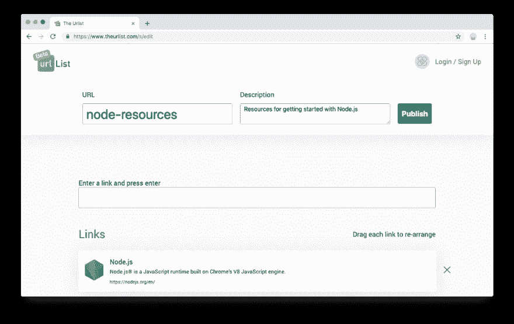](https://res.cloudinary.com/practicaldev/image/fetch/s--2FwnByj8--/c_limit%2Cf_auto%2Cfl_progressive%2Cq_auto%2Cw_880/https://cdn-images-1.medium.com/max/1024/1%2ASKik0Vj9-CMTtc7rXHX0Kg.png)

您可以为您的列表提供自定义 url 和描述。如果您没有选择自定义 url，它会为您生成一个。当您单击“发布”时，您会得到一个直接指向所有链接的 URL。就是这样！你可以把它想成 bit.ly，但是要有一堆链接。

[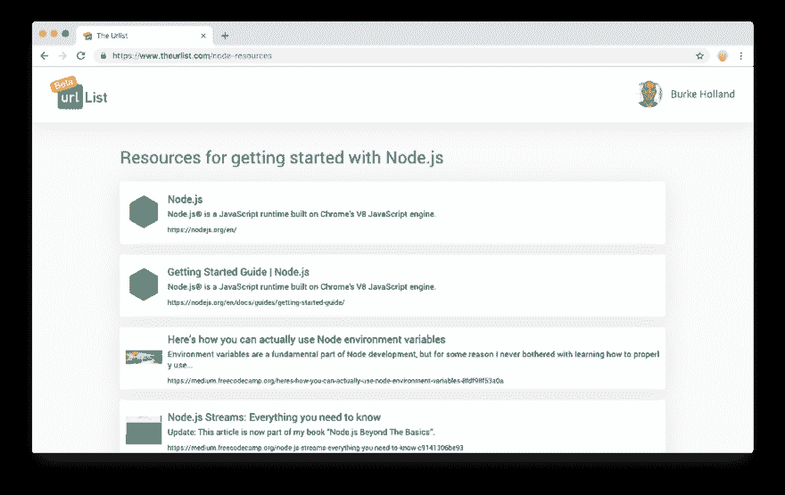](https://res.cloudinary.com/practicaldev/image/fetch/s--poOhbmLb--/c_limit%2Cf_auto%2Cfl_progressive%2Cq_auto%2Cw_880/https://cdn-images-1.medium.com/max/1024/1%2ACQ7gPgbGiSezu8CiK9YNDQ.png)

您不必登录，但如果登录，您可以发布，然后返回并管理您的列表。否则，您的列表是匿名创建的，一旦您发布了它，它就是最终的。目前我们只支持 Twitter 登录。

[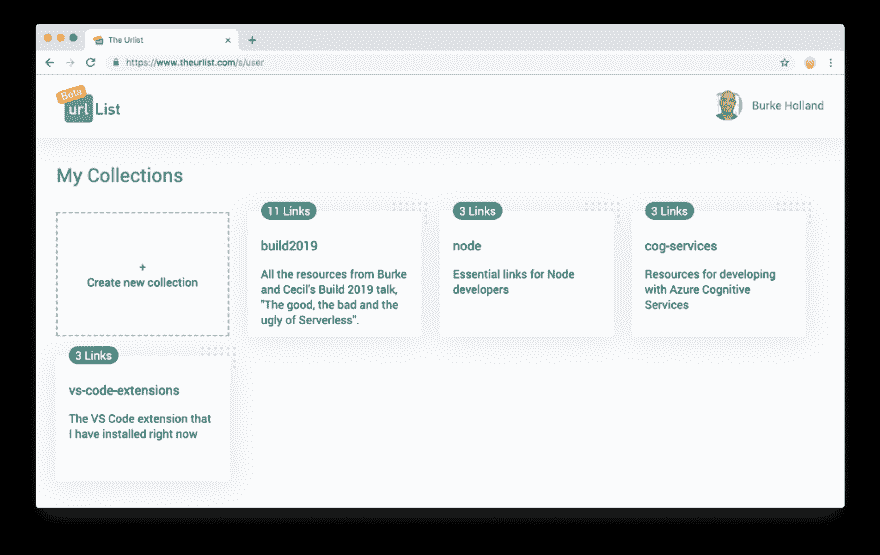](https://res.cloudinary.com/practicaldev/image/fetch/s---hMiI4GH--/c_limit%2Cf_auto%2Cfl_progressive%2Cq_auto%2Cw_880/https://cdn-images-1.medium.com/max/1024/1%2AeY4bc_HZG8u0R4XLkkx0Tw.png)

我们构建这个应用程序有双重动机。当我们试图解决一个问题时，我们也试图学习如何在 Azure 上构建一个真正的*无服务器应用。我们想要一个真实世界的用例——而不是一个没有实际用途的人为例子。这就是为什么整个项目都是开源的。*

burkeholland/the-urlist

### **前端:view+type script**

前端是用 Vue 和 TypeScript 写的单页 app。我特别选择了这两种技术，因为 TypeScript 正变得异常流行，我想看看使用 Vue 会是什么样的体验。

在那次经历中有很多东西需要解开，但足以说它是有见地的。

做完这件事后，**我不认为我对这种规模的项目的打字稿的价值感兴趣。强打是一种税。您支付税款以换取更好的可维护性和工具，但是在这种规模的项目中，根本没有足够的规模来证明费用的合理性。我感觉项目中的代码行和 TypeScript 什么时候变得有价值有交集。在这个项目中，我从来没有达到那个交叉点。**

[](https://res.cloudinary.com/practicaldev/image/fetch/s--q06cD4nG--/c_limit%2Cf_auto%2Cfl_progressive%2Cq_auto%2Cw_880/https://cdn-images-1.medium.com/max/763/1%2AwCZlJqdnfc3i5PAgI8VZZw.png) 

<figcaption>没什么大不了的——我知道。我用 PowerPoint 做的。</figcaption>

还有 Vue 组件的广泛生态系统的问题，其中许多组件还没有定型。这让您感觉好像必须强迫 TypeScript 做它不想做的事情。你最终会写下“任何”和“声明”一大堆，这基本上就像在尖叫，“看别处，打字稿！”

虽然在 Vue 组件的主题上，我们在这个应用程序中使用了一些我认为非常棒的组件。

我们将 Vue 模态组件用于…..…..情态动词。

[euvl/vista-js 模式](https://github.com/euvl/vue-js-modal)

[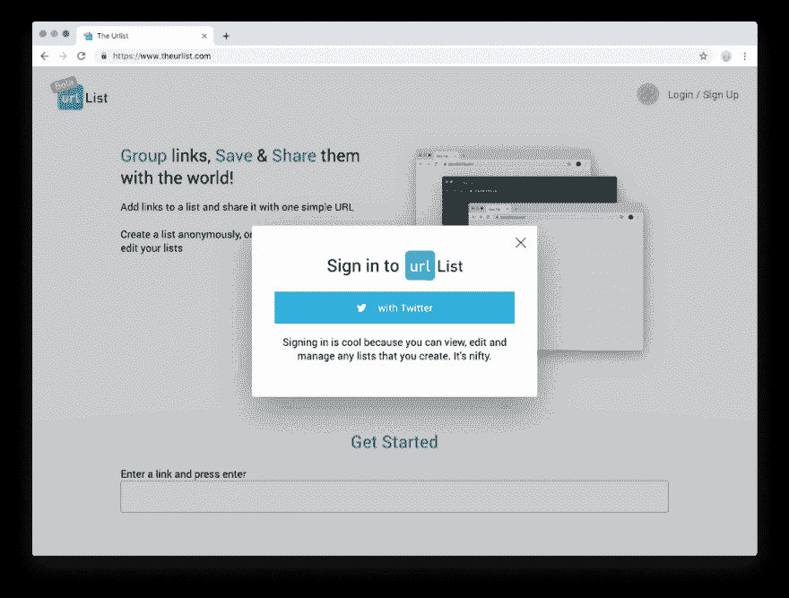](https://res.cloudinary.com/practicaldev/image/fetch/s--bXIqKMZA--/c_limit%2Cf_auto%2Cfl_progressive%2Cq_auto%2Cw_880/https://cdn-images-1.medium.com/max/1024/1%2AVF2Hl-HeLGwCoCX3yzQAiw.png)

我们使用 SlickSort 组件进行拖放排序。这个组件真的很酷。我很喜欢它，我不知道它是如何工作的，但它工作。它甚至可以在手机上运行。

[jexorg dican/vista sliksport](https://github.com/Jexordexan/vue-slicksort)

[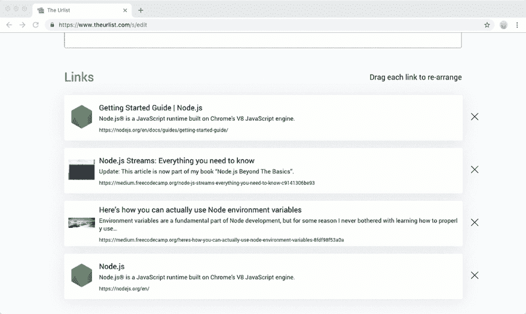](https://res.cloudinary.com/practicaldev/image/fetch/s--2Y_0Z3f4--/c_limit%2Cf_auto%2Cfl_progressive%2Cq_66%2Cw_880/https://cdn-images-1.medium.com/max/1024/1%2AzJH8SCydCDEYb9vf3_1RuQ.gif)

和 Vuelidate 进行验证——包括异步验证，它要求我们通过 API 检查所选的 url 是否可用。

Vuelidate |一个 Vue.js 库。

[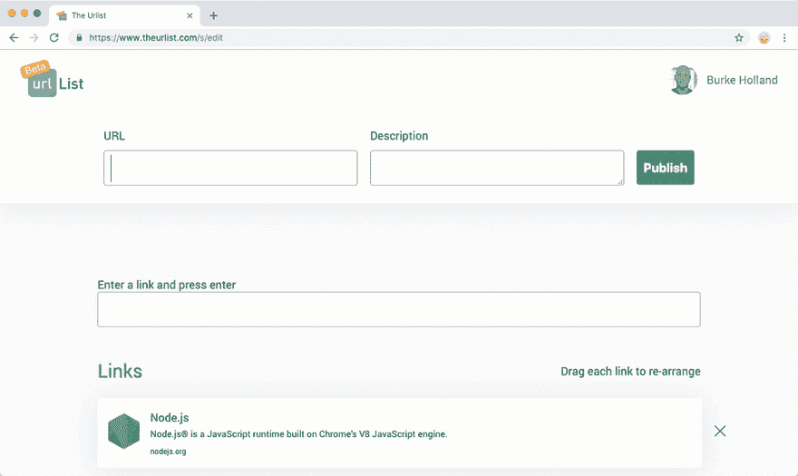](https://res.cloudinary.com/practicaldev/image/fetch/s--XcfUYPEF--/c_limit%2Cf_auto%2Cfl_progressive%2Cq_66%2Cw_880/https://cdn-images-1.medium.com/max/1024/1%2A04WSOFX4HWlXEBLnmWw4ng.gif)

前端托管在 Azure 存储上。这也是我们称之为“无服务器”的部分原因。由于 Vue 应用程序只编译成静态 HTML、CSS、JavaScript 和图像文件，我们可以把它放在 Azure 存储上。

[教程:在 Blob storage - Azure Storage 上托管一个静态网站](https://docs.microsoft.com/en-us/azure/storage/blobs/storage-blob-static-website-host?WT.mc_id=personal-blog-buhollan)

它是“无服务器”的，因为它可以无限扩展，我们只需为我们使用的东西付费。在 Azure 存储的情况下，我们每 GB 支付 0.0184 美元。我们的整个 dist 文件夹的大小——图像和所有是 1.8 MB。

我们这里也是按带宽使用付费的。每 GB 的费用是 8 美分，但是每个月的前 5 GB 是免费的。因此，在我们为带宽付费之前，我们的应用程序必须看到稳定的使用情况。

Azure 存储绝对是托管静态站点的最佳方式。它没有开销，速度非常快。没有要启动的容器。没有要运行的节点服务器。你只是…..对于单页应用来说，这种类型的托管是无可匹敌的。

### 后端:Azure 函数+ C

Cecil 用 C#用 Azure 函数写的 API。当有人说“无服务器”时，我们通常会想到功能。这是微软为该市场定位的产品，当有人在晚宴上说出这个词时，它可能更符合你的想法。

[从 Azure 门户创建你的第一个功能](https://docs.microsoft.com/en-us/azure/azure-functions/functions-create-first-azure-function?WT.mc_id=personal-blog-buhollan)

我们选择用 C#来构建 API，因为我们希望像在现实应用程序中一样混合和匹配各种技术。我们本可以拥有一个完整的 JavaScript 堆栈，但是跨技术工作给了我们两个人一个拓宽视野的机会。

每个 API 端点都有相应的函数。Cecil 给这些函数起了名字，所以只看名字就能相对容易地知道它们是做什么的。

[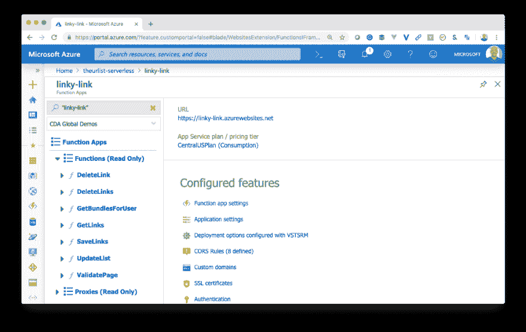](https://res.cloudinary.com/practicaldev/image/fetch/s--gGEF6YZ4--/c_limit%2Cf_auto%2Cfl_progressive%2Cq_auto%2Cw_880/https://cdn-images-1.medium.com/max/1024/1%2AhoGLgHhT9P1Qq83C8CXVtw.png)

他使用 Azure 函数中内置的路由功能使它们成为 RESTful 端点。这一点的美妙之处在于，当你在研究这些方法时，它们对人类是有意义的。当你使用它们时，它们作为 API 是有意义的。

[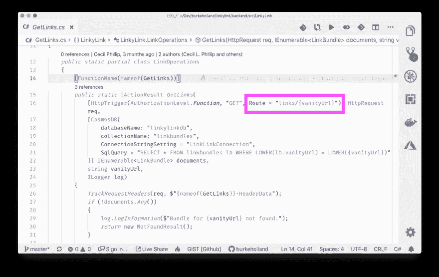](https://res.cloudinary.com/practicaldev/image/fetch/s--oYHha9zn--/c_limit%2Cf_auto%2Cfl_progressive%2Cq_auto%2Cw_880/https://cdn-images-1.medium.com/max/1024/1%2A2LPCU4kCNBKMvQufNBv2jg.png)

我们还使用了内置的身份验证机制，该机制通过 Azure 的 AppService 身份验证来公开功能。我们选择进行社交登录只是因为我们认为没有必要存储用户名和密码。在 Cecil 这边，他按照 Azure 门户的“认证”部分的指示，在 Twitter 中为我们的功能应用程序设置了一个新的应用程序，然后复制了密钥。

[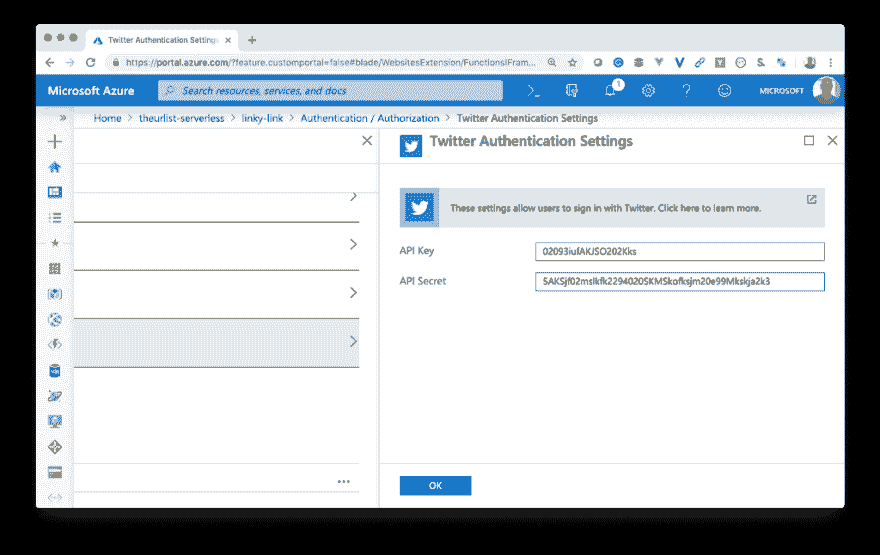](https://res.cloudinary.com/practicaldev/image/fetch/s--_TwjS-jT--/c_limit%2Cf_auto%2Cfl_progressive%2Cq_auto%2Cw_880/https://cdn-images-1.medium.com/max/1024/1%2Axs3xIelOxtFvy6DgccjQrQ.png) 

<figcaption>放松，这些不是我们实际的钥匙</figcaption>

这点亮了/。在我们的函数应用程序中验证端点。我们现在可以从我们的前端调用这些端点，它将引导用户通过认证流。例如，如果我们想让他们登录，然后将他们重定向回应用程序，我们只需让我们的“登录”按钮转到这个 URL…

```
https://www.theurlist.com/.auth/login/twitter?post\_login\_redirect\_url=https://www.theurlist.com 
```

这将用户发送到 Twitter 进行身份验证，然后返回到我们的应用程序。当他们回来时，他们现在有一个 auth cookie 附加到他们的会话。如果我们看看开发工具中的 cookies，我们可以看到这一点。

[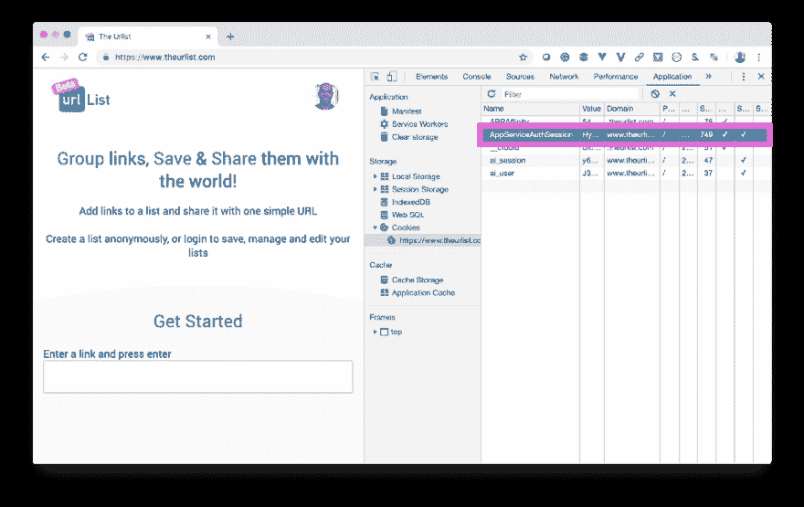](https://res.cloudinary.com/practicaldev/image/fetch/s--qG9twk_s--/c_limit%2Cf_auto%2Cfl_progressive%2Cq_auto%2Cw_880/https://cdn-images-1.medium.com/max/1024/1%2AX3QT6vNZ5sqI4roSaofrzg.png)

现在我们可以询问 Twitter 拥有的用户信息。这些东西包括用户名、全名、头像等等。我们通过调用“me”端点来做到这一点，当我们打开身份验证时，这个端点会自动亮起。

```
https://www.theurlist.com/.auth/me 
```

[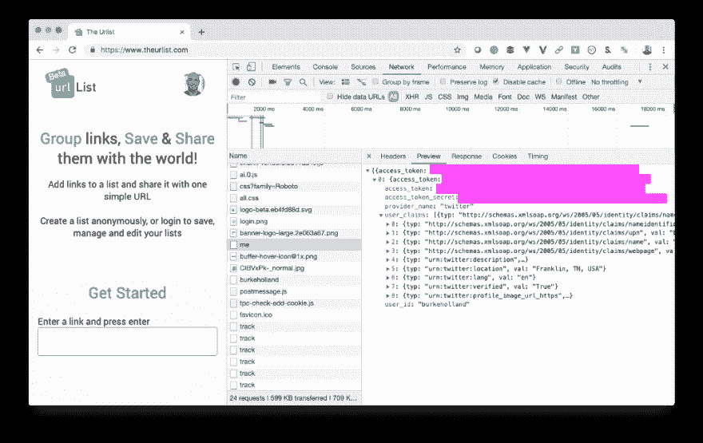](https://res.cloudinary.com/practicaldev/image/fetch/s--DMzZHOXG--/c_limit%2Cf_auto%2Cfl_progressive%2Cq_auto%2Cw_880/https://cdn-images-1.medium.com/max/1024/1%2AkJ1vdPEdXAasbxgkoIvKOg.png)

Cecil 现在可以从前端验证我对 API 的每个请求，并获得相同的用户信息。这就是我们如何确定哪些列表是您的，以及您是否有权编辑它们。

[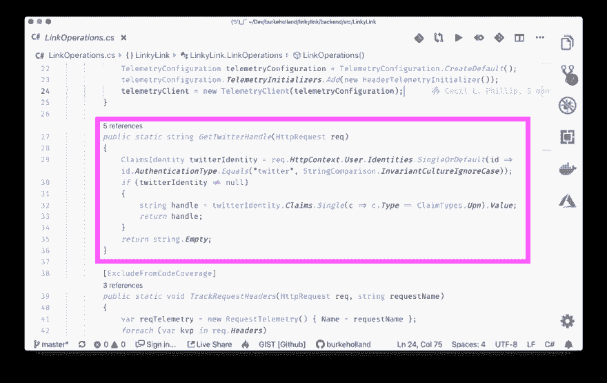](https://res.cloudinary.com/practicaldev/image/fetch/s--Xwj-GtEx--/c_limit%2Cf_auto%2Cfl_progressive%2Cq_auto%2Cw_880/https://cdn-images-1.medium.com/max/1024/1%2AnaJSalTFtawofi9JiPf3wg.png)

### Cosmos DB + SQL API

对于我们的数据存储，我们使用了 Cosmos DB 和 SQL API。这允许我们有一个 NoSQL 数据存储，我们仍然可以用 SQL 查询。我发现 NoSQL 很棒，除非你需要做一些不仅仅是琐碎查询的事情。然后一切对我来说都开始变得混乱，我想起了詹姆斯·米肯斯的这张幻灯片[“计算机是一种悲伤，我是治愈方法”](https://vimeo.com/95066828)。

[](https://res.cloudinary.com/practicaldev/image/fetch/s--LhDuhMiC--/c_limit%2Cf_auto%2Cfl_progressive%2Cq_auto%2Cw_880/https://cdn-images-1.medium.com/max/928/1%2A2bgFm8pty2RJ0uYCVVG-Dw.png)

还有一个针对 VS 代码的漂亮的 Cosmos DB 扩展，这使得处理我们的文档和实际查看数据库变得更加容易。

[Azure Cosmos d b-Visual Studio market place](https://marketplace.visualstudio.com/items?itemName=ms-azuretools.vscode-cosmosdb&WT.mc_id=personal-blog-buhollan)

当您从头开始时，能够看到您的数据库是无可替代的。能够在 VS 代码中看到它就更好了。

[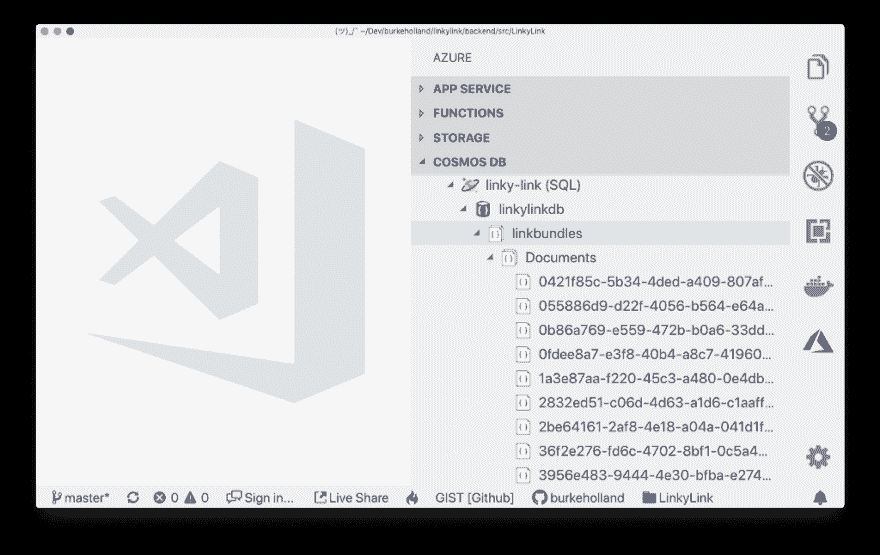](https://res.cloudinary.com/practicaldev/image/fetch/s--8oshELEV--/c_limit%2Cf_auto%2Cfl_progressive%2Cq_auto%2Cw_880/https://cdn-images-1.medium.com/max/1024/1%2AVLCFBhGvhPEi_vemo46qDw.png)

严格地说，Cosmos DB 是我们的应用程序不是无服务器的一个地方。

Cosmos DB 每月运行费用约为 25 美元，可获得 100 RU，即“每秒请求单位”。我们每个月都必须提前购买，即使我们用不完，我们仍然要为此付费。我们也有上限，所以如果我们的应用程序变得非常流行，我们必须通过保留更多的 RU 来手动扩展。

### 天蓝色的前门

我们使用 Azure Front Door 将前端和后端粘合在一起。我的意思是…

我们的前端运行在 Azure 存储上，它的 URL 是[https://theurlistdotcom.z19.web.core.windows.net/](https://theurlistdotcom.z19.web.core.windows.net/)

我们的后端运行在 Azure Functions 上，它的 URL 是[https://linky-link.azurewebsites.net/api](https://linky-link.azurewebsites.net/api)。

我们想要的是拥有一个领域——theurlist.com。我们希望 root 指向我们的 Vue 应用程序，而/api 指向我们的 api。

为了实现这一点，我们使用了一个名为 Azure Front Door 的新产品。

[Azure quick start——使用 Azure 门户创建应用程序高可用性的前门配置文件](https://docs.microsoft.com/en-us/azure/frontdoor/quickstart-create-front-door?WT.mc_id=personal-blog-buhollan)

前门宣称自己是“高度可用的全球应用程序”的工具。

在我们的例子中，我们对此不太感兴趣，我们更感兴趣的是它能够让我们为我们的应用程序建立一个入口点，并在这个入口点后面组织所有的部分。

前门工程通过一个可视化的设计界面。它从给你一个

“前端主机”开始。默认情况下，你会得到… < appname > .azurefd.net。这是你可以访问你的网站的网址。您还可以添加一个自定义域，我们马上就要做。

[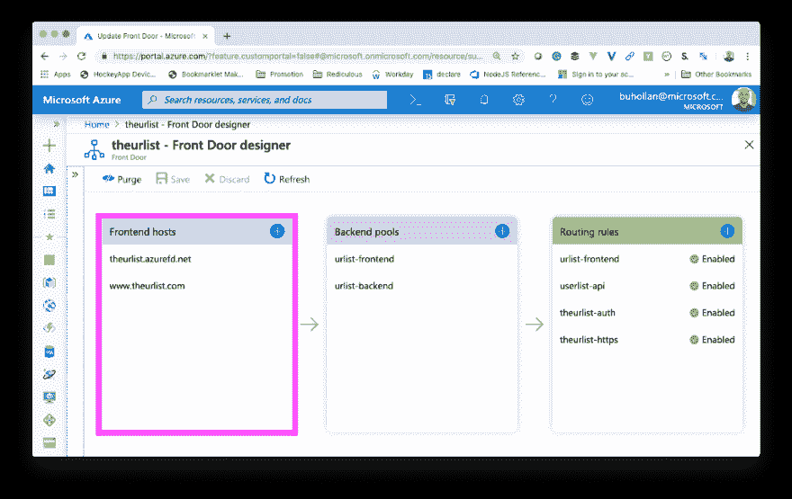](https://res.cloudinary.com/practicaldev/image/fetch/s--3KOkZLX5--/c_limit%2Cf_auto%2Cfl_progressive%2Cq_auto%2Cw_880/https://cdn-images-1.medium.com/max/1024/1%2AU3Vu1ZdXCJB9EGwGKMgMNQ.png)

然后，它希望您识别“后端池”。这些仅仅是你想要引导流量的资源。对我们来说，前端是静态网站，后端是功能应用。我刚刚把我的叫做“urlist-frontend”和“urlist-backend”。如果你看看它们的内部，它们分别指向存储和功能。

[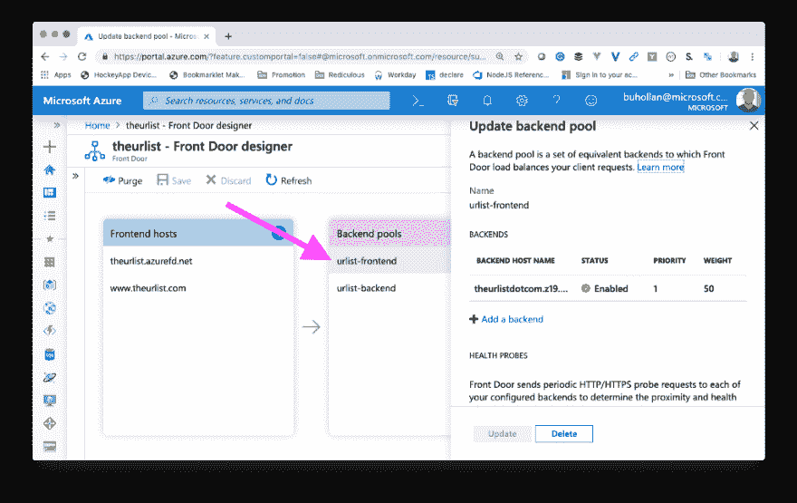](https://res.cloudinary.com/practicaldev/image/fetch/s--6ZCp8VMj--/c_limit%2Cf_auto%2Cfl_progressive%2Cq_auto%2Cw_880/https://cdn-images-1.medium.com/max/1024/1%2AHx92izN0y4gV91_VOIcFdA.png)

最后，我们有我们想要定义的路线。

[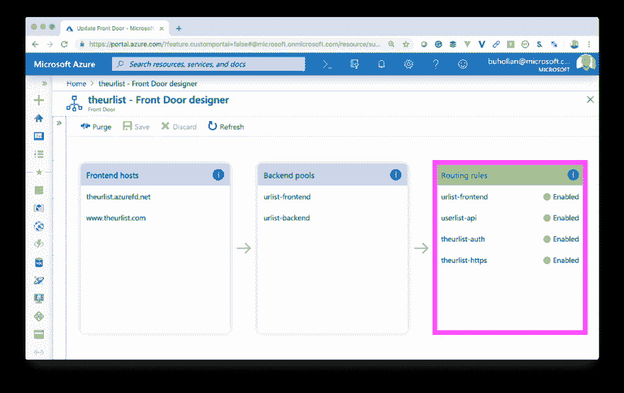](https://res.cloudinary.com/practicaldev/image/fetch/s--oD_7JRBp--/c_limit%2Cf_auto%2Cfl_progressive%2Cq_auto%2Cw_880/https://cdn-images-1.medium.com/max/1024/1%2ARSG9B1U64mMza_hK_7vyUQ.png)

在我们的例子中，我们有四条路线…

1.  我们站点的根，它指向我们“后端池”中的 urlist-frontend
2.  /api，它指向我们的“后端池”中的 URL list-back end
3.  /.auth 指向我们的“后端池”中的 URL list-back end
4.  将所有 http 流量重定向到 https 的路由

我们的自定义域被添加到“前端主机”部分。我们添加了一个新的域名，指向 theurlist.azurefd.net，在我们的 DNS 中有一个 www CNAME。然后，前门验证了这一点，并神奇地为[www.theurlist.com](http://www.theurlist.com.)创建并分配了一个 SSL 证书。不必配置 SSL 是…有点神奇。

前门也是我们应用的 CDN。它只是产品的一部分。这意味着我们被缓存在全球的边缘，这只是提高了我们将应用程序放入人们浏览器的速度。

### 解决一个记录问题

我们要做的最后一件事是找出如何让 Azure 的前门在 A 记录后面。

当你建立一个自定义域名时，你需要给它一个 A 记录。这通常被称为“裸域”。只是域名，没有 [www](http://www) 。在我们的例子中，那是 theurlist.com。问题是 A 记录必须是 IP 地址，前门不给我们 IP。它只给了我们 theurlist.azurefd.net。

为了解决这个问题，我们决定简单地将任何到 theurlist.com 的流量重定向到 www.theurlist.com。

我注册了域名便宜，但我无法让他们的重定向规则可靠地工作。最后，我们建立了一个 Cloudflare 实例作为我们的 DNS。Cloudflare 允许我们为 root (@)创建一个 CNAME，并将其指向[www.theurlist.com](http://www.theurlist.com)。现在，我们已经说过您不能这样做——根据 DNS 规范，您不能这样做。但是 Cloudflare 允许它使用一种叫做“CNAME 拉平”的东西。

#### CNAME 展平

当您创建一个 CNAME 并指向根时，Cloudflare 基本上解析了 theurlist.azurefd.net 的 IP，这就是 get 作为 A 记录返回的内容。问题是在前门的情况下，我们不能直接去找 IP，因为 IP 是负载均衡器。如果我们只是导航到 IP，它不知道我们想要哪个站点。

[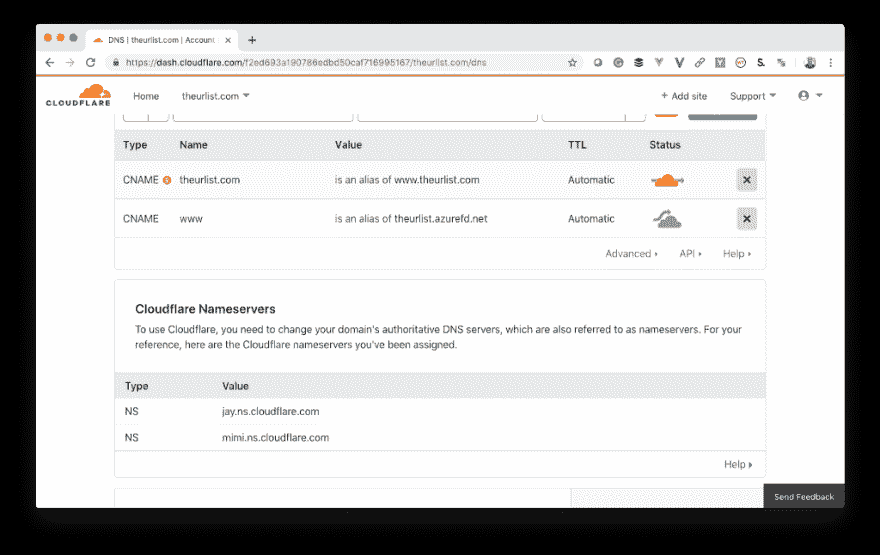](https://res.cloudinary.com/practicaldev/image/fetch/s--TbA1GtdD--/c_limit%2Cf_auto%2Cfl_progressive%2Cq_auto%2Cw_880/https://cdn-images-1.medium.com/max/1024/1%2Ae9Luold75LuZILF2LPNYww.png)

由于我们已经通过 Cloudflare 来解析我们的域，我们可以在 Cloudflare 中添加一个页面规则来捕获所有流量并重定向它。上图中的橙色云表示流量流经 Cloudflare 的 HTTP 代理。这就是我们如何捕获它并用页面规则重定向它。

[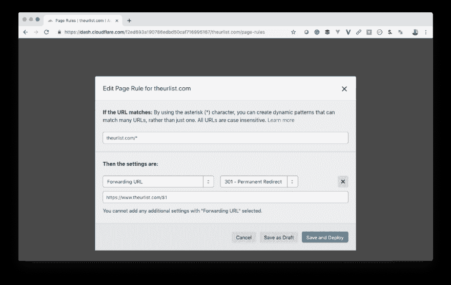](https://res.cloudinary.com/practicaldev/image/fetch/s--SErSoJIi--/c_limit%2Cf_auto%2Cfl_progressive%2Cq_auto%2Cw_880/https://cdn-images-1.medium.com/max/1024/1%2AOeaUh43csd_GnsdBZ84RrA.png)

我花了一段时间才弄明白我必须在路径中使用*来捕获路径的其余部分，然后在重定向中使用$1 来传递它。

这给了我们一个不需要 IP 地址的裸域。装运它。

Azure 前门按路线定价。前五条路线总共花费 21 美元。除此之外，每传输一 GB 大约消耗 25 美分。这里有一点前期成本，但我们从前门获得的不仅仅是一个端点…

*   加密套接字协议层
*   加拿大
*   全局 HTTP 平衡
*   应用加速
*   系统健康监控

### 共享互联网

这句口号是我自己想出来的。你喜欢吗？我应该去鲨鱼池吗？我们今年会上市吗？

我们认为这个应用程序很有趣，不仅因为它展示了我们如何构建一个 web 应用程序，还因为我们认为我们利用 Azure 的 T2 方式为 T4 提供了最大的速度和规模。

如果你感兴趣，你可以在名为“无服务器的好、坏、丑”的 Urlist 上查看 Build 2019 会话。

[https://www.youtube.com/embed/T5ULvFk134U](https://www.youtube.com/embed/T5ULvFk134U)

我们希望这个应用程序不仅从代码和架构的角度对您有用，而且作为一个实际的应用程序，您可以使用它来共享您的链接。我们很乐意看到你的问题和公关！

burkeholland/the-urlist