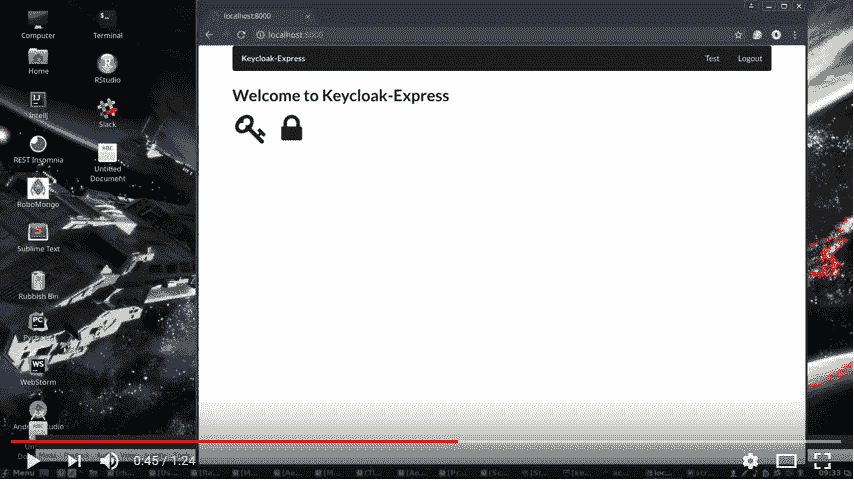
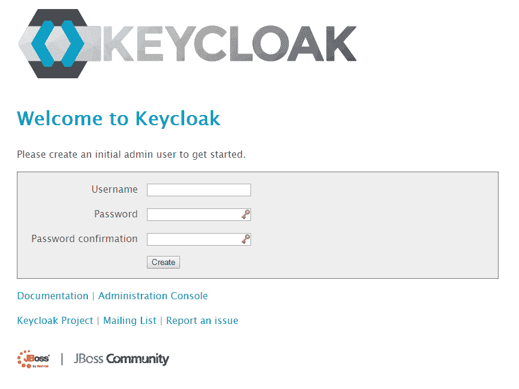
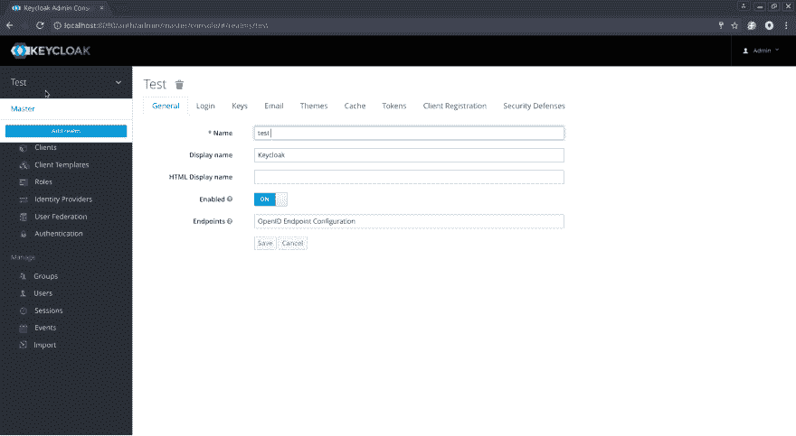
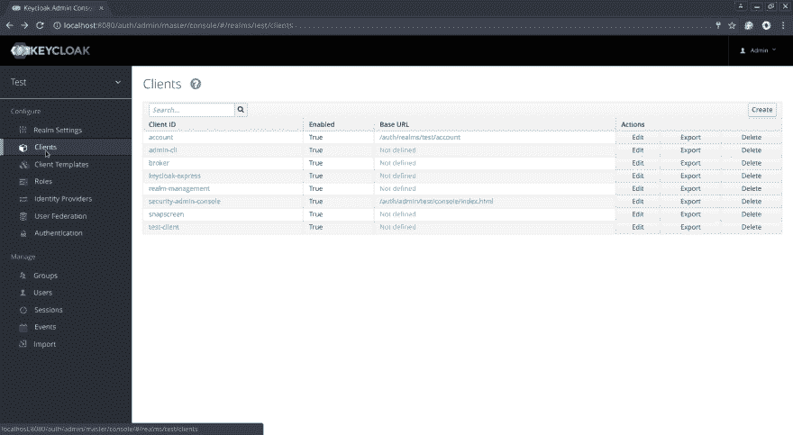
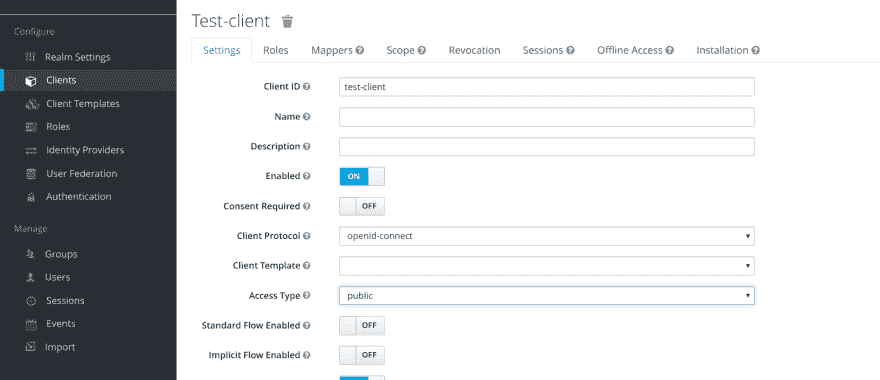
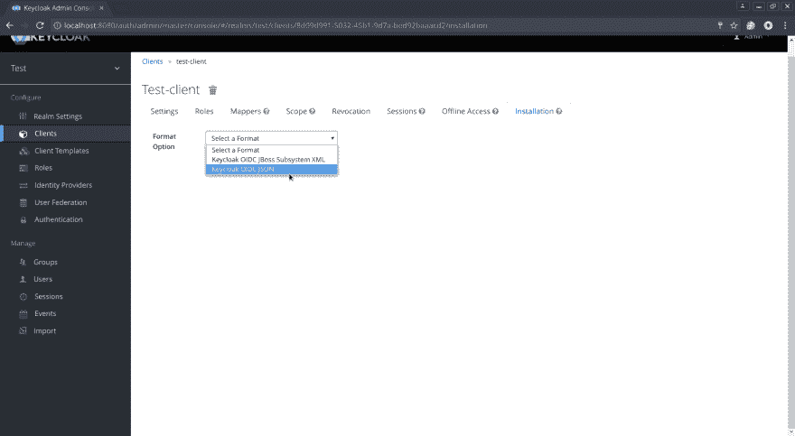

# 钥匙锁和快递

> 原文：<https://dev.to/austincunningham/keycloak-and-express-1cdd>

这是设置 Express 和 Keycloak 来保护网络路由的指南。背景 Keycloak 是一个开源的身份和访问管理解决方案，它可以很容易地保护应用程序或微服务，只需很少或不需要代码。Express 是一个最小且灵活的 Node.js web 应用程序框架。阅读官方的 Keycloak 文档可能需要一段时间，因为文档内容广泛，涵盖了许多不同的用例。这是一个简单的快速操作指南。

目标是创建一个使用 Keycloak 保护“/test”路线的 Express 应用程序。登录和用户设置由 keycloak 控制。默认路由“/”不受保护。“/logout”路由会终止 keycloak 会话。

要在快速应用程序中安装 keycloak-connect npm，请使用以下命令

```
npm install keycloak-connect --save 
```

Enter fullscreen mode Exit fullscreen mode

## 设置快递服务器

您需要将 keycloak-connect 和 express-sessions 导入到您的 express 应用程序中。

```
const Keycloak = require('keycloak-connect');
const session = require('express-session'); 
```

Enter fullscreen mode Exit fullscreen mode

接下来配置会话以使用 memoryStore。设置 keycloak 中间件以使用会话内存库。

```
var memoryStore = new session.MemoryStore();                       
var keycloak = new Keycloak({ store: memoryStore });
//session 
app.use(session({
    secret:'BeALongSecret',                         
    resave: false,                         
    saveUninitialized: true,                         
    store: memoryStore                       
}));

app.use(keycloak.middleware()); 
```

Enter fullscreen mode Exit fullscreen mode

然后，您可以在受保护的路线上使用 keycloak.protect。这将检查用户是否登录到 keycloak 服务器，并重定向到路由。如果用户没有登录，服务器将重定向到 keycloak 登录页面。用户可以通过点击登录页面上的注册链接来创建新帐户。这将在 Keycloak 服务器上创建新用户。

```
//route protected with Keycloak 
app.get(‘/test’, keycloak.protect(), function(req, res){
    res.render(
        ‘test’, 
        {title:’Test of the test’}
        ); 
}); 
```

Enter fullscreen mode Exit fullscreen mode

设置注销路由以使用 keycloak 中间件终止会话。

```
app.use( keycloak.middleware( { logout: '/'} )); 
```

Enter fullscreen mode Exit fullscreen mode

有关服务器的完整实现，请参见以下内容。

```
 'use strict';

const Keycloak = require('keycloak-connect');
const express = require('express');
const session = require('express-session');
const expressHbs = require('express-handlebars');

const app = express();

// Register 'handelbars' extension with The Mustache Express
app.engine('hbs', expressHbs({extname:'hbs',
  defaultLayout:'layout.hbs',
  relativeTo: __dirname}));
app.set('view engine', 'hbs');

var memoryStore = new session.MemoryStore();
var keycloak = new Keycloak({ store: memoryStore });

//session
app.use(session({
  secret:'thisShouldBeLongAndSecret',
  resave: false,
  saveUninitialized: true,
  store: memoryStore
}));

app.use(keycloak.middleware());

//route protected with Keycloak
app.get('/test', keycloak.protect(), function(req, res){
  res.render('test', {title:'Test of the test'});
});

//unprotected route
app.get('/',function(req,res){
  res.render('index');
});

app.use( keycloak.middleware( { logout: '/'} ));

app.listen(8000, function () {
  console.log('Listening at http://localhost:8000');
}); 
```

Enter fullscreen mode Exit fullscreen mode

## 安装示例

将这个 [repo](https://github.com/austincunningham/keycloak-express) 和 cd 克隆到新目录，运行 npm install，repo 中有一些额外的东西，比如视图。

## 演示视频

您可以在
[](https://youtu.be/VAzI7f3pxec) 看到 Keycloak 和一个 Express.js 服务器在运行

## 设置 Keycloak 服务器

要使用这个快速应用程序，您需要启动并运行一个 Keycloak 服务器。Keycloak 可以下载并在本地运行，也可以从 docker 容器中运行，更多信息请参见 [docker hub image](https://hub.docker.com/r/jboss/keycloak/) 。

在下载页面的[下载 Keycloak。要在本地运行它，解压下载的文件并运行 standalone.sh](http://www.keycloak.org/downloads.html) 

```
./keycloak-unzip-directory/bin/standalone.sh 
```

Enter fullscreen mode Exit fullscreen mode

然后，您可以使用以下 url 从浏览器访问 Keycloak 服务器

[http://localhost:8080/auth/](http://localhost:8080/auth/)
您将看到 Keycloak 管理员的初始密码屏幕。

[](https://res.cloudinary.com/practicaldev/image/fetch/s--cqTF1-AC--/c_limit%2Cf_auto%2Cfl_progressive%2Cq_auto%2Cw_880/https://cdn-images-1.medium.com/max/1600/1%2ATnDXQpqicsMOT-Bowo3ynw.png%3Fstyle%3Dcenterme)

有关设置键盘锁的更多信息，请参见以下[指南](https://www.keycloak.org/docs/latest/getting_started/index.html)

接下来你需要[设置一个领域](http://www.keycloak.org/docs/latest/getting_started/index.html#creating-a-realm-and-user)。登录到 Keycloak 管理控制台，悬停在左上角，点击添加领域，并给它一个名称。

[](https://res.cloudinary.com/practicaldev/image/fetch/s--zjxFAzDu--/c_limit%2Cf_auto%2Cfl_progressive%2Cq_auto%2Cw_880/https://cdn-images-1.medium.com/max/2400/1%2A8QUACOFFtq3ou5QA_UmHqQ.png%3Fstyle%3Dcenterme) 
创造一种境界

要使用 Node.js 适配器，首先必须在 Keycloak 管理控制台中为您的应用程序创建一个客户机。[设置开放 ID 连接客户端](http://www.keycloak.org/docs/latest/server_admin/index.html#_clients)。在您的新领域点击客户端，并创建和给你的客户端一个名称/ID。

[](https://res.cloudinary.com/practicaldev/image/fetch/s--31kCzKqo--/c_limit%2Cf_auto%2Cfl_progressive%2Cq_auto%2Cw_880/https://cdn-images-1.medium.com/max/2400/1%2AlKPpdCLjYu6GHPfKn3MIFw.png%3Fstyle%3Dcenterme)

该适配器支持公共、机密和仅承载访问类型。选择哪一个取决于用例场景。在这种情况下，我用 openid-connect 选择 public。

[](https://res.cloudinary.com/practicaldev/image/fetch/s--CWJi58eL--/c_limit%2Cf_auto%2Cfl_progressive%2Cq_auto%2Cw_880/https://cdn-images-1.medium.com/max/2400/1%2AUSxH7yuMSYuV6_E7zCXcKg.png%3Fstyle%3Dcenterme)

您需要定义一个有效的重定向 URL

[](https://res.cloudinary.com/practicaldev/image/fetch/s--snBw0aY7--/c_limit%2Cf_auto%2Cfl_progressive%2Cq_auto%2Cw_880/https://cdn-images-1.medium.com/max/1600/1%2AEBvShEJuRoPae84DeqX7Yw.png%3Fstyle%3Dcenterme)

创建客户端后，单击“安装”选项卡，选择“密匙扣 OIDC JSON”作为“格式”选项，然后单击“下载”。

[](https://res.cloudinary.com/practicaldev/image/fetch/s--fHOPKCHN--/c_limit%2Cf_auto%2Cfl_progressive%2Cq_auto%2Cw_880/https://cdn-images-1.medium.com/max/2400/1%2AQnixBP-B0-I0nnsQQeo71A.png%3Fstyle%3Dcenterme)

下载的 keycloak.json 文件应该放在项目的根文件夹中。示例 keycloak.json 文件

```
{  "realm":  "test",  "auth-server-url":  "http://localhost:8080/auth",  "ssl-required":  "external",  "resource":  "keycloak-express",  "public-client":  true,  "confidential-port":  0  } 
```

Enter fullscreen mode Exit fullscreen mode

就是这样，你的快捷网络路线将受到钥匙锁的保护。更多信息见[此处](http://www.keycloak.org/docs/latest/securing_apps/index.html#_nodejs_adapter)。

[我的博客](https://austincunningham.ddns.net)