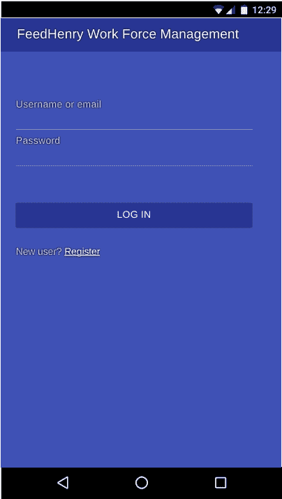
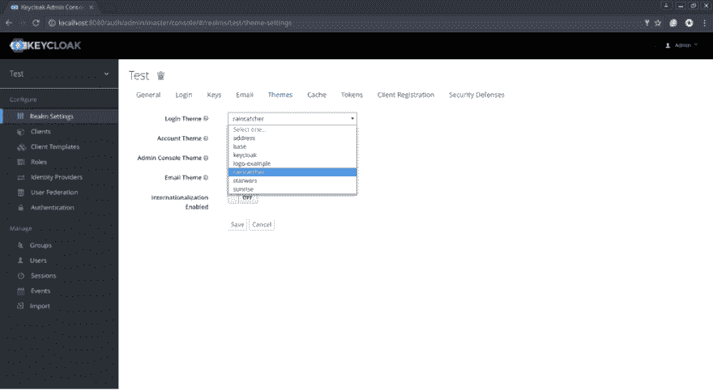

# 为 Keycloak 创建自定义主题

> 原文：<https://dev.to/austincunningham/create-a-custom-theme-for-keycloak-15ji>

[](https://res.cloudinary.com/practicaldev/image/fetch/s--6ny_977f--/c_limit%2Cf_auto%2Cfl_progressive%2Cq_auto%2Cw_880/https://cdn-images-1.medium.com/max/800/0%2AlMzC1bK4bQulI6GB.%3Fstyle%3Dcenterme)

## 用法

Git 在 keycloak 实例的 Themes 目录中克隆这个 repo 来使用这个主题

要选择主题，你需要登录你的 keycloak 管理控制台。转到
领域和主题，并从下拉列表中选择。

[](https://res.cloudinary.com/practicaldev/image/fetch/s--h0nNlv1m--/c_limit%2Cf_auto%2Cfl_progressive%2Cq_auto%2Cw_880/https://cdn-images-1.medium.com/max/1000/0%2A49oKObDvfQyfw5WH.%3Fstyle%3Dcenterme)

## 配置自己的主题

建议您复制一个现有主题并编辑它。为了使
能够在不重启 keycloak 服务器
的情况下编辑主题并查看更改，您需要在 keycloak 服务器上编辑 standalone.xml 文件以禁用缓存。

位于此处

```
./standalone/configuration/standalone.xml 
```

Enter fullscreen mode Exit fullscreen mode

对独立进行以下更改。

```
<theme>
    <staticMaxAge>-1</staticMaxAge>
    <cacheThemes>false</cacheThemes>
    <cacheTemplates>false</cacheTemplates>
    ...
</theme> 
```

Enter fullscreen mode Exit fullscreen mode

要更改您的登录和注册用户屏幕的标题，您可以编辑位于
的 CSS

```
./raincatcher-keycloak-theme/login/resources/css/styles.css 
```

Enter fullscreen mode Exit fullscreen mode

在此进行更改以更改标题

```
/* Change content to change the title of the page*/
div#kc-header::after {
    content: 'FeedHenry Work Force Management';
    font-size: 40px;
    line-height: 50px;
    margin-bottom: 15px;
}

/*title banner size and colour*/
div#kc-header {
    width:100%;
    background-color: rgb(40,53,147);
    padding-top: 2.5em;
    padding-bottom: 2.5em;
    padding-right: 2em;
    padding-left: 3em;
} 
```

Enter fullscreen mode Exit fullscreen mode

要更改背景颜色或设置背景图像

```
body {
    background-color: rgb(63,81,181);
    /*background-image: url('../img/bkgrnd.jpg');*/
    background-position: center center;
    background-attachment: fixed;
    background-size: cover;
    background-repeat: no-repeat;

    color: #fff;
    font-family: sans-serif;
    text-shadow: 0px 0px 10px #000;
    margin: 0px;
} 
```

Enter fullscreen mode Exit fullscreen mode

更改登录和字段文本

```
/* label change Username, Password text*/
div#kc-form label {
    color: rgba(255, 255, 255, 0.7) !important;
    display: block;
    font-size: 30px;
} 
```

Enter fullscreen mode Exit fullscreen mode

改变字段的外观和感觉

```
/*fields*/
input[type=text], input[type=password] {
    color: #ddd;
    font-size: 30px;
    margin-bottom: 20px;
    background: none;
    border-width: 0 0 1px 0;
    padding: 12px;
    width: 95%;
} 
```

Enter fullscreen mode Exit fullscreen mode

更改登录和注册按钮

```
/*button*/
input[type=submit] {
    border: none;
    border-radius: 3px;
    background-color: rgb(40,53,147);
    box-shadow: 0px 0px 6px rgba(0,0,0,0.5);
    color: rgba(0,0,0,0.6);
    font-size: 30px;
    color: white;
    text-transform: uppercase;
    padding: 20px;
    margin-top: 3em;
    width: 98%;
} 
```

Enter fullscreen mode Exit fullscreen mode

更多信息参见 Keycloak 主题文档[此处](http://www.keycloak.org/docs/latest/server_development/index.html#_themes)

[MyBlog](https://austincunningham.ddns.net/)
[乳齿象](https://mastodon.ie/@austincunningham)