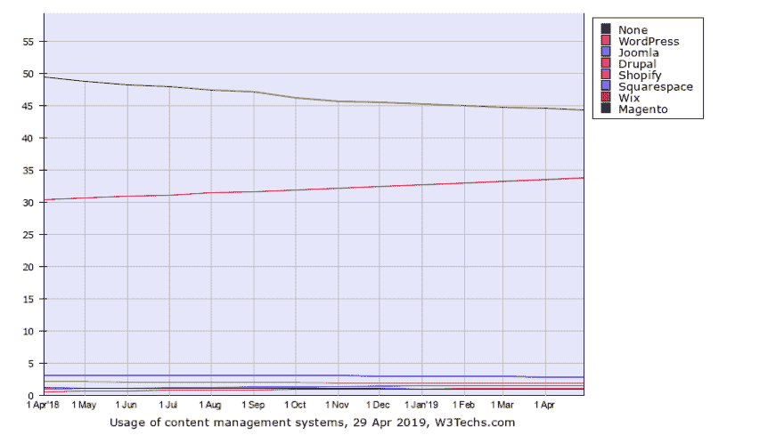
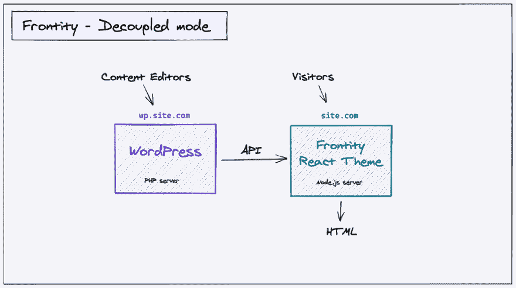
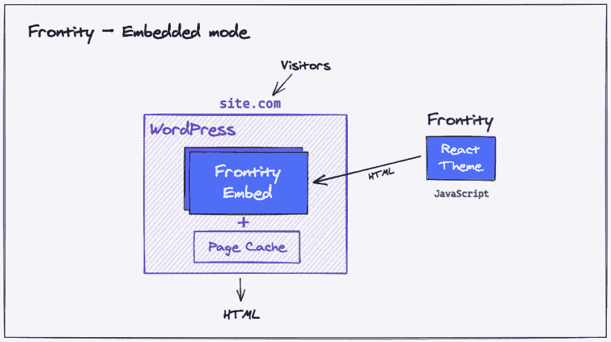

# Frontity，一个创建 WordPress 站点的 React 框架

> 原文：<https://dev.to/frontity/frontity-a-react-framework-to-create-wordpress-themes-f9e>

这几个月在 Frontity 过得很紧张。早在三月份，我们就决定停止为 WordPress 出版商(也称为 Frontity PRO)开发移动主题，将我们所有的注意力放在[**【Frontity.org】**](https://frontity.org/):一个用 React 创建 WordPress 主题的开源框架。

在我们等待测试版发布的同时，让我们回顾一下什么是 Frontity，以及你可以在框架中看到的一些特性。

👉**更新** : Frontity 1.0 现已上线！点击这里阅读关于[的发布。](https://frontity.org/blog/announcing-frontity-1-0/)

## Frontity，一个创建 WordPress 主题的 React 框架

Frontity 是一个基于 React 开发 WordPress 主题的免费开源框架。

换句话说，它允许你为一个[无头(或解耦)的 WordPress 站点](https://www.elegantthemes.com/blog/wordpress/headless-wordpress)构建一个 **React 前端**，该站点通过 WordPress REST API 提供数据。

这种方法有很多优点，但是为了用 React 构建一个 WordPress 主题，开发者**需要学习和配置很多东西** : *捆绑*，*传输*，*路由*，*服务器渲染*，*从 WordPress 检索数据*，*管理状态*，或者*管理 css* ，等等。

Next.js 和 Gatbsy.js 是两个很棒的 React 框架，可以与 WordPress 一起工作，但是它们都不是专门针对这个 CMS 的。因此，仍然有一些复杂的配置和额外的工具留给开发人员。

Frontity 是一个自以为是的 React 框架，专注于 WordPress，旨在使一切更简单，即使对于那些不太熟悉 React 的开发人员也是如此:

*   **关注 WordPress** :框架的每一部分都已经被简化和优化，以便与 WordPress 一起使用。
*   固执己见的框架:开发者不需要弄清楚使用什么工具来处理 css 或状态管理之类的事情。

这意味着一切都准备好了，所以你可以马上使用 React 创建一个新的令人惊叹的 WordPress 主题。

### WordPress 的另一个渲染引擎

Frontity 也可以被描述为 WordPress 的替代渲染引擎。

传统上，WordPress 使用基于 PHP 模板文件的主题来生成 HTML。

当 [REST API](https://developer.wordpress.org/rest-api/) 在 WordPress 4.7 中被合并到 core 中，开发者**不再局限于**PHP 渲染引擎。他们可以检索他们的 WordPress 内容，并在任何他们想要的地方使用它，这开启了一个新的可能性世界。

其中一种可能性是使用 React 创建 WordPress 主题。这就是前沿性发挥作用的地方。

## 为什么 WordPress 和 React？

在写这篇文章的时候(2019 年 4 月)，WordPress 控制了超过 33%的网络。过去几年，它在 T2 的市场份额一直在增长，而且没有放缓的迹象。

随着向 Gutenberg 的转变，随着无头 CMS 的使用越来越多，WordPress 社区越来越多地开始考虑为他们的项目做出反应。除此之外，像 React 这样的现代库越来越受欢迎，并成为丰富用户体验的必要条件。

如果 WordPress 很棒，React 也很棒，那为什么不把两个合二为一**？尤其是如果你想用现代的 web 开发工具建立一个 CMS 驱动的站点。**

我们相信这种基于 JavaScript 的方法正在 WordPress 生态系统中获得牵引力，所以现在是开始熟悉它的最佳时机。

## Frontity 是如何工作的？

在 Frontity 项目中，WordPress 被用作一个无头或分离的 CMS，仅仅用于管理内容。Frontity 使用来自 WordPress REST API 的数据，并使用 React 生成显示在浏览器中的最终 HTML。

有了 Frontity，你仍然可以使用你的 WordPress dashboard 以你习惯的方式编辑和创建内容。当你进行修改时，你的 Frontity 站点中的内容会自动更新，就像使用传统的 WordPress 主题一样。

Frontity 应用程序需要 Node.js 服务器和 WordPress 服务器(PHP)才能运行。有两种主要的前沿模式(架构或配置):解耦模式和嵌入式模式。

#### 1。[解耦模式](https://docs.frontity.org/architecture/decoupled-mode)

在这种模式下，Frontity 从 WordPress 服务器(PHP)的 REST API 获取数据，并将最终的 HTML 作为同构的 React 应用程序返回给访问者。

#### 2。[嵌入式模式](https://docs.frontity.org/architecture/embedded-mode)

在这种模式下, [Frontity 嵌入式模式插件](https://api.frontity.org/frontity-plugins/embedded-mode)替换 PHP 主题，并向 Frontity / Node.js 服务器请求检索 HTML 作为同构的 React 应用程序，由 WordPress 返回给访问者。

根据使用的模式，主域(如`www.site.com`)将连接到 WordPress 服务器(嵌入式模式)或 Frontity 服务器(分离模式)。

**在文档的[架构](https://docs.frontity.org/architecture)页面了解更多**。

### 为什么是不同的 Node.js 服务器？

React 是一个 JavaScript 库。为了为站点访问者或 Google 生成 HTML，服务器还需要能够运行 JavaScript。

Frontity 准备在常规 Node.js 服务器或无服务器服务中托管。这使得它非常便宜，并且可以无限扩展。

## 锋度特征

这些是你有望在 Frontity 中看到的一些[特性](https://docs.frontity.org/about/frontity-features)。

**零设置开发**

一切都已经准备好了，你可以专注于构建你的网站:React、webpack、Babel、SSR、Routing、CSS-in-JS、WP REST API、TypeScript、林挺、测试等等。

**闪电般的加载速度**

Frontity 发送一个准备好开始浏览站点的 HTML，所以最初的加载感觉几乎是即时的。不需要额外的资产或往返。

这个 HTML 功能齐全，无需 Javascript 即可导航。一旦 React 加载，它就会控制应用程序，用户不会注意到任何变化，它是 100%透明的。

**即时应用内导航**

React 加载后，路由器会自动预取其它路由和数据。当用户在应用程序中导航时，他们永远不必等待。

**可扩展(通过 Frontity 和 npm 包)**

默认情况下，Frontity 被设计为可扩展的。类似于插件在 WordPress 中的工作方式，该框架提供了一个非常灵活且易于使用的包管理界面，使你能够根据自己的需要轻松扩展该框架。

开发人员可以创建他们自己的定制包(扩展)或通过安装任何现有的 Frontity 和 npm 包向他们的网站添加新功能，而不必从头开始构建它们。此外，Frontity [主题](https://api.frontity.org/frontity-themes)和[包](https://api.frontity.org/frontity-packages#official-frontity-packages)可以在不修改代码的情况下激活和停用，并且可以跨项目重用。

作为其可扩展性模式的结果，Frontity 中的功能没有耦合到路由系统，让开发人员决定呈现什么类型的页面，并给予他们对布局的完全控制，等等。

**服务器端渲染**

Frontity 用 React 生成的完全填充的 HTML 文件进行响应。这减少了第一次内容丰富的绘画所需的时间，并确保搜索引擎优化不会受到损害。

使用 WordPress REST API 检索内容。一旦 React 被加载到浏览器中，它就会控制页面并施展它的魔法。

**代码拆分**

Frontity 使用 webpack 来拆分代码，并发送应用程序工作所需的最少代码。它还允许开发者在可加载组件的帮助下动态加载组件。

**支持 WordPress.com【WordPress.org T2】**

Frontity 可以使用不同的“源”扩展。第一个测试版本包括一个`wp-source`，它可以与任何 WordPress.com 或 WordPress.org 站点的 REST API 一起工作。

**单次安装支持多个站点**

这类似于 WordPress multisite: Frontity 允许你只安装一个软件就可以服务任意数量的站点。这对于管理不同客户端的用户或想要创建网络的用户来说非常有用。

**无服务器和水平扩展**

Frontity 服务器非常小，非常适合无服务器要求。这意味着前端可以无限扩展。

所有的服务器代码都打包在一个文件中，准备好与 Vercel(现在使用其 CLI)等无服务器服务一起工作。Frontity 还准备在任何 Node.js 服务器中进行水平扩展。

**久经考验的框架**

在过去的两年里，我们已经开源了我们用来支持大型 WordPress 新闻网站的内部框架。Frontity 被数百万读者使用，被证明可以构建引人入胜的前端体验。

你可以在这里了解更多关于这个项目[的故事。](https://frontity.org/about-us/)

## 与其他 React 框架的主要区别

Frontity 在某种程度上类似于 Gatsby.js 和 Next.js，并且可以与之相提并论。

**100%专注于 WordPress**

这意味着作为开发人员，您需要学习的概念数量是最少的。开始时不需要复杂的配置，对提供内容的 API 的查询已经针对开发人员最经常需要的东西进行了预配置。

简而言之，您可以将大部分时间花在项目的开发需求上(例如主题)，而将较少的时间花在建立项目或担心工具和配置上。

这是一个固执己见的框架

Frontity 有自己的状态管理器和 CSS-in-JS 解决方案。由于这一点，开发人员不必弄清楚如何配置这些工具，或者学习其他技术，如 Redux 或 GraphQL。

它可以像 WordPress 一样扩展

Frontity 提供了一种非常灵活的可扩展性模式，更类似于 WordPress 本身，而不是其他 JavaScript 框架。为了添加新功能或扩展 Frontity 的功能，您可以使用任何现有的 Frontity 和 npm 包，而不必从头开始构建它们。

此外，Frontity 主题和扩展可以在不修改代码的情况下激活和停用，并且可以跨项目重用，有助于减少开发和维护时间。

**它是动态渲染的**

在 Frontity 中，HTML 由 Node.js 服务器或无服务器服务动态呈现。这意味着每次编辑内容或发布新内容时，不必重新构建 HTML。

Frontity 网站可以像静态网站一样快，因为大多数请求都由中间缓存层处理。静态 HTML 由 CDN 缓存，与 Frontity 生成的动态 HTML 由 CDN 缓存和服务的方式相同。

由于其动态方法，Frontity 在频繁和实时的内容更新方面提供了强大的功能和可靠性，使其非常适合那些内容可能会快速变化或预计会随着时间的推移而增长的项目。

此外:

*   不需要学习 GraphQL 或者 REST API。您可以使用 Frontity 的内置状态管理器获得这些数据。
*   Frontity 可以用完全相同的 React 代码库输出适合 Google AMP 的 HTML。

## 包装完毕

我们希望这篇文章能让你更好地理解什么是前沿性以及它是如何工作的。要了解更多信息以及如何开始，请访问[文档](https://docs.frontity.org/)或 [Learn Frontity](https://frontity.org/learn/) 页面。如果你是 Frontity 新手，可以看看这个[循序渐进教程](https://tutorial.frontity.org/)。

如果您还有任何问题或希望参与 Frontity，请随时加入[社区论坛](https://community.frontity.org/)。我们的目标之一是创建一个共享知识的开放空间，在这里开发者可以互相帮助。

要了解 Frontity 的所有信息和最新产品更新，请在此订阅 Frontity 简讯[。](https://frontity.org/newsletter)

*最初发表于[frontity.org/blog](https://frontity.org/blog/frontity-a-react-framework-to-create-wordpress-themes/?utm_source=dev.to&utm_medium=introducing-frontity-framework&utm_campaign=content_marketing)。*