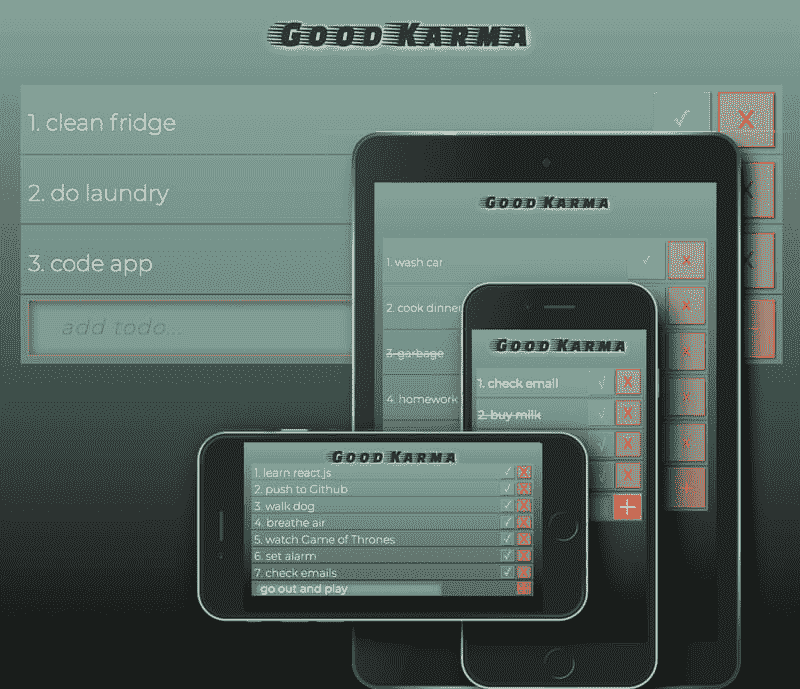

# 准系统 TODO 应用程序，使用钩子的无查询 RWD

> 原文：<https://dev.to/beau_dev/barebones-todo-app-query-less-rwd-using-hooks-361h>

我想学习一些关于钩子的知识，这样我就可以知道我的 twitter feed 中的每个人都在谈论什么。🤔

我打算做一个响应迅速、无需媒体查询的应用程序，它在纵向和横向模式下都能做出响应。

我在其中一个组件上添加了一些三次贝塞尔动画。

(这是我在 Dev 上的第一件事，我希望它对像我一样的学习者有用。)

[https://github.com/beauhaus/good-karma](https://github.com/beauhaus/good-karma)

