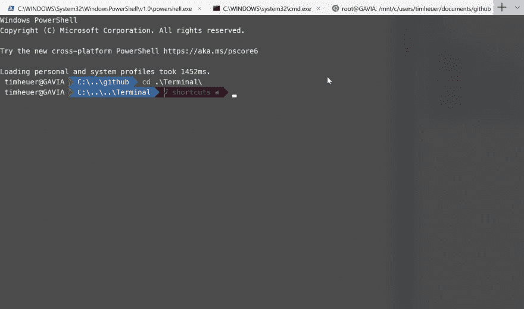
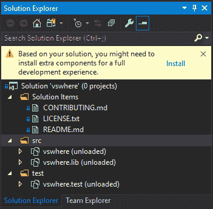
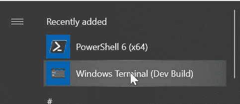
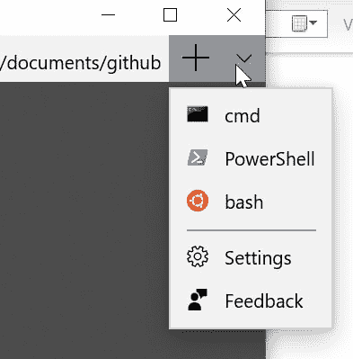

# 构建和定制新的 Windows 终端

> 原文：<https://dev.to/timheuer/building-and-customizing-the-new-windows-terminal-16i9>

我不喜欢 C++。好了，我说了……把它解决了。这不是一个公平的说法，因为我知道很多人都这样认为，他们认为我不仅用 C++写代码简直是疯了。作为一个没有传统计算机科学背景的人，我从来没有在 C 或 C++基础上“长大”。

> 注意:你可以在牛逼的 **[CodeNewbie](https://www.codenewbie.org)** 播客上听到更多关于我(和其他人)的科技之旅。我的小插曲就在这里:[从警察招募到开发商](https://www.codenewbie.org/podcast/from-police-recruit-to-developer)。

继续，在下面插入“你不是真正的程序员”的评论。这些年来，我已经有了足够厚的脸皮来听到这些反馈。总之我跑题了。虽然我不是 C++的粉丝，但这真的不是关于语言，而是迭代开发循环。我经常发现它比我想要的和混合/匹配的工具集、设置等要慢。给我留下了许多不尽人意的地方。然而，尽管如此，看 C++代码是学习和真正欣赏其他人写的语言和代码的一个很好的方式。没有比代码更好的学习发展资源了。

上周在微软 Build 大会上，一个有趣的新项目向开发者社区发布了……一个新的 **[Windows 终端](https://github.com/microsoft/Terminal/)** 。而且是开源的！

[](https://res.cloudinary.com/practicaldev/image/fetch/s--W573z4KX--/c_limit%2Cf_auto%2Cfl_progressive%2Cq_auto%2Cw_880/https://storage2.timheuer.com/terminal1.png)

在这个生态系统中，我从未见过像过去 10 天这样令人兴奋的终端应用。太有趣了。首先，这是为您带来 Windows 终端项目的团队:

> 亲爱的 [#Build2019](https://twitter.com/hashtag/Build2019?src=hash&ref_src=twsrc%5Etfw) 实体和虚拟与会者& tweeps -感谢您参加我们的讲座，参观我们的展位，并提出/发布大量精彩问题&评论。我们感谢你们所有人。
> 
> 带着爱从 [#WSL](https://twitter.com/hashtag/WSL?src=hash&ref_src=twsrc%5Etfw) 和[#终点站](https://twitter.com/hashtag/Terminal?src=hash&ref_src=twsrc%5Etfw)车队
> 
> 一直到明年😜[pic.twitter.com/VayHovDnNJ](https://t.co/VayHovDnNJ)
> 
> — Rich Tur-minal-ner-d ([@richturn_ms](https://dev.to/richturn_ms) ) [May 8, 2019](https://twitter.com/richturn_ms/status/1126264083043328002?ref_src=twsrc%5Etfw)

伟大的人，热衷于让 Windows 成为一个伟大的开发环境，不管你在开发什么。这也是为您带来 WSL 和新功能的团队！所以你想试用终端…你的第一个问题是*我在哪里可以得到它？*

## 构建 Windows 终端

好吧，现在它是唯一的来源。这可能会在接下来的几个月中有所改变，但是现在如果您真的想尝试一下，您需要自己构建它。GitHub 上的[库有所有的位和指令让你这么做。我像其他人一样马上就开始了，但遇到了一些问题，因为我使用的是 Visual Studio 2019。幸运的是，这个问题已经被](https://github.com/microsoft/Terminal/)[这个公关](https://github.com/microsoft/Terminal/commit/af7316c130059ba15fe16ff0d13608d956a2b449)解决了，让寻宝游戏中的依赖变得不那么痛苦。

> 附注:如果您有一个开放源代码或基于团队的项目，现在就帮自己一个忙，添加一个. vsconfig 文件。详细信息:[使用在您的组织中配置 Visual Studio。虚拟配置](https://devblogs.microsoft.com/setup/configure-visual-studio-across-your-organization-with-vsconfig/?WT.mc_id=blog-blog-timheuer)

基本步骤是:

*   [将您的机器置于开发者模式](https://docs.microsoft.com/windows/uwp/get-started/enable-your-device-for-development?WT.mc_id=docs-blog-timheuer)
*   确保你有一些 Git 工具
*   确保你有 C++工具(编译器等。)( [Visual Studio 社区版](https://visualstudio.microsoft.com/?WT.mc_id=visualstudio-blog-timheuer)免费下载/安装并运行)
*   克隆存储库
*   [更新子模块](https://github.com/microsoft/Terminal#building-the-code)
*   构建 repo(使用 VS 或 tools\bcz 脚本)

如果您使用 Visual Studio 2019(我推荐),打开 OpenConsole.sln 文件应该会出现一个屏幕提示您在解决方案资源管理器中“安装”缺少的依赖项:

[](https://res.cloudinary.com/practicaldev/image/fetch/s---PMM_VWX--/c_limit%2Cf_auto%2Cfl_progressive%2Cq_auto%2Cw_880/https://storage2.timheuer.com/vsconfig-screenshot00.png)

如果您单击 Install，它将引导您完成可能没有启用的缺失组件，以完成构建。完成这个过程。完成后，您将拥有所有的信息，并可以返回到 OpenConsole.sln 项目，选择“构建解决方案”并开始该过程。很多东西都是第一次做，所以需要一点时间。现在怎么办？

## 部署/运行 Windows 终端

构建是第一步，现在您要运行它。Windows 终端是通用 Windows 平台(UWP)应用程序，必须首先进行部署。最简单的方法来自 Visual Studio，但是你可能想知道是什么项目！？**终端\CascadiaPackage** 项目就是您想要的项目，只需右键单击它并选择 Deploy。这将把它部署到您的机器上(假设您启用了开发人员模式)。这将出现在您的开始菜单中:

[](https://res.cloudinary.com/practicaldev/image/fetch/s--XWZKN3wQ--/c_limit%2Cf_auto%2Cfl_progressive%2Cq_auto%2Cw_880/https://storage2.timheuer.com/startmenuterminal.png)

点击/点击/无论什么，你将第一次启动终端！

## 等等，我看到的标签呢？

啊，既然你已经让它运行了，让我们参观一下。现在的设置是一个 JSON 文件，您可以通过 settings 菜单访问它。你如何得到设置菜单？按 CTRL + T 调出选项卡视图，然后在右上方区域应该会有一个下拉菜单:

[](https://res.cloudinary.com/practicaldev/image/fetch/s--rrq_14F1--/c_limit%2Cf_auto%2Cfl_progressive%2Cq_auto%2Cw_880/https://storage2.timheuer.com/terminalmenupic.png)

如果您单击 Settings，它将在您的计算机上为编辑 json 文件而配置的默认编辑器中打开 profile.json 文件。对我来说，这是 Visual Studio，但你也可以使用代码或其他编辑器。这是为您的终端环境编辑您自己的配置文件。默认情况下，这个 JSON 没有空白，所以您可能希望对其进行格式化，使其更具可读性。在 Visual Studio 中是 CTRL + K，CTRL + D，它会为你美化它。然后，您会在文件顶部看到一些初始设置:

```
{
  "defaultProfile": "{a933a071-2a32-42c9-b03a-550845793252}",
  "initialRows": 30,
  "initialCols": 120,
  "alwaysShowTabs": true,
  "showTerminalTitleInTitlebar": true,
  "experimental_showTabsInTitlebar": false,

```

如果您像我一样将第 5 行改为 true，那么即使只有一个控制台主机在运行，您也将总是从制表符开始。当您保存 profile.json 文件时，它将被重新格式化为没有空格的格式(代码中有一个文件监视器),但是设置将立即生效。

## 导航 profile.json 选项

概要文件 main meat 在概要文件本身中。这些决定了您可以启动哪些 shells 控制台以及它们的配置。举个例子，这是我现在看起来的一个片段:

```
{
  "defaultProfile": "{a933a071-2a32-42c9-b03a-550845793252}",
  "initialRows": 30,
  "initialCols": 120,
  "alwaysShowTabs": true,
  "showTerminalTitleInTitlebar": true,
  "experimental_showTabsInTitlebar": false,
  "profiles": [
    {
      "startingDirectory": "c:\\users\\timheuer\\documents\\github",
      "guid": "{b056b6a8-89ba-4868-86c6-2ea078cd4fdd}",
      "name": "cmd",
      "colorscheme": "UbuntuLegit",
      "historySize": 9001,
      "snapOnInput": true,
      "cursorColor": "#FFFFFF",
      "cursorHeight": 25,
      "cursorShape": "vintage",
      "commandline": "cmd.exe",
      "fontFace": "Cascadia Code",
      "fontSize": 12,
      "acrylicOpacity": 0.75,
      "useAcrylic": true,
      "closeOnExit": true,
      "padding": "0, 0, 0, 0",
      "icon": "ms-appdata:///roaming/cmd-icon.png"
    },
    {
      "startingDirectory": "c:\\users\\timheuer\\documents\\github",
      "guid": "{a933a071-2a32-42c9-b03a-550845793252}",
      "name": "PowerShell",
      "background": "#0C0C0C",
      "colorscheme": "UbuntuLegit",
      "historySize": 9001,
      "snapOnInput": true,
      "cursorColor": "#FFFFFF",
      "cursorHeight": 25,
      "cursorShape": "vintage",
      "commandline": "powershell.exe",
      "fontFace": "Meslo LG M for Powerline",
      "fontSize": 12,
      "acrylicOpacity": 0.75,
      "useAcrylic": true,
      "closeOnExit": true,
      "padding": "0, 0, 0, 0",
      "icon": "ms-appdata:///roaming/powershell_64.png"
    },

```

虽然我没有启用所有选项，但是对源代码进行一点小小的探索可以帮助您了解还有哪些其他选项:

*   名称:特定概要文件的名称。现在，这是之前显示的下拉菜单中显示的内容。记录了一个问题，可能会将此作为选项卡的名称。
*   guid:此配置文件的唯一标识符。顺便说一句，如果你不知道并且想要创建你自己的配置文件并且需要一个 GUID，VIsual Studio 有一个“创建 GUID”工具，可以从工具菜单中获得…选择注册表格式，然后复制/粘贴
*   配色方案:这映射到这个区域的配色方案…这是一个颜色数组，映射到各种前景/背景/文本/高光等。也是可配置的设置。您可以在您的配置文件中看到，坎贝尔和其他一些人(日晒暗/光)是预先配置的。您可以使用 iterm2colors 值来创建新的方案。
*   前景:前景，duh(覆盖颜色表/方案)
*   背景:背景，duh(覆盖颜色表/方案)
*   colortable:方案中颜色数组的内嵌版本
*   historySize:老实说，我还没有在代码中看到过这个
*   snapOnInput:老实说，我也没有看过这个
*   光标颜色:您选择的光标样式的颜色
*   cursorShape:显示光标的不同选项:vintage(粗下划线)、bar(竖条)、下划线(细下划线)、filledBox、emptyBox
*   cursorHeight:光标高度
*   命令行:为概要文件运行的命令(完整的路径或者可以在 path 中找到的内容)
*   fontFace:用于此配置文件的字体。你可能会在我的博客中看到，我正在使用“Meslo LG M for Powerline”来获得很酷的自定义提示符。[点击此处了解更多操作方法](https://gist.github.com/jchandra74/5b0c94385175c7a8d1cb39bc5157365e)，它可以在 Windows 终端上运行

*   注意:这个团队也将开放一种新的字体，用于终端，但是在这篇文章发表时还不可用

*   fontSize:字体的大小
*   丙烯电容:如果选择使用丙烯(透明)功能，则为窗口的不透明度。0-1 之间的值
*   useAcrylic: true/false 如果您想使用透明度
*   滚动条状态:隐藏/可见是选项
*   close exit:true/false 如果您希望在启动主机的退出命令时该选项卡关闭
*   填充:这会影响一些输出，但老实说现在效果不好，建议保留为 0，0，0，0
*   startingDirectory:这个概要文件的启动目录。我用我的 github 目录配置了我的目录，我所有的代码都在这个目录中，而不是$home(这是默认的)
*   图标:将显示在菜单和选项卡中的图标。这些位于您的 RoamingState 目录中(C:\ Users \<yourusername>AppData \ Local \ Packages \ WindowsTerminalDev _ 8 wekyb 3d 8 bbwe \ roaming state)，值的格式为“ms-appdata:///roaming/<yourfilename></yourfilename></yourusername>

现在，这些是可用的选项，你应该用它们来定制你需要改变的。我已经把这些弄得够乱了，现在已经到了我想要它们在的地方。

## 浏览源并做出贡献

当我开始这篇关于我如何不喜欢 C++的文章时，这是一个学习很多东西的好地方。Windows 终端源代码是一个别人的代码迷宫，现在没有一个清晰的地图。因此，最好的方法是真的只是挖掘和遵循特定的流程。我发现这是浏览任何项目源代码的最佳方式:找到一个特性，并尝试在代码中找到并遵循它。对我来说，我把设置文件弄得一团糟，我讨厌用鼠标使用菜单，我需要一个键盘快捷键。我知道 CTRL + T 启动了一个新的选项卡，所以我可以实现一个键盘快捷键来快速启动设置文件。我第一次把这个特性作为项目的一个问题记录下来:[添加访问设置](https://github.com/microsoft/Terminal/issues/683)的键绑定，然后开始工作。我知道新标签快捷方式的存在，所以我采纳了自己的建议:*遵循代码！*经过几次尝试，浏览了所有的标题和各种代码文件后，我为自己的问题向项目提交了一份 PR:[PR # 684](https://github.com/microsoft/Terminal/pull/684/commits/c5cadf7b004ab4c380dabfe52c3458935df7383e)。有 6 个文件进行了更改以添加此键绑定，如果您看到我提出的更改，已经有一个我可以调用的函数(与菜单使用的相同)，我只需要映射键绑定并让它调用现有的函数。很简单，但是我学到了一点当前代码在存储库中的结构。

因此，我的建议是，找到一些你认为是现有功能的一部分或你想自己添加的东西，并开始寻找你认为它可能在哪里。你会很快发现终端设置、终端核心、终端控制等的一些结构。尝试做一些改变。请记住，这是积极的发展，事情会经常变化。该团队甚至表示:

> ⚠ **注意**:命令行团队正在积极地开发这个库，并将定期重新构建代码，以使其更容易理解、导航、构建、测试和贡献，因此**确实期望定期对代码布局进行重大更改**。

我已经被合并咬了一口，但没什么大不了的，只是修复一些东西，然后继续前进！

## 下一步是什么？

团队对他们想要完成的目标有一个很好的期望，并且刚刚开始。质量会提高，错误会得到修复，终端的消费会更好，等等。阅读存储库中的自述文件，并在 Twitter 上与团队交流(自述文件中有他们的联系信息)。

希望这有所帮助！

(本文[跨贴自 timheuer.com](https://timheuer.com/blog/archive/2019/05/13/building-windows-terminal-navigating-source-and-profile-settings.aspx))