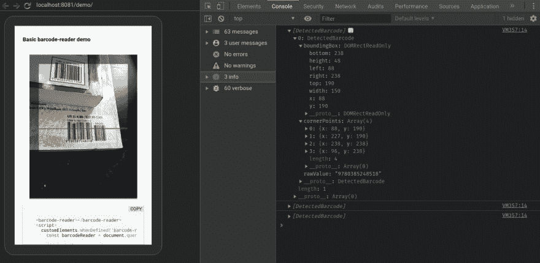

# 发布了试验性条形码阅读器 web 组件

> 原文：<https://dev.to/justinribeiro/experimental-barcode-reader-web-component-released-38pm>

不久前，在《聚合 2 日》中，我有一个非常特别的 web 组件版本，非常漂亮。这是基于 Chrome 中已启用的形状检测 API 的早期实验。我甚至一度使用性能更好的 polyfill，[条形码检测器 polyfill](https://github.com/giladaya/barcode-detector-polyfill/pulls?q=is%3Apr+author%3Ajustinribeiro+is%3Aclosed) ，让该组件无需担心要加载哪个垫片/polyfill。

然而，就像大多数事情一样，我从来不觉得这是一个非常干净的样本。它有一些怪癖，虽然很多人恳求我发布它，但我只是觉得它会对学习方面的任何有用的东西造成更多的困惑(它在移动设备上非常慢，即使是网络工作者也是如此)。

快进到几个星期前，我需要一个条形码阅读器组件在一个小的演示中，我正在为一个内部的公司谈话做准备。随着 Chrome 中的形状检测功能的出现，我决定摆脱沉重的逻辑，在 litElement 中构建一个小组件(我对组件 API 有一个更宏伟的愿景，但它可以很容易地独立存在)。

现已推出([在 npm](https://www.npmjs.com/package/@justinribeiro/barcode-reader) 和 [Github](https://github.com/justinribeiro/barcode-reader) 上提供)，扩展包括:

1.  使用 Chrome M74 中可用的形状检测 API(参见 [Chrome 状态](https://www.chromestatus.com/feature/4757990523535360))。
2.  DedicatedWorker 上的模块脚本。您可以使用'–enable-experimental-web-platform-features '标志来尝试该功能(参见[https://crbug.com/680046](https://crbug.com/680046))
3.  使用 [Comlink](https://github.com/GoogleChromeLabs/comlink) 作为工作者的代理
4.  通过 [LitElement](https://lit-element.polymer-project.org/) 构建为 web 组件

[](https://res.cloudinary.com/practicaldev/image/fetch/s--cMi_k0nX--/c_limit%2Cf_auto%2Cfl_progressive%2Cq_auto%2Cw_880/https://storage.googleapis.com/jdr-public-imgs/blog/201905010-barcode-chrome-devtools-remote-debug.png)

请注意，这是没有生产准备好的任何方式，但如果你想抓住与 npm 或纱线玩，请这样做！

```
npm i @justinribeiro/barcode-reader # or yarn add @justinribeiro/barcode-reader 
```

在使用中，它基本上只有一个`start()`和`stop()`方法(因此，您可能会基于某种理想的用户操作以某种形式显示所述组件……您可能不希望它一直全速运行)。

```
customElements.whenDefined('barcode-reader').then(() =\> { const barcodeReader = document.querySelector('barcode-reader'); // start the camera stream // always looks for // facingMode: { // exact: 'environment', // } barcodeReader.start(); // component returns a custom event with results document.addEventListener('barcodes-found', (event) =\> { console.log(event.detail.barcodes); // if you want to stop streaming, ala, I'm hiding you now barcodeReader.stop(); }, false); }); 
```

如果你正在寻找一种更像应用程序的方法，我强烈推荐[保罗·金兰斯的](https://paul.kinlan.me/)[QR snaper](https://github.com/PaulKinlan/qrcode)作为一个很好的例子。

有问题或意见吗？确保在回购上 ping 我，因为我计划开始迭代一个更有用的版本。