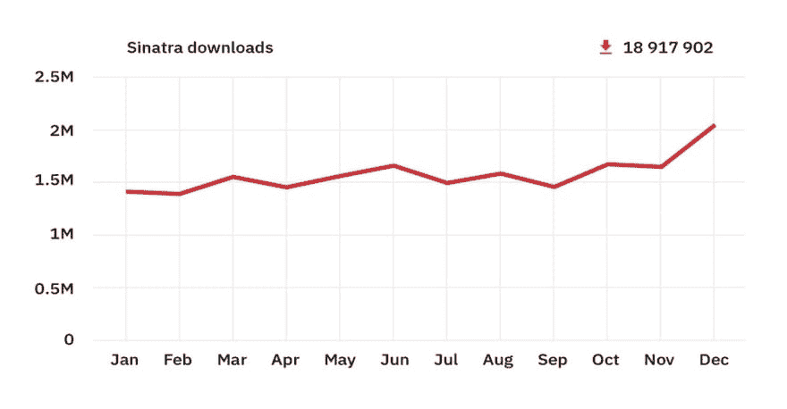

# 辛纳屈，没人在乎

> 原文：<https://dev.to/sebsanzdesant/no-one-cares-sinatra-a-ruby-micro-framework-3kio>

[Sinatra](http://sinatrarb.com/) 是 Ruby 底层微框架。

什么是框架？很高兴你问了！

> 软件框架是一个[抽象](https://en.wikipedia.org/wiki/Abstraction_(computer_science))，其中提供通用功能的[软件](https://en.wikipedia.org/wiki/Software)可以被额外的用户编写的代码选择性地改变，从而提供应用特定的软件。软件框架提供了构建和部署应用程序的标准方式。
>  [https://en.wikipedia.org/wiki/Software_framework](https://en.wikipedia.org/wiki/Software_framework)

作为一个框架，Sinatra 让你在一个 [RESTful](https://restfulapi.net/) 结构中 [CRUD](https://en.wikipedia.org/wiki/Create,_read,_update_and_delete) ，从而通过网络浏览器创建、读取、更新和删除数据。这是通过标准化的 RESTful 约定来实现的，比如 GET 和 POST。有了 Sinatra，你可以创建简单的网站、博客或基本的内容管理系统。

随着我们的 mod 向 Sinatra 发展，一些来自早期 mod 的同行带着一丝轻蔑的口吻描述了这个小框架，比如“Eww，你要开始使用 Sinatra 了”。每当有人对着我这样的菜鸟做关于辛纳屈的鬼脸时，它就会让我想起弗兰克的开创性作品[“没人在乎”](https://en.wikipedia.org/wiki/No_One_Cares)的专辑封面，这是一组令人心碎和充满爱的歌曲，描述了即使是像辛纳屈这样的主要人物也没有得到爱。

我忍不住把孤独的弗兰克和一些程序员与 Sinatra 和 Rails 的关系联系起来。

但是，尽管说同情党，让我们看看一些统计数据显示，辛纳特拉实际上如何持有自己的框架领域。

2016 年，Sinatra 的使用率仅比 Rails 低 95%,但这意味着它被 5%的 Ruby framework 市场使用，这在任何市场都是一个不可忽略的数字。更有甚者，它[在 2018 年红宝石宝石使用率排名第 73 位](http://bestgems.org/search?q=sinatra)。考虑到总共有 *152，505* 颗宝石可供选择，这已经不错了。

<figure> 

<figcaption>来自:[https://infinum . co/the-turned-eight/analyzing-rubygems-stats-v 2018](https://infinum.co/the-capsized-eight/analyzing-rubygems-stats-v2018)</figcaption>

</figure>

这表明 Sinatra 是一个健壮的小工具，因此当与 Ruby 比较时，它更适合下图所示的情况:

这就是在进入更大的框架之前熟悉 Sinatra 的重要性。当你的五金店关门了，或者你的电动工具坏了，拥有一套根深蒂固的技能来解决挑战(因为你已经用一种更简单的工具如折叠刀解决了它们)是至关重要的。

除此之外，它还有助于您理解并深刻欣赏像 Rails 这样的框架。有了 Sinatra 的良好经验基础，你就可以用更大、更复杂的工具更好地编程。它将帮助你找到解决将来遇到的问题和挑战的方法。

最后，Sinatra 是不需要 Rails 提供的所有花哨功能的项目的理想选择。有时你不需要 18v 锂动力无绳锤钻/驱动器，一把小刀就可以了。

使用 Sinatra，由于其简单性，甚至可能会让人想起[这位亚马逊评论者](https://www.amazon.com/gp/customer-reviews/RK1QZGY5AXJZV/ref=cm_cr_dp_d_rvw_ttl?ie=UTF8&ASIN=B00005UMTA)对*“没人在乎”、*的评价

> 弗兰克太好了，不管你一开始有没有心情，他都能让你进入状态。”

看看这个使用 Sinatra 的应用程序、工具和网站的令人敬畏的长列表。