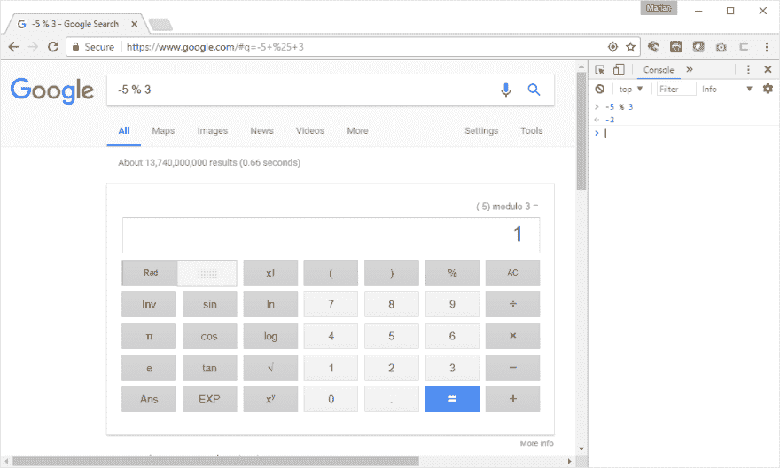
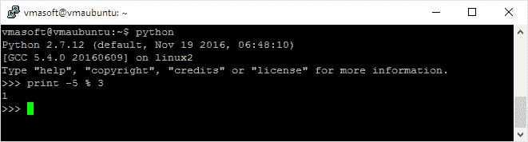
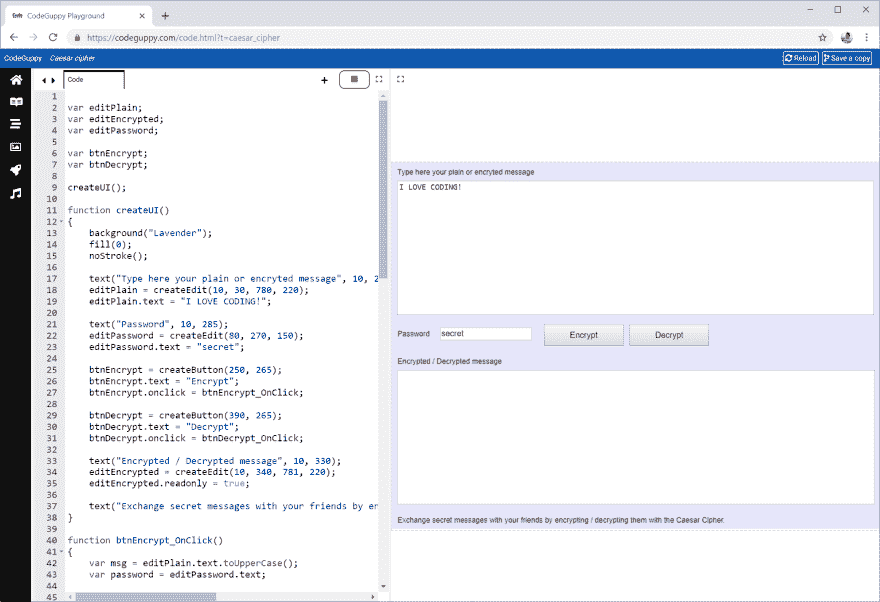

# JavaScript 模运算和凯撒密码

> 原文：<https://dev.to/codeguppy/javascript-modulo-operation-and-the-caesar-cipher-107m>

科学计算或算法的成功实现不仅可以通过理解特定语言或框架提供的特性来实现，还可以通过理解其局限性来实现。

计算机是精确的科学仪器，但它们是通过操纵离散空间中的实体来工作的(屏幕上的像素数量有限，每个数字后面的位数有限，等等。)

试着忽略这些限制或框架规格，很快你就会发现你的数学公式和你试图写的代码之间有一个阻抗不匹配。

## 模运算符

有时，错误地宣传或理解框架函数或操作符会使情况变得复杂。本文主要关注*模*操作符。

问任何一个 C#或 JavaScript 程序员他们语言中的模运算符是什么，他们很可能会回答:%(例如百分号)。许多文档将%符号称为模运算符。

哇！这是一个微妙但非常危险的错误。在 C#和 JavaScript 中,%运算符实际上是用来计算一个操作数除以第二个操作数后的余数(带符号)。因此，操作数应该正确地称为有符号余数运算符。

乍一看，有符号余数运算符的功能类似于模运算符。让我们通过比较 JavaScript 返回的结果和 Google 返回的结果来做一些测试。

在 Chrome 中，打开控制台(按 F12 并选择控制台选项卡)。从左栏开始一个接一个地输入计算结果。接下来，在谷歌搜索栏中输入相同的表达式。注意结果。他们应该是一样的。

|  | Java Script 语言 | 谷歌 |
| --- | --- | --- |
| 5 % 3 | Two | Two |
| 26 % 26 | Zero | Zero |
| 15 % 12 | three | three |

现在让我们尝试使用一个负值作为第一个操作数:

[](https://res.cloudinary.com/practicaldev/image/fetch/s--oHLN-s-f--/c_limit%2Cf_auto%2Cfl_progressive%2Cq_auto%2Cw_880/https://thepracticaldev.s3.amazonaws.com/i/elfw0wn0qig9ykpmwuvp.png)

惊喜！

*   -5 % 3 = 1(根据谷歌的数据)
*   -5 % 3 = -2(根据 JavaScript)

良好的...如果我们看看 JavaScript (…甚至 C#或许多其他语言)中% operator 的定义，这实际上并不奇怪。谷歌计算的是真模，而这些计算机语言计算的是带符号的提醒。

然而，并不是所有的编程语言/框架都有相同的%实现。例如，在 Python 中,%运算符以与 Google 相同的方式计算真模:

[](https://res.cloudinary.com/practicaldev/image/fetch/s--fz4iv9tt--/c_limit%2Cf_auto%2Cfl_progressive%2Cq_auto%2Cw_880/https://thepracticaldev.s3.amazonaws.com/i/j8es6rv8xf7pesgs4slf.png)

语言之间的这种行为差异可能会在您的计算中引入细微的错误，尤其是当您试图将一种算法从一种语言移植到另一种语言时！

## 明白了的问题是解决了一半的问题

假设我们需要使用模运算在 JavaScript 中实现一个(科学的)计算。

既然我们现在知道 JavaScript 没有真正的模操作符，我们可以很容易地将模操作实现为一个函数。

JavaScript 中有多种实现模的方法。我将向你展示做这件事的三种方法。

```
// Implement modulo by replacing the negative operand 
// with an equivalent positive operand that has the same wrap-around effect
function mod(n, p)
{
    if ( n < 0 )
        n = p - Math.abs(n) % p;

    return n % p;
} 
```

```
// Implement modulo by relying on the fact that the negative remainder
// is always p numbers away from a positive reminder
// Ex: -5 % 3 | -5 = -2 * 3 + 1 and -5 = -1 * 3 + (-2) | -2 + 3 = 1 
function mod(n, p)
{
    var r = n % p;

    return r < 0 ? r + p : r;
} 
```

```
// Implement modulo by solving n = v * p + r equation 
function mod(n, p) 
{
    return n - p * Math.floor( n / p );
} 
```

## 攻击问题

有了更精确的工具，我们现在已经准备好处理这种(科学)计算，并期望每次都能得到正确的结果。

有许多计算利用了模运算...然而，出于好玩的目的，我将向您展示如何使用模运算来实现[凯撒密码](https://learncryptography.com/classical-encryption/caesar-cipher)——一种非常简单的加密形式，其中原始消息中的每个字母都向左或向右移动一定数量的位置。

要解密信息，我们只需将字母移回相同的位置。

示例:

*   如果我们将所有字母移动 3 个位置，JAVASCRIPT 就变成了 MDYDVFULSW
*   如果我们将所有字母向后移动 3 个位置，MDYDVFULSW 将返回 JAVASCRIPT。

如果在移位之后，一个字母超出了字母的范围，则该字母被字母表环绕。示例:如果移动 3 个位置，字母 Z 将变成 C。

这种“环绕”效应意味着使用模。用数学术语来说，上述内容可以表示为:

a(x)=(x+n)对 26

Dn(x) = (x – n) mod 26

试图在 JavaScript 中实现这种算法而不使用适当的模操作符将会产生不正确的结果或者非常晦涩难懂的代码。

通过使用上面定义的任何一个 mod 函数，该代码同样表达了数学方程:

```
// Function will implement Caesar Cipher to
// encrypt / decrypt the msg by shifting the letters
// of the message acording to the key
function encrypt(msg, key)
{
    var encMsg = "";

    for(var i = 0; i < msg.length; i++)
    {
        var code = msg.charCodeAt(i);

        // Encrypt only letters in 'A' ... 'Z' interval
        if (code >= 65 && code <= 65 + 26 - 1)
        {
            code -= 65;
            code = mod(code + key, 26);
            code += 65;
        }

        encMsg += String.fromCharCode(code);
    }

    return encMsg;
} 
```

玩得开心！加密几条消息来试试代码。记住:如果你用一个正密钥加密，用互补的负密钥解密。

你也可以用这些代码来解码那些出现在网络和新闻组中的消息。

在以后的文章中，我将讨论其他的“限制”以及通用语言和框架的解决方案，比如在科学计算中正确处理浮点数(IEEE 754)。

以上代码可在下面的[网上游乐场](https://codeguppy.com/code.html?caesar_cipher)中获得

[](https://res.cloudinary.com/practicaldev/image/fetch/s--hNcDhEXA--/c_limit%2Cf_auto%2Cfl_progressive%2Cq_auto%2Cw_880/https://thepracticaldev.s3.amazonaws.com/i/12dl9enhjkecrpeo35le.png)

> 更多有趣的 JavaScript 活动，请访问主[codeguppy.com](https://codeguppy.com)网站。