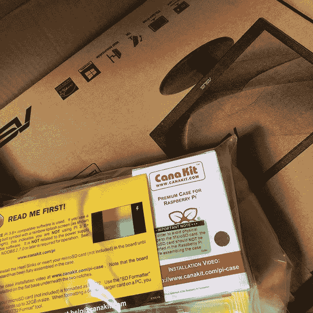

# 建立一个树莓派:为什么这次这么难？

> 原文：<https://dev.to/egf/setting-up-a-raspberry-pi-why-was-this-so-difficult-this-time-40l2>

我已经在我的时间里建立了我的公平份额的覆盆子馅饼。我想除了一个以外，其他的都是 RetroPis，但是过程大体上是一样的。

今年母亲节，我的家人给我买了一个 Pi 3B+和一个触摸屏显示器，这样我就可以把一个家庭日历/信息/命令中心放在一起了。我想我应该把 NOOBS 放在那里，然后开始。私家侦探有其他想法。

我真的看了 6 张 MicroSD 卡。其中一个我认为是合法的损坏，但其他的似乎在我的笔记本电脑上工作正常，但 Pi 无法启动。我尝试了 NOOBs，我尝试了 Raspbian 图像，我跳了一小段舞作为对 Pi 神的祭品。没有。

因此，当事情没有发生时，我有一些让 Pi 工作的建议。如果我多做一点研究，我可能会从一开始就发现这些东西。但是就像我说的，我已经建立了几个 Pis，没有遇到这些问题。所以，我想是吧！

1.  从官方覆盆子 Pi 网站下载 NOOBS 或拉斯比安。
2.  如果你在 Mac 上，使用[解压缩器](https://theunarchiver.com/)解压缩任何 zip 文件(NOOBs 或 Raspbian 等)。
3.  使用[蚀刻机](https://www.balena.io/etcher/)将你的图像写到你的 SD 卡上(你不需要弄乱格式或任何类似的东西——这是我认为我的很多问题所在？躺着？奠定？)
4.  把所有的东西都插上，如果你幸运的话，鲍勃就是你的叔叔！

敬请关注我的家庭指挥中心！我退出了！