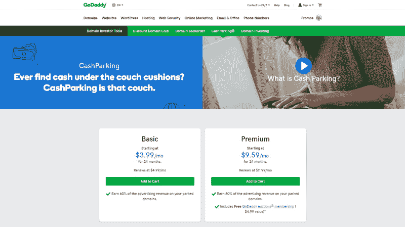
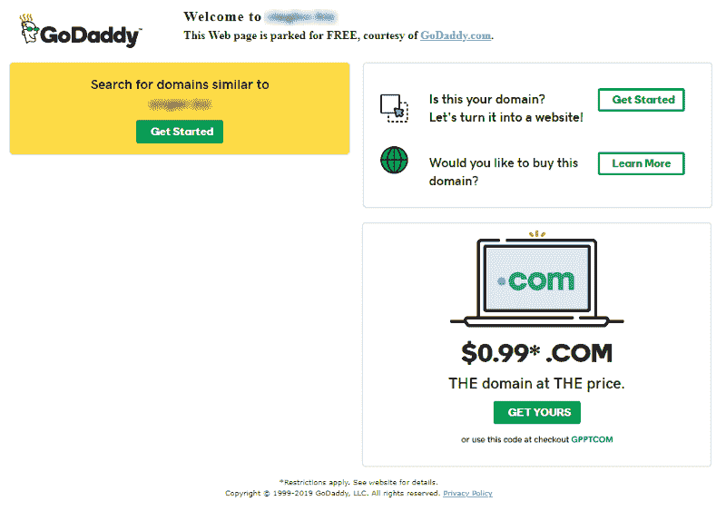
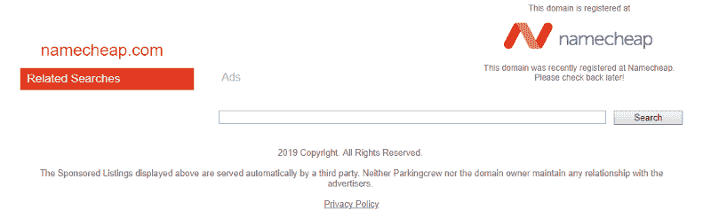
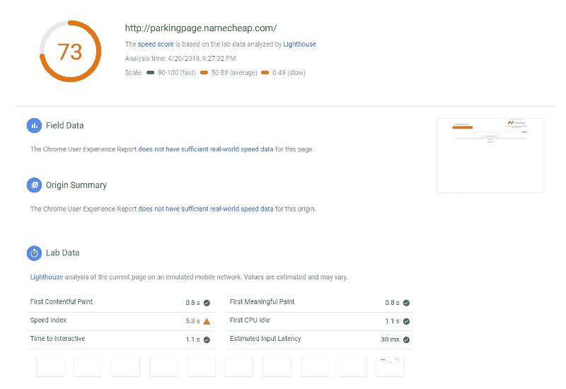
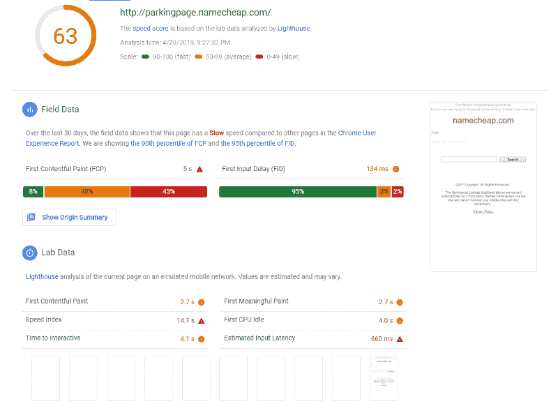
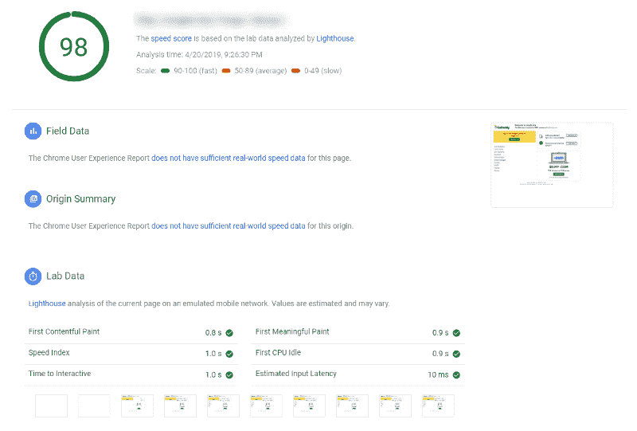
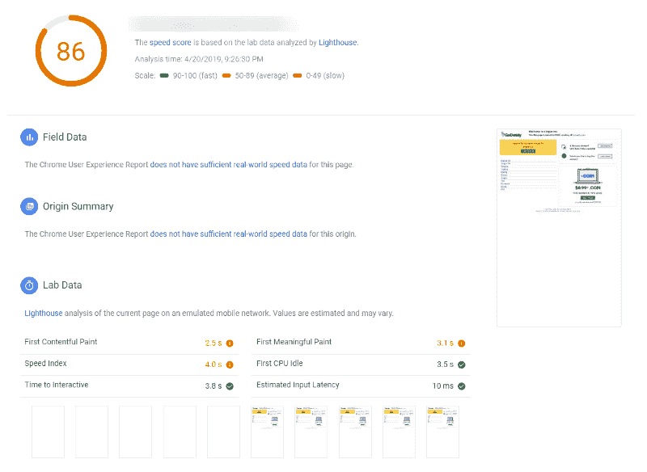
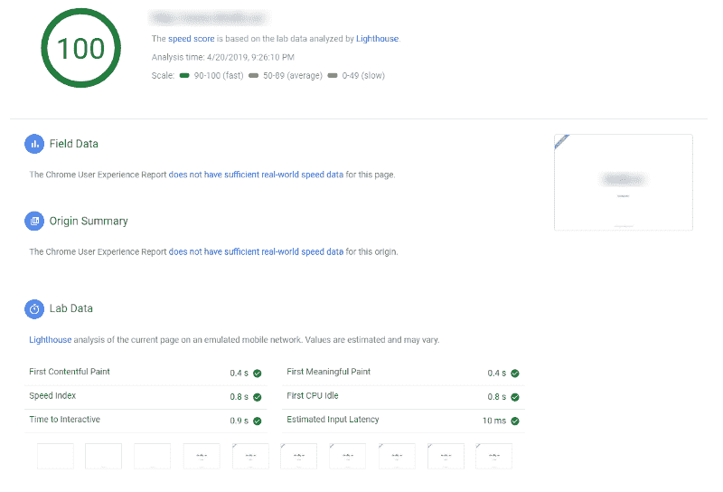
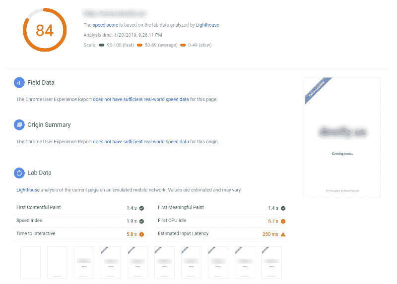
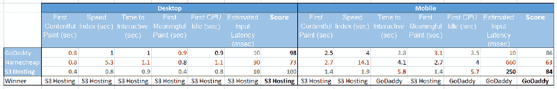

# 让我们建立一个具有实时分析的域名停放页面

> 原文：<https://dev.to/levz0r/let-s-build-a-domain-parking-page-with-real-time-analytics-2l0>

的确，大多数已知的域名注册服务商都提供域名停放服务。GoDaddy 甚至让你通过他们的 [CashParking](https://www.godaddy.com/domains/cashparking) 解决方案赚取现金，但可惜的是，这项服务的基本计划每月费用为 3.99 美元，你最好确保你的域名将产生足够的流量来支付这笔费用。

<figure>

<figcaption>A screenshot from CashParking (Taken on April 20th, 2019)</figcaption>

</figure>

当然，替代方案确实存在。我们可以通过给注册商做广告来“免费”停放我们的域名。这是 GoDaddy 上的免费域名停车场:

<figure>

<figcaption>A screenshot of one of my domains, parked at GoDaddy</figcaption>

</figure>

Namecheap 也不例外。这是他们的免费域名停放页面的样子:

<figure>

<figcaption>http://parkingpage.namecheap.com/</figcaption>

</figure>

现在不要误解我的意思，注册商不需要停放我们的域名。他们的主要业务是注册域名和管理 DNS。因此，在网站建设期间，对于想评估域名使用情况的人来说，似乎没有简单免费的解决方案。

### [亚马逊简单存储服务](https://aws.amazon.com/s3/)来拯救

全面披露:我是亚马逊网络服务的忠实粉丝。

因为存储在简单存储服务(S3)的每个文件(对象)都有一个唯一的 URL，我们可以在上面[托管](https://docs.aws.amazon.com/AmazonS3/latest/dev/WebsiteHosting.html)一个网站。这项服务的伟大之处在于，它不需要我们支付任何费用(或大致如此):作为 [AWS 免费使用层](https://aws.amazon.com/free/)的一部分，亚马逊免费向我们提供 20，000 个 GET 请求，接下来的 1，000 个请求的费用低至 0.0004 美元(截至撰写本文时)。让我们计算一下:

*   如果我们的域名很抢手，每月有 100，000 名访客，我们只需支付(100，000–20，000)/1000 * 0.0004 = 0.032 美元
*   对于一般的域名，我们不会支付任何费用…

亚马逊是这样描述 S3 的:

> [……]亚马逊 S3 专为 99.999999999% (11 个 9)的耐用性而设计，为全球公司的数百万个应用程序存储数据。

回到域名停放…为了将我们的域名停放在 S3，我们所要做的就是用一些描述性的文字(例如“正在建设中”或“即将推出”)建立一个静态的 HTML 网页，我们的域名用大而粗的字母书写，并启动网站的 [Google Analytics](https://analytics.google.com/) 脚本。当网页将被上传到 S3 桶(类似于您的操作系统上的目录)并启用静态网站托管时，我们的桶将有一个唯一的 URL，如下所示:

[http://**www.domain.com**. S3-website-us-east-1 . Amazon AWS . com](http://www.domain.com.s3-website-us-east-1.amazonaws.com)

在我们的停车页面上线之前，我们需要执行另一个可选(但建议)步骤:为我们的桶创建一个 [CORS 配置](https://docs.aws.amazon.com/AmazonS3/latest/dev/cors.html)。请阅读[CORS 强制使用的用例](https://docs.aws.amazon.com/AmazonS3/latest/dev/cors.html#example-scenarios-cors)。

完成配置后，我们将创建一个起源于 www.domain.com[的](http://www.domain.com) [CNAME](https://en.wikipedia.org/wiki/CNAME_record) 记录，该记录将被映射到 S3 的 URL。**需要注意的是，S3 要求完整域名(包括子域)的名称与桶名匹配，否则，该解决方案将无法工作。**

### 停车页面创建自动化

在我们弄清楚如何在 S3 上创建一个停车页面之后，我们现在将自动化这个过程，通过尽可能少的操作来自动创建一个新的停车页面。

为此，我已经创建了一个样板[项目](https://github.com/levz0r/s3-domain-parking)，它将让你配置你的域名，以及描述性文本(见下图)，并将你的谷歌分析帐户连接到登陆页面，这样你就不会错过任何访问者。

<figure>

<figcaption>This is how your parking page is going to look like…</figcaption>

</figure>

为了实现流程自动化，我们需要:

1.  从样板文件 [zip](https://github.com/levz0r/s3-domain-parking/archive/master.zip) 中下载并解压停车网页。
2.  在这里开一个免费的 AWS 账户[。在这个过程中，亚马逊会要求你提供信用卡号码。但只要我们每个月的访客少于 20，000 人，就不会花我们一毛钱*【免责声明:作者不对您可能从亚马逊和/或其子公司收到的任何费用负责】*；](https://aws.amazon.com/free/)
3.  创建一个具有**编程权限**和以下权限的 IAM 用户:`s3:PutObject`、`s3:PutBucketWebsite`、`s3:GetBucketWebsite`、`s3:GetBucketCORS`、`s3:PutBucketAcl`、`s3:CreateBucket`、`s3:ListBucket`、`s3:PutBucketCORS`、`s3:GetBucketAcl`、`s3:HeadBucket`、`s3:PutObjectAcl`。如果您不确定如何做，请前往[在您的 AWS 帐户中创建 IAM 用户](https://docs.aws.amazon.com/IAM/latest/UserGuide/id_users_create.html)和[在策略中指定权限](https://docs.aws.amazon.com/AmazonS3/latest/dev/using-with-s3-actions.html)。一旦创建了用户，记下访问密钥 ID 和秘密密钥——我们将在配置步骤中用到它们；
4.  下载安装 [Node.js 10 和 NPM](https://nodejs.org/en/download/)；
5.  可选:创建一个 Google Analytics 帐户，并写下您的跟踪 ID ( [说明](https://support.google.com/analytics/answer/7476135?hl=en#choosetracking))。

### 配置

现在打开终端，转到包含步骤 1 中的样板文件的解压缩目录。在那里你会找到一个`config.json`文件。使用您最喜欢的文本编辑器，进行以下修改:

*   `trackingId`:谷歌分析追踪 ID(可选)。
*   `domainName`:域名。它将以粗体显示，如上面的截图所示。请使用顶级域名(不带 www。).
*   `innerHtml`:将出现在域名下的 HTML。在上面的截图中，设置为:“即将推出…”。
*   `accessKeyId`:步骤 3 中的 AWS 访问密钥 ID。
*   `secretAccessKey`:来自步骤 3 的密钥。
*   `awsRegion` : AWS 默认区域。我们可以把它留在“美国-东-1”。
*   `showRibbon`:如果你想支持这个项目，让‘Fork me on GitHub’功能区在登陆页面的左上角可见，就把这个字段值设置为 true，否则就设置为 false。

我们快完成了。我们现在要做的就是执行以下命令:

1.  `npm install`
2.  `npm run deploy`

第一个命令可以运行一次。对于进一步的部署—修改`config.json`并仅运行第二个命令。

跟随屏幕上的进度。如果一切顺利，你终端上的最后一行应该是:“*请创造新的记录:CNAME([www . your-domain](http://www.your-domain))->T3】www .(your-domain). S3-website-us-east-1 . Amazon AWS . com*”。但是在创建之前，先去 *[www。(your-domain). S3-website-us-east-1 . Amazon AWS . com](http://www.(your-domain).s3-website-us-east-1.amazonaws.com)*并验证您的登录页面是否可访问。如果您设置了 Google Analytics 跟踪 ID，请验证该网站上至少有一个活跃用户。

最后一步:使用您的 DNS 提供商更新 CNAME 记录。给他们一些时间来传播变化，然后验证您的域现在有一个登录页面。

### 停放您的顶级域名

不幸的是，S3 网站托管不能与顶级域名。然而，使用我们的 DNS 提供商，我们可以将顶级域名重定向到位于 S3 的 www 子域。这里是使用 Namecheap 创建域名重定向的[指令](https://www.namecheap.com/support/knowledgebase/article.aspx/385/2237/how-to-redirect-a-url-for-a-domain)。

### 极客预警！引擎盖下是什么？

该项目由两部分组成:

1.  网络框架。
2.  AWS 部署脚本。

对于 web 框架，选择了 Angular 7。但是为什么要对一个 HTML 文件使用 Angular 呢？答案简单明了:

1.  灵活性:当一个人需要一个单一的静态页面时，另一个人可能会有额外的需求(联系方式、广告、动画等)。).Angular 让我们可以轻松地定制我们的 web 应用程序。
2.  个人喜好:我每天都用它工作。
3.  **性能:**我们很快就会看到，Angular 和 GoDaddy 和 Namecheap 提供的现有停车页面在性能和加载时间上没有明显的差异。

为了使用动态的(可配置的)跟踪 ID 向 Google Analytics 报告，选择了[angular articles 2](https://github.com/angulartics/angulartics2)乍一看似乎有些过分，但我还是想给它灵活性。Mixpanel 是谷歌分析的补充还是替代？只需修改几行代码，我们就万事俱备了。

对于 AWS 部署脚本，只有两个外部依赖: [aws-sdk](https://www.npmjs.com/package/aws-sdk) 和 mime。使用 AWS SDK，我们创建/更新 S3 存储区、CORS 配置，并将生成的 Angular web 应用程序上传到 S3 存储区。解析每个文件的 mime 类型很重要，否则，浏览器将无法访问我们的登录页面。

### 基准

*[PageSpeed Insights](https://developers.google.com/speed/pagespeed/insights/) 用于衡量业绩。*

name cheap/desktop:

name cheap/mobile:

go daddy/桌面:

GoDaddy/mobile:

S3 主机/桌面:

S3 主机/手机:

总结一下 PageSpeed Insights 的对比，我们可以清楚地看到桌面浏览器上谁是赢家……在移动上，GoDaddy 仅比 S3 高 2 分。Namecheap 在所有测试中都很便宜。这使得 S3 主办不仅可行，甚至比我们之前讨论的备选方案更可取。

现在去享受你的免费域名停车！😍

为了方便起见，下面是项目存储库:

## [levz0r](https://github.com/levz0r)/[S3-域名停车](https://github.com/levz0r/s3-domain-parking)

### 可配置的轻量级域名停车页面，支持谷歌分析。

<article class="markdown-body entry-content container-lg" itemprop="text">

# AWS S3 域名停车场

该项目创建了一个 S3 桶，它被配置为托管一个启用了 CORS 的静态网站。您所要做的就是配置项目，并在您的域中创建一个 CNAME 记录。

## 先决条件

1.  [AWS 自由层账户](https://aws.amazon.com/free/)；
2.  [以下列](https://docs.aws.amazon.com/IAM/latest/UserGuide/id_users_create.html)[权限](https://docs.aws.amazon.com/IAM/latest/UserGuide/access_controlling.html)程序化访问 AWS 账户:`s3:PutObject`、`s3:PutBucketWebsite`、`s3:GetBucketWebsite`、`s3:GetBucketCORS`、`s3:PutBucketAcl`、`s3:CreateBucket`、`s3:ListBucket`、`s3:PutBucketCORS`、`s3:GetBucketAcl`、`s3:HeadBucket`、`s3:PutObjectAcl`。
3.  访问域名管理(name price，GoDaddy 等。);
4.  [谷歌分析](https://analytics.google.com)账户(可选)。
5.  [Node.js 和 npm](https://nodejs.org/en/download/) 已安装。

## 限制

由于 S3 静态网站托管的工作方式，它是不可能创造一个顶级域名的 CNAME 记录。因此，您可以停放`(subdomain).domain.com`(例如`www.domain.com`)。话虽如此，一些 DNS 提供商(Namecheap)允许将顶级域名重定向到一个子域*见问题[此处](https://serverfault.com/questions/410727/point-s3-bucket-to-top-level-domain)* 。

## 配置

在您停车之前…

</article>

[View on GitHub](https://github.com/levz0r/s3-domain-parking)

*感谢您的阅读！一如既往，我很高兴收到您的反馈和建议！如果你喜欢你所读的，请与你的朋友分享这个故事！*

*-杠杆*

###### 本文原载于[传媒](https://medium.com/@levz0r/domain-parking-with-real-time-analytics-fef95b093756)