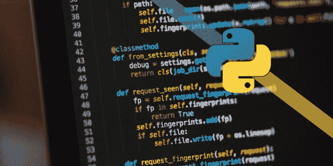
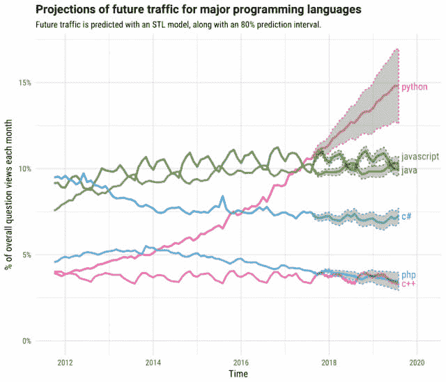

# Python 为移动应用开发带来的商业利益

> 原文：<https://dev.to/ruchikaaggarw17/why-should-you-choose-python-for-app-development-project-in-2019-1hao>

各种软件开发公司频繁推出新应用，这也是很多创业公司的巨大商机。挑战在于为你的应用程序开发选择正确的编程语言。

## **2019 年的 Python**

Python 是一种强大的面向对象的函数式编程语言，被大多数公司用于软件开发。根据 [PYPL 人气指数](http://pypl.github.io/PYPL.html) ，Python 是今年最受欢迎的编码语言。

与其他编程语言相比，Python 具有清晰的语法编码，因此在您的业务应用中易于阅读和实现。它致力于业务逻辑，而不是关注语言的基本事实。

今天 **[Python 开发者](https://www.valuecoders.com/hire-developers/hire-python-developers?utm_source=python-developers-arushi)** 更喜欢在各种各样的应用程序中使用这种语言，因为它很容易让他们与 C、Objective-C、Java 或 FORTRAN 语言联系起来。Python 支持所有的操作系统，如 Windows、Mac、Amiga、Linux/Unix、OS/2 等。使用 Python，你可以创建有用的移动应用，比如 Instagram、Ubuntu、Calibre、Quora、Reddit、Spotify、YouTube 等等。

## **为什么用 Python 开发移动应用程序？**

Python 可以在任何主流操作系统上运行，如 OS/2、Linux/Unix、Mac、Amiga、Windows 等。

Python 语言允许你开发小规模或大规模的无障碍程序。

Python 为应用程序开发人员和系统管理员提供了多种工具。

Python 本质上是灵活和动态的，这就是为什么谷歌、雅虎和 IBM 的用户觉得它很容易使用。

Python 提供了很高的可移植性，允许同一个应用程序在所有主要平台上运行。

Python 丰富的库和其他包帮助应用程序开发人员处理任何任务。

## **Python 在移动开发中的作用**

今天，移动应用程序开发已经成为一个主要行业，因为它的范围和机会都在不断扩大。跨平台 Python 框架是用于 Android、Windows 7、Linux 和 Mac 的最佳选择。它也是编写简单脚本和复杂多线程应用程序的完美编程语言。

Python 最棒的一点是，它让你有机会使用无限行已经编写好的免费代码。使用 Python，Android 和 iPhone 应用程序开发人员可以使用多种跨平台开发技术为他们的用户提供出色的移动应用程序。

### **基于 Python 的移动应用**

[**FoodPlus**](https://play.google.com/store/apps/details?id=com.androidapp.foodplus&hl=en_US)

FoodPlus 是一款使用 Python 编程的美食移动应用程序，可帮助处理美食订单、跟踪美食订单，是专为美食爱好者设计的。

[**AppBackup**](https://play.google.com/store/apps/details?id=mobi.usage.appbackup&hl=en_US)

AppBackup 是一款适用于 iOS 设备的智能应用程序，允许其用户创建备份并恢复 App Store 应用程序的设置和数据。

用 Python 开发的其他应用还有 Instagram、OpenStack、BitTorrent、YouTube、Ubuntu 软件中心、优步、Reddit 和 Spotify。因此，我可以说这是一个强大的应用程序组合。您也可以将 Python 用于您的应用程序开发项目。

**Python 为应用开发带来的好处**

在深入了解 Python 在移动应用开发中的概念之前，让我们先来看看它的主要特性，与其他工具相比，这些特性让你有理由选择 Python 进行应用开发:

**易读的语言**

对于应用程序开发人员来说，第一次使用一种新的编程语言可能会非常困难，因为它会带来额外的复杂性。Python 是一种指示缩进和帮助可读性的动态语言。

**开发者轻松编码**

与 C++、Java 等其他编程语言相比，Python 是一种更容易编写代码的编程语言。开发人员可以在几个小时内学会 Python 的概念，这就是为什么它被称为开发人员友好的语言。

**易于解读的语言**

对于一些编程语言，如 C++或 Java，开发人员总是应该先编译然后运行它。但是 Python 的情况不一样，因为不需要编译它，因为它可以轻松地将一种语言转换成二进制。

**面向开发者的表达性语言**

Python 易于使用，富有表现力的语言有助于您专注于解决方案，而不是核心语法。

**面向对象的语言**

Python 是一种面向对象的语言，专注于对象、函数和组合数据。该语言支持多种继承，可以在面向对象和面向过程的编程上工作。

在 Python 中，有一些工具可以用在 app 开发的早期阶段。

[**VOC**](https://github.com/beeware/voc) 是一个将字节码转换成 Java 类文件的 transpiler。

[**Python-iOS-template**](https://github.com/beeware/Python-iOS-template)是所有 iOS app 开发的千篇一律的模板。

[**Python-Android-template**](https://github.com/beeware/Python-Android-template)也是各类 Android app 开发的千篇一律的模板。

[**公文包**](https://github.com/beeware/briefcase) 是将 Python 项目打包成 app 的扩展工具。

[**Rubicon-ObjC**](https://github.com/beeware/rubicon-objc) 对 Objective-C 和 Python 都有效。

**是一个跨平台的原生 widget 形式的库。**

 ****最终**

在列出 Python 语言的所有特性及其对移动开发的积极影响后，有许多方法可以在 Python 上创建您的业务应用程序，但这完全取决于您的努力、策略、想法和规范。

因此，如果你正在寻找 **[定制软件开发服务](https://www.valuecoders.com/custom-software-development-services-company?utm_source=custom_Ruchi_a24)** 只需在谷歌上搜索一下，你就会得到 Python Django 开发者的选项列表，你可以与他们讨论你自己的项目并创建你自己的移动应用。**