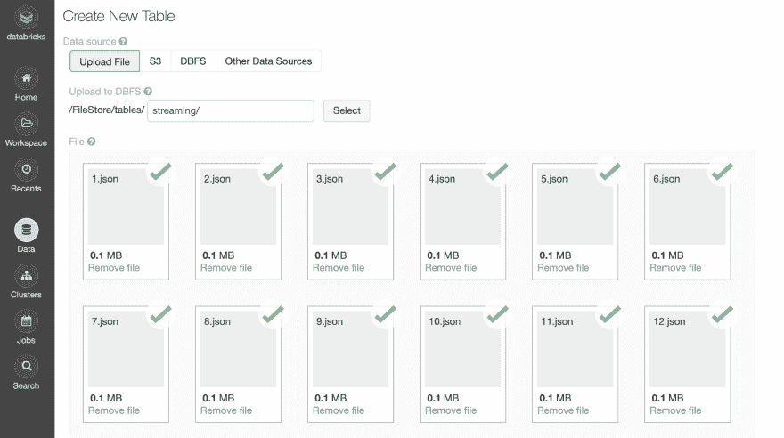
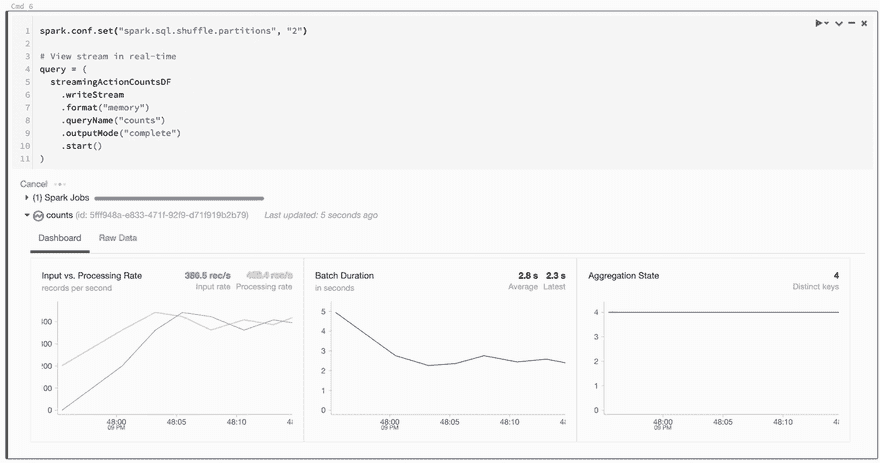

# PySpark 中的结构化流

> 原文：<https://dev.to/hackersandslackers/structured-streaming-in-pyspark-527f>

[](https://res.cloudinary.com/practicaldev/image/fetch/s--qSw2lO1N--/c_limit%2Cf_auto%2Cfl_progressive%2Cq_auto%2Cw_880/https://storage.googleapis.com/hackersandslackers-cdn/2019/06/apachesparkpt4-1%402x.jpg)

现在我们已经熟悉了 [Spark 数据帧](https://dev.to/hackersandslackers/dataframe-transformations-in-pyspark-continued-3i09-temp-slug-575266)，我们将实现这个新发现的知识来帮助我们在 PySpark 中实现流数据管道。事实证明，实时数据流是 Spark 最大的优势之一。

对于这一轮，我们将触及如何在 Spark 中构建结构化流的基础。Databricks 有一些可爱的特性帮助我们可视化流数据:我们将使用这些特性来验证我们的流是否工作。如果您希望将 Spark 与消息代理挂钩，或者创建一个生产就绪的管道，我们将在以后的文章中对此进行介绍。

## 准备一些数据

我们需要一些看起来相当真实的数据来进行这项工作。本着数据流的本质(以及被夸大的技术趋势)，我生成了一组旨在模拟物联网设备输入的数据。我们将通过探索物联网设备将事件动作流式传输到一个集中位置的真实场景，深入探讨结构化流式传输。

这些数据的本质是 20 个不同的 JSON 文件，每个文件有 1000 个条目。这个文件集合应该可以很好地模拟真实数据的样子。如果你想得到这些文件，我已经把它们上传到这里了。让我们先来预览一下:

```
[{"time":"2018-10-27T16:52:04Z","customer":"Feliks Fuggle","action":"power on","device":"Footbot Air Quality Monitor"},  {"time":"2019-04-05T10:56:05Z","customer":"Chelsea Redgewell","action":"power off","device":"Amazon Echo"},  {"time":"2018-06-22T04:29:44Z","customer":"Cymbre Bischof","action":"low battery","device":"Nest T3021US Thermostat"},  {"time":"2019-01-28T07:36:33Z","customer":"Bettye McKeefry","action":"low battery","device":"August Doorbell Cam"},  {"time":"2019-04-21T23:33:44Z","customer":"Gratiana Shapera","action":"power on","device":"Nest T3021US Thermostat"},  {"time":"2018-06-20T08:18:21Z","customer":"Hurleigh Gotcliff","action":"low battery","device":"Amazon Echo"},  {"time":"2019-05-08T06:09:27Z","customer":"Freeland Giacomozzo","action":"power on","device":"Amazon Echo"},  {"time":"2019-01-26T15:39:30Z","customer":"Kally Shawell","action":"low battery","device":"Footbot Air Quality Monitor"},  {"time":"2018-06-17T08:24:24Z","customer":"Kerrin Gurley","action":"power on","device":"Amazon Echo"},  {"time":"2018-06-05T03:32:00Z","customer":"Eduino Gilmour","action":"power on","device":"August Doorbell Cam"},  {"time":"2019-01-13T15:52:30Z","customer":"Vernon Carleman","action":"power off","device":"Google Home Voice Controller"},  {"time":"2018-09-12T23:42:01Z","customer":"Constantino Evitt","action":"power off","device":"August Doorbell Cam"},  {"time":"2019-05-10T15:02:28Z","customer":"Jermaine Bofield","action":"low battery","device":"Amazon Dash Button"},  {"time":"2018-12-23T22:05:23Z","customer":"Omero Westphal","action":"low battery","device":"Footbot Air Quality Monitor"},  {"time":"2018-09-10T16:51:15Z","customer":"Gaylor Tour","action":"power off","device":"Amazon Echo"},  {"time":"2018-10-29T18:56:45Z","customer":"Jordan Dikles","action":"power off","device":"Amazon Echo"},  {"time":"2018-08-18T18:43:38Z","customer":"Phyllida Druitt","action":"low battery","device":"August Doorbell Cam"},  {"time":"2018-08-10T00:12:19Z","customer":"Norrie Culwen","action":"power off","device":"August Doorbell Cam"},  {"time":"2019-03-20T22:56:44Z","customer":"Filmore Paggitt","action":"power on","device":"August Doorbell Cam"},  {"time":"2018-05-14T15:13:17Z","customer":"Jerald Galtone","action":"power on","device":"Google Home Voice Controller"},  ... 
```

*免责声明:这些数据非常不真实(我实际上是用 [Mockaroo](https://mockaroo.com) 编译的，这是一个创建虚假数据集的一站式商店)。因此，我们的数据看起来完全是随机的(因为确实如此)。*

我们将构建一个结构化的流，它查看所有这些文件上传的位置并传输数据。

### 上传我们的数据

尽管我很想把这些数据上传到 S3，但亚马逊把我锁在了自己的账户之外。他们已经把我锁在外面几个月了，提示我为一张我不再拥有的信用卡申请 CVV(AWS 支持不做任何事情)。如果有人认识亚马逊的人，打电话给我。

相反，我们将把这些文件存放在我们的 Databricks 帐户中，这可以在**数据**选项卡的 UI 中轻松处理。启动集群后，我只需上传这 20 个 JSON 文件，并将其存储在 DBFS (Databricks 文件系统)中。我使用的路径是`/FileStore/tables/streaming/`。

[](https://res.cloudinary.com/practicaldev/image/fetch/s--naFx0zRa--/c_limit%2Cf_auto%2Cfl_progressive%2Cq_auto%2Cw_880/https://storage.googleapis.com/hackersandslackers-cdn/2019/07/upload-json-streaming-spark.png) 

<figcaption>通过 UI 上传数据。</figcaption>

我们可以通过浏览 DBFS 来验证数据是否已上传:

[](https://res.cloudinary.com/practicaldev/image/fetch/s--BRLFi2wT--/c_limit%2Cf_auto%2Cfl_progressive%2Cq_auto%2Cw_880/https://storage.googleapis.com/hackersandslackers-cdn/2019/07/browse-dbfs-databricks.png)T3】浏览我们的文件系统

看起来我们可以走了！

如果你正在寻找一种清理 DBFS 的方法，这可以通过安装 [Databricks CLI](https://docs.databricks.com/user-guide/dev-tools/databricks-cli.html#databricks-cli) 来实现。安装后，我们可以使用`dbfs rm -r dbfs:/FileStore/tables/[folder_name]/`删除文件或目录。

## 加载并检查我们的数据

我们从导入**时间戳**和**字符串**类型开始；从之前的数据来看，我们知道我们需要支持这些类型。然后，我们将数据的路径保存到变量`inputPath`:

```
from pyspark.sql.types import TimestampType, StringType

# Path to our 20 JSON files inputPath = "/FileStore/tables/streaming/" 
```

我们将为我们的数据创建一个模式；在创建结构化流时推断模式通常不是一个好主意。我们将数据从一个可预测的源传输到另一个源，因此我们应该明确地设置我们的数据结构(并消除设置不正确的可能性)。

```
# Explicitly set schema schema = StructType([ StructField("time", TimestampType(), True), 
                      StructField("customer", StringType(), True),
                      StructField("action", StringType(), True),
                      StructField("device", StringType(), True)]) 
```

`StructType`是一个保留字，它允许我们创建一个由`StructField` s 组成的模式。`StructField`接受 3 个参数:我们字段的**名称**、**类型**以及字段是否应该是**可空的**。

让我们利用所有这些来创建一个数据框架:

```
from pyspark.sql.types import TimestampType, StringType, StructType, StructField

# Path to our 20 JSON files inputPath = "/FileStore/tables/streaming/"

# Explicitly set schema schema = StructType([ StructField("time", TimestampType(), True), 
                      StructField("customer", StringType(), True),
                      StructField("action", StringType(), True),
                      StructField("device", StringType(), True)])

# Create DataFrame representing data in the JSON files inputDF = (
  spark
    .read
    .schema(schema)
    .json(inputPath)
)

display(inputDF) 
```

这是我们的输出:

| 时间 | 顾客 | 行为 | 设备 |
| --- | --- | --- | --- |
| 空 | 空 | 空 | 空 |
| 2018-06-05T01:33:35.000+0000 | 沙利亚·克罗马克 | 低电量 | 奥古斯特门铃摄像头 |
| 2019-01-08T17:03:51.000+0000 | 罗斯玛丽·罗克福德 | 低电量 | 亚马逊破折号按钮 |
| 2019-04-26T14:45:54.000+0000 | 凯西亚·迪明 | 关机 | Nest T3021US 恒温器 |
| 2018-07-24T12:49:36.000+0000 | 卡弗·麦库克 | 关机 | 亚马逊回声 |
| 2018-08-24T09:00:57.000+0000 | Anet Eagles | 通电 | 奥古斯特门铃摄像头 |
| 2018-09-24T07:06:01.000+0000 | 罗兰多记忆 | 通电 | 亚马逊回声 |
| 2018-08-22T09:20:51.000+0000 | 撕了一点 | 通电 | 奥古斯特门铃摄像头 |
| 2018-08-13T13:23:27.000+0000 | 兰达·安斯利 | 关机 | 奥古斯特门铃摄像头 |
| 2018-06-05T20:40:33.000+0000 | 布拉提市长 | 通电 | 亚马逊回声 |

出现一个空的行！看起来我们模拟现实世界的尝试进行得很顺利:我们已经有了第一个愚蠢的问题！不用担心:

```
# Remove empty rows inputDF = inputDF.dropna()

display(inputDF) 
```

那就行了。让我们通过查看 IOT 设备中的动作分布来进一步研究我们的数据。我们将通过创建一个具有聚合函数的新数据帧来实现这一点:按操作分组:

```
# Aggregate number of actions actionsDF = (
  inputDF
    .groupBy(
       inputDF.action
    )
    .count()
)
actionsDF.cache()

# Create temp table named 'iot_action_counts' actionsDF.createOrReplaceTempView("iot_action_counts") 
```

现在我们可以查询刚刚创建的表:

```
%sql
select action, sum(count) as total_count from iot_action_counts group by action 
```

看看这个:

| 行为 | 总计 _ 计数 |
| --- | --- |
| 通电 | Six thousand six hundred and thirty-one |
| 低电量 | Six thousand seven hundred and thirty-three |
| 关机 | Six thousand six hundred and sixteen |

太棒了。这里没什么意外。我们开始流式传输，好吗？

## 我们的数据流

为了将数据加载到流数据帧中，我们创建了一个数据帧，就像我们用`inputDF`创建的一样，但有一个关键的不同:我们将使用`.readStream`而不是`.read`:

```
# Create streaming equivalent of `inputDF` using .readStream streamingDF = (
  spark
    .readStream                       
    .schema(schema)              
    .option("maxFilesPerTrigger", 1)
    .json(inputPath)
) 
```

没错，创建一个流数据帧就像轻触这个开关一样简单。

我们的数据不是实时创建的，所以我们必须使用一个技巧来模拟流条件。我们可以一次加载一个 JSON 文件，而不是在数据进来时进行流式处理。这就是`option()`正在做的事情:我们将`maxFilesPerTrigger`选项设置为`1`，这意味着一次只能流传输一个 JSON 文件。这将允许我们在数据流入时看到它！

我们可以做的另一件很酷的事情是从`streamingDF`创建一个数据帧，并应用一些转换，就像我们之前的聚合一样。当该数据帧从父数据帧继承`readStream`时，它将进行流式处理:

```
# Create streaming equivalent of `inputDF` using .readStream() streamingDF = (
  spark
    .readStream                       
    .schema(schema)              
    .option("maxFilesPerTrigger", 1) # Treat a sequence of files as a stream by picking one file at a time
    .json(inputPath)
)

# Stream `streamingDF` while aggregating by action streamingActionCountsDF = (                 
  streamingDF
    .groupBy(
      streamingDF.action
    )
    .count()
) 
```

数据帧有一个内置的检查，当我们需要快速测试我们的流的状态。在数据帧上运行`.isStreaming`将返回一个布尔值，它将告诉我们该数据帧是否是流式的:

```
# Is `streamingActionCountsDF` actually streaming? streamingActionCountsDF.isStreaming 
```

输出:

```
True 
```

## 启动我们的流

现在我们有了一个流数据帧，但它并没有在任何地方流动。要传输到目的地，我们需要在数据帧上调用`writeStream()`,并设置所有必要的选项:

```
spark.conf.set("spark.sql.shuffle.partitions", "2")

# View stream in real-time query = (
  streamingActionCountsDF
    .writeStream
    .format("memory")
    .queryName("counts")
    .outputMode("complete")
    .start()
) 
```

这里有一个快速分类:

### 格式

我们可以在流写入的数据帧上调用`.format()`来指定我们的数据将被写入的目的地的*类型。每种类型的输出被称为**输出接收器**(明白吗？因为我们正在*将*流入*接收器。* `.format()`接受以下内容:*

*   **parquet** :将输出存储到一个目录中。需要设置**路径**选项，设置文件的目的地。
*   **kafka** :将输出存储到 kafka 中的一个或多个主题。必需选项是**Kafka . bootstrap . servers**(Kafka 服务器 IP 地址列表)和**主题** (Kafka 主题或要写入的主题)。
*   **console** :每次有触发时打印输出到 console/stdout。用于调试。
*   **内存**:输出以内存表的形式存储在内存中。需要设置`.queryName()`。用于调试。

我们只是测试一下，所以把我们的数据帧写到`memory`对我们来说是可行的。如果这是在某个真实的地方写的，我们会希望指向一个消息代理或者什么的。

### 输出模式

`.outputMode()`用于确定要写入数据流接收器的数据。“输出”特指在流式数据帧中有新数据可用的任何时候。`.outputMode()`接受三个值中的任何一个:

*   **append** :只有新的行将被写入接收器。
*   **完成**:每次有更新时，所有的行将被写入接收器。
*   **update** :每次有更新时，只有被更新的行将被写入接收器。

### 开始

在流式数据帧上调用时启动数据流。

## 在数据块中实时观看数据流

我们如何预览流向内存的数据？Databricks 有一种有趣的方式来实时观察流是如何执行的，*而仍然在我们的笔记本上*。看看当我们运行包含上述内容的单元时会发生什么:

[](https://res.cloudinary.com/practicaldev/image/fetch/s--heXsNNHW--/c_limit%2Cf_auto%2Cfl_progressive%2Cq_66%2Cw_880/https://storage.googleapis.com/hackersandslackers-cdn/2019/07/stream0.gif) 

<figcaption>Ohhhh 恶声恶气！</figcaption>

事情正在发生！我们看到了关于处理速率、批处理持续时间等有用的信息。很酷的东西。如果我们切换到**原始数据**选项卡，我们可以看到到底发生了什么:

[](https://res.cloudinary.com/practicaldev/image/fetch/s--rRVZtk9_--/c_limit%2Cf_auto%2Cfl_progressive%2Cq_66%2Cw_880/https://storage.googleapis.com/hackersandslackers-cdn/2019/07/stream1.gif) 

<figcaption>我们的输出正好概述一下。</figcaption>

现在我们正在谈话！检查 **batchId** 的值...注意到它是如何上升到 20 然后停止的吗？每个 JSON 文件一个！我们还看到了像**时间戳**、**numi outrows**和其他有用的东西。

嗯，我们做到了。总而言之，用 PySpark 构建结构化流并不像听起来那么令人畏惧。下次见，太空牛仔。